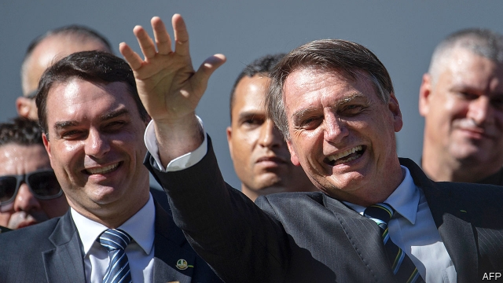

###### Caving on corruption

# Jair Bolsonaro has given up on his anti-graft crusade 

 

> print-edition iconPrint edition | The Americas | Jul 27th 2019 

IF THERE IS one thing voters wanted from Jair Bolsonaro when they elected him Brazil’s president last October it was to end corruption. When he was a right-wing congressional backbencher, his fulminations against “os corruptos” helped make him famous. In his inauguration speech on January 1st he promised to “free the country from the yoke of corruption”. 

Now, his plans to keep his most important campaign promise are failing. That is because his administration looks nearly as scandal-prone as the one it replaced. One of his sons, Flávio, a senator from Rio de Janeiro (pictured left), is being investigated for money-laundering. Messages leaked to the Intercept, an investigative news website, have damaged the reputation of Sérgio Moro, the justice minister, who is in charge of fighting corruption and crime. They show that Mr Moro collaborated improperly with prosecutors when he was the judge in charge of the vast Lava Jato anti-corruption investigation. The operation led to the jailing of more than 100 businessmen and several politicians, including Luiz Inácio Lula da Silva, a former president. 

The tourism minister is being investigated for putting up female paper candidates in congressional and state elections to get campaign funds meant for them. Mr Bolsonaro nominated another son, Eduardo, to be Brazil’s ambassador to the United States, adding nepotism to his administration’s list of sins. 

The president can claim some successes, including progress on economic reform. He broke with past presidents’ practice of giving cabinet jobs in exchange for support in congress. So far, that is his only contribution to cleaner politics. 

A low point came on July 16th, when Dias Toffoli, a justice on the supreme court, suspended the investigation of Flávio Bolsonaro. Police had identified an “exceptional increase” in his net worth tied to property deals between 2014 and 2017, when he was a state congressman. Seven million reais ($2m) passed without explanation through the bank account of his driver, a friend of the president.  

Mr Toffoli ruled that prosecutors need permission from a judge to use financial data collected by COAF, the government financial-intelligence unit, and other agencies. The supreme court has been considering since 2017 whether to issue such a ruling. It is due to decide in November this year. Mr Toffoli acted on his own after Flávio’s lawyers joined the suit. The ruling throws anti-corruption investigations into a “state of instability and confusion”, says Silvana Batini, a Lava Jato prosecutor from Rio de Janeiro. It could also hinder probes of money-laundering by drug gangs. 

The president welcomed the decision to suspend the case against his son. Otherwise he has gone quiet on corruption. In the second half of 2018 he tweeted 68 times about corruption, according to the Electronic Government Laboratory at the University of Brasília. The number of tweets dropped to 20 in the first half of this year. In July there has so far been none. 

Mr Moro, weakened by the leaks, has said nothing about Mr Toffoli’s decision. An anti-crime and corruption measure he proposed is making little progress. The committee responsible for it in the lower house of congress has voted down one idea to punish wrongdoing: writing into law the requirement that people convicted of corruption begin their sentences if they lose their first appeals, which does not always happen now. 

So far, Brazilians have not noticed that the anti-corruption dream team are failing them. True, Mr Bolsonaro’s approval rating of 33% in early July was the lowest since 1990 for any president after six months in office, according to Datafolha, a pollster. But scandals are not the reason. More often, respondents point to the impact of a weak economy, cuts to university budgets and unpresidential behaviour (Mr Bolsonaro recently called governors of poor north-eastern states paraíbas, or “hicks”). 

Embarrassing headlines have not stopped parts of his programme from moving ahead, which was not the case during the presidency of his predecessor, Michel Temer. Mercosur, a group to which Brazil belongs, has reached a trade agreement in principle with the European Union (see article). A reform of pensions is advancing. 

If the corruption fight is to resume, prosecutors say, both the supreme court and the president will have to change course. Prosecutors hope that the court will reverse Mr Toffoli’s decision, unblocking investigations into Flávio and other alleged wrongdoers. Progress will depend partly on whom Mr Bolsonaro chooses to succeed Raquel Dodge as Brazil’s attorney-general in September. Mr Bolsonaro has waffled about whether he will pick one of the three candidates proposed by the National Association of Prosecutors. That practice began in 2003 as a way of ensuring the attorney-general’s independence from politics. Mr Bolsonaro’s choice will be “a big test of the government’s commitment” to fight corruption, says Bruno Brandão of Transparency International, an NGO. 

Despite its flaws, Lava Jato offered the hope that Brazil might end the culture of impunity that allowed corruption to flourish. The question now is whether that quest can overcome the damage inflicted on it by its biggest champions.■ 

-- 

 单词注释:

1.corruption[kә'rʌpʃәn]:n. 腐败, 堕落, 贪污 [计] 论误 

2.jair[]:[网络] 睚珥；贾伊尔；睢珥 

3.crusade[kru:'seid]:n. 改革运动, 十字军东侵 vi. 从事改革运动, 加入十字军 

4.Jul[]:七月 

5.voter['vәutә]:n. 选民, 投票人 [法] 选民, 选举人, 投票人 

6.congressional[kәn'greʃәnl]:a. 会议的, 议会的, 国会的 [法] 代表大会的, 大会的, 议会的 

7.backbencher['bækbentʃә]:n. 后座议员 

8.fulmination[.fʌlmi'neiʃәn]:n. 闪电, 爆鸣, 爆发 [化] 雷爆; 爆燃 

9.O[әu]:interj. 啊, 唉, 哎呀, 哦 n. 零 [计] 操作, 运算, 输出 

10.inauguration[i,nɔ:^ju'reiʃәn]:n. (美)总统就职, 开幕仪式, 就职典礼, 开始, 开辟, 开创, 为...举行开幕式 [法] 就职, 就职典礼, 创造 

11.yoke[jәuk]:n. 轭, 牛轭, 束缚 vt. 给...上轭, 连接, 结合, 使匹配 vi. 结合, 匹配 [计] 磁轭; 磁头组; 偏转线圈 

12.senator['senәtә]:n. 参议员, (某些大学的)理事 [法] 参议员, 上议员 

13.rio[]:n. 里约（巴西共和国的旧首都） 

14.de[di:]:[化] 非对映体过量 [医] 铥(69号元素铥的别名,1916年Eder离得的假想元素) 

15.Janeiro[]:n. （葡）一月 

16.intercept[.intә'sept]:n. 截取, 妨碍, 截距 vt. 拦截, 阻止, 截取 

17.investigative[in'vestigeitiv]:a. 审查的, 调查的, 好研究的 [法] 调查的, 审查的, 受调查研究的 

18.Moro['mәurәu]:n. 摩洛族, 摩洛语 

19.improperly[]:[计] 不适当地 

20.prosecutor['prɒsikju:tә]:n. 实行者, 告发者, 公诉人 [法] 原告, 起诉人, 检举人 

21.lava['lɑ:vә]:n. 熔岩, 火山岩 [医] 火山石(一种顺势疗法药) 

22.jato['dʒeitәu]:n. 喷气起飞助推器 

23.luiz[]:n. (Luiz)人名；(西、葡)路易斯 

24.lula[]:n. 卢拉（男子名） 

25.DA[,di:'ei]:美国地方检察官 [计] 数据采集, 数据管理员, 数据分析, 设计自动化 

26.silva['silvә]:n. 森林, 森林志 

27.nominate['nɒmineit]:vt. 提名, 任命, 命名 [法] 提名...为候选人, 指定, 推荐 

28.Eduardo[]:n. 爱德华多（姓氏） 

29.nepotism['nepәtizm]:n. 偏袒亲属, 起用亲戚 

30.politic['pɒlitik]:a. 精明的, 明智的, 策略的 

31.dia[]:abbr. （美）国防情报局（Defense Intelligence Agency） 

32.exceptional[ik'sepʃәnәl]:a. 例外的, 异常的, 特别的 

33.congressman['kɒŋgresmәn]:n. 国会议员, 众议院议员 [法] 国会议会 

34.reais[]:[网络] 雷亚尔；黑奥；雷阿尔 

35.datum['deitәm]:n. 论据, 材料, 资料, 已知数 [医] 材料, 资料, 论据 

36.coaf[]:[网络] 剑桥大学申请表；泜；金融活动控制委员会 

37.instability[.instә'biliti]:n. 不安定, 不稳定 [医] 不稳定性 

38.Silvana[sil'vænә,-'vɑ:-]:n. 西尔瓦娜(Silvia的异体)(f.) 

39.batini[]:[网络] 巴庭尼 

40.hinder['hindә]:a. 后面的 v. 阻碍, 打扰 

41.probe[prәub]:n. 探索, 调查, 探针, 探测器 v. 用探针探测, 调查, 探索 

42.tweet[twi:t]:vi. 啁啾 n. 小鸟叫声 

43.convict[kәn'vikt]:n. 囚犯, 罪犯 vt. 宣告有罪, 使知罪 

44.alway['ɔ:lwei]:adv. 永远；总是（等于always） 

45.Brazilian[brә'ziljәn]:n. 巴西人 a. 巴西的, 巴西人的 

46.Datafolha[]:[网络] 圣保罗页报调查机构 

47.pollster['pәulstә]:n. 民意调查人, 民意测验经办人 

48.respondent[ri'spɒndәnt]:a. 回答的, 应答的, 反射的 n. 应答者, 被告 

49.unpresidential[]:[网络] 很没有总统样子 

50.hick[hik]:n. 乡下人, 土头土脑的人, 反应迟钝的人 

51.presidency['prezidәnsi]:n. 总统职权, 总裁职位 

52.predecessor[.predi'sesә]:n. 前任, 先辈, 前身 [医] 初牙, 前辈, 祖先 

53.michel[]:n. 米歇尔（男子名） 

54.Temer[]:[网络] 了不起；铁木耳 

55.mercosur[]:abbr. Mercado Comun del Sur 南方共同市场 

56.Brazil[brә'zil]:n. 巴西 

57.unblock['ʌn'blɔk]:[计] 解锁, 解块 [经] 解冻 

58.allege[ә'ledʒ]:vt. 宣称, 主张, 提出, 断言 [法] 断言, 指称, 指证 

59.wrongdoer['rɒŋ'du:ә]:n. 做坏事的人 

60.Raquel[]:n. 拉克尔（人名） 

61.dodge[dɒdʒ]:v. 避开, 躲避 n. 诡计, 躲藏 

62.waffle['wɒfl]:vi. 胡扯, 闲聊 n. 华夫饼干, 胡扯 [计] Waffle程序 

63.bruno['bru:nәu]:n. 布鲁诺（男子名） 

64.transparency[træns'pærәnsi]:n. 透明, 透明度, 透过性, 透明物, 清晰 [计] 透明性; 透明 

65.ngo[]:abbr. 民间组织；非政府组织（Non-Governmental Organization） 

66.flaw[flɒ:]:n. 缺点, 裂纹, 瑕疵, 一阵狂风 [化] 划痕; 裂缝; 裂纹 

67.impunity[im'pju:niti]:n. 不受惩罚, 无事, 无患 [法] 不受刑罚, 免罚, 免罪 

68.quest[kwest]:n. 探索, 寻求, 调查 v. 寻找, 找, 追寻猎物 

69.inflict[in'flikt]:vt. 施以, 加害, 使承受 [法] 处, 加, 予以 

