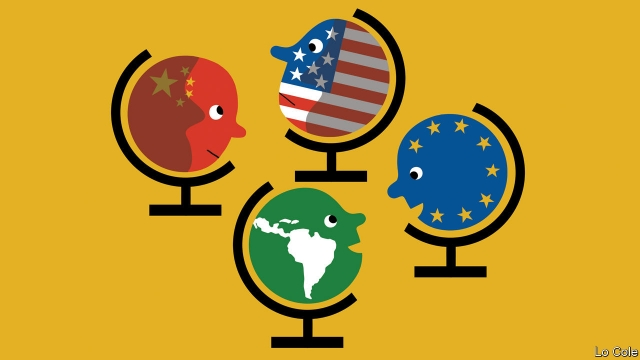

###### Bello

# Latin America and Europe have much to gain from closer ties 

 

> print-edition iconPrint edition | The Americas | Jul 27th 2019 

TO THE OUTSIDER Latin America has long appeared to form an unquestionable part of the zone of influence of the United States. In fact, that has applied mainly to the Caribbean basin, not to the vast area south of the greatest geographical barrier in the Americas, the Amazon rainforest. As long ago as the 1940s Nicholas Spykman of Yale University identified Brazil and Argentina, the main countries in what is now the Mercosur trade bloc, as “the equidistant zone”: as far from New York as from Lisbon and as open to European as to yanqui influence. Even today, although the United States is the main trading partner of Latin America as a whole, Mercosur (which includes Paraguay and Uruguay) does nearly half as much trade again with the European Union. 

In recent decades European interest in Latin America, and vice versa, has been fitful. In 1999 the first EU-Latin America summit, held in Rio de Janeiro, proclaimed a “strategic partnership” but attached no strategies to make that more than a slogan. Latin America was a priority for Europe, but beneath many others, so it wasn’t. Left-wing governments in South America preferred “south-south co-operation” to ties with Europe. The lack of serious intent was summed up by 20-year on-off talks for a trade agreement between the EU and Mercosur. 

That this was successfully concluded last month has significance that goes well beyond the agreement itself. Provided it is ratified, it will offer benefits especially to European manufacturers and to Mercosur farmers. It will be phased in over 15 years, at the end of which it will have eliminated tariffs on over 90% of goods traded between the blocs, with tariff-free quotas for the remainder. It also opens up services and public procurement in Mercosur and, in effect, commits Brazil’s environmentally unfriendly president, Jair Bolsonaro, both to the Paris agreement to combat climate change (which he had wanted to leave) and to curbing deforestation of the Amazon. 

Just as important is the potential stimulus to reforming Mercosur’s economies and to regional integration within Latin America. Brazil and Argentina are among the world’s most closed economies. That is now likely to change. To take advantage of the EU agreement, they will have to lighten burdensome taxes and regulations and boost internal transport infrastructure. After rule by protectionist left-wingers, both now have governments that want to open up economically. Mercosur’s presidents this month said they want swiftly to reach trade agreements with Canada and the EFTA bloc, which includes Switzerland and Norway. The EU agreement “is not a point of arrival but of departure,” declared Mauricio Macri, Argentina’s president. A more open, business-friendly Mercosur would in turn ease regulatory convergence with Latin America’s other big trading group, the Pacific Alliance. 

The long-awaited breakthrough reflects bigger changes. Both sides worry about the trade war and the geopolitical conflict between China and Donald Trump’s United States. China is now Mercosur’s largest single trade partner (and the second-biggest for Latin America as a whole). Although the EU remains the largest investor in Latin America, Chinese investments and loans to the region have grown fast. China’s growing influence there is of concern not just to Mr Trump, but to Europe and Japan, too. The prospect of being squeezed between Mr Trump and China scares many Latin American leaders. 

The Mercosur agreement is part of a broader European reassessment of Latin America. Both regions share a commitment to democracy and multilateralism, values that are on the defensive. In that sense, “though far apart geographically, we are closer than any other continents,” Federica Mogherini, the EU’s outgoing foreign-policy chief, stated in April. She unveiled a new policy statement aimed at achieving greater political co-operation between the two regions. This contains a healthy dose of realism. Having previously sought to work with Latin America mainly through CELAC, a comatose and divided 33-country outfit, the European Commission will now give priority to co-operating with smaller and more coherent groups. 

Much can still go wrong. Ratification of the Mercosur accord by Europe’s national parliaments will take up to two years and will not be easy. If Mr Macri loses a presidential election in October, Argentina could pull out. Above all, distance and the press of other priorities may cause each side to lose interest once again. That would be a strategic error.■ 

