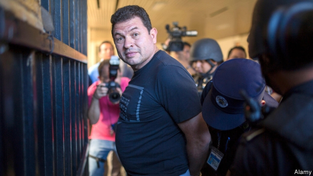

###### Buy any deans necessary

# Letting academics pick magistrates has not worked in Guatemala 

 

> print-edition iconPrint edition | The Americas | Jul 27th 2019 

JUDGES WIELD more power than almost anyone else in Guatemala. This year the supreme court disqualified one of the front-runners for the presidency. It allowed the candidacy of another, Sandra Torres, after prosecutors declined to open a corruption case against her until the day after her immunity, to which she is entitled as a candidate, took effect. The current president, Jimmy Morales, is at odds with the constitutional court because it blocked a proposed agreement under which migrants bound for the United States would have to apply for asylum in Guatemala. The selection this summer of a new bench for the supreme court, plus scores of judges for appellate courts, matters as much as whether Ms Torres wins the election on August 11th. 

The selection process is an unusual one. Deans of university law faculties are entitled to a third of the seats on “postulation commissions”, which draw up shortlists of potential judges. The rest of the membership is composed of serving judges, representatives of bar associations and the rector of a university. Congress makes the final choice. The constitutional court is chosen differently. The president, congress, the supreme court, the bar association and the University of San Carlos, Guatemala’s only public one, each pick a judge. 

The system became part of the constitution in 1985 and was extended in 1993. It was a way to lessen corruption by reducing the influence over the judiciary of politicians and their friends. It has not worked as intended. 

In 2001 the dean of San Carlos’s law school persuaded the university to name him to the constitutional court. One of his successors realised that he could expand his influence by conferring lots of degrees. The grateful graduates would man the bar associations, giving them a say over who sits on the commissions. 

These incentives have led to a proliferation of law schools. In the past 25 years their number has risen from four to 12. Wheeler-dealers bankroll the campaigns of professors competing to become deans, for example by throwing parties for students, who in some cases have a role in choosing them. Some law schools are almost phantoms. Da Vinci University, whose former dean, Fredy Cabrera, was a presidential candidate, has a skeleton staff but graduates hundreds of students. The judges who emerge from this complicated selection process are expected to issue rulings favourable to the people who manipulate it, for example on tax cases. 

Until a few years ago the most powerful judge-picker was Roberto López Villatoro, an importer of knock-off shoes known as “the sneaker king”. In 2009 he allegedly bought the votes of bar-association representatives by sending them to Spain to study for master’s degrees. In 2014 he bought a flat for a magistrate. Mr López is in jail pending trial, but the professorial patronage continues. 

-- 

 单词注释:

1.dean[di:n]:n. 院长, 主持牧师 [法] 外交团长, 学院院长, 教务长 

2.magistrate['mædʒistreit]:n. 长官, 法官, 推事 [法] 司法行政官, 治安法官, 地方法官 

3.Guatemala[.gwɑ:tә'mɑ:lә]:n. 危地马拉 

4.Jul[]:七月 

5.wield[wi:ld]:vt. 挥舞, 运用 

6.disqualify[dis'kwɒlifai]:vt. 使不适合, 取消...资格 

7.presidency['prezidәnsi]:n. 总统职权, 总裁职位 

8.candidacy['kændidәsi]:n. 候选人的地位, 候选资格 [法] 候选人的身份, 资格 

9.sandra[]:n. 桑德拉（女子名） 

10.Torre[]:n. (Torre)人名；(英、法)托尔；(德、西、意、葡、塞)托雷 托尔 托雷 

11.prosecutor['prɒsikju:tә]:n. 实行者, 告发者, 公诉人 [法] 原告, 起诉人, 检举人 

12.corruption[kә'rʌpʃәn]:n. 腐败, 堕落, 贪污 [计] 论误 

13.immunity[i'mju:niti]:n. 免疫, 免疫性, 免除 [化] 免疫性 

14.jimmy['dʒimi]:n. 铁撬 vt. 撬 

15.morale[mɒ'rɑ:l]:n. 士气, 道德 

16.odds[ɒdz]:n. 可能性, 几率, 机会, 胜算, 不平等 

17.constitutional[.kɒnsti'tju:ʃәnl]:a. 宪法的, 立宪的, 体质的 [医] 全身的; 体质的 

18.migrant['maigrәnt]:n. 候鸟, 移居者 [法] 移居者 

19.asylum[ә'sailәm]:n. 庇护, 收容所 [医] 养育院 

20.appellate[ә'pelit]:a. 上诉的, 有权受理上诉的 [法] 受理上诉的, 上诉的, 控诉的 

21.postulation[.pɒstʃә'leiʃәn]:n. 假定 [经] 假定, 要求 

22.shortlist['ʃɔ:tlist]:n. <英>供最后挑选(或考虑)用的候选人名单 

23.membership['membәʃip]:n. 会员的资格, 全体会员, 会员数目 [法] 会员资格, 成员资格, 会籍 

24.rector['rektә]:n. 教区长, 校长, 院长 

25.differently['difrentli]:adv. 差异, 不同, 各别, 各种 

26.san[sɑ:n]:abbr. 存储区域网（Storage Area Networking） 

27.carlo[]:n. 卡洛（男子名） 

28.judiciary[dʒu:'diʃiәri]:a. 司法的, 法院的, 法官的 n. 司法部, 司法系统, 法官 

29.successor[sәk'sesә]:n. 继承者, 接任者 [计] 后继 

30.confer[kәn'fә:]:vt. 授予, 带来 vi. 协商 

31.incentive[in'sentiv]:n. 动机 a. 激励的 

32.proliferation[.prәulifә'reiʃәn]:n. 增殖, 激增 [医] 增生, 增殖 

33.bankroll['bæŋkrәul]:n. 一卷钞票, 资金 vt. 提供资金 

34.phantom['fæntәm]:n. 幻影, 虚位, 幽灵, 化身, 令人恐惧的事物, 骇人的想法 a. 幻觉的, 幻影的, 幽灵的, 虚无飘渺的, 捉摸不定的, 有名无实的 

35.DA[,di:'ei]:美国地方检察官 [计] 数据采集, 数据管理员, 数据分析, 设计自动化 

36.vinci['vintʃi(:)]:n. 达芬奇（姓氏, 意大利的著名美术家、雕刻家、科学家、建筑家） 

37.fredy[]:[网络] 于立成；弗雷迪；弗莱迪 

38.Cabrera[]:n. (Cabrera)人名；(葡、瑞典、英)卡布雷拉；(西)卡夫雷拉 

39.presidential[.prezi'denʃәl]:a. 总统制的, 总统的, 首长的, 统辖的 [法] 总统的, 议长的, 总经理的 

40.skeleton['skelәtn]:n. 骨骼, 骨瘦如柴的人, 梗概, 骨干, 残骸 a. 骨骼的, 概略的, 基层的, 骨干的 [计] 骨架 

41.ruling['ru:liŋ]:n. 判决, 裁定, 统治 a. 统治的, 支配的, 普遍的 

42.manipulate[mә'nipjuleit]:vt. 操纵, 利用, 操作, 巧妙地处理, 假造 

43.Roberto[]:n. 罗伯托（人名） 

44.López[]:[地名] 洛佩斯 ( 阿根、厄 ) 

45.villatoro[]: [地名] [西班牙] 比利亚托罗 

46.importer[im'pɒ:tә]:n. 输入者, 进口商 [法] 进口商, 输入者 

47.allegedly[ә'ledʒidli]:adv. 依其申述 

48.Spain[spein]:n. 西班牙 

49.pending['pendiŋ]:a. 未决定的, 待决的, 行将发生的, 向外伸出的 prep. 在等待...之际, 直到...时为止, 在...期间, 在...过程中 

50.professorial[.prәufi'sɒ:riәl]:a. 教授的, 教授似的, 庄重的 

51.patronage['pætrәnidʒ]:n. 赞助, 恩赐态度, 光顾, 任免权, 保护人的身分 [经] 光顾, 资助, 赞助 

