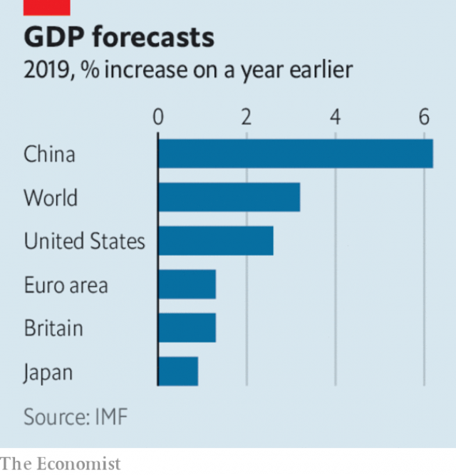

###### Britain finds its BoJo

# Business this week 

> Jul 25th 2019 

America’s Justice Department announced a broad antitrust review of the market power of online platforms in search, social media and retailing. That increases the pressure on Amazon, Apple, Facebook and Google to improve their behaviour as the calls from some Democrats to break up those companies grow louder during the election season. See article. 

Meanwhile, the Federal Trade Commission confirmed that it is slapping Facebook with a $5bn fine for violating privacy. It ordered Facebook to change its attitude to privacy “from the corporate board-level down”, and introduce mechanisms that make its executives accountable for decisions on privacy. The firm disclosed that the FTC has launched a separate antitrust investigation into its practices. See article. 

Boeing’s quarterly net loss of $2.9bn was its biggest ever. The aerospace company recently disclosed an after-tax charge of $4.9bn in connection with the worldwide grounding of its 737 MAX airliner following two fatal crashes. 

Carl Icahn, an activist investor, stepped up his attack on Occidental’s offer to take over a rival oil company, Anadarko, calling it a “travesty”. Mr Icahn holds a 4.4% stake in Occidental and has nominated a slate of directors to sit on the company’s board. He has been highly critical of Warren Buffett’s backing of Occidental’s bid, which includes putting $10bn towards its financing. 

Soon after ditching an IPO of its Asian business, which would have been the world’s most valuable stockmarket flotation this year, Anheuser-Busch InBev agreed to sell its Australian brewing division to Asahi, a Japanese beermaker, for $11.3bn. The world’s biggest brewer still intends eventually to list its Asian assets. It needs the money to pay down the huge debt pile it amassed during a takeover binge. 

 

The IMF lowered its forecast of global growth this year, to 3.2%, which would be the weakest in a decade. In its latest outlook the fund described the world economy as “subdued”; it is specifically concerned about trade and technology tensions between America and China and the prospect of Britain leaving the EU without a deal. Still, the IMF expects British GDP to grow by 1.3% this year, slightly above its previous projection in April. It sharply downgraded its growth forecasts for many emerging economies, notably Brazil, Mexico and South Africa. 

South Africa’s finance minister laid out plans to provide Eskom, which generates most of the country’s electricity, with another rescue, this time worth 59bn rand ($4.2bn). Moody’s, a credit-rating agency, said that because the embattled utility is ever more dependent on bail-outs it would regard Eskom’s debt as part of the government’s. 

The Federal Reserve took the unusual step of qualifying the remarks of a senior official to reassure markets that they had not been made in relation to the central bank’s forthcoming decision on interest rates. Speculation that the Fed might cut its benchmark rate by half a percentage point, rather than a quarter, mounted after John Williams, who heads the Federal Reserve Bank of New York, said that he supports aggressive easing. Donald Trump, a critic of the Fed’s recent monetary tightening, seized on the remarks, saying they underlined its “faulty thought process”. 

Costs related to the overhaul of its business pushed Deutsche Bank to a €3.2bn ($3.5bn) net loss in the second quarter, its biggest quarterly loss in four years. The German bank booked about half of a restructuring charge it will take as it retreats from trading and slashes 18,000 jobs over the next three years. 

Nissan confirmed it would cut 12,500 jobs worldwide, or 10% of its workforce, by 2022, as it curtails capacity. The Japanese carmaker has struggled in recent years. Profit in the latest quarter fell by 95% compared with the same three months last year, to ¥6.4bn ($58m). 

General Motors delayed the large-scale roll-out of its autonomous-car ride-hailing service, which it has developed in collaboration with Cruise, its self-driving-car unit. It had hoped to deploy a fleet of robotaxis on the roads of San Francisco by the end of this year, but the launch has been delayed indefinitely. GM, like its competitors, is still dealing with technical obstacles and unresolved regulatory questions. 

In the week when Tesla dismayed investors with another disappointing quarterly earnings report, Ford unveiled an electric-powered prototype of its F-150 pickup truck in response to a claim by Elon Musk that Tesla’s rival model would have better “functionality”. Ford’s F-series pickups are the best-selling cars in America. In a show of strength, its prototype pulled a freight train for 1,000 feet, a direct challenge to Mr Musk’s boast about the better performance of his new vehicle. 

-- 

 单词注释:

1.BoJo[]:[网络] 伯爵；母情；坊城 

2.Jul[]:七月 

3.antitrust[.ænti'trʌst]:a. 反托拉斯的 [法] 反托拉斯的 

4.online[]:[计] 联机 

5.amazon['æmәzɒn]:n. 亚马孙河 [医] 无乳腺者 

6.facebook[]:n. 脸谱网 

7.google[]:谷歌；搜索引擎技术；谷歌公司 

8.democrat['demәkræt]:n. 民主人士, 民主主义者, 民主党党员 [经] 民主党 

9.slap[slæp]:n. 掴, 掌击, 侮辱, 拍击声 v. 拍击, 惩罚 adv. 正面地, 直接地, 突然地 

10.privacy['praivәsi]:n. 隐私, 隐居, 秘密 [计] 个人保密权 

11.corporate['kɒ:pәrit]:a. 社团的, 合伙的, 公司的 [经] 团体的, 法人的, 社团的 

12.mechanism['mekәnizm]:n. 机械, 机构, 结构, 机理, 技巧 [化] 机理; 历程; 机构 

13.accountable[ә'kauntәbl]:a. 负有责任的, 可说明的, 可解释的 [经] 负有责任的 

14.ftc[]:abbr. （美）联邦贸易委员会（Federal Trade Commission）；（日）公平贸易委员会（Fair Trade Commission） 

15.aerospace['єәrәuspeis]:n. 航天空间, 航天技术 

16.grounding['graundiŋ]:n. 基础教学, 基础训练 [经] 搁浅 

17.MAX[mæks]:[计] 最大 

18.airliner['єәlainә]:n. 班机, 大型客机 

19.Carl[kɑ:l]:n. 卡尔（男名） 

20.icahn[]: [人名] 伊坎 

21.activist['æktivist]:n. 激进主义分子 

22.investor[in'vestә]:n. 投资者 [经] 投资者 

23.anadarko[]:[网络] 阿纳达科；纳达科；阿纳达科公司 

24.travesty['trævisti]:n. 拙劣的模仿作品, 嘲弄, 滑稽模仿 vt. 滑稽地模仿, 歪曲 

25.occidental[.ɒksi'dentәl]:n. 欧美人, 西方人 a. 欧美的, 西方的, 西方国家的 

26.nominate['nɒmineit]:vt. 提名, 任命, 命名 [法] 提名...为候选人, 指定, 推荐 

27.slate[sleit]:n. 板岩, 页岩, 提名名单, 人选, 记录, 石板 a. 石板色的 vt. 铺石板, 责骂, 痛打 

28.warren['wɒrәn]:n. 养兔场, 拥挤的地区 

29.ipo[]:abbr. 首次公开募股（Initial Public Offerings）；初次公开发行（Initial Public Offering） 

30.stockmarket[s'tɒkmɑ:kɪt]: 证券市场; 证券交易所; 证券行情 

31.flotation[flәu'teiʃәn]:[化] 浮; 浮游选矿 [医] 浮集(法), 浮选(法) 

32.inbev[]:[网络] 英博；英博啤酒集团；英博集团 

33.brew[bru:]:n. 酿造酒, 酝酿 v. 酿造, 酝酿 

34.Asahi[]:n. 朝日（公司及其品牌名称） 

35.brewer['bru:ә]:n. (啤酒)制造者, 泡制饮料的器皿 [机] 啤酒工人 

36.asset['æset]:n. 资产, 有益的东西 

37.amass[ә'mæs]:vt. 积聚, 堆积 

38.takeover[]:n. 接管, 接收 [经] 接收 

39.binge[bindʒ]:n. 狂闹, 狂欢 

40.IMF[]:国际货币基金组织 [经] 国际货币基金 

41.subdue[sәb'dju:]:vt. 使服从, 压制, 减弱, 抑制, 克制 

42.specifically[spi'sifikli]:adv. 特定地, 明确地, 按特性 

43.EU[]:[化] 富集铀; 浓缩铀 [医] 铕(63号元素) 

44.projection[prә'dʒekʃәn]:n. 发射, 计划, 突出部分, 设计, 推测 [计] 投影 

45.downgrade['dajn^reid]:vt. 降低, 贬低 n. 下坡 a. 下坡 adv. 下坡 

46.notably['nәjtbәli]:adv. 显著地, 著名地, 尤其, 特别 

47.Brazil[brә'zil]:n. 巴西 

48.eskom[]:[网络] 南非电力公司；南非国家电力公司；斯康 

49.rand[rænd]:n. 兰特, (非正式)边, 田埂, 缘 [经] 兰特 

50.embattle[im'bætl]:vt. 列阵, 布阵, 整军备战, 严阵以待 

51.reassure[.ri:ә'ʃuә]:vt. 使...安心, 向...再保证 [法] 重新保证, 再保险, 使清除疑虑 

52.forthcoming['fɒ:θ'kʌmɑŋ]:a. 即将来临的 n. 来临 

53.speculation[.spekju'leiʃәn]:n. 沉思, 推测, 投机 [经] 投机交易, 买空卖空 

54.benchmark[]:[计] 基准程序; 基准 

55.john[dʒɔn]:n. 盥洗室, 厕所, 嫖客 

56.williams['wiljәmz]:n. 威廉姆斯（男子名） 

57.york[jɔ:k]:n. 约克郡；约克王朝 

58.monetary['mʌnitәri]:a. 货币的, 金钱的 [经] 货币的, 金融的 

59.tighten['taitn]:vt. 勒紧, 使变紧 vi. 变紧, 绷紧 

60.overhaul[.әuvә'hɒ:l]:vt. 分解检查, 翻修, 精细检查, 彻底革新 n. 分解检查, 精细检查, 大检修 

61.deutsche[]:n. 德意志联邦共和国马克 

62.restructuring[]:[计] 重构的 

63.slash[slæʃ]:v. 猛砍, 乱砍 n. 猛砍, 乱砍, 删减 [计] 斜线 

64.nissan[]:n. 尼桑（日产汽车名） 

65.curtail[kә:'teil]:vt. 缩减, 剥夺, 简略 [法] 剥夺特权 

66.carmaker['kɑ:,meikә(r)]:n. 汽车制造商 

67.collaboration[kә.læbә'ræʃәn]:n. 合作, 勾结 [法] 通敌卖国者, 奸细 

68.cruise[kru:z]:n. 巡航, 巡弋, 漫游 v. 巡航, 巡弋, 漫游 

69.deploy[di'plɒi]:v. 展开, 配置 

70.san[sɑ:n]:abbr. 存储区域网（Storage Area Networking） 

71.francisco[fræn'siskәu]:n. 弗朗西斯科（男子名, 等于Francis） 

72.indefinitely[]:adv. 无期限地 

73.GM[]:通用汽车公司, 总经理, 导弹 [经] 通用汽车公司 

74.unresolved['ʌnri'zɔlvd]:a. 无决断力的, 不果断的, 无决心的, 未解决的, 未澄清的, 未议决的, 未分解的 [计] 非分辩的 

75.regulatory['regjulәtәri]:a. 受控制的, 统制的, 调整的 [经] 规则的 

76.Tesla['teslә]:[电] 特斯拉 

77.dismay[dis'mei]:n. 沮丧 vt. 使惊愕, 使气馁 

78.earning['ә:niŋ]:n. 收入（earn的现在分词） 

79.ford[fɒ:d]:n. 浅滩, 福特汽车 v. 涉过, 涉水 

80.unveil[.ʌn'veil]:vt. 揭开, 揭幕, 除去...的面纱 vi. 显露, 除去面纱 

81.prototype['prәutәtaip]:n. 原型 [计] 样机; 原型 

82.pickup['pikʌp]:n. 拾起, 加速, 刺激, 猎物的收集, 好转, 恢复健康, 搭车者, 兴奋剂, 电视摄像 [电] 拾音器 

83.elon[i'lɔn]:n. 埃伦（可溶性显影剂粉末） 

84.musk[mʌsk]:n. 麝香, 麝香的气味 [化] 麝香 

85.functionality[,fʌŋkәʃә'næliti]:[计] 功能性, 泛函性 [化] 官能度 

