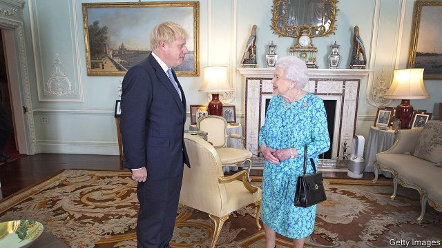
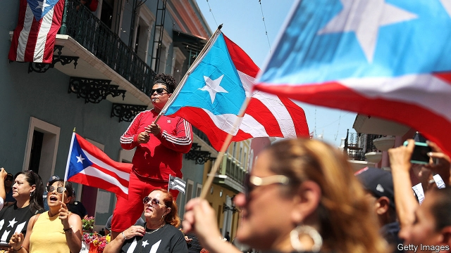

###### Britain finds its BoJo

# Politics this week 

 

> Jul 25th 2019 

Boris Johnson took over as Britain’s prime minister from Theresa May after winning the Conservative Party’s leadership contest. Mr Johnson was the favourite from the outset and won comfortably, taking 66% of the vote from the 160,000 party members on an 87% turnout. Some wonder how long he will last. Brexit has already claimed two British prime ministers. When Parliament scrutinises his Brexit proposals Mr Johnson is likely to struggle as much as Mrs May did. See article. 

Mr Johnson started naming his new ministers, aiming to move away from the pale, male and stale image of previous cabinets. Sajid Javid was appointed chancellor of the exchequer, Dominic Raab took charge at the Foreign Office and Priti Patel became home secretary. There were two other themes in his picks: the new cabinet is packed with pro-Brexiteers and those who backed Mr Johnson in the leadership race. See article. 

The response in Europe to Mr Johnson’s victory was muted. Ursula von der Leyen, the president-elect of the European Commission, politely noted that he “faces challenging times”. Others were more direct. Guy Verhofstadt, who leads the liberal bloc in the European Parliament, called him “irresponsible”. 

In one of her first big decisions as she prepares to take over the presidency of the European Commission, Mrs von der Leyen decided to move Martin Selmayr, the EU’s most senior civil servant, to a new job running the EU’s operations in Austria. The demotion comes less than 18 months after his controversial appointment amid claims of cronyism. 

Ukraine’s parliamentary election was won by President Volodymyr Zelensky’s new Servant of the People party, which won the first overall majority in the country since the fall of communism. Mr Zelensky, a former comedian, called the snap poll after winning the presidency on an anti-corruption ticket in April. See article. 

Kenya’s finance minister, Henry Rotich, was arrested on corruption charges. He denies wrongdoing. The case has raised fears of political instability in Kenya as Mr Rotich is an ally of the deputy president, William Ruto, who plans to run for president in 2022. Mr Ruto’s supporters claim the police and prosecutors are using corruption charges to undermine his chances of winning office. 

The health minister of the Democratic Republic of Congo, Oly Ilunga, resigned amid a dispute over Ebola. Mr Ilunga had resisted the introduction of an experimental vaccine that experts believe could have helped contain the current outbreak, in which about 2,500 people have been infected. 

Iran seized a British tanker passing through the Strait of Hormuz, an important choke- point for international shipping. The capture of the tanker came two weeks after Britain seized an Iranian tanker allegedly bound for Syria. See article. 

Robert Mueller gave eagerly awaited testimony to America’s Congress at a public hearing. The man who investigated links between Donald Trump’s election campaign and Russian officials did not stray far from the findings of his report, published in April, but he rejected the president’s claim that it completely exonerated him. See article. 

The Senate confirmed Mark Esper as America’s new defence secretary, following the derailment of Patrick Shanahan’s nomination last month. Mr Esper received broad bipartisan support in the Senate, though a smattering of Democrats raised concerns about his former job as a lobbyist for a weapons company. 

A resolution opposing an attempt to boycott Israel picked up huge Democratic support and passed the House of Representatives by 398 to 17. That marked a stinging defeat for the movement to boycott Israel, advanced by newly elected progressives. 

 

Ricardo Rosselló became the first governor of Puerto Rico to resign, after two weeks of ever-larger protests triggered by the leak of sexist, homophobic and violent text messages that he exchanged with government officials. One of the offending texts mocked victims of Hurricane Maria, making reference to cadavers and crows. 

South Korea accused Russian aircraft of violating its airspace during a joint military exercise with China. The alleged incursion happened near disputed islands in the Sea of Japan, which are claimed by both Japan and South Korea. Russia denied the incursion. See article. 

Pakistan’s prime minister, Imran Khan, visited the White House. Donald Trump boasted that he could wipe out Afghanistan, an American ally, and, to India’s horror, offered to mediate in the long-standing dispute over Kashmir. See article. 

Japan’s ruling Liberal Democrats won a majority of seats in the upper house of parliament at an election, but failed to secure the supermajority required to change the country’s pacifist constitution, a long-held goal of Shinzo Abe, the prime minister.  

Li Peng, a former prime minister of China, died aged 90. Mr Peng was known as the “Butcher of Beijing” for his role in the crackdown on pro-democracy protesters in Tiananmen Square in 1989. See article. 

Tensions were high in Hong Kong after protesters vandalised the Chinese government’s liaison office in the territory. A mob of men armed with sticks and metal bars later attacked passengers at a railway station. China hinted that it was ready to intervene in Hong Kong if protesters threatened the central government’s authority. See article. 

A Venezuelan fighter jet “aggressively shadowed” an American navy reconnaissance plane over the Caribbean Sea, according to Southern Command, which runs American military operations in Latin America. Venezuela claimed the navy plane had strayed into its airspace. 

The power went off again in 16 of Venezuela’s 23 states. In the capital, Caracas, the blackout caused huge traffic jams. The government blamed an “electromagnetic attack”. 

Brazil’s president, Jair Bolsonaro, chose Marcelo Xavier da Silva, a federal police officer, to lead the government’s Indian affairs department, Funai. Indigenous groups criticised the appointment. As Funai’s ombudsman in 2017 Mr da Silva had asked the police to take “persecutory measures” against activists. Separately, Mr Bolsonaro said he would review data on the deforestation of the Amazon before their release, because the figures could hurt Brazil’s image. 

-- 

 单词注释:

1.BoJo[]:[网络] 伯爵；母情；坊城 

2.politic['pɒlitik]:a. 精明的, 明智的, 策略的 

3.Jul[]:七月 

4.boris['bɔris]:n. 鲍里斯（男子名） 

5.johnson['dʒɔnsn]:n. 约翰逊（姓氏） 

6.theresa[ti'ri:zә]:n. 特丽萨（女子名） 

7.comfortably['kʌmfәtәbli]:adv. 安乐地, 舒服地, 宽裕地 

8.turnout['tә:naut]:n. 聚集的人群, 出席者, 产量 [化] 输出; 产额 

9.Brexit[]:[网络] 英国退出欧盟 

10.scrutinise[]:vt.vi. 细看, 仔细检查, 审查, 细阅 [经] 详细检查, 细细地看 

11.Mr['mistә(r)]:先生 [计] 存储器回收程序, 多重请求 

12.sajid[]:n. (Sajid)人名；(印尼)赛义德 

13.javid[]:[网络] 加威；贾维德 

14.chancellor['tʃɑ:nsәlә]:n. 大臣, 总理, 首相, 大使馆/领事馆的一等秘书, 司法官, 大学校长 

15.exchequer[iks'tʃekә]:n. (英国)财政部, 国库 [法] 国库, 财源, 财政法院 

16.dominic['dɔminik]:n. 多米尼克（男子名） 

17.Raab[]:n. (Raab)人名；(英、法、德、俄、捷、匈、瑞典)拉布；(西)拉夫 

18.priti[]:[网络] 喜；觉了喜；普里提 

19.Patel[]:n. 帕特尔（姓氏） 

20.ursula['ә:sjulә]:n. 厄休拉（女子名） 

21.Von[vɔn;fɔn;fәn]:[计] 冯·诺伊曼 

22.der[]:abbr. 区分编码规则（Distinguished Encoding Rules） 

23.leyen[]:[网络] 部女部长莱恩 

24.politely[pә'laitli]:adv. 有礼貌地, 文雅地, 客气地 

25.verhofstadt[]:n. (Verhofstadt)人名；(德)费尔霍夫施塔特 

26.bloc[blɒk]:n. 集团 

27.irresponsible[.iri'spɔnsәbl]:a. 不负责任的；不可靠的 

28.presidency['prezidәnsi]:n. 总统职权, 总裁职位 

29.Martin['mɑ:tin]:n. 马丁, 圣马丁鸟 

30.Selmayr[]:[网络] 迈亚 

31.Austria['ɒstriә]:n. 奥地利 

32.demotion[di'mәuʃәn]:n. 降级, 降职, 降等 [经] 降级 

33.les[lei]:abbr. 发射脱离系统（Launch Escape System） 

34.amid[ә'mid]:prep. 在其间, 在其中 [经] 在...中 

35.cronyism['krәjniizəm]:n. 任人唯亲 

36.parliamentary[.pɑ:lә'mentәri]:a. 国会的, 议会的, 议会制度的 

37.volodymyr[]:[网络] 昊宇 

38.zelensky[]:[网络] 泽伦斯基 

39.comedian[kә'mi:djәn]:n. 喜剧演员 

40.henry['henri]:n. 亨利 [医] 亨[利](电感应单位) 

41.corruption[kә'rʌpʃәn]:n. 腐败, 堕落, 贪污 [计] 论误 

42.wrongdoing['rɒŋ'du:iŋ]:n. 干坏事, 坏事 

43.instability[.instә'biliti]:n. 不安定, 不稳定 [医] 不稳定性 

44.Kenya['kenjә]:n. 肯尼亚 

45.ally['ælai. ә'lai]:n. 同盟者, 同盟国, 助手 vt. 使联盟, 使联合, 使有关系 vi. 结盟 

46.william['wiljәm]:n. 威廉（男子名）；[常作W-][美俚]钞票, 纸币 

47.Ruto[]:[网络] 鲁托；托公主；舞场 

48.supporter[sә'pɒ:tә]:n. 支持者, 后盾, 迫随者, 护身织物 [法] 支持者, 赡养者, 抚养者 

49.prosecutor['prɒsikju:tә]:n. 实行者, 告发者, 公诉人 [法] 原告, 起诉人, 检举人 

50.undermine[.ʌndә'main]:vt. 在...下面挖, 渐渐破坏, 暗地里破坏 [法] 暗中破坏, 以阴谋中伤伤害 

51.Congo['kɔŋ^әu]:n. 刚果, 刚果河, 工夫茶 [建] 刚果, 直接刚果红 

52.oly[]:abbr. Washington, D. C. , Olympics 华盛顿奥运会（国家协会） 

53.ilunga[]: [地名] [坦桑尼亚] 伊隆加 

54.ebola[i'bəulə]:n. 埃博拉病毒 

55.vaccine['væksi:n]:n. 牛痘苗, 疫苗 a. 疫苗的, 牛痘的 

56.outbreak['autbreik]:n. 爆发, 暴动 [医] 暴发 

57.Iran[i'rɑ:n]:n. 伊朗 

58.Hormuz['hɔ:mәz,hɔ:'mu:z]:霍尔木兹海峡(在伊朗和阿拉伯半岛之间,连接波斯湾[即阿拉伯湾]和阿曼湾) 

59.Iranian[i'reiniәn]:a. 伊朗的, 伊朗语系的 n. 伊朗人, 伊朗语 

60.allegedly[ә'ledʒidli]:adv. 依其申述 

61.Syria['siriә]:n. 叙利亚 [经] 叙利亚 

62.Robert['rɔbәt]:[法] 警察 

63.Mueller[]:米勒（人名） 

64.eagerly[]:adv. 渴望, 热衷于, 热切 

65.testimony['testimәni]:n. 证言, 证据, 声明 [医] 证据 

66.stray[strei]:n. 走失的家畜, 浪子 a. 迷途的, 偶然的 vi. 迷路, 彷徨, 流浪 

67.exonerate[ig'zɒnәreit]:vt. 免除, 证明无罪 [法] 解放, 开释, 免罪 

68.esper[]:n. 埃斯珀（姓氏）；灵异少女 

69.derailment[]:[法] 出轨 

70.patrick['pætrik]:n. 帕特里克（男子名） 

71.nomination[.nɒmi'neiʃәn]:n. 提名, 任命, 提名权 

72.bipartisan[bai,pɑ:ti'zæn]:a. 两党连立的 

73.smatter['smætә]:v. 略知, 略懂 n. 一知半解, 肤浅知识, 少数 

74.democrat['demәkræt]:n. 民主人士, 民主主义者, 民主党党员 [经] 民主党 

75.lobbyist['lɔbiist]:n. 说客 [法] 院外活动集团成员 

76.Israel['izreil]:n. 以色列, 以色列后裔, 犹太人 

77.stinging['stiŋiŋ]:a. 刺人的, 刺一般的, 激烈的 

78.Ricardo[ri'kɑ:dәu]:里卡多(姓氏) 

79.Puerto[]:n. 垭口, 港口, 山口 n. (Puerto)人名；(西)普埃尔托 

80.rico[]:abbr. 反诈骗腐败组织集团犯罪法（Racketeer Influenced and Corrupt Organizations Act） 

81.trigger['trigә]:n. 触发器, 扳机 vt. 触发, 发射, 引起 vi. 松开扳柄 [计] 切换开关 

82.sexist['seksist]:n. 性别歧视者 

83.homophobic[,hɔmə'fəubik]:a. 害怕同性恋的 

84.mock[mɒk]:n. 嘲笑, 戏弄, 模仿 a. 假的, 伪造的, 模拟的 adv. 虚伪地 vt. 嘲弄, 模仿, 使失望, 欺骗, 挫败 vi. 嘲弄 

85.Maria[mә:'raiә, mә'riә]:n. 玛丽亚（女名） 

86.cadaver[kә'deivә]:n. 死尸, 尸体 [医] 尸体 

87.Korea[kә'riә]:n. 朝鲜, 韩国 

88.allege[ә'ledʒ]:vt. 宣称, 主张, 提出, 断言 [法] 断言, 指称, 指证 

89.incursion[in'kә:ʃәn]:n. 侵入, 侵略, 奇袭 

90.IMRAN[]:n. 伊姆兰（男子名） 

91.khan[kɑ:n]:n. 可汗, 商队宿店 

92.Afghanistan[æf'gænistæn]:n. 阿富汗 

93.mediate['mi:dieit]:a. 居间的, 间接的 vt. 斡旋, 调停 vi. 处于中间, 调解 

94.Kashmir['kæʃmiә]:n. 克什米尔 

95.supermajority[,sju:pəmə'dʒɔriti, -,dʒɔ:-]:n. 绝对多数制 

96.pacifist['pæsifist]:n. 和平主义者, 反战论者, 不抵抗主义者 

97.shinzo[]:[网络] 晋三；爆裂战士战蓝宝；神像 

98.abe[eib]:n. 亚伯（男子名, 等于Abraham） 

99.peng[]:n. 执业工程师 

100.crackdown['krækdaun]:n. 制裁, 镇压, 痛击 

101.protester[]:n. 抗议者, 持异议者, 拒付者 [经] 反对者 

102.hong[hɔŋ]:n. （中国、日本的）行, 商行 

103.kong[kɔŋ]:n. 含锡砾石下的无矿基岩；钢 

104.vandalise['vændәlaiz]:vt. 摧残(文化), 破坏(公共财产), 故意破坏 

105.liaison[li:'eizɒn]:n. 联络 

106.mob[mɒb]:n. 暴民, 民众, 暴徒 vt. 大举包围, 蜂拥进入, 围攻 vi. 聚众生事 

107.intervene[.intә'vi:n]:vi. 插入, 调停, 干涉 [经] 进场干预 

108.venezuelan[,venә'zweilәŋ]:a. 委内瑞拉的；委内瑞拉人的 

109.aggressively[]:adv. (贬)侵略, 侵犯, 寻衅, (褒)敢作敢为, 有进取心, (武器)攻击性, 过分, 放肆 

110.reconnaissance[ri'kɒnisәns]:n. 侦察, 勘察队 [电] 勘查 

111.Caribbean[.kæri'bi:әn]:n. 加勒比海 a. 加勒比海的, 加勒比人的 

112.Venezuela[,vene'zweilә]:n. 委内瑞拉 

113.caracas[kә'rækәs]:n. 加拉加斯（委内瑞拉首都） 

114.blackout['blækaut]:n. 灯火管制, 暂时的意识丧失, 灯火熄灭, 删除 [计] 电网掉电 

115.electromagnetic[ilektrәj'mæ^nitik]:a. 电磁的, 由电磁石产生的 [电] 电磁的 

116.jair[]:[网络] 睚珥；贾伊尔；睢珥 

117.marcelo[]:n. 马塞洛（著名足球明星） 

118.xavier['zeiviә(r),'zæ-,'zeivjә(r)]:n. 泽维尔（男子名） 

119.DA[,di:'ei]:美国地方检察官 [计] 数据采集, 数据管理员, 数据分析, 设计自动化 

120.silva['silvә]:n. 森林, 森林志 

121.funai[]:[网络] 船井；船井电机；印第安人基金会 

122.indigenous[in'didʒinәs]:a. 本土的, 国产的, 固有的 [医] 原产的, 本土的 

123.criticise['kritisaiz]:v. 批评, 吹毛求疵, 非难 

124.ombudsman['ɒmbudzmæn]:n. (专查官员舞弊的)调查官 [法] 调查专员, 监察专员, 司法专员 

125.persecutory[]:a. persecute的变形 

126.activist['æktivist]:n. 激进主义分子 

127.datum['deitәm]:n. 论据, 材料, 资料, 已知数 [医] 材料, 资料, 论据 

128.deforestation[di:.fɒ:ri'steiʃәn]:n. 采伐森林, 森林开伐 [法] 砍伐森森 

129.amazon['æmәzɒn]:n. 亚马孙河 [医] 无乳腺者 

