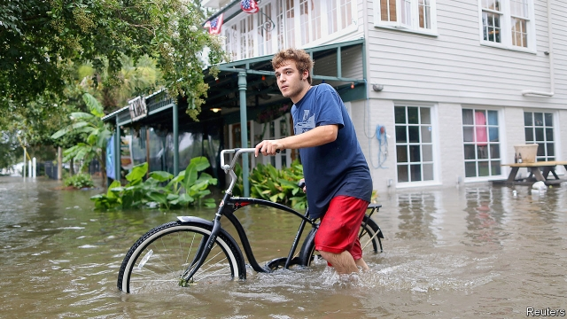
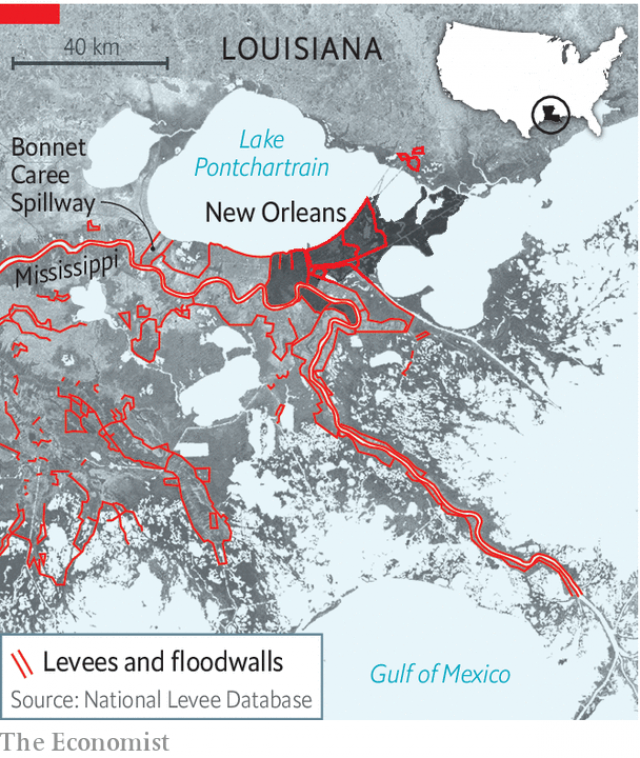

###### Barry scary

# A new threat to New Orleans 

 

> print-edition iconPrint edition | United States | Jul 27th 2019 

AS HURRICANES GO, Barry hardly qualified for the title. Poorly organised and slow-moving, it achieved the requisite wind speed for just a couple of hours on July 13th before being demoted to a tropical storm. But for New Orleans, mild Barry was a wake-up call, exposing a new vulnerability for a low-lying city: the possibility that the vast Mississippi—still swollen in July, months after it typically crests—could be pushed over its banks by the surge a tropical storm often brings. 

In flood-prone New Orleans floods can come from the sea, from the river or from the sky. Much of the city is below sea level, and its topography is bowl-like, with levees forming the edges. When torrential rain falls, as it often does, there is nowhere for it to go, so it must be pumped out over the walls. The potential for disaster is greater when a levee is overtopped—or worse, breached—by tidal Lake Pontchartrain or the river, which bookend the city. 

Hurricane Katrina, now 14 years ago, was the modern standard-setter for local catastrophe. Katrina’s formidable surge overwhelmed a system of levees and floodwalls designed to keep the sea at bay in hurricanes, a system later revealed as badly flawed. Eighty percent of the city went under water, much of it for weeks. Since then, most New Orleanians—and the Army Corps of Engineers, which oversees the system of levees—have understandably focused their attention on improving the defences facing the sea. The Mississippi river, the very reason for the city’s precarious siting, has lately been an afterthought. 

 

Barry helped change that. Though hurricane season runs from June 1st until November 30th, the first two months are usually quiet in the Gulf. Barry came early for a Louisiana cyclone, arriving when the Mississippi, which rises every spring with snowmelt and rainfall in the northern states and Canada, was still swollen. The river’s height as it passes the city is measured against sea level. When Katrina hit in August 2005, it was around three feet above sea level. When Barry was approaching it was at 16 feet above. 

Just as they do to the seas in their path, hurricanes can change river levels. When Katrina churned through Louisiana the river level shot up from less than four feet to nearly 16 in the city, not enough to threaten the river levees, but close. Early forecasts had said that Barry might raise the Mississippi by four feet. That would have been enough to reach the tops of some of the city’s levees. Scientists are still trying to understand how the extra force a high river has might counteract the opposing surge a powerful hurricane carries. But had Barry been a monster like Katrina, or even a less-catastrophic storm like Gustav in 2008 or Isaac in 2012, it is likely that the flood defences along the river would have failed. 

New Orleanians are used to thinking about stacked threats, for instance the possibility that a slow-moving hurricane could dump tons of rain, flooding the city from within even as a storm surge menaces from without. Barry introduced a new one: a high river in the summer, pushed over its banks by a hurricane. This new menace showed itself even though the Corps of Engineers has taken steps this year to lower the height of the river. The Bonnet Carre Spillway, a man-made sluice about 30 miles upriver from New Orleans that diverts water to Lake Pontchartrain, is not put into service in most years. This year, it has been open for 120 days, a new record. And yet the river remains high. 

For New Orleanians, the brush with Hurricane Barry was a reminder that their city has been made more vulnerable by global warming, which brings rising seas and an increased likelihood of powerful hurricanes. Oil and gas exploration has hastened the erosion of the wetlands that once protected the region. And the river’s levees, while keeping the Mississippi in its banks, have starved the delta of sediment and led it to sink more quickly. Engineers and academics are starting to talk about ways to diminish the river’s flow safely in the future—by creating new reservoirs upstream, or perhaps restoring wetlands. While those questions are debated, New Orleanians will be keeping an eye on their mighty river, which is expected to remain well above its usual height as the peak of hurricane season approaches. ■ 

