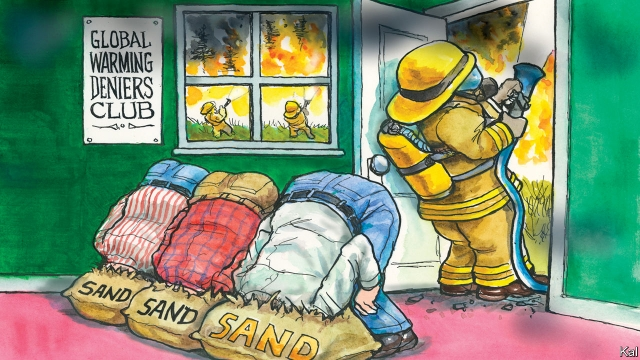

###### Lexington

# Hotshots and global warming in Alaska 

 

> print-edition iconPrint edition | United States | Jul 25th 2019 

THE WILDFIRE is half a mile away, with nothing between it and Tim Hatfield’s fireline except flammable spruce trees. High in the Alaskan Arctic, smoke fills the southern horizon—stirred by a light southwesterly breeze that is a source of irritation to the 35-year-old chief firefighter. He is anxious to complete the five-mile defensive buffer he and his 66 firefighters are carving into the boreal forest to stop fire, which has consumed 11,000 acres since it was started by a lightning strike three weeks ago. 

That would entail widening the fireline by burning a strip of forest on its southern edge. Yet in these winds, and Alaska’s record high temperatures, a controlled burn could get out of hand. It could burn the patches of forest owned by the local Neetsaii’ Gwich’in Indians that Mr Hatfield and his team have been dispatched, by helicopter and boat, to protect under the terms of the government’s settlement with the tribe. “You have to be patient with fire,” he says. “Sometimes that’s the hardest thing.” 

While American politicians engage in a hot and unproductive debate about global warming, the country’s 14,000 federal wildfire fighters—and more employed by state and local agencies—are fighting it every day. Hotter, drier conditions have sent the natural fire cycle on which the forests and grasslands of Alaska and the western states depend into a tailspin. The wildfire season is 78 days longer than it was five decades ago. In California, which last year saw its deadliest and two biggest wildfires, it is year-round. 

Nowhere is the fiery new normal more obvious than in Alaska, which is largely forested and warming at twice the global rate. Of the 10m acres of American forest incinerated in 2015, a new annual record, over half were in the northernmost state. And while the fire season in the Lower 48 has got off to a relatively slow start this year, Alaska is again ablaze. It has lost over 2m acres of forest so far. This puts Mr Hatfield and his team on the front line of a struggle in which more than America’s forests—the fourth most extensive of any country’s—are at stake. The firefighters represent a prominent test of America’s effort to adapt to global warming—and in the process, some hope, bring sanity to the political debate. 

As climate-change pioneers, they might not seem all that impressive. Bearded and intensely grimy, after 17 days of work and sleep in smoke and dirt, Mr Hatfield inspects the arrow-straight ride the firefighters have cut with chainsaws and Pulaskis, a cross between an axe and an adze used in American wildfire fighting for almost a century. Given the fire’s remoteness and low priority—it threatens no city or significant installation—there is no less arduous way. Slouching through the forest in his filthy uniform of yellow shirt and green combat trousers, while recalculating wind, humidity and temperature, Mr Hatfield recalls one of the original pioneers, an impression reinforced by the all-American miscellany he meets along the fireline. First a 20-man crew of Gwich’in irregulars, struggling with a water-pump; next some elite “Hotshot” firefighters from Oregon, leaning on their Pulaskis (“They call me “First-gear”, one says, “cause I don’t go fast but I never stop”). A nearby spruce whooshes into flame, sparked by embers from an earlier, aborted, effort to widen the line. Mr Hatfield ignores it. 

The diversity of his team in fact reflects the efficiency of America’s emergency response system. Within hours of the National Interagency Fire Centre in Boise, Idaho, receiving a call for help, it can dispatch one or more of the 110 Hotshot crews employed by federal agencies and state and county governments. It is also a tribute to the spirit of the firefighters—of which there were further illustrations around the campfire where Mr Hatfield and his deputies, including another Alaskan, a Californian, Washingtonian and more Oregonians, gathered to grill hot dogs and steaks on sharpened sticks. Wildfire fighters are an unusual lot, at once dedicated and free-spirited. Many are drawn to working long hours for six months, in order to spend the rest of the year hunting or skiing. “And for most of us just being in the woods is huge,” said Brita West, an Alaskan and rare female firefighter. Yet the stresses of the new normal are taking a toll. 

Wildfire fighters are racking up twice as much overtime as they were a few years ago, in part because there are fewer of them. The number of federal firefighters has fallen by over 2,000. That is a result of cost-cutting and also increased competition for free spirits from fracking and other extractive industries in the western states. More hazardous infernos are another disincentive. Almost 200 wildlife firefighters have perished in the past decade. America is therefore starting to run short of some of its most heroic public servants even as its need for them soars. 

Areas formerly prioritised for protection—including native American forest—are being abandoned in times of high activity. And there will be more of these. Climate models augur a huge increase in wildfires’ frequency and range. Yet with many politicians on the right denying the reality of global warming, no government or agency has made a serious effort to model what firefighting resources will be needed, to defend what areas and at what cost. 

There are two big cautionary lessons here. One is that, beyond the dysfunction in Washington, the excellence of America’s institutions is creating a false sense of security about the long-term threats its politicians are neglecting. That is starkly true of America’s early efforts to adapt to global warming. But much the same could be said for its armed forces, diplomatic service, judiciary and other institutional crutches against manifold threats. This is not sustainable. Without better leadership, there will be a reckoning. 

The second lesson, given how little public attention has been paid to the wildfires, is that there is little reason to think increased natural disasters alone will produce the necessary leadership. Many Americans, and by extension their politicians, are already becoming inured to global warming’s devastating effects.■ 
<<<<<<< HEAD

-- 

 单词注释:

1.lexington['leksiŋtәn]:n. 列克星敦市（位于美国肯塔基州） 

2.hotshot['hɒtʃɒt]:n. 艺高而自负的人, 货物快车, 快速交通工具, 大人物 

3.Alaska[ә'læskә]:n. 阿拉斯加州 

4.Jul[]:七月 

5.wildfire['waildfaiә]:n. (古时战争时所用的)燃料剂, 磷火, 鬼火, 野火 

6.tim[tim]:n. 蒂姆（男子名） 

7.fireline[]:n. 防火线；火灾最前线 

8.flammable['flæmәbl]:a. 易燃的, 可燃性的 [电] 可燃的 

9.spruce[spru:s]:n. 云杉 a. 颇为干净的, 俏的, 整洁的 v. (使)显干净, 打扮整齐 

10.alaskan[ә'læskәn]:a. 阿拉斯加的；阿拉斯加州的 

11.southwesterly[sauθ'westәli]:a. 往西南的, 来自西南的 adv. 往西南, 来自西南 

12.irritation[.iri'teiʃәn]:n. 刺激, 烦恼, 刺激物 [医] 刺激[作用], 兴奋 

13.defensive[di'fensiv]:a. 防卫的, 防备用的, 自卫的 n. 守势, 防卫姿势, 防卫物 

14.buffer['bʌfә]:n. 缓冲器, 缓冲区 vt. 缓冲 [计] 缓冲区, 缓冲器 

15.boreal['bɒ:riәl]:a. 北的 

16.entail[in'teil]:vt. 使成为必需, 需要, 使承担, 遗传给 n. 限定继承 

17.Hatfield['hætfi:ld]:n. 哈特菲尔德（英国一城市） 

18.dispatch[dis'pætʃ]:vt. 派遣 n. 派遣, 急件 [计] 调度 

19.unproductive[.ʌnprә'dʌktiv]:a. 不生产的, 无出产的, 不毛的 [经] 非生意性的, 浪费的 

20.wildfire['waildfaiә]:n. (古时战争时所用的)燃料剂, 磷火, 鬼火, 野火 

21.grassland['græslænd]:n. 牧草地, 草原 

22.tailspin['teilspin]:n. 旋尾降落 

23.California[.kæli'fɒ:njә]:n. 加利福尼亚 

24.fiery['faiәri]:a. 炽热的, 热烈的, 暴躁的 

25.incinerate[in'sinәreit]:vi. 烧成灰, 灰化 vt. 焚化 

26.northernmost['nɒ:ðәnmәust]:a. 最北的 

27.ablaze[ә'bleiz]:a. 着火的, 闪亮的, 激昂的 adv. 着火, 闪耀 

28.sanity['sæniti]:n. 神智健全, 头脑清楚, 通情达理 [医] 精神健全 

29.intensely[ɪn'tenslɪ]:adv. 强烈地; 极度; 剧烈地 

30.grimy['graimi]:a. 污秽的, 肮脏的 

31.chainsaw['tʃeinsɔ:]:vt.用链锯割,<喻>肢解 

32.pulaskis[pʊ'læskɪ]:n. 锹背单刃手斧 

33.axe[]:n. 斧, 斧头 vt. 削减(人员、经费、计划、机构等) 

34.adze[]:[机] 扁斧 

35.remoteness[ri'mәutnis]:n. 远离, 远隔, 微少 [法] 遥远, 间接, 疏远 

36.les[lei]:abbr. 发射脱离系统（Launch Escape System） 

37.arduous['ɑ:djuәs]:a. 费力的, 努力的, 险峻的 

38.slouch[slautʃ]:n. 没精打采的样子, 耷拉, 笨人 vi. 没精打采地走, 耷拉着 vt. 使低垂 

39.filthy['filθi]:a. 污秽的, 丑恶的 

40.combat['kɒmbæt]:n. 争斗, 战斗 vi. 战斗, 争斗 vt. 与...战斗, 与...斗争 

41.trouser['trauzә]:a. 裤子的 

42.recalculate[ri:'kælkjuleit]:vt. 重新计算, 重新估计 

43.humidity[hju:'miditi]:n. 湿气, 潮湿, 湿度 [计] 湿度 

44.miscellany[mi'selәni]:n. 杂集, 杂录, 混杂 

45.elite[ei'li:t]:n. 精华, 精锐, 中坚分子 

46.hotshot['hɒtʃɒt]:n. 艺高而自负的人, 货物快车, 快速交通工具, 大人物 

47.Oregon['ɒ:rigɒn]:n. 俄勒冈 

48.whoosh[hwu:ʃ]:n. 飞快移动 v. (使)嗖嗖地飞快移动 

49.ember['embә]:n. 灰烬, 余烬 

50.abort[ә'bɒ:t]:vi. 流产, 中途失败 vt. 使流产, 使失败, 使中止 

51.diversity[dai'vә:siti]:n. 差异, 多样性 [化] 多样性 

52.interagency[ˌɪntər'eɪdʒənsɪ]: 跨部门的 

53.boise['bɔisi]:n. 博伊西（美国爱达荷州首府） 

54.Idaho['aidәhәu]:n. 爱达荷州 

55.tribute['tribju:t]:n. 贡物, 礼物, 颂辞 

56.campfire['kæmpfaiә]:n. 营火, 营火会 

57.Californian[.kæli'fɒ:njәn]:n. 加利福尼亚州人 a. 加利福尼亚的 

58.Washingtonian[,wɔʃiŋ'tәuniәn]:a. 华盛顿市的 

59.Oregonian[.ɒ:ri'gәuniәn]:a. 俄勒冈的 n. 俄勒冈人 

60.wildfire['waildfaiә]:n. (古时战争时所用的)燃料剂, 磷火, 鬼火, 野火 

61.dedicate['dedikeit]:vt. 献出, 贡献 

62.brita[]:n. (Brita)人名；(瑞典、西)布丽塔(女名), 布里塔 

63.toll[tәul]:n. 通行费, 代价, 钟声 vt. 征收, 敲钟, 鸣钟, 勾引, 引诱 vi. 征税, 鸣钟 

64.fracking[]:n. 水力压裂 

65.extractive[ik'stræktiv]:a. 引得出的, 萃取的, 抽取的 n. 抽出物, 精, 熬汁 

66.hazardous['hæzәdәs]:a. 危险的, 冒险的, 碰运气的 [法] 危险的, 冒险的, 碰运气的 

67.inferno[in'fә:nәu]:n. 地狱, 地狱似的地方 

68.disincentive[.disin'sentiv]:a. 抑制的 n. 抑制因素 

69.perish['periʃ]:vi. 毁灭, 丧生, 凋谢, 颓丧, 死亡, 腐烂 vt. 毁坏, 使麻木, 使丧生, 耗尽 

70.soar[sɒ:]:n. 高扬, 翱翔 vi. 往上飞舞, 高耸, 翱翔 

71.formerly['fɒ:mәli]:adv. 从前, 以前 

72.prioritise[praɪ'ɒrəˌtaɪz]:vt. 给予…优先权; 按优先顺序处理; 出轻重缓急 vi. 把事情按优先顺序排好（等于prioritize） 

73.augur['ɒ:gә]:n. 占卜官, 预言者 v. 预示, 预言 

74.firefight['faiәfait]:n. [军]交火,火战,炮战 

75.cautionary['kɒ:ʃәnәri]:a. 警告的 

76.dysfunction[dis'fʌŋkʃәn]:n. 机能不良, 机能障碍 [医] 机能障碍, 机能不良 

77.Washington['wɒʃiŋtn]:n. 华盛顿 

78.excellence['ekslәns]:n. 优秀, 卓越, 优点 

79.starkly[]:adv. 完全, 分明地, 赤裸裸地 

80.diplomatic[.diplә'mætik]:a. 外交的, 老练的 [法] 外交的, 外交上的, 文献上的 

81.judiciary[dʒu:'diʃiәri]:a. 司法的, 法院的, 法官的 n. 司法部, 司法系统, 法官 

82.institutional[.insti'tju:ʃәnәl]:a. 制度的, 公共机构的, 学会的 [法] 组织机构的, 制度的, 公共机构的 

83.crutch[krʌtʃ]:n. 拐杖, 支撑, 依靠 vt. 支撑 

84.manifold['mænifәuld]:n. 复印本, 多种 a. 多种的, 有许多部分的, 多方面的 vt. 复写, 使多样化, 增多 

85.sustainable[sә'steinәbl]:a. 足可支撑的, 养得起的, 可以忍受的 

86.reckon['rekәn]:vt. 计算, 总计, 估计, 认为, 猜想 vi. 数, 计算, 估计, 依赖, 料想 

87.inure[i'njuә]:vt. 使习惯于 vi. 生效 

88.devastate['devәsteit]:vt. 毁坏 [法] 使荒废, 毁灭, 掠夺 
=======
>>>>>>> 50f1fbac684ef65c788c2c3b1cb359dd2a904378

