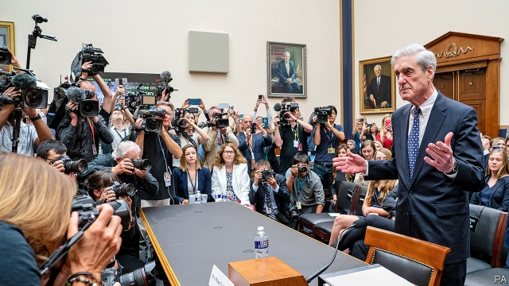

###### Thus spake Robert Mueller

# Impeachment looks even less likely now than before Robert Mueller’s testimony 

 

> print-edition iconPrint edition | United States | Jul 25th 2019 

FOR TWO YEARS, Robert Mueller has loomed over American politics, nearly unseen and largely silent. Mr Mueller, who was appointed to investigate Russian interference in the 2016 presidential election, after President Donald Trump sacked James Comey, the then-FBI director, stayed silent throughout the 22-month inquiry. In March, after indicting 34 people, executing 500 searches and issuing 2,800 subpoenas, his office submitted a 448-page report summarising its findings and then closed. Mr Mueller gave brief public remarks after the report’s release, stating that it would be inappropriate for him to testify before Congress because “the report is my testimony”. Despite that admonishment, on July 24th, Mr Mueller was hauled before two committees of the House of Representatives, which is controlled by the Democrats, and made to testify for six hours. He did not deviate much from his pledge. 

Democrats were hoping Mr Mueller would recount the president’s misdeeds in clear, shareable sound bites that would interest the voting public again after the muted reception of the report. Although close associates of the president were charged with crimes over the course of the investigation, the report did not turn up proof of a conspiracy with Russia. The second half of the report detailed repeated efforts by the president to derail the investigation, including by trying to sack Jeff Sessions, the attorney-general at the time, so that Mr Mueller could be reined in. Because of an existing legal opinion stating that a sitting president cannot be indicted, the report did not reach a judgment on whether Mr Trump should be prosecuted for obstruction of justice. The final sentence of the report notes that “while this report does not conclude that the president committed a crime, it also does not exonerate him.” 

A hefty minority of the party hankering after impeachment, against the wishes of the Democratic leadership, had hoped to bolster their stalled case. They repeated the most damning excerpts of the report—especially one in which the president slumped in chair and said “Oh my God. This is terrible. This is the end of my presidency”—hoping that the former special counsel would chime in and help them along. But Mr Mueller, who stammered, asked for questions to be repeated and answered questions with either clipped one-word replies or legalistic language did not help their case. He refused to read portions of the report aloud, for fear of becoming a political prop in their campaign adverts (some of which were uploaded online before he had left his chair)—leaving the various questioning congressmen to stage their own dramatic readings. Throughout much of the day it appeared that the congressmen were testifying to Mr Mueller, rather than the other way around. 

For House Democrats this was deflating. An impeachment effort last week, called by Representative Al Green over the president’s racist remarks, died after being turned back by a majority of Democrats. It also comes after months of oversight authority—and the subpoena authority that comes with leadership of the House—have failed to turn up as much scandal as was expected at the start of the year. Jerrold Nadler, the chairman of one of the committees, already has a primary challenger who charges that he has been too tame in his oversight of the administration. 

The Republicans were almost uniformly in Trump-defence mode. Though they took nearly every speaking opportunity to assail Mr Mueller’s credibility and impartiality they did gleefully accept the conclusion that “the investigation did not establish that members of the Trump campaign conspired or coordinated with the Russian government in its election interference activities” without question. Several, including Devin Nunes, the senior Republican on the intelligence committee, advanced the conspiracy theory that the entire affair had been a hoax concocted by Democrats and Russia. If an aim of congressional Democrats had been to present the public with a clear and convincing view of presidential misconduct, this seesawing from one sympathetic Democrat to the next Republican inquisitor will not have helped. 

Stuck at the epicentre of a political storm, Mr Mueller sought to extricate himself as painlessly as possible. It was an understandable strategy. Political showmanship reigned in this congressional hearing, as it does in many. His few flashes of emotion came when discussing the prospect of recurring electoral interference. “Over the course of my career, I’ve seen a number of challenges to our democracy. The Russian government’s efforts to interfere in our election is among the most serious,” he said in his opening remarks. Later on, he remarked that “It wasn’t a single attempt. They’re doing it as we sit here. And they expect to do it during the next campaign”. Nor did he sound hopeful that Congress would heed the warning. Asked whether the meddling of foreign governments in elections was a permanent feature of American politics, he answered: “I hope this is not the new normal, but I fear it is.” ■ 

-- 

 单词注释:

1.spake[speik]:vbl.speak的过去式 

2.Robert['rɔbәt]:[法] 警察 

3.Mueller[]:米勒（人名） 

4.impeachment[im'pi:tʃmәnt]:[法] 控告, 检举, 弹劾 

5.les[lei]:abbr. 发射脱离系统（Launch Escape System） 

6.testimony['testimәni]:n. 证言, 证据, 声明 [医] 证据 

7.Jul[]:七月 

8.loom[lu:m]:n. 织布机, 若隐若现的景象 vi. 朦胧地出现, 隐约可见, 可怕地出现 

9.politic['pɒlitik]:a. 精明的, 明智的, 策略的 

10.unseen[.ʌn'si:n]:a. 未被看见的, 看不见的 

11.presidential[.prezi'denʃәl]:a. 总统制的, 总统的, 首长的, 统辖的 [法] 总统的, 议长的, 总经理的 

12.jame[]: 灰岩井 

13.comey[]: [人名] 科米 

14.indict[in'dait]:vt. 起诉, 控告, 指控 [法] 控告, 揭发, 对...起诉 

15.subpoena[sәb'pi:nә]:n. 传票 vt. 传审, 传唤 

16.summarise['sʌmәraiz]:vt. 概括, 总结, 摘要, 概述 

17.inappropriate[.inә'prәupriәt]:a. 不适当的, 不相称的 

18.testify['testifai]:v. 证明, 作证, 声明, 表明 

19.admonishment[әd'mɔniʃmәnt]:n. 训戒；警告（等于admonition） 

20.haul[hɒ:l]:n. 用力拖拉, 拖运, 强拉, 捕获量, 拖运距离 vi. 拖, 拉, 改变方向, 改变主意 vt. 拖拉, 拖运 

21.democrat['demәkræt]:n. 民主人士, 民主主义者, 民主党党员 [经] 民主党 

22.deviate['di:vieit]:vi. 脱离, 偏离 vt. 使偏离 a. 脱离常规的 n. 脱离常规的人 

23.pledge[pledʒ]:n. 诺言, 保证, 誓言, 抵押, 信物, 保人, 祝愿 vt. 许诺, 保证, 使发誓, 抵押, 典当, 举杯祝...健康 

24.recount[ri'kaunt]:vt. 详述, 叙述, 重新计算 n. 重新计算 

25.misdeed['mis'di:d]:n. 罪行, 犯罪 [法] 不端行为, 犯罪, 恶性 

26.shareable['ʃeәrәbl]:[计] 可共享的 

27.conspiracy[kәn'spirәsi]:n. 同谋, 阴谋, 阴谋集团 [法] 阴谋, 通谋, 共谋 

28.derail[di'reil]:vt. 使出轨 n. 脱轨器 [计] 转移指令 

29.jeff[dʒef]:n. 杰夫（男子名, 等于Jeffrey） 

30.cannot['kænɒt]:aux. 无法, 不能 

31.judgment['dʒʌdʒmәnt]:n. 裁判, 宣告, 判决书 [医] 判断 

32.prosecute['prɒsikju:t]:vt. 告发, 起诉, 彻底进行, 执行, 从事 vi. 告发, 起诉, 作检察官 

33.obstruction[әb'strʌʃәn]:n. 障碍, 妨碍, 闭塞物 [医] 梗阻, 不通 

34.exonerate[ig'zɒnәreit]:vt. 免除, 证明无罪 [法] 解放, 开释, 免罪 

35.hefty['hefti]:a. 重的, 肌肉发达的 

36.hanker['hæŋkә]:vi. 渴望, 热切希望 

37.impeachment[im'pi:tʃmәnt]:[法] 控告, 检举, 弹劾 

38.bolster['bәulstә]:n. 支持, 长枕 vt. 支持, 支撑 

39.stall[stɒ:l]:n. 厩, 停车处, 牧师职位, 货摊, 托辞, 拖延 vt. 关入厩, 停顿, 推托, 支吾, 使陷于泥中 vi. 被关在厩内, 陷于泥中, 停止, 支吾 

40.damn[dæm]:n. 一点, 诅咒, 丝毫 interj. 该死, 该死的 vt. 诅咒, 罚...下地狱 vi. 指责, 谴责, 骂...该死, 证明...有罪 

41.excerpt['eksә:pt]:n. 摘录 v. 引用, 摘录 

42.slump[slʌmp]:n. 暴跌, 垂头弯腰的姿态 vi. 猛然掉落, 陷入, 衰落(经济等) 

43.counsel['kaunsәl]:n. 商议, 忠告, 法律顾问 v. 商议, 劝告 

44.chime[tʃaim]:n. 钟声, 钟, 和谐 vi. 鸣, 奏出谐和的乐声, 和谐 vt. 敲出和谐的声音, 打钟报时, 重复说 

45.stammer['stæmә]:v. 口吃, 结结巴巴地说 n. 口吃, 结巴 

46.clip[klip]:n. 修剪, 夹子, 回形针, 剪下来的东西 vt. 修剪, 痛打, 夹牢, 剪报 vi. 剪报 

47.legalistic[.li:gә'listik]:a. 尊重法律的 

48.prop[prɒp]:n. 支柱, 支持者, 倚靠人, 道具, 螺旋桨 vt. 支撑, 维持 

49.advert[әd'vә:t]:vi. 提出看法, 引起注意, 留意 n. 广告 

50.upload['ʌp,lәud]:[计] 上装, 加载, 储入 

51.online[]:[计] 联机 

52.congressman['kɒŋgresmәn]:n. 国会议员, 众议院议员 [法] 国会议会 

53.deflate[di'fleit]:vt. 放气, 抽出空气, 使缩小 vi. 缩小 

54.AL[]:[计] 算法语言, 字母, 汇编语言 [医] 铝(13号元素) 

55.racist['reisist]:n. 种族主义者 [法] 种族主义的, 种族歧视 

56.oversight['әuvәsait]:n. 勘漏, 失察, 失败, 照料 [经] 监督权 

57.jerrold[]: [男子名] [英格兰人姓氏] 杰罗尔德 Garrett的变体 

58.nadler[]: [人名] [英格兰人姓氏] 纳德勒职业名称，制针者，有时也指裁缝，来源于中世纪英语，含义是“针”(needle)+er 

59.challenger['tʃælindʒә]:n. 挑战者 [经] 申请回避的人 

60.uniformly['ju:nifɔ:mli]:adv. 一样, 一致, 相同, 一直不变, 一贯, 始终如一, 均质, 一律, 均匀 [计] 均匀地 

61.assail[ә'seil]:vt. 攻击, 质问 [法] 攻击, 袭击, 著手解决 

62.credibility[.kredi'biliti]:n. 可信用, 确实性, 可靠 [法] 证据能力, 可信程度, 确实性 

63.impartiality['im.pɑ:ʃi'æliti]:n. 公平, 无私, 不偏 [法] 公正无私, 公平, 公正 

64.gleefully['ɡli:fəlɪ]:adv. 高兴地 

65.conspire[kәn'spaiә]:vi. 阴谋, 协力, 共谋 vt. 图谋 

66.devin[]:n. 德温（男子名） 

67.nune[]: [地名] [莫桑比克] 努内 

68.hoax[hәuks]:vt. 欺骗, 哄骗, 愚弄 n. 愚弄人, 恶作剧 

69.concoct[kәn'kɒkt]:vt. 调合, 捏造, 编造 [建] 调制, 混合 

70.congressional[kәn'greʃәnl]:a. 会议的, 议会的, 国会的 [法] 代表大会的, 大会的, 议会的 

71.misconduct[.mis'kɒndʌkt]:vt. 办错, 使行为不端 n. 办错, 渎职, 通奸 

72.seesaw['si:sɒ:]:n. 跷跷板, 跷跷板游戏, 起伏交替的动作 a. 上下或前后摇动的, 交互的 vi. 玩跷跷板, 上下或来回摇动 vt. 使上下或来回摇动 

73.democrat['demәkræt]:n. 民主人士, 民主主义者, 民主党党员 [经] 民主党 

74.inquisitor[in'kwizitә]:n. 询问者, 审问者, 检察官 [法] 审问官, 调查官, 宗教裁判官 

75.epicentre['episentә(r)]:n. 震中, 集中点, 中心 

76.extricate['ekstrikeit]:vt. 使解脱, 救出 

77.painlessly[]:adv. 无痛苦地, 不费力地 

78.understandable[.ʌndә'stændәbl]:a. 可以理解的 

79.showmanship['ʃәjmәnʃip]:n. 安排演出的窍门, 吸引观众的窍门, 经营术, 招徕生意的手腕 

80.recur[ri'kә:]:vi. 复发, 回到, 重现, 再来, 诉诸, 采用, 循环 

81.electoral[i'lektәrәl]:a. 选举人的, 选举的, (有关)选举的 [法] 选举的, 选举人的, 由选举人组成的 

82.heed[hi:d]:n. 注意, 留心 v. 注意, 留心 

83.meddle['medl]:vi. 干涉, 干预, 擅自摸弄 [法] 干预, 插手, 弄乱 

