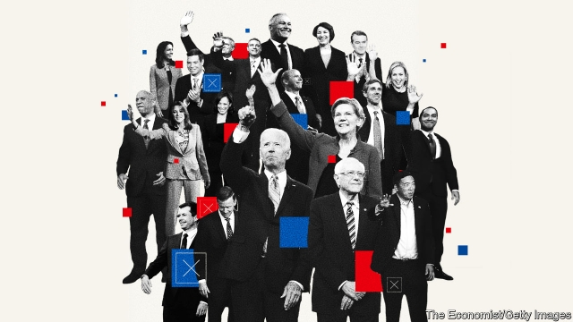
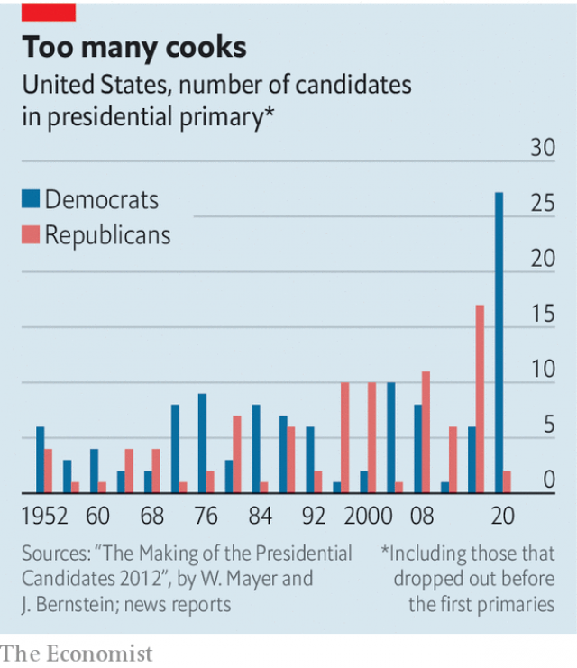

###### Overcrowded primaries

# Should political parties really let anyone run for president? 

 

> print-edition iconPrint edition | United States | Jul 27th 2019 

TWENTY-FIVE candidates are running for the Democratic Party’s nomination. Twenty of them will take the stage in next week’s televised primary debates. So large a slate could fill two football teams, provide five sets of starters in the NBA or be the primary cast for a Broadway musical. Though fields of this size are atypical compared with primaries in the 20th century, they are becoming the new normal (see chart). In 2016 the Republican field that included Donald Trump contained 16 other candidates. Party bosses recognise that having so many choices overwhelms voters and encourages candidates to take extreme positions. But doing something about it will require them to act in a way that to many seems undemocratic. 

The parties’ current nomination rules allow almost anyone who wishes to run for president to do so. To try to minimise the chaos this invites, the Democratic National Committee set minimum thresholds in terms of polling numbers and fundraising that had to be met in order to be included in the televised debates. These are hard to calibrate precisely in advance. In this case the system has thrown up too many candidates for voters to evaluate. It rewards name recognition and social-media prowess, and asks activists to make decisions about people about whom they know little. 

Absent from the 20 candidates who were selected for the Democrats’ first televised debates was Steve Bullock, the governor of Monatana and the only Democratic governor of a state won by Mr Trump in the race, because he was lower in the polls and had fewer individual campaign donors than other candidates. Meanwhile Marianne Williamson, spiritual guru, whose assertion that “there’s no higher art than living a beautiful life” may not be the winning message Democrats are searching for in 2020, was allowed to speak on the party’s platform to millions of Americans. It does not have to be like this. Party leaders used to exercise more sway over primaries. They could do so again. 

Republicans’ and Democrats’ lack of control over their nominating process is a uniquely American phenomenon. Nowhere else in the world do political parties engage in years-long campaign battles between candidates vying for the approval of hyper-engaged partisans. Most other countries allow some combination of legislators, party members and interest groups to select party leaders. This is the case in parliamentary democracies such as Britain (where Conservative MPs chose a slate of two candidates to put to party members), Canada and Australia, as well as in presidential systems like France and Mexico, where most parties choose their leaders from a more restricted list. 

 

The current system can trace its roots back to the 1972 Democratic Convention in Miami Beach. This was the first contest in which the rules of the McGovern-Fraser commission were adopted. That commission was tasked with creating more open rules after Hubert Humphrey was nominated in a contentious convention, despite not competing in any of 13 primary races. (In the five decades since the adoption of more democratic rules, the Democratic Party has won fewer presidential elections than in the five decades before, when candidates were chosen in smoke-filled rooms.) Republicans were persuaded by similar pro-democracy arguments and enacted plebiscitary reforms in the 1970s and 1980s, increasing the number of primaries at the expense of caucuses and binding delegates to the voters’ decisions. 

Fans of the current system consider it a plus that the two parties are open to outsiders like Mr Trump or Bernie Sanders. They also point out that the 25 candidates on the Democratic side will be winnowed down to a more manageable number. Yet although candidates have already started dropping out, their reasons for doing so do not suggest a process that is working well. 

Eric Swalwell, a congressman, suspended his campaign because he was spending so much money on fundraising to pull in enough individual donors to qualify for the debates. In one month, “we spent $110,000-ish to get $100,000. So it’s like you’re like spending money to get less money just to meet a threshold,” Mr Swalwell said after dropping out of the race. He may be no great loss. But if Democrats lose Mr Bullock or Michael Bennet, an impressive centrist senator from Colorado, in the next round of winnowing, they may find they lose candidates with a good chance of beating Mr Trump months before the first actual primary takes place, in February 2020. 

Elaine Kamarck of the Brookings Institution, a think-tank, and author of “Primary Politics: Everything You Need to Know about How America Nominates Its Presidential Candidates”, believes this system makes it far too easy for parties to be hijacked by outsiders. “No other political process in the modern world”, Ms Kamarck writes, “has so abandoned this critical vetting function of the political party in the nominating process.” A system of peer review by elected officeholders before candidates were put before primary voters would, she argues, work better. 

What would this look like in practice? Ms Kamarck presents three possible solutions. First, both parties could increase the role that superdelegates—convention delegates who can vote whichever way they please—play in the process. Currently Republicans do not use superdelegates in their selection process, and Democrats have recently cut their power. Second, parties might consider a national convention to endorse a limited number of candidates before the choice between them is presented to the voters. The third option would be to let a party’s members of Congress present a slate of endorsed candidates to primary voters. Julia Azari, an associate professor of political science at Marquette University, says that the ideal system probably lies somewhere between the brokered conventions of the 1960s and the nearly fully democratised system of today. 

It is too late for reformers to affect the system that will be used in 2020, but it is not unimaginable that they may do so later on. Both parties already enact restrictions on who may run, and even the constitution includes some anti-democratic requirements, such as the need to be 35 years or older to run for president. Nor is it abnormal for the parties to exercise a heavy hand in their nomination processes. In the 2008 primary, for example, the Democratic National Committee voted to strip Michigan and Florida of all their pledged delegates after they scheduled their primary elections earlier in the year than originally agreed. The rules committees of the two parties still have the power and flexibility to reform a system that is failing to work. They should use it.■ 

-- 

 单词注释:

1.overcrowd[.әuvә'kraud]:vt. 容纳过多的人, 使过度拥挤 

2.Jul[]:七月 

3.nomination[.nɒmi'neiʃәn]:n. 提名, 任命, 提名权 

4.televise['telivaiz]:v. 用电视播放, 播映 

5.slate[sleit]:n. 板岩, 页岩, 提名名单, 人选, 记录, 石板 a. 石板色的 vt. 铺石板, 责骂, 痛打 

6.starter['stɑ:tә]:n. 开端者, 在起跑线上的人, 参加赛跑的人, 调度员, 起动机, 酵母 [计] 启动程序, 启动器 

7.nba[]:abbr. 全美篮球协会（National Basketball Association） 

8.broadway['brɒ:dwei]:n. 百老汇大街 

9.atypical[.ei'tipikl]:a. 非典型的 [医] 非典型的, 不标准的 

10.overwhelm[.әuvә'hwelm]:vt. 淹没, 受打击, 制服, 压倒, 使不知所措 [法] 打翻, 倾覆, 覆盖 

11.voter['vәutә]:n. 选民, 投票人 [法] 选民, 选举人, 投票人 

12.undemocratic['ʌndemә'krætik]:a. 非民主的, 不民主的 

13.minimise[]:vt. 使减到最少/最小, 使降到最低限度, 使缩到最小, 极度轻视 

14.chao[]:n. 钞（货币） 

15.threshold['θreʃәuld]:n. 门槛, 入口, 开端, 阈 [计] 阈; 阈值 

16.fundraising['fʌndˌreɪzɪŋ]:n. 筹款, 募款 a. 筹款的 

17.calibrate['kælibreit]:vt. 测定口径, 校准, 使标准化, 调整 [化] 校准 

18.precisely[pri'saisli]:adv. 精确地, 明确地, 刻板地, 拘泥地, 正好, 恰恰, 对, 正是如此, 确实如此, 不错 

19.prowess['prauis]:n. 英勇, 勇敢, 超凡技术 

20.activist['æktivist]:n. 激进主义分子 

21.steve[]:n. 史蒂夫（男子名） 

22.bullock['bulәk]:n. 阉牛 

23.donor['dәunә]:n. 捐赠人 [化] 给体; 供体 

24.marianne[,meәri'æn, mɑ:'rjɑ:n]:n. 玛丽安（法兰西共和国或其政府的绰号, 因以女性为其化身, 故名） 

25.williamson['wiljәmsn]:n. 威廉姆森（姓氏名） 

26.guru['guru:]:n. 古鲁(印度教导师) [医] 柯拉子 

27.assertion[ә'sә:ʃәn]:n. 断言, 主张 [法] 宣称, 断言, 维护 

28.democrat['demәkræt]:n. 民主人士, 民主主义者, 民主党党员 [经] 民主党 

29.nominate['nɒmineit]:vt. 提名, 任命, 命名 [法] 提名...为候选人, 指定, 推荐 

30.uniquely[]:adv. 独特地；珍奇地 

31.vie[vai]:vi. 争, 竞争, 争胜 vt. 提出...来竞争, 以...作较量 

32.partisan['pɑ:tizn]:n. 党羽, 虔诚信徒, 同党, 游击队员 a. 党派的, 偏袒的, 效忠的, 献身的, 盲目推崇的 

33.legislator['ledʒisleitә]:n. 立法者, 立法官, 立法委员 [法] 立法者, 立法机关成员, 立法委员 

34.parliamentary[.pɑ:lә'mentәri]:a. 国会的, 议会的, 议会制度的 

35.MP[]:国会议员, 下院议员 [计] 宏处理程序, 维护程序, 线性规划, 微程序, 多处理器 

36.presidential[.prezi'denʃәl]:a. 总统制的, 总统的, 首长的, 统辖的 [法] 总统的, 议长的, 总经理的 

37.Miami[mai'æmi]:n. 迈阿密 

38.hubert['hju:bә(:)t]:n. 休伯特（男子名） 

39.humphrey['hʌmfri]:n. 汉弗莱（男子名） 

40.contentious[kәn'tenʃәs]:a. 好争吵的, 爱争论的, 有异议的 [法] 诉讼的, 争执的, 引起争论的 

41.adoption[ә'dɒpʃәn]:n. 采用, 采纳, 收养 [法] 收养, 采纳, 采用 

42.enact[i'nækt]:vt. 制定法律, 扮演, 颁布 [法] 法令, 法规, 条例 

43.plebiscitary[pli'bisitәri]:a. 平民表决的, 公民投票的 

44.outsider[' aut'saidә]:n. 外人, 局外人, 非会员, 外行, 门外汉, 比赛中获胜可能性不大的选手 [经] 外船公司 

45.bernie['bә:ni]:n. 伯尼（男子名）；[俚]可卡因（等于cocaine） 

46.sander['sændә]:[电] 散沙 

47.winnow['winәu]:vt. 簸, 扬(谷), 吹掉, 把挑出来, 精选 vi. 扬谷, 分出好坏, 飞翔 n. 扬谷, 扬谷器 

48.manageable['mænidʒәbl]:a. 易办的, 易管理的, 易控制的 

49.eric['erik]:abbr. 科教资源信息中心（Educational Resources Information Center）；电子遥控与独立控制（Electronic Remote and Independent Control） 

50.Swalwell[]:[地名] 斯沃尔韦尔 ( 加、英 ) 

51.congressman['kɒŋgresmәn]:n. 国会议员, 众议院议员 [法] 国会议会 

52.les[lei]:abbr. 发射脱离系统（Launch Escape System） 

53.michael['maikl]:n. 迈克尔（男子名） 

54.bennet['benit]:n. 水杨梅, 花梗 

55.centrist['sentrist]:n. 中间党派的成员, 温和主义者 [法] 中间派议员, 中立派议员 

56.senator['senәtә]:n. 参议员, (某些大学的)理事 [法] 参议员, 上议员 

57.Colorado[,kɔlә'rɑ:dәu]:n. 科罗拉多, 科罗拉多河 

58.elaine[]:n. 伊莱恩（女子名） 

59.kamarck[]: [人名] 卡马克 

60.Brooking[]:n. (Brooking)人名；(英、西)布鲁金 忍受（brook的现在分词形式） 容忍 

61.presidential[.prezi'denʃәl]:a. 总统制的, 总统的, 首长的, 统辖的 [法] 总统的, 议长的, 总经理的 

62.hijack['haidʒæk]:vt. 抢劫, 劫持, 敲诈 [法] 挡路抢劫, 抢劫, 绑架 

63.vet[vet]:n. 兽医 vi. 当兽医 vt. 诊断, 检审 

64.peer[piә]:n. 同等的人, 匹敌, 贵族 vi. 凝视, 窥视, 费力地看, 隐现 vt. 与...同等, 封为贵族 

65.officeholder['ɔfis,hәjldә(r),'ɔ:-]:n. 官员 

66.currently['kʌrәntli]:adv. 现在, 当前, 一般, 普通 [计] 当前 

67.superdelegates[]:[网络] 超级代表 

68.endorse[in'dɒ:s]:vt. 支持, 赞同, 背书于, 签署 [经] 赞成, 背书 

69.julia['dʒu:ljә]:n. 朱莉娅（女子名） 

70.azari[]:n. (Azari)人名；(法、意、伊朗、俄)阿扎里 

71.marquette[]:n. (Marquette)人名；(英、法)马凯特 马凯特 

72.broker['brәukә]:n. 掮客, 经纪人 [经] 经纪人, 掮客 

73.fully['fuli]:adv. 十分地, 完全地, 充分地 

74.democratise[di'mɔkrәtaiz]:v. <主英> = democratize 

75.reformer[ri'fɒ:mә]:n. 改革家, 改革运动者 [化] 转化炉; 转化器; 重整器; 重整炉 

76.unimaginable[.ʌni'mædʒinәbl]:a. 不能想象的, 不可思议的 

77.Michigan['miʃigәn]:n. 密歇根州 

78.Florida['flɒridә]:n. 佛罗里达州 

79.pledge[pledʒ]:n. 诺言, 保证, 誓言, 抵押, 信物, 保人, 祝愿 vt. 许诺, 保证, 使发誓, 抵押, 典当, 举杯祝...健康 

80.originally[ә'ridʒәnli]:adv. 本来, 原来, 最初, 就起源而论, 独创地 

81.flexibility[.fleksi'biliti]:n. 弹性, 适应性 [计] 灵活性; 适应性 

