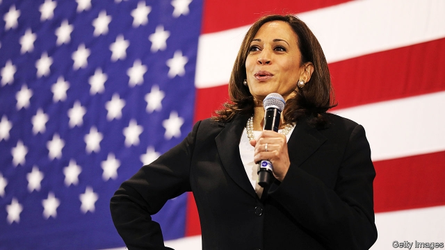

###### To Washington, via Chennai

# The rising clout of Indian-Americans 

 

> print-edition iconPrint edition | United States | Jul 25th 2019 

PRAMILA JAYAPAL, a congresswoman from Washington state, sees rapid change in American politics. Five years ago she was the first South Asian elected to her state legislature. In 2016 she made it to Congress, where she is now one of four Indian-Americans, known collectively as the Samosa Caucus, in the House. Last month she became the first woman of South-Asian descent to preside over the chamber. Across America, she says, “more and more South-Asian faces are running and winning.” 

Her successes cheered her great-aunt in Chennai, in southern India, who had much to gossip about over tea with a close friend in the city, the aunt of another American politician, Kamala Harris. The senator, whose mother migrated to California from Chennai, rarely mentions the Indian side of her family while campaigning. But as a front-runner in the race for the Democratic nomination, she is undoubtedly spurring others of Indian descent to turn to politics. (The prominence of Nikki Haley—a Republican former governor of Punjabi descent, who served until last year as America’s ambassador to the UN—also fuels interest.) 

Ram Villivalam, a state senator in Illinois, says having a half-Indian senator running to be president gives a jolt of confidence to Indian-Americans. Ms Jayapal concurs. Indian-Americans number 4m, about 1% of the total population, counting both migrants and their children. Most have arrived in America over the past two decades. Many are highly educated, wealthy and in professions such as engineering or medicine. But whereas older Indian-Americans focused on becoming model citizens and making money, Ms Jayapal says that those below 40 are “much more engaged” and “take democracy and voting to be critical”. 

Raja Krishnamoorthi, an Illinois congressman of Tamil descent, says older migrants shunned politics, worried that names crammed with many letters would seem too strange to voters. The young are more assured and politically sophisticated. He, too, is thrilled by Ms Harris’s campaign, saying “she puts a little curry into the narrative” of the presidential race. A decade ago few South Asians ran for office of any sort in immigrant-heavy suburbs around Chicago, he says. But since his election to Congress in 2016 he estimates that 40 or so candidates have sought elected office of some sort in the area. 

Could Indian-Americans really grow into a significant political force? Their numbers look too puny to matter as a national voting bloc. Devesh Kapur, at Johns Hopkins University, estimates that only 1m voters of Indian descent are politically active. That number could double within two decades through immigration, more naturalisations and as children age. But even then few will be swing-voters in close-fought states, unlike, say, Cuban-Americans in Florida. Most are reliably Democrats—77% of Indian-Americans backed Hillary Clinton in 2016, for example—who cluster in partisan strongholds such as California, New York and Illinois. 

Yet there are other ways to amass political clout. Mr Krishnamoorthi and Mr Villivalam both suggest “Indian-Americans look to Jewish Americans” as a model, since they are seen as active in charitable and civic life, and as educated, organised and influential in politics. Mr Kapur, who wrote a book about the Indian diaspora in America, also calls them “a weak equivalent of the Jewish-American community.” 

He notes that Capitol Hill, for example, is crammed with staff and interns of Indian-American heritage. They also appear to be “over-represented” in academia, the media and other influential posts. He talks of the growing significance of informal networks, as well-connected Indian-Americans find jobs for each other’s offspring. Ms Jayapal also points to the prevalence of skilled Indian-Americans (perhaps subsidised in their first jobs by well-off parents) who work as assistants to senators and representatives in Washington. 

Karthick Ramakrishnan, who runs a survey of Asian-American attitudes from the University of California, argues that Indian-Americans are exceptional when compared with other Asian groups. They are far likelier to get involved in politics as donors, voters or candidates. High levels of education, English-language proficiency and roots in a country with its own long democratic tradition all help them to take part in America’s political culture. 

Money is also a factor. Average incomes are among the highest of any minority group. Although Ms Jayapal gently grumbles that older Indian-Americans—the wealthiest of all—want a photo with a politician but find “parting with cash difficult”, younger ones grasp that they can be influential as donors. Niraj Antani, a young (Republican) member of Ohio’s state legislature, who is of Gujarati descent, says Indian-Americans are responsible for a portion of his fundraising, and sees them as increasingly skilled in bundling donations. “They are now hosting [fundraising] events, not just attending them”, he says. 

They are also getting better organised. Mr Antani points to lobbies such as AAHOA, a hotel association, and a political action committee (PAC) belonging to the Hindu-American Foundation, as being influential among Indian-Americans. More significant still is the Indian American Impact Fund, a Democratic-leaning PAC, which describes its mission as, to “wield political power to fight back” against xenophobia and anti-immigrant policies under President Donald Trump. 

“Indian-Americans have a drive for success,” says Mr Antani, “and political success is very measurable: how many cabinet secretaries, congressmen, school-board members and state legislators do we have?” He, and his colleagues, are gung-ho about their prospects. America will see an Indian-American president before too long, he predicts. It might even be the next one. ■ 

