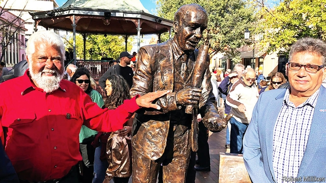

###### Waiting to be heard

# Australia’s government wants to amend the constitution. But how? 

 

> print-edition iconPrint edition | Asia | Aug 3rd 2019 

THE OUTBACK town of Dubbo in May unveiled one of Australia’s few public statues of an Aboriginal (pictured). William Ferguson, a pioneering campaigner for Aboriginal rights, founded an organisation in the town in 1937 to fight government interference in Aboriginals’ lives. The following year, as Australia marked the 150th anniversary of British settlement, Mr Ferguson and other Aboriginals held a “Day of Mourning” in Sydney. “Surely the time has come at last for us to do something for ourselves,” he told that gathering, “and make ourselves heard.” Aboriginal activists are still campaigning, this time for a “voice to parliament”, a body to advise governments on policies that affect indigenous people. However the government, a coalition of two right-wing parties, won’t hear of it. 

More than 3% of Australia’s 25m people are Aboriginals. Their forebears lived in Australia for perhaps 60,000 years before the British arrived in 1788. Unlike New Zealand’s, Australia’s colonisers never signed any treaties with the original inhabitants. Instead, they first openly persecuted them and then abused them in the name of civilising them. Today, Aboriginals tend to die younger than other Australians and spend more time in prison before they do, among other blights. Successive governments’ efforts to improve their circumstances have disappointed, in part, Aboriginal leaders contend, because Aboriginals do not have enough say in the design of such policies. 

In July Ken Wyatt, the minister for indigenous Australians, announced that the government would, by the end of its three-year term in 2022, hold a referendum on giving “constitutional recognition” to Aboriginals. (The constitution used to mention Aboriginals as being under the jurisdiction of state governments and not to be counted in the census, but since a revision in 1967 does not mention them at all.) Aboriginal leaders want the new amendment to be more than symbolic. Two years ago activists held a “National Constitutional Convention” at Uluru (Ayers Rock) in central Australia to discuss what it should entail. They called for “power over our destiny” and for a “First Nations Voice enshrined in the constitution”. 

Labor, the main opposition party, supports the idea of an advisory body with a constitutional underpinning, to protect it from what Linda Burney, its shadow minister for indigenous affairs, calls the “whim of any government”. She recalls how a previous right-wing government simply abolished a commission charged with protecting Aboriginal interests 14 years ago. The government, however, has dismissed the “voice”, as a third chamber of parliament. Conservative commentators say creating such a body would flout racial equality by giving special rights to Aboriginals. 

Murray Gleeson, a former chief justice, has assailed such arguments. “What is proposed is a voice to parliament, not a voice in parliament.” To him, such an idea “hardly seems revolutionary”. On the contrary, he says, it would be an “appropriate form of recognition”. What the government considers appropriate is less clear. Mr Wyatt has promised to work with Ms Burney to craft a proposal. Both are Aboriginals—a breakthrough in itself. The debate about the voice, Ms Burney says, will be “the story of this term of government”. ■ 

-- 

 单词注释:

1.amend[ә'mend]:vt. 修改, 改善, 改良 vi. 改过自新 

2.Aug[]:abbr. 八月（August） 

3.outback['aut'bæk]:n. 内地 a. 内地的 adv. 在内地 

4.Dubbo[]:[地名] 达博 ( 澳 ) 

5.unveil[.ʌn'veil]:vt. 揭开, 揭幕, 除去...的面纱 vi. 显露, 除去面纱 

6.aboriginal[.æbә'ridʒәnәl]:a. 原始的, 土著的 n. 土著居民, 土生生物 

7.william['wiljәm]:n. 威廉（男子名）；[常作W-][美俚]钞票, 纸币 

8.Ferguson['fə:ɡəsən]:n. 弗格森（美国密苏里州的一个城市名）；弗格森（姓氏） 

9.campaigner[kæm'peinә]:n. 从军者, 老兵, 竞选者 

10.organisation[,ɔ: ^әnaizeiʃən; - ni'z-]:n. 组织, 团体, 体制, 编制 

11.aboriginal[.æbә'ridʒәnәl]:a. 原始的, 土著的 n. 土著居民, 土生生物 

12.sydney['sidni]:n. 悉尼（澳大利亚港市） 

13.activist['æktivist]:n. 激进主义分子 

14.indigenous[in'didʒinәs]:a. 本土的, 国产的, 固有的 [医] 原产的, 本土的 

15.coalition[.kәuә'liʃәn]:n. 结合体, 结合, 联合 [经] 联合, 联盟 

16.forebear['fɒ:bєә]:n. 祖先, 祖宗 

17.coloniser[]:[网络] 殖民者；开拓者；定居者 

18.openly['әjpәnli]:adv. 公开地, 坦率地, 直率地, 公然地 

19.persecute['pә:sikju:t]:vt. 迫害, 虐待, 困扰, 同...捣乱 [法] 迫害, 虐待, 烦扰 

20.civilise['sivilaiz]:vt. 开化, 使文明, (非正式)教化, 使文雅, 教育, 教导 vi. 变成文明社会 

21.blight[blait]:n. 枯萎病 vt. 使染上枯萎病, 破坏 vi. 枯萎 

22.contend[kәn'tend]:vi. 奋斗, 斗争, 竞争 vt. 为...斗争 

23.ken[ken]:n. 视野范围, 知识范围, 见地 

24.wyatt['waiәt]:n. 怀亚特（男子名, 等于Wyat） 

25.referendum[.refә'rendәm]:n. （就重大政治或社会问题进行的）全民公决，全民投票 

26.constitutional[.kɒnsti'tju:ʃәnl]:a. 宪法的, 立宪的, 体质的 [医] 全身的; 体质的 

27.jurisdiction[.dʒuәris'dikʃәn]:n. 司法权, 审判权, 管辖权 [经] 法律管辖权, 审判权 

28.census['sensәs]:n. 户口普查 vt. 实施统计调查 

29.amendment[ә'mendmәnt]:n. 修订, 改善, 改良, 改正 [化] 调理剂; 修正 

30.symbolic[sim'bɒlik]:a. 象征的, 符号的 [电] 符号化 

31.constitutional[.kɒnsti'tju:ʃәnl]:a. 宪法的, 立宪的, 体质的 [医] 全身的; 体质的 

32.uluru['u:ləru:]:n. 澳州艾尔斯岩; [地名] [澳大利亚] 乌卢鲁巨石 

33.ayer[]:n. （西）昨天 

34.entail[in'teil]:vt. 使成为必需, 需要, 使承担, 遗传给 n. 限定继承 

35.destiny['destini]:n. 命运, 定数 

36.enshrine[in'ʃrain]:vt. 入庙祀奉, 铭记 

37.labor['leibә]:n. 劳动, 努力, 工作, 劳工, 分娩 vi. 劳动, 努力, 苦干 vt. 详细分析, 使厌烦 

38.opposition[.ɒpә'ziʃәn]:n. 反对, 敌对, 相反, 在野党 [医] 对生, 对向, 反抗, 反对症 

39.advisory[әd'vaizәri]:a. 顾问的, 咨询的, 劝告的 [法] 劝告的, 忠告的, 咨询的 

40.underpin[.ʌndә'pin]:vt. 从下面支承, 支撑, 支持 [经] 支撑 

41.linda[]:n. 琳达（女子名） 

42.Burney['bә:ni]:伯尼(姓氏) 

43.whim[hwim]:n. 一时的兴致, 冲动, 怪念头, 绞盘 

44.commentator['kɔmenteitә]:n. 评论员, 实况广播员, 注释者, 时事评论员 

45.flout[flaut]:vt. 嘲笑, 愚弄 vi. 表示轻蔑 n. 嘲笑, 愚弄, 轻视 

46.murray['mʌri, 'm\\:-]:n. 默里（男子名）；墨累河（澳大利亚东南部一条河流） 

47.gleeson[]: [人名] [爱尔兰姓氏] 格利森 Gleesan的变体; [地名] [美国] 格利森 

48.assail[ә'seil]:vt. 攻击, 质问 [法] 攻击, 袭击, 著手解决 

49.les[lei]:abbr. 发射脱离系统（Launch Escape System） 

