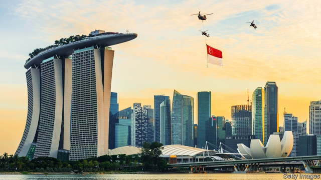
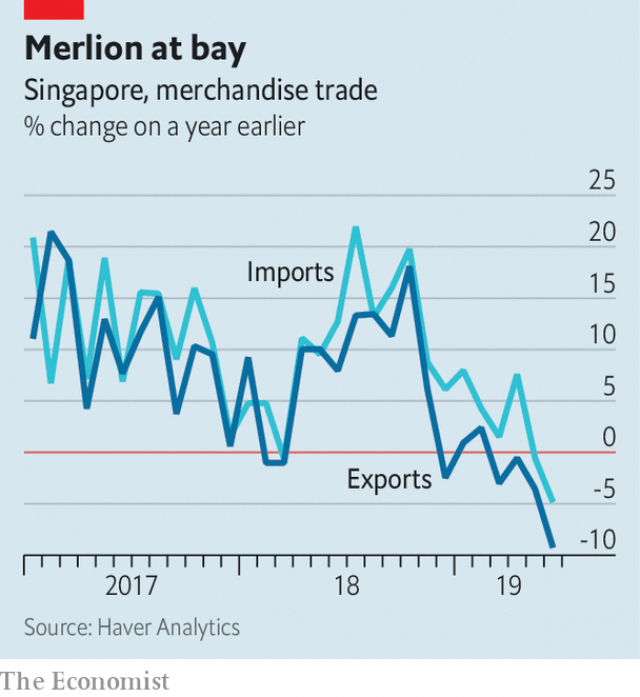

###### Hazy

# Even Singapore’s ruling party struggles to plan for everything 

 

> print-edition iconPrint edition | Asia | Aug 3rd 2019 

THE ROAR of a fighter jet cuts through the gentle hubbub of a business lunch. Intrigued diners turn to the window, trying to spot it beyond Singapore’s gleaming skyscrapers. Fly-bys are part of rigorous preparations for the 54th anniversary of Singapore’s independence on August 9th. Nothing is left to chance. The forethought reflects the Singaporean government’s broader approach. 

Elections, for example, also run seamlessly. Singapore’s next one need not be held until early 2021, but it is likely to take place sooner. It is also probable that the People’s Action Party (PAP), in power since 1959 (when Singapore was still a British colony), will triumph once again. But thereafter confident predictions diminish. Knowing the true state of the government’s popularity is difficult, since the local press is largely state-owned and timid. 

Recent elections offer a mixed view. In 2011 the PAP achieved its worst result since 1965, winning 60% of the popular vote but still retaining 93% of seats in parliament. Four years later it did far better, winning almost 70% of the vote. But 2015 was also the 50th anniversary of Singaporean independence and the year in which its chief architect, Lee Kuan Yew, died. The next election will show whether the surge in the PAP’s support was a patriotic anomaly. 

Two sets of challenges could undermine the PAP’s careful planning for polling day. The first touches on the longevity of the party itself. Last year in neighbouring Malaysia (of which Singapore was briefly a part), the ruling United Malays National Organisation was unexpectedly defeated in an election, putting an end to its six decades of uninterrupted sway. Malaysians summoned up the courage to rock the boat—something Singaporeans are frequently advised against by their government—without causing it to capsize. That leaves the PAP vying with the Communist Party of Vietnam for the title of South-East Asia’s ruling party of longest standing. It is an awkward juxtaposition. 

The prime minister, Lee Hsien Loong, who is the son of Lee Kuan Yew, has been in his post for almost 15 years. (That is less than half the time that his father held the job.) He is expected to lead the party through the next election and then step down before his 70th birthday in 2022. His anointed successor, Heng Swee Keat, a competent if uninspiring technocrat, was promoted to the position of deputy prime minister in May. 

The succession has been less smooth than usual. The prime minister’s own brother became a loud critic of the government after a very public family spat over Lee Kuan Yew’s house two years ago. “Today’s PAP is no longer the PAP of my father,” he declared in recent days. “It has lost its way.” A new political party—the Progress Singapore Party—is led by another former insider unhappy with the way the country is being run. Tan Cheng Bock was a member of parliament for the PAP for 26 years. “I worry because I see the foundations of good governance eroding,” Dr Tan declared on July 26th. 

The second potential impediment to another easy electoral triumph for the PAP is the economy. According to official estimates, Singapore managed year-on-year growth of just 0.1% in the second quarter. It is the most meagre expansion for a decade and follows a disappointing first quarter, too. (Last year the economy grew by about 3%.) The country’s electronics industry has been hit badly by the global downturn in demand for gadgets. As of June, the value of electronics exports had fallen by more than 30% compared with a year earlier. 

 

The trade war between America and China is making matters worse. Singapore is a trading entrepot, with a big and busy port. But China, Singapore’s biggest trading partner, is also suffering from a slowdown, with growth at its lowest level in decades. No wonder Singapore’s imports and exports are contracting (see chart). 

The timing of the election may turn on when (or whether) the economy picks up. The government has plenty of scope to stimulate it, by spending more on infrastructure and its ageing population. The budget is in surplus, albeit only narrowly. Moreover, the government remains a big shareholder in many of Singapore’s largest firms, which gives it a say in their investments and hiring. The PAP has a record of excellent economic management. Mr Heng, for example, burnished his reputation by running the Monetary Authority of Singapore, the central bank, during the financial crisis of 2007-08. 

Singapore’s transformation from a resource-poor island into a wealthy city-state is proof of the strength of the PAP’s planning. But the wealthier countries become, the slower they tend to grow. The big question is whether Singaporeans accept that the PAP cannot preside over breakneck growth forever. Government handouts may soften the blow. If Mr Lee announces generous ones at the National Day Rally later this month, consider it the start of another meticulous election campaign. ■ 

-- 

 单词注释:

1.hazy['heizi]:a. 朦胧的, 模糊的, 烟雾弥漫的 

2.Aug[]:abbr. 八月（August） 

3.hubbub['hʌbʌb]:n. 吵闹声, 叫嚷声, 混乱 

4.intrigue[in'tri:g]:n. 阴谋, 复杂的事 vi. 密谋, 私通 vt. 激起...的兴趣, 用诡计取得 

5.diner['dainә]:n. 用餐者 

6.gleam[gli:m]:n. 光束, 微光, 反光 vi. 闪烁, 隐约地闪现 vt. 使发微光, 使闪烁 

7.rigorous['rigәrәs]:a. 严厉的, 严酷的, 严格的, 苛刻的, 严密的, 精确的 

8.forethought['fɒ:θɒ:t]:n. 事先的考虑, 事先的筹划, 深虑, 先见 [法] 预谋 

9.singaporean[,siŋ^ә'pɔ:riәn]:n. 新加坡人 

10.seamlessly['si:mlisli]:adv. 无空隙地; 无停顿地 

11.pap[pæp]:n. 奶头, 乳头状物, 软食, 半流质食物 [计] 分组交换过程协议, 打印机访问协议 

12.Singapore[.siŋgә'pɒ:]:n. 新加坡 

13.thereafter[.ðєәr'æftә]:adv. 其后, 从那时以后 

14.prediction[pri'dikʃәn]:n. 预言, 预报 [化] 预测 

15.diminish[di'miniʃ]:v. (使)减少, (使)变小 

16.popularity[.pɒpju'læriti]:n. 名声, 受大众欢迎, 流行 

17.lee[li:]:n. 背风处, 避风处, 下风处, 保护, 庇护 a. 避风的, 背风的, 下风的, 保护的 

18.kuan[^wɑ:n]:n. 官窑瓷器 

19.yew[ju:]:n. 紫杉 

20.surge[sә:dʒ]:n. 巨涌, 汹涌, 澎湃 vi. 汹涌, 澎湃, 颠簸, 猛冲, 突然放松 vt. 使汹涌奔腾, 急放 [计] 电压尖峰 

21.patriotic[.peitri'ɒtik]:a. 爱国的, 有爱国心的 [法] 爱国的, 有爱国心的 

22.anomaly[ә'nɒmәli]:n. 不规则, 反常事物, 畸形 [医] 异常, 反常 

23.undermine[.ʌndә'main]:vt. 在...下面挖, 渐渐破坏, 暗地里破坏 [法] 暗中破坏, 以阴谋中伤伤害 

24.longevity[lɒn'dʒeviti]:n. 长命, 长寿, 寿命 [医] 长寿 

25.Malaysia[mә'leiziә]:n. 马来西亚 [经] 马来西亚 

26.briefly['brifli]:adv. 简短地, 扼要地, 简明地, 简单地 

27.Malay[mә'lei]:n. 马来 a. 马来人的, 马来语的 

28.organisation[,ɔ: ^әnaizeiʃən; - ni'z-]:n. 组织, 团体, 体制, 编制 

29.unexpectedly[]:adv. 想不到的, 突然的, 意外的, 出乎意料的 

30.uninterrupted['ʌn.intә'rʌptid]:a. 不间断的, 连续的, 不断的 

31.Malaysian[mә'leiziәn]:a. 马来西亚的 n. 马来西亚人 

32.summon['sʌmәn]:vt. 召唤, 召集, 号召, 振奋, 唤起, 鼓起 [经] 传唤, 传讯 

33.singaporean[,siŋ^ә'pɔ:riәn]:n. 新加坡人 

34.capsize[kæp'saiz]:v. 翻覆, 倾覆 

35.vie[vai]:vi. 争, 竞争, 争胜 vt. 提出...来竞争, 以...作较量 

36.Vietnam[.vjet'næm]:n. 越南 

37.juxtaposition[.dʒʌkstәpә'ziʃәn]:n. 并排, 并置, 并列 [医] 并列, 并置, 对合 

38.hsien[ʃjen]:n. <汉>县 

39.loong[lu:ŋ]:n. 龙; 中国龙; 吉祥物; 中华民族的图腾和象征 

40.les[lei]:abbr. 发射脱离系统（Launch Escape System） 

41.anoint[ә'nɒint]:vt. 涂油, 施以涂油礼 [医] 涂油膏 

42.successor[sәk'sesә]:n. 继承者, 接任者 [计] 后继 

43.heng[]:n. 恒; 珩 

44.swee[]:n. 瑞（粤语男子名） 

45.keat[]:[网络] 露齿微笑的钥匙盒；知识经济协会 

46.uninspiring[ˌʌnɪnˈspaɪərɪŋ]:a. 引不起兴趣的, 无鼓舞作用的, 无指望的 

47.technocrat['teknәukræt]:n. 技术专家治国论者, 技术专家统治论者 

48.insider['in'saidә]:n. 内部的人, 权威人士, 知道内情的人 [经] 熟悉内情者 

49.cheng[]:成（汉语拼音） 

50.bock[bɒk]:n. 德国黑啤酒, 一杯啤酒 

51.governance['gʌvәnәns]:n. 统治, 统辖, 管理 [法] 统治, 管理, 支配 

52.erode[i'rәud]:vt. 腐蚀, 侵蚀 vi. 受腐蚀 

53.impediment[im'pedimәnt]:n. 妨碍, 障碍, 阻止, 口吃 [经] 对履行义务的阻碍 

54.electoral[i'lektәrәl]:a. 选举人的, 选举的, (有关)选举的 [法] 选举的, 选举人的, 由选举人组成的 

55.meagre['mi:^ә(r)]:a. 瘦的, 不毛的, 贫乏的, 贫弱的, 少量的, 力量不够的, 质不高的, 量不足的 

56.downturn['dauntә:n]:n. (尤指经济方面的)衰退, 下降趋势 [电] 低迷时期 

57.gadget['gædʒit]:n. 小配件, 小玩意, 诡计 

58.entrepot['ɒntrәpәu]:n. 仓库, 贸易中心 [经] 仓库, 保税仓库, 转运口岸 

59.slowdown['slәudaun]:n. 降低速度, 减速 

60.timing['taimiŋ]:n. 时间选择, 时间测定, 定时, 调速 [计] 定时器时钟 

61.infrastructure['infrәstrʌktʃә]:n. 基础结构, 基础设施 [经] 基础设施 

62.albeit[ɔ:l'bi:it]:conj. 尽管, 虽然 

63.narrowly['nærәuli]:adv. 狭窄地, 严密地, 仔细地, 几乎不, 勉强地, 仅仅 

64.shareholder['ʃєә.hәuldә]:n. 股东 [法] 股东, 股票持有人 

65.burnish['bә:niʃ]:vt. 擦亮, 打磨, 磨光 vi. 磨光发亮 n. 光辉, 光泽 

66.monetary['mʌnitәri]:a. 货币的, 金钱的 [经] 货币的, 金融的 

67.cannot['kænɒt]:aux. 无法, 不能 

68.preside[pri'zaid]:vi. 统辖, 当主人, 主持 [法] 主持, 负责, 指挥 

69.breakneck['breiknek]:a. 要使颈骨折断似的, 非常危险的 

70.handout['hændaut]:n. 施舍物, 救济品, 分发的印刷品资料, 广告物品 

71.soften['sɒftn]:v. (使)变柔软, (使)变柔和 

72.rally['ræli]:n. 重振旗鼓, 集合, 群众集会, 跌停回升 v. 重整旗鼓, 集合, 恢复精神, 团结, 挖苦, 嘲笑 

73.meticulous[mә'tikjulәs]:a. 一丝不苟的, 精确的, 过细的 

