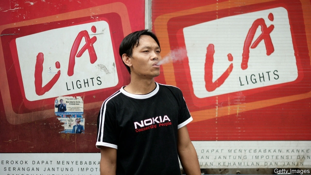
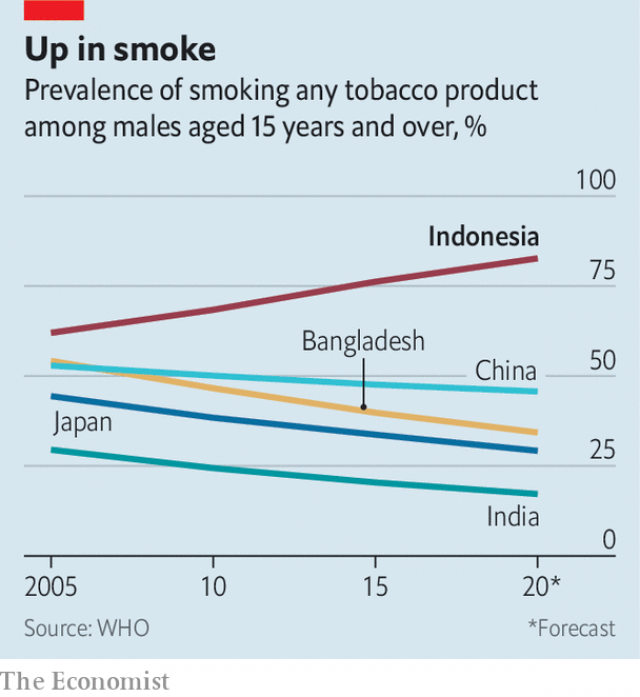

###### No smoking without a fire

# Indonesia seeks to curb e-cigarettes, but not the normal sort 

 

> print-edition iconPrint edition | Asia | Aug 3rd 2019 

SOUNDING MORE like an anguished health worker than a profit-seeking businessman, James Monsees delivers his pitch to a crowded ballroom in Jakarta. The e-cigarettes made by his company, Juul Labs, can save smokers from an early death, he insists. Pointing to government-backed studies from Britain and elsewhere, Mr Monsees argues that e-cigarettes, which heat a liquid laced with nicotine into a vapour that can be inhaled without actually burning anything, are far less harmful than normal cigarettes. “We can have one of the largest positive public-health impacts in history,” he enthuses. 

Indonesia could certainly do with a boost to public health. Around 75m of its 189m adults smoke, according to the World Bank, a higher number than in any other country bar China and India. Smoking rates among men (76%) are the second-highest in the world after Timor-Leste, which itself used to be part of Indonesia. What is more, they are rising, unlike in most Asian countries (see chart). Euromonitor, a research firm, reckons Indonesians spend a hefty $25bn or so a year on cigarettes, including kretek, local favourites which contain cloves as well as tobacco and are especially unhealthy. 

Needless to say, Indonesia’s tobacco companies do not share Mr Monsees’s dream of a smoke-free Indonesia. The big ones—Sampoerna (owned by Philip Morris), Gudang Garam, Djarum and Bentoel (owned by British American Tobacco)—form a weighty lobby. The industry pays a big chunk of the country’s taxes and employs around 6m people. 

 

That may help explain the authorities’ apparent reluctance to stub out smoking, even though the World Health Organisation says smoking-related diseases claim around 225,000 lives across the archipelago each year. Indonesia is one of fewer than ten countries to refuse to sign the WHO’s convention on regulating tobacco. Around 21% of 13-15-year-old boys smoke and there are no penalties for selling tobacco to minors. Cigarettes are cheap (a pack of 20 costs around $2). Tobacco firms promote their wares in slick television advertisements showing manly pursuits. They sponsor sports tournaments and other events where scantily clad marketing girls hand out free samples. Smokers are allowed to light up in many public spaces. 

Despite the widely accepted benefits of switching to e-cigarettes, the government sought to ban the first ones to arrive in the country on health grounds. The trade minister, Enggartiasto Lukita, memorably told people using e-cigarettes to smoke conventional cigarettes instead to preserve jobs for tobacco-growers. In the end the government backed away from a complete ban, but it has imposed onerous restrictions. Distributors have to secure lots of government approvals, a big hurdle for the small firms that dominate the market. Worse, last year the government slapped a 57% excise tax on e-cigarettes and liquids. That leaves Juul and other e-cigarette-makers chasing a relatively small number of rich smokers. The total market for e-cigarettes remains trifling in comparison with sales of the normal sort, at about $200m a year, according to Euromonitor. In fact, none of the big tobacco firms bothers to sell e-cigarettes in Indonesia, even though Sampoerna’s American parent offers “heated tobacco” products in other markets. ■ 

