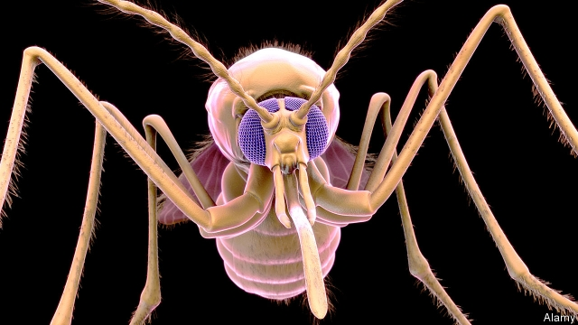

###### The itch of fate

# A history of humankind’s enemy number one 

 

> print-edition iconPrint edition | Books and arts | Aug 3rd 2019 

The Mosquito. By Timothy Winegard. Dutton Books; 496 pages; $28. Text Publishing; £12.99. 

DURING THE second world war, American troops in the Far East were said to have two foes. The first was Japanese. One propaganda poster depicted an enemy’s sabre, slick with blood. The second adversary had no sword but was terrifying all the same. Malaria-carrying mosquitoes infected around 60% of Americans stationed in the Pacific at least once. Drugs such as Atabrine could help, but nasty side-effects meant that some GIs shunned their daily dose—with predictable consequences. “These Men Didn’t Take Their Atabrine” warned a sign propped below a pair of human skulls in Papua New Guinea. 

At least decent treatment was available. For most of human existence, says Timothy Winegard in his lively history of mosquitoes, “we did not stand a chance” against the insect and its diseases. That was partly because of ignorance. Earlier humans blamed malaria and its mosquito-borne cousins on “bad air” from swamps, even as the years passed and death kept whining at their ears. Malaria once killed over 20% of people in the Fens of eastern England. Yellow fever ravaged Memphis, Tennessee, deep into the 1800s. No wonder Mr Winegard calls the mosquito a “destroyer of worlds”, which may have dispatched around half of all humans ever born. 

But his book is more than a litany of victims. Mr Winegard convincingly argues that the insect has shaped human life as well as delivering death. Mosquitoes helped save the Romans from Hannibal and Europe from the Mongols. And if malaria has changed history, so has resistance to it. Europeans believed that the relative immunity enjoyed by some Africans made them ideal slaves in the New World. Later, the tables were turned. “They will fight well at first, but soon they will fall sick and die like flies,” predicted Toussaint Louverture of the Frenchmen sent to end his slave revolution in Haiti. He was right. About 85% of the 65,000 soldiers deployed to the colony died of mosquito-borne illnesses, and Haiti won its independence. 

These dashes across time and distance could become exhausting, but Mr Winegard is an engaging guide, especially when he combines analysis with anecdote. One highlight relays a bizarre plot by a Confederate zealot to infect Abraham Lincoln with yellow fever; another passage explains the ancient Egyptian habit of fighting malarial fevers by bathing in urine. (A few of the witticisms fall flat. Calling the 18th-century Caribbean a “dinner-party buffet” for mosquitoes seems glib, for example; anthropomorphising the pests as a “guerrilla force” is a metaphor too far.) 

But much of Mr Winegard’s narrative is thrilling—above all the concluding chapters in which he tackles the modern mosquito. Drugs and insecticides have helped slash malaria rates, but mosquitoes can quickly develop immunity themselves. In total, the insects still kill over 800,000 people every year. And though gene-editing might one day render them harmless, or even obliterate them altogether, mosquito-borne illnesses such as Zika have recently been spreading to new regions. The destroyer of worlds has not finished yet. ■ 

