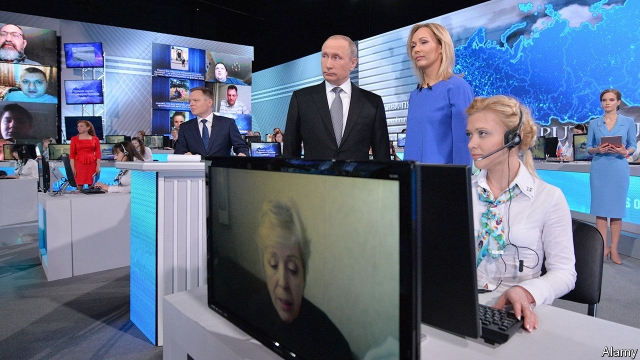

###### A world of lies

# Dispatches from “the war against reality” 

 

> print-edition iconPrint edition | Books and arts | Aug 3rd 2019 

This is Not Propaganda. By Peter Pomerantsev. PublicAffairs; 256 pages; $28. Faber & Faber; £14.99. 

REREAD PETER POMERANTSEV’S first book today and you experience a sense of vertigo. Published in 2014, “Nothing is True and Everything is Possible” is a memoir of working in Russia’s television industry in the 2000s. During his first meeting in Moscow in 2006, Mr Pomerantsev, then a producer-director, now a fellow at the London School of Economics, listens to one of the country’s top TV presenters declare: “We all know there will be no real politics. But we still have to give our viewers the sense that something is happening.” The question is, “Who’s the enemy this week?” Politics should feel “like a movie!” 

That book was acclaimed as a searing insight into the semiotics of Vladimir Putin’s Russia. But in the era of Brexit, Donald Trump and Cambridge Analytica, of Rodrigo Duterte and Jair Bolsonaro, the ruses it depicts are eerily recognisable: the spurious storylines and made-up enemies, the redefinition of what constitutes a fact, the wholesale manipulation of the citizenry. Even the title (adapted from Hannah Arendt) seems as applicable to today’s social-media-inflected Western world as to the Russia of a decade ago. 

Now the author has updated his analysis for the current moment. In “This is Not Propaganda”, Mr Pomerantsev asks: what if Russia “had been a pre-echo of what was to come”? In answering that question he ranges from identity politics to the disavowal of objectivity in much of the media; from the distressingly familiar online harassment of Filipino journalists to the “information war blitzkrieg” that accompanied the Russian invasion of Ukraine. This time his beat extends across Europe to China, the Americas and the Middle East, letting him draw helpful connections between dispersed but similar battles in “the war against reality”. 

“Nothing is True” was the account of an insider. Here, Mr Pomerantsev plays the more traditional role of a researcher and reporter. He meets information-age mountebanks and the idealists attempting to resist or expose them. He describes in detail how social media have been weaponised by the bad guys, though he neglects to tease out the influence of would-be good guys: optimistic tech types keen on making the world a better place. He shows how the digital tools used to mobilise peaceful revolutions have been co-opted by autocrats. 

The personal experience on which Mr Pomerantsev draws for this book is partly vicarious, as he movingly weaves the story of his parents, Igor and Lina, into his narrative. As dissidents in Soviet Ukraine, they lived under claustrophobic censorship and the constant fear of arrest and interrogation; eventually they were exiled for possessing and circulating samizdat. They moved to London (via Austria and Germany), where Igor worked for the BBC’s Russian service, revelling in the freedom to say and think what he wanted. 

The contrast between the tight regulation of information by repressive regimes in the 20th century, and the free-for-all of today’s media environment, gives the book its disconcerting force. Once authoritarian states concentrated on suppressing unwelcome news and opinions; now some also flood the zone with a million different takes. Once they pushed a monolithic ideology; now they shape-shift, so nobody knows what they stand for. In the past, propaganda often complemented military action; now fighting may be necessary only to provide images for propaganda. 

“If you can’t convince them, confuse them,” is an old political motto. But the means for doing that so cheaply and widely are new. If politics in the television age had to feel like a movie, the trick now is to make it seem like an account of real life. ■ 
<<<<<<< HEAD

-- 

 单词注释:

1.dispatch[dis'pætʃ]:vt. 派遣 n. 派遣, 急件 [计] 调度 

2.Aug[]:abbr. 八月（August） 

3.propaganda[.prɒpә'gændә]:n. 宣传, 宣传活动 [医] 宣传 

4.peter['pi:tә]:vi. 逐渐消失, 逐渐减少 

5.Pomerantsev[]:波梅兰采夫 

6.publicaffairs[]:na. 公众事务 [网络] 公共事务出版社；公务；公共事务专业研究生排名 

7.Faber[]:n. 法伯尔 

8.reread[.ri:'ri:d]:vt. 重读, 再读 

9.peter['pi:tә]:vi. 逐渐消失, 逐渐减少 

10.vertigo['vә:tigәu]:n. 眩晕, 迷惘 [医] 眩晕 

11.memoir['memwɑ:]:n. 传记, 实录, 追思录, 回忆录, 自传 [化] 研究报告 

12.presenter[pri'zentә]:n. 节目主持人, 奉献者, 提出者 [法] 告发者, 提出者, 推荐者 

13.politic['pɒlitik]:a. 精明的, 明智的, 策略的 

14.acclaim[ә'kleim]:n. 喝彩, 欢呼, 赞同 v. 欢呼, 喝彩, 称赞 

15.searing['siәriŋ]:a. 灼热的 

16.semiotic[.semi'ɒtik]:a. 符号学的, 症状的 [医] 症状的; 特殊的 

17.Vladimir[vlɑ'dimɪr]:n. 弗拉基米尔（古罗斯弗拉基米尔-苏兹达里公国的古都） 

18.Brexit[]:[网络] 英国退出欧盟 

19.Cambridge['keimbridʒ]:n. 剑桥 

20.analytica[]:[网络] 生化及实验室技术展；生化技术博览会；慕尼黑生技医疗仪器展 

21.Rodrigo[]:n. 罗德里戈（歌曲名称） 

22.duterte[]:[网络] 迪泰特 

23.jair[]:[网络] 睚珥；贾伊尔；睢珥 

24.ruse[ru:z]:n. 计策, 谋略, 诡计 [法] 诡计, 计策 

25.depict[di'pikt]:vt. 描述, 描写 

26.eerily[]:a. 怪诞的；奇异的；可怕的 

27.spurious['spjuriәs]:a. 假造的, 伪造的, 欺骗的 [医] 假的, 伪的 

28.storyline[]:n. 故事情节 

29.redefinition[.ri:defi'niʃәn]:n. 重新定义 

30.constitute[kәn'stitjut]:vt. 构成, 组成, 任命 [建] 构造, 组成 

31.wholesale['hәulseil]:n. 批发 a. 批发的, 大规模的 adv. 大规模, 照批发方式 vi. 经营批发业, 批发 vt. 批发 

32.manipulation[mә.nipju'leiʃәn]:n. 操作, 处理 [化] (用手)操作; 使用 

33.citizenry['sitizәnri]:n. 市民 [法] 市民 

34.hannah['hænә]:n. 汉娜（女子名） 

35.arendt[]:n. (Arendt)人名；(德、俄、罗、荷、法、英)阿伦特 阿伦特 

36.update[ʌp'deit]:vt. 更新, 使现代化 n. 更新 [计] 更新 

37.disavowal[.disә'vauәl]:n. 否认, 否定, 拒绝 [法] 拒绝承担责任, 抵赖, 否认 

38.objectivity[,ɔbdʒek'tivәti]:n. 客观, 客观现实, 客观性 [经] 客观性 

39.distressingly[]:adv. 使人痛苦, 令人苦恼 

40.online[]:[计] 联机 

41.harassment['hærәsmәnt]:n. 困扰, 烦扰, 烦恼 [法] 折磨, 骚扰, 侵扰 

42.Filipino[.fili'pi:nәu]:n. 菲律宾人 

43.blitzkrieg['blitskri:ɡ]:n. （德）闪电战；突然袭击 

44.ukraine[ju(:)'krein]:n. 乌克兰（原苏联一加盟共和国, 现已独立） 

45.disperse[dis'pә:s]:vt. 分散, 传播, 散开 vi. 分散 a. 分散的 [计] 分散 

46.insider['in'saidә]:n. 内部的人, 权威人士, 知道内情的人 [经] 熟悉内情者 

47.mountebank['mauntәbæŋk]:n. 江湖郎中, 骗子 

48.idealist[ai'diәlist]:n. 理想主义者, 唯心主义者 a. 唯心论的, 理想主义的 

49.weaponised['wepənaiz]:vt. 把…改装成武器；使…武器化 

50.tech[tek]:n. 技术学院或学校 

51.mobilise['mәjbilɑiz]:vi.vt. 动员, 松动, 使活动, 调动, 发动 

52.autocrat['ɒ:tәkræt]:n. 独裁者 

53.vicarious[vai'kєәriәs]:a. 代理的, 代用的, 替代的 [医] 替代的, 错位的 

54.movingly[]:adv. 感人地, 动人地 

55.Igor[]:n. (Igor)人名；(乌克、罗、塞、斯洛伐、法、葡、俄、西、英)伊戈尔 abbr. 注入气和采出石油比（Injection Gas-Oil Ratio） 

56.lina[]:n. 莉娜（女子名） 

57.narrative['nærәtiv]:n. 叙述, 故事 a. 叙述的, 叙事的, 故事体的 

58.dissident['disidәnt]:a. 意见不同的, 持不同政见的 n. 意见不同的人, 持不同政见者 

59.claustrophobic[,klɔ:strә'fәjbik]:a. (患)幽闭恐怖症的,导致幽闭恐怖症的 

60.censorship['sensәʃip]:n. 检查制度 [医] 督察, 监察 

61.interrogation[in.terәu'geiʃәn]:n. 审问, 疑问句, 问号 [电] 询问 

62.exile['eksail]:n. 放逐, 流放, 被放逐者 vt. 放逐, 流放, 使背井离乡 

63.samizdat[səmaɪz'dæt]:n. <俄>地下出版物; 私出版物 

64.Austria['ɒstriә]:n. 奥地利 

65.revel['revl]:n. 作乐, 狂欢 vi. 狂欢作乐, 陶醉, 着迷 vt. 耗费 

66.repressive[ri'presiv]:a. 压抑的, 抑制的, 镇压的 

67.regime[rei'ʒi:m]:n. 政权, 当权期间, 政体, 社会制度, 体制, 情态 [医] 制度, 生活制度 

68.disconcert[.diskәn'sә:t]:vt. 使困惑, 使仓皇失措, 打乱(计划等) 

69.authoritarian[ɒ:.θɒri'tєәriәn]:a. 独裁的, 独裁主义的 

70.suppress[sә'pres]:vt. 镇压, 使止住, 禁止, 抑制, 查禁 [法] 镇压, 平定, 禁止出版 

71.unwelcome[ʌn'welkәm]:a. 不受欢迎的, 讨厌的 n. 冷淡 vt. 冷淡地对待, 冷淡地接受 

72.monolithic[.mɒnәu'liθik]:a. 独石的, 完全统一的, 整体的 [化] 整体(铸,烧结)的; 龟甲网衬里; 单片; 单块 

73.ideology[.aidi'ɒlәdʒi]:n. 思想体系, 意识形态, 观念学, 空论 [医] 观念学, 观念形态 

74.propaganda[.prɒpә'gændә]:n. 宣传, 宣传活动 [医] 宣传 

75.complement['kɒmplimәnt]:n. 补足物, 补语, 补数 vt. 补充, 补足 [计] 补码; 反相器; 补数 

76.cheaply['tʃipli]:adv. 便宜地 
=======
>>>>>>> 50f1fbac684ef65c788c2c3b1cb359dd2a904378

