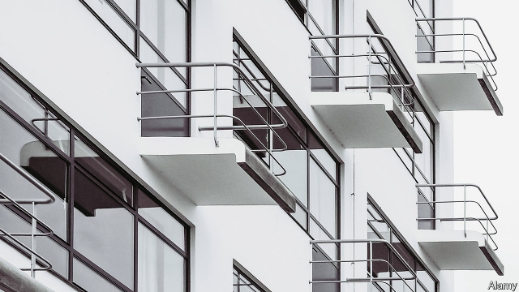
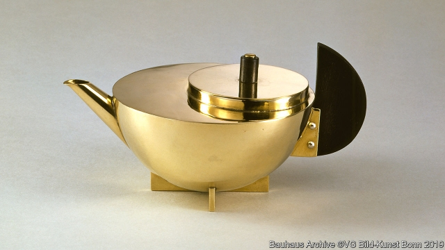

###### Thinking outside the box

# Kinks in the clean lines of the Bauhaus 

 

> print-edition iconPrint edition | Books and arts | Aug 3rd 2019 

SINCE IT WAS built in 1924, the Landhaus Ilse, or Ilse country house, has been an incongruous presence on the edge of Burbach, a provincial town in wooded hills halfway between Frankfurt and Cologne. Not only does the yellow single-storey box, with its illuminated central shaft, stand in contrast to the region’s traditional timber-framed and slate-clad homes. The house itself seems paradoxical. Its confident, modernist lines are complemented by a less austere chorus of sloping roof, small lattice windows, curvaceous chimney-tops and a weather vane. 

Inside, the house—which has not been renovated since the 1920s—is a riot of colour. One room is pink, another blue; a third is criss-crossed by gold lines. The central family room gives, on one side, onto the parlour (painted red), which leads to a conservatory. In the cellar, a big kitchen includes a dumbwaiter that once sent meals up to the green dining room. Improbable as it seems, this contradictory place, which fell into disuse and might have been demolished, sheds light on the evolution and nuances of the Bauhaus school of architecture and design, which was founded a century ago, in 1919. 

For most enthusiasts, the school’s legacy is embodied in iconic designs such as Walter Gropius’s Bauhaus building in Dessau (pictured), Marcel Breuer’s tubular chairs or Wilhelm Wagenfeld’s glass-domed table lamp. Although it closed in 1933, the Bauhaus posthumously became the high church of novelty, simplicity and functionalism, a reformation of an architectural past of stale ornament and tradition. White-cubed houses across the world are today liable to be tagged with the label “Bauhaus-style”, as if that designation could mean only one thing. 

Three major exhibitions are being held in Germany to mark the centenary, one in each of the school’s successive home towns: Weimar, where it was established by Gropius; Dessau, which it moved to in 1925; and Berlin, where it was run by Mies van der Rohe in 1932-33 before closing under pressure from the Nazis. The last, put on by the Bauhaus Archive, a museum, will open in September, as will the one in Dessau (Weimar’s is already up and running). The Ilse house will feature prominently in Berlin. It is likely to disconcert devotees of clean lines—and simple histories. 

Willi Grobleben, the father of the woman who gave the house its name, moved to Burbach in 1924, says Katrin Mehlich, who runs the town’s cultural office. The new technical director of a local quarry, Grobleben had the house built as a company guesthouse; he was given the property as a pay-off in 1927. His daughter, Ilse, lived there until she died in 2000. The house was bought and saved from oblivion by Erika Wirtz, a local entrepreneur. Not long afterwards she came across a familiar-looking floor-plan in a book about the Bauhaus. “That is my Ilse,” Wirtz exclaimed. 

Actually, the plan was for the white-cubed, flat-roofed Haus am Horn in Weimar—the Bauhaus’s earliest foray into architecture, which had been the main exhibit in the school’s first big show, in 1923. All the rooms in the Haus am Horn were—like those of the Ilse house—organised around a central, sky-lit family room. The layout was socially progressive (there was no provision for servants) and aesthetically controversial (the big windows were placed as the interiors demanded, making the exterior asymmetrical). The Haus am Horn was long thought to be unique. 

For the show in Berlin, Anna Henckel-Donnersmarck, a video artist, has interviewed experts and Burbach locals about the curious history of the run-down Ilse house. Her video installation will explore how Grobleben came to mimic the Haus am Horn. Did he visit the Bauhaus exhibition in 1923? Was he among those who inquired about buying a plan? Did he see one in a magazine? Did he and Gropius, born in the same year, meet as students? “The similarities are so strong we can’t really talk about a coincidence,” Annemarie Jaeggi, the head of the Bauhaus Archive, told the video artist in the house’s dining room. The floor plans are Exhibit A, she said. 

“Grobleben was a bit of a nut,” confides Albert Schöllchen in the house’s red parlour. “He certainly didn’t fit in here.” Albert and his older brother Jürgen moved in across the road in the 1950s. Albert says he always found the house “spooky” and gave it no thought. Jürgen says he often wondered: “How did it get here?” He regrets not having asked the Groblebens that question when he could. 

“Part of the fascination about the Ilse house is that we don’t know everything,” says Christoph Ewers, the town’s mayor. What seems clear is that, in Burbach, the newfangled Haus am Horn was turned into what the mayor calls “a representative, traditional upper-middle-class house”. The town declared the building a landmark in 2001 and took it over in 2017 after Wirtz, the entrepreneur, died. Ms Jaeggi was the first bigwig from one of the latter-day Bauhaus institutions to pay a visit. 

In Berlin, the Ilse house and the Haus am Horn will be explained side by side. Nina Wiedemeyer, the exhibition’s curator, wants to tease out the complexities of the Bauhaus story beyond the clean-lined narrative that Gropius and others propagated. In the approved version, which dates to a show at the Museum of Modern Art in New York in 1938, the school was a fount of elegant yet accessible modernism. The Bauhaus proved as avant-garde in marketing itself as it was in art: Gropius gave dozens of speeches about it, and his successor as the school’s director, Adolf Meyer, put on a state-of-the-art touring showcase. 

 

Yet there were always kinks. The retrospective in Berlin will document the school’s close links to other artistic movements, such as the anti-establishment provocations of Dadaism. It will expose the bickering and glitches beneath the myth, noting, for instance, that one design now widely considered a Bauhaus classic, Maria Brandt’s geometrical tea-infuser of 1924 (pictured*), never made it beyond the prototype stage. For its part, the Ilse house demonstrates that the Bauhaus could inspire mash-ups as well as doctrinal purity. 

After all, short-lived as it was, the school involved 1,400 people. Like most human endeavours of that size, and most artistic trends, “it was not a monolith,” Ms Wiedemeyer says. Her exhibition will include some of the Bauhaus’s greatest hits; “but it will also say, ‘Wait, there’s more…’” ■  

*Bauhaus Archive Berlin © VG Bild-Kunst Bonn 2019 
<<<<<<< HEAD

-- 

 单词注释:

1.kink[kiŋk]:n. 扭结, 蜷缩 v. (使)扭结, (使)绞缠 

2.Aug[]:abbr. 八月（August） 

3.ilse['ilsə]:n. 伊尔丝（女子名） 

4.incongruous[in'kɒŋgruәs]:a. 不协调的, 不一致的, 不合适的 

5.burbach[]: [地名] [德国] 布尔巴赫 

6.provincial[prә'vinʃәl]:n. 外地人, 粗野的人 a. 省的, 外地的, 偏狭的 

7.wooded['wudid]:a. 树木繁茂的 

8.halfway['hɑ:f'wei]:a. 中途的, 不彻底的, 部分的 adv. 半路地, 在中途, 在半途 

9.frankfurt['fræŋkfәt]:n. 牛肉香肠, 猪牛肉混合香肠 

10.Cologne[kә'lәun]:n. 科隆, 科隆香水 

11.illuminate[i'lju:mineit]:vt. 照明, 用灯装饰, 阐明, 说明, 使灿烂 vi. 照亮, 用灯装饰 

12.shaft[ʃæft]:n. 轴, 箭杆, 矛, 矿井 vt. 装杆于, 利用 

13.paradoxical[.pærә'dɒksikl]:a. 似非而是的, 矛盾的, 诡论的 [医] 奇异的, 矛盾的, 逆理的, 反常的 

14.modernist['mɒdәnist]:n. 现代主义者, 现代人, 现代主义作家 

15.complement['kɒmplimәnt]:n. 补足物, 补语, 补数 vt. 补充, 补足 [计] 补码; 反相器; 补数 

16.les[lei]:abbr. 发射脱离系统（Launch Escape System） 

17.austere[ɒ'stiә]:a. 严峻的, 禁欲的, 简朴的 

18.lattice['lætis]:n. 格子, 组合格子, 格子状东西 vt. 制做格子, 使成格子状 [计] 格 

19.curvaceous[kә:'veiʃәs]:a. 曲线美的, 肉体美的 

20.vane[vein]:n. 风向标, 风信旗, 变化不定的事物 [机] 轮叶, 叶 

21.renovate['renәuveit]:vt. 更新, 革新, 刷新, 修复, 使恢复活力 

22.riot['raiәt]:n. 暴动, 喧闹, 放纵 vi. 发动, 暴动, 纵情, 放荡 vt. 浪费, 挥霍 

23.parlour['pɑ:lә]:n. 客厅, 会客室, 雅座 a. 客厅的 

24.conservatory[kәn'sә:vәtәri]:a. 保存性的, 有保存力的 n. 温室, 音乐学校 

25.dumbwaiter[dʌm'weɪtər]: <美>（楼上下之间）送饭菜的小升降机; 送菜升降机 

26.dining['dainiŋ]:n. 正餐, 宴会 

27.improbable[im'prɒbәbl]:a. 不大可能的, 不象发生的, 荒谬可笑的 [法] 未必会的, 不大可能发生的, 未必确实的 

28.disuse[dis'ju:s]:n. 不被使用, 废弃 vt. 停止使用, 废止 

29.demolish[di'mɒliʃ]:vt. 毁坏, 破坏, 粉碎 

30.nuance[nju:'ɑ:ns]:n. 细微差别 

31.enthusiast[in'θju:ziæst]:n. 热心家, 狂热者, 爱好者 

32.legacy['legәsi]:n. 祖先传下来之物, 遗赠物 [经] 遗产, 遗赠物 

33.embody[im'bɒdi]:vt. 具体表达, 使具体化 [经] 合并, 具体化, 具体表现 

34.iconic[ai'kɔnik]:[计] 图标的 

35.Walter['wɔ:ltә(r)]:n. 沃尔特（男子名） 

36.Dessau['desau]:n. 德绍（德国东部城市） 

37.marcel[mɑ:'sel]:n. 波浪形鬈发 vt. 把...烫成波浪形 vi. 烫发 

38.tubular['tju:bjulә]:a. 管状的 [医] 小管的, 管状的 

39.wilhelm['vilhelm,'wil-]:n. 威廉（William的德语形式, 男子名） 

40.posthumously[]:adv. 父死后出生, 遗腹, 著作者死后出版, 身后, 死后 

41.novelty['nɒvәlti]:n. 新奇, 新鲜, 新奇的事物 

42.functionalism['fʌŋkʃәnәlizm]:n. 功能论, 机能心理学, 功能主义, 实用第一主义 

43.reformation[.refә'meiʃәn]:n. 改革, 改正, 重新形成, 重新组成 

44.architectural[.ɑ:ki'tektʃәrәl]:a. 有关建筑的, 建筑学的 

45.designation[.dezig'neiʃәn]:n. 指示, 指定, 命名 [电] 指定 

46.centenary[sen'ti:nәri]:n. 一百年 a. 一百年的 

47.Weimar['vaimɑ:]:魏玛 

48.Gropius[]:n. (Gropius)人名；(英)格罗皮厄斯；(德)格罗皮乌斯 

49.Berlin[bә:'lin]:n. 柏林, (软质)柏林毛线 

50.mie[]:abbr. 工业工程硕士（Master of Industrial Engineering）；制造业信息化工程；心肌梗塞延展（Myocardial Infarct Extension）；最小点火能（Minimum Ignition Energy） 

51.der[]:abbr. 区分编码规则（Distinguished Encoding Rules） 

52.rohe[]: [人名] 罗厄 

53.Nazi['nɑ:tsi]:n. 纳粹党人 a. 纳粹党的 

54.archive['ɑ:kaiv]:vt. 把...存档 n. 档案馆, 档案文件 [计] 挡案库, 存档 

55.prominently['prɔminәntli]:adv. 显著地 

56.disconcert[.diskәn'sә:t]:vt. 使困惑, 使仓皇失措, 打乱(计划等) 

57.devotee[.devә'ti:]:n. 爱好者, 献身者, 虔诚的宗教信徒 

58.Willi[]:威利(人名） 

59.Katrin[]:n. (Katrin)人名；(英)凯特琳；(德)卡特琳 

60.cultural['kʌltʃәrәl]:a. 文化的, 教养的, 修养的 [医] 培养的 

61.quarry['kwɒri]:n. 采石场, 方形石, 猎物, 被追求物, 来源 vt. 挖出, 努力挖掘 vi. 费力地找 

62.guesthouse['^esthajs]:n. 宾馆, 高级寄宿舍, 招待所 

63.oblivion[ә'bliviәn]:n. 遗忘, (头脑的)一片空白状, 湮没, 大赦, 赦免 [法] 忘却, 被忘却的事, 大赦 

64.erika[]:n. 埃里卡（女名） 

65.wirtz[]: [人名] 沃茨 

66.entrepreneur[.ɒntrәprә'nә:]:n. 企业家, 主办人 [经] 承包商, 企业家 

67.afterwards['ɑ:ftәwәdz]:adv. 然后, 后来 

68.hau[]:abbr. 自动暖气控制系统 n. (Hau)人名；(越)厚；(罗)哈乌；(法)奥；(中)郝(普通话·威妥玛)；(柬)华；(日)匐(姓)；(德、捷、缅)豪 

69.foray['fɒrei]:vi. 侵略, 劫掠, 袭击 n. 侵掠, 侵略, 攻击 

70.socially['sәuʃәli]:adv. 在社会上, 在社交上, 以社会生活方式 

71.aesthetically[i:s'θetikәli]:adv. 美学观点上地；审美地 

72.asymmetrical[]:a. 不对称的, 偏位的 [计] 非对称的, 不对称的 

73.anna['ænә]:n. 安娜（女子名） 

74.mimic['mimik]:a. 模仿的, 摹拟的 n. 效颦者, 模仿者, 小丑, 仿制品 vt. 模仿, 摹拟 

75.similarity[.simi'læriti]:n. 类似, 类似处 [法] 类似, 相似, 类似事例 

76.Annemarie[,ænmә'ri:]:n. 安玛丽(f.) 

77.confide[kәn'faid]:vt. 吐露, 委托 vi. 信赖 

78.albert['ælbәt]:n. 艾伯特（男子名） 

79.alway['ɔ:lwei]:adv. 永远；总是（等于always） 

80.spooky['spu:ki]:a. 幽灵一般的, 吓人的, 令人毛骨悚然的 

81.fascination[.fæsi'neiʃәn]:n. 令人着迷的事物, 入迷, 魅力 

82.Christoph[]:克里斯托夫（人名） 

83.ewer['ju:ә]:n. (有柄的)大口水壶, 花瓶状水罐 

84.newfangled['nju:fæŋgld]:a. 新奇的, 最新式的, 最新流行的 

85.landmark['lændmɑ:k]:n. 陆标, 划时代的事, 地界标 [医] 界标 

86.bigwig['bigwig]:n. 要人, 大亨 

87.nina['ni:nә]:n. 尼娜（女名） 

88.curator[kjuә'reitә]:n. 管理者, 经理, 主管人, 掌管者, 馆长, 大学学监, 监护人, 保护人 [经] 临时监护人 

89.complexity[kәm'pleksiti]:n. 复杂, 复杂性, 复杂的事物 

90.narrative['nærәtiv]:n. 叙述, 故事 a. 叙述的, 叙事的, 故事体的 

91.propagate['prɒpәgeit]:vt. 繁殖, 传播, 传送 vi. 繁殖, 蔓延 

92.york[jɔ:k]:n. 约克郡；约克王朝 

93.fount[faunt]:n. 泉, 源泉, 墨水缸, 一副铅字 

94.modernism['mɒdәnizm]:n. 现代作风, 现代主义, 现代思想 

95.marketing['mɑ:kitiŋ]:n. 行销, 买卖 [经] 推销, 在市场买卖, 销售 

96.successor[sәk'sesә]:n. 继承者, 接任者 [计] 后继 

97.Adolf['ædɔif]:n. 阿道夫(亦作Adolph) (m.) 

98.meyer[]:n. 迈耶（日耳曼语, 指首席侍从或农夫） 

99.showcase['ʃәukeis]:n. 陈列橱 [经] 商品陈列所, 货物陈列架 

100.retrospective[.retrә'spektiv]:a. 回顾的, 怀旧的, 在后面的 n. 回顾展 

101.provocation[.prɒvә'keiʃәn]:n. 激怒, 刺激, 挑拨 [医] 激发[作用] 

102.dadaism['dɑ:dәizәm]:n. 达达派, 达达主义（崇尚虚无的艺术派别） 

103.bicker['bikә]:vi. 斗嘴, 潺潺而流, 闪动 n. 口角, 流水声 

104.glitch[^litʃ]:[计] 假信号 

105.myth[miθ]:n. 神话, 虚构的事, 虚构的人 

106.Maria[mә:'raiә, mә'riә]:n. 玛丽亚（女名） 

107.geometrical[.dʒiәu'metrikl]:a. 几何学的, 几何的 [机] 几何学的 

108.prototype['prәutәtaip]:n. 原型 [计] 样机; 原型 

109.doctrinal['dɒktrinәl]:a. 教义的, 教诲的, 学说的 

110.endeavour[in'devә]:n. 努力, 力图, 尽力 vi. 努力, 力图, 尽力 

111.monolith['mɒnәuliθ]:n. 巨型独石, 大独石碑 

112.vg[]:abbr. 音频段（Voice Grade）；电压增益（Voltage Gain）；很好（Very Good）；代理监督（Vicar General） 

113.Bonn[bɒn]:n. 波恩 
=======
>>>>>>> 50f1fbac684ef65c788c2c3b1cb359dd2a904378

