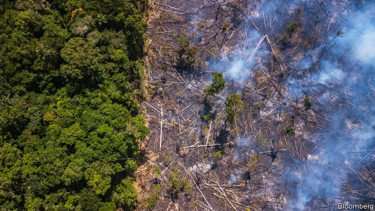
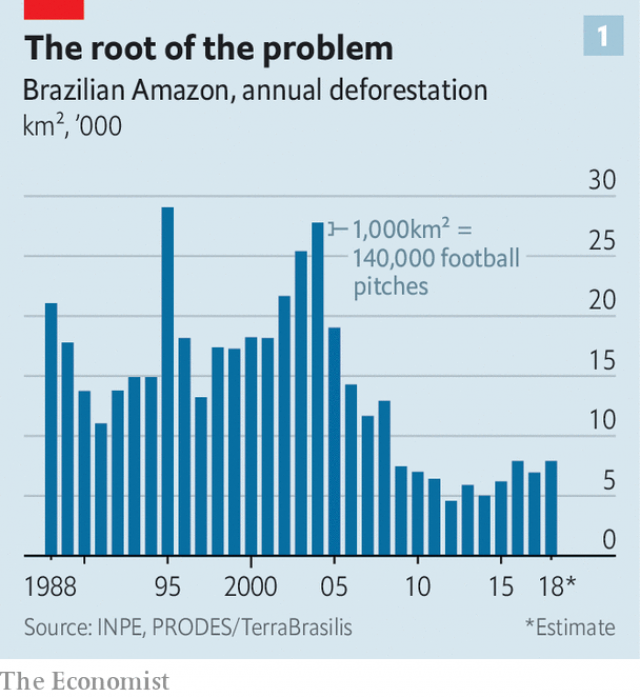
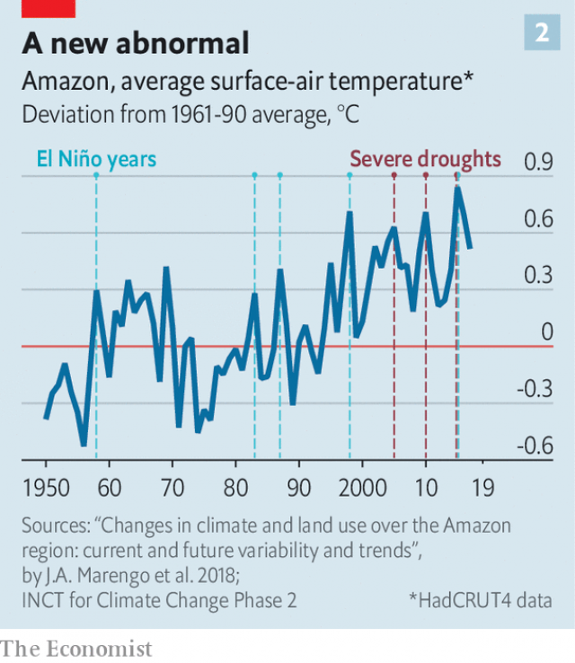

###### On the brink

# The Amazon is approaching an irreversible tipping point 

 

> print-edition iconPrint edition | Briefing | Aug 1st 2019 

THE AMAZON basin, most of which sits within the borders of Brazil, contains 40% of the world’s tropical forests and accounts for 10-15% of the biodiversity of Earth’s continents. Since the 1970s nearly 800,000km² of Brazil’s original 4m km² (1.5m square miles) of Amazon forest has been lost to logging, farming, mining, roads, dams and other forms of development—an area equivalent to that of Turkey, and bigger than that of Texas. Over the same period, the average temperature in the basin has risen by about 0.6°C. This century, the region has suffered a series of severe droughts. 

Both the reduction in tree coverage and the change in climate were endangering the forest’s future well before Brazil’s general elections of October 2018. But after that the forest faced another threat: Jair Bolsonaro, the new president, and arguably the most environmentally dangerous head of state in the world. 

From 2004 to 2012 the rate of deforestation in the Brazilian Amazon slowed. The government’s environmental protection agency, Ibama, was strengthened. Other countries, and global NGOs, nagged and encouraged; in 2008 an international Amazon Fund was created to help pay for protection. Not a moment too soon, said rainforest scientists. They had begun to suspect that, if tree loss passed a certain threshold, the deforestation would start to feed on itself. Beyond this tipping-point, forest cover would keep shrinking whatever humans might try to do to stop it. Eventually much of the basin would be drier savannah, known as cerrado. As well as spelling extinction for tens of thousands of species, that devastation would change weather patterns over much of South America and release into the atmosphere tens of billions of tonnes of carbon, worsening global warming. 

 

This hopeful period of slower deforestation was not to last. Even before Mr Bolsonaro, deforestation began to tick up (see chart 1). In 2012, under then-president Dilma Rousseff, Brazil’s congress passed a new forest code that gave amnesty to those who had taken part in illegal deforestation before 2008. In 2017 Michel Temer, the next president, signed a law that streamlined the privatisation of occupied public lands, which spurred land grabs in the Amazon. During the deep recession of 2014-16 the environment ministry’s budget was slashed. Between August 2017 and July 2018 Brazil lost 7,900km² of Amazon forest—nearly a billion trees—the highest rate of deforestation for a decade. 

According to preliminary satellite data, since Mr Bolsonaro took office in January, the Amazon has lost roughly 4,300km² of forest, which means this year’s total will surely outstrip last year’s. This is not a fluke. The president appears to want the country to return to the time of Brazil’s military dictatorship, when big infrastructure projects prompted widespread destruction in the name of development. 

A few of Mr Bolsonaro’s plans have been curbed. Pressure from Tereza Cristina, the agriculture minister, and the farm lobby led him to withdraw his threat to leave the Paris climate agreement and from abolishing the environment ministry—mostly because deals with disapproving European firms would be at risk. A bill introduced by Flávio Bolsonaro, the president’s eldest son and a senator in his own right, to eliminate a requirement for farmers to preserve some natural vegetation on land they clear has not yet passed. The supreme court blocked a decree to transfer powers over the demarcation of indigenous reserves from the justice ministry to Ms Cristina’s—which would have “put the fox in charge of the chicken coop,” argues Randolfe Rodrigues, an opposition senator. 

But even without the biggest changes, Mr Bolsonaro’s government can still encourage, directly or indirectly, a large amount of deforestation, by not enforcing the laws that prohibit it. On February 28th the environment minister, Ricardo Salles, fired 21 of Ibama’s 27 state heads, following the president’s orders to “clean out” the agency. Most have yet to be replaced, including all but one in the Amazon states. The environment ministry has started to flag up in advance where and when anti-logging operations will take place. Between January and May, Ibama imposed the lowest number of fines for illegal deforestation in a decade. 

Mr Salles says that “the role of the state is to protect landowners’ property rights”. He wants to use donations from Norway and Germany to the 3.6bn reais ($950m) Amazon Fund to compensate landowners for land that had been turned into conservation areas, even though most of it was occupied illegally. 

Deforesters appear emboldened. According to the Indigenist Missionary Council, a Catholic group, the number of illegal invasions in indigenous areas has jumped. On July 24th miners with guns invaded a village in the northern state of Amapá, killed one of its leaders and expelled the residents. Satellite data show a drastic rise in the year-on-year deforestation rate starting in May, the beginning of the dry season. In July, more than 1,800km² was cleared, three times more than last year. 

These statistics tell only part of the story. The Amazon matters to the global climate because it is a sink of carbon, mitigating warming. If the rainforest were to die back, the large amount of greenhouse gases this would release would speed up that process. But the climate matters to the Amazon, too. It is sensitive to changes in temperature and rainfall, as well as to atmospheric carbon-dioxide levels. 

The Amazon is unique among tropical rainforests in that it produces a lot of its own rainfall. As moisture travels from the Atlantic to Peru, the Amazon’s trees recycle some of it; around half the forest’s rain is reused this way. Rainwater is pulled up from the roots to the canopy, where it is released back to the atmosphere to fall as rain again. Not only does this provide moisture to the region, the evaporation off the leaves also has a local cooling effect. 

This is what has led to worries about tipping-points. In an influential paper in 2007 Gilvan Sampaio and Carlos Nobre of Brazil’s National Institute for Space Research forecast that, were 40% of the forest to perish, the loss of water-recycling capacity would mean very little of the rest would have enough rainfall to survive. 

Alongside the threat from deforestation, the forest’s capacity to water itself can be weakened by rising temperatures. Beatriz Marimon and Ben Hur Marimon, at the University of Mato Grosso in Nova Xavantina, have kept tabs for decades on dozens of plots in the transição, the margin between the wet Amazon and the drier cerrado. Today, Mr Marimon says, they are seeing “two warmings in one”. On top of global warming are changes that result from deforestation, which removes the air-conditioning effect provided by water evaporating from the trees’ leaves. 

 

A study by Divino Silvério and colleagues at the Amazon Environmental Research Institute, published in 2015, found that converting forest to pasture increased land temperatures by 4.3°C; if pasture was then turned over to arable crops, things warmed a little more. The transição is already hotter and drier than most of the rainforest. Clearing more of its patchwork of forest, farms and savannah makes the remaining woodland even hotter. 

Ms Marimon has also observed that temperatures above 40°C dry out trees, making them more likely to fall in strong winds. The fragmentation brought about by farming creates isolated patches of forest. If they lose access to seed banks in the soil and water sources, such disconnected fragments are less able to recover. 

How plants respond to carbon-dioxide levels probably exacerbates matters. The more carbon dioxide in the air, the less air plants need to process in order to photosynthesise. The less air they take in, the less water vapour they let out. As a consequence, the plants both do less to cool their immediate environment (because less water evaporates) and also make the atmosphere less moist. This has been shown to be happening in other watersheds, though there is not yet conclusive evidence from the Amazon. 

Clearances also lead to local drying. Satellite data show that air which passes over primary rainforest produces twice as much rain a few days later than that which passes over farmland. In 2012 scientists at the University of Leeds predicted that continued deforestation would cause rainfall in the Amazon to drop by 12% in the wet season and by 21% in the dry season by 2050. 

The forest’s dry season started to lengthen in the 1970s; the rains which used to come in October now come in November. This might have been an effect of deforestation; there is some evidence that water returned to the atmosphere by trees is particularly important in getting the rainy season going. The most dramatic effect of drying seen by scientists, though, is not a shorter wet season. It is the disproportionate impact of the years in which rainfall is particularly low. 

 

This century has already seen three unusually harsh droughts, in 2005, 2010 and 2015. That of 2015 corresponds to an El Niño event—a see-saw effect in Earth’s climate whereby a shift in the flow of energy between the atmosphere and the ocean in the central Pacific produces a predictable pattern of climate anomalies all through the tropics and beyond (see chart 2). The correlation between El Niño events and droughts in the Amazon, most notably in the south-eastern part, predates human activities. But those activities may, at a global level, increase the frequency and intensity of El Niño events. At the local level they worsen the damage that droughts do. 

The El Niño drought in 2015 was particularly severe. In Nova Xavantina more than a third of the trees in some of the Marimons’ study plots died in its aftermath. The region around the city of Santarém, farther north and deep in the Amazon, saw flames as tall as buildings tear through the forest, enveloping the canopy in thick black smoke that stretched for miles and turned the sunlight red. For months after the fires died down, the forest floor smouldered. Hundred-year-old trees dried out and died. 

Nearly four years later, the forest is still recovering. At one part of the Tapajós National Forest reserve, where 580km² (11% of the total area) burned, saplings have shot up among the ashes of their giant forebears, but it will be years before they form a canopy. A second round of fires in 2017 burned nearly a quarter of another reserve, where 75 communities of river-dwellers make their living fishing and hunting. 

Fires are not new to the Amazon, but recently they seem to have been more frequent and intense. This kicks off a vicious cycle. Dead trees open gaps in the canopy, allowing more light and wind to reach the forest floor, which becomes hotter, drier and more prone to burn again. This year is expected to be a mild El Niño year, which means higher temperatures and less rain for the area around Santarém. Fires could rage again. If that happens, says Joice Ferreira, a biologist at the Brazilian Agricultural Research Corporation, the debris left over from the previous fires will serve as fuel for the flames. “After that,” she says, “there won’t be many trees left.” 

Over the past 50 years 17% of the rainforest has been lost, some way from the 40% tipping-point proposed in 2007. But last year Mr Nobre and Thomas Lovejoy of George Mason University, after taking account of climate change and fire as well as deforestation, revised the estimate of the threshold to 20-25%. That is uncomfortably close to today’s figure. Mr Nobre says the recent droughts and floods could be the “first flickers” of permanent change. Carlos Rittl of the Brazilian Climate Observatory, a consortium of research outfits, expects Mr Bolsonaro’s tenure to see deforestation pass 20%. If Mr Lovejoy and Mr Nobre are right, that could be disastrous—once the tipping-point is transgressed, much of the rest of the forest could follow in just a matter of decades. 

Even now, the service that the Amazon provides the rest of the world as a sink for carbon dioxide appears to be declining. Simon Lewis of University College London, and colleagues, analysed observations of 321 plots across the Amazon basin. They found that in primary forests plants absorb, on average, a third less carbon dioxide than they did in the 1990s, owing to increasing tree mortality. In a paper published in 2011 Mr Lewis argued that carbon lost to the atmosphere through tree death and fire in the droughts of 2005 and 2010 might offset as much as a decade’s worth of carbon-dioxide absorption by the forest. 

Not everyone is so gloomy. Forests that are diverse, like the Amazon, are likely to have drought-resistant species that can fill the niche left by drought-prone ones without a loss of biomass, points out Kirsten Thonicke of the Potsdam Institute for Climate Impact Research, a German think-tank. Secondary forests store significant amounts of carbon, though far less than primary ones. One study found that as a secondary forest grows, it recovers 1.2% carbon storage per year, so a 20-year-old secondary forest would store roughly 25% of the carbon stored by a primary forest. There are ways to mitigate the biomass loss from logging and ranching, by being careful about which trees to cut and reforesting afterwards. In Paris Brazil pledged not just to halt illegal deforestation by 2030 but also to reforest 120,000km². 

Such attempts at mitigation look increasingly unlikely. In June Mr Bolsonaro published a decree which indefinitely extends the 2019 deadline for farmers to begin replanting illegally deforested land. This not only reduces the chances of reforestation. It reinforces the message: the government will turn a blind eye to more. Similarly, if his son’s bill were to pass it would legalise the deforestation of some 1.5m km². Clearing that would emit nearly 65bn tonnes of carbon dioxide—equivalent to Brazil’s emissions over the past 27 years. 

In July President Bolsonaro called deforestation data “lies” and said he wanted to review them before they were released to the public. Hamilton Mourão, the vice-president, says that other countries’ professed concern for the Amazon masks “covetousness” for precious minerals in the region. Mr Salles, the environment minister, likes to point out that many rich countries cut down their own forests but have not fulfilled promises to pay Brazil not to do the same. “You can’t give Brazil the onus of being the world’s lungs without any benefits,” he argues. 

Mr Salles is right that the countries responsible for the bulk of emissions should compensate Brazil for its role in absorbing them. In return Brazil must protect, rather than destroy, the rainforest. In June a trade deal between the EU and Mercosur—Brazil, Argentina, Paraguay and Uruguay—was announced at the G20 summit, which includes a commitment to implement the Paris climate agreement. It has yet to be approved; it is also unclear how much it will sway the president to curb his infrastructure plans, or indeed his rhetoric. 

Concerns about what Brazil’s climate policies might do to the country’s reputation could spur local resistance to Mr Bolsonaro’s anti-environmental turn. Fears for the climate itself may yet do more. “We have no doubt that the forest has a direct effect on the rain cycle,” says Artemizia Moita, the sustainability director of a farming group that has 530km² of soyabean and cattle farms. “If we keep deforesting,” she asks, “how will we keep producing?” Unlike other farmers she admits she is worried about climate change. 

For many, any shift in attitudes will already come too late. Magdalena is an elderly woman who has spent her life as a river-dweller in one of the rainforest’s reserves. She used to hunt deer and armadillo to make her living. Now she treks 13km to buy beef from a local village. “All the game is gone,” she laments. ■ 

-- 

 单词注释:

1.brink[briŋk]:n. 边缘, 陡岸 

2.amazon['æmәzɒn]:n. 亚马孙河 [医] 无乳腺者 

3.irreversible[,iri'vә:sәbl,-sib-]:a. 不可逆的, 不可改变的, 不能倒置的, 不能翻转的, 不能倒转的, 不可撤销的 [计] 不可逆的 

4.Aug[]:abbr. 八月（August） 

5.amazon['æmәzɒn]:n. 亚马孙河 [医] 无乳腺者 

6.Brazil[brә'zil]:n. 巴西 

7.biodiversity[]:n. 生物多样性 

8.Texas['teksәs]:n. 德克萨斯 

9.sery[]:n. (Sery)人名；(俄)谢雷；(科特)塞里 

10.coverage['kʌvәridʒ]:n. 覆盖的范围, 保险总额, 新闻报导 [化] 可达范围; 覆盖度 

11.endanger[in'deindʒә]:vt. 危及 [法] 使危险, 危及 

12.jair[]:[网络] 睚珥；贾伊尔；睢珥 

13.arguably['ɑ:ɡjuәbli]:adv. 可论证地；可争辩地；正如可提出证据加以证明的那样地 

14.environmentally[]:adv. 有关环境方面 

15.deforestation[di:.fɒ:ri'steiʃәn]:n. 采伐森林, 森林开伐 [法] 砍伐森森 

16.Brazilian[brә'ziljәn]:n. 巴西人 a. 巴西的, 巴西人的 

17.environmental[in.vaiәrәn'mentәl]:a. 周围的, 环境的 [经] 环境的, 环保的 

18.ibama[]:[网络] 巴西环保署；巴西再生资源及环保局；可再生自然资源协会 

19.ngos[]:abbr. non-government organization 非政府组织，非政府机构 

20.nag[næg]:n. 老马, 驽马, 劣等竞赛马, 唠叨 v. 不断地唠叨, 恼人 

21.rainforest['rein'fɔrist]:[生态]雨林 

22.threshold['θreʃәuld]:n. 门槛, 入口, 开端, 阈 [计] 阈; 阈值 

23.savannah[sә'vænә]:n. 大草原, 热带草原（等于savanna） 

24.cerrado[]:n. 热带高草草原 [网络] 拉多；拉朵；巴西钱帕达 

25.extinction[ik'stiŋkʃәn]:n. 消失, 消灭, 废止 [化] 消光; 熄灭 

26.tens[]:十位 

27.specie['spi:ʃi]:n. 硬币 [经] 硬币 

28.devastation[.devә'steiʃәn]:n. 毁坏 

29.tonne[tʌn]:n. 吨, 公吨 [经] 吨 

30.worsen['wә:sn]:vt. 使更坏, 使恶化 vi. 变得更坏, 恶化 

31.Dilma[]:[网络] 迪尔玛；总统迪尔玛 

32.rousseff[]:[网络] 罗塞夫；总统罗赛夫 

33.amnesty['æmnisti]:n. 大赦, 赦免 

34.michel[]:n. 米歇尔（男子名） 

35.Temer[]:[网络] 了不起；铁木耳 

36.streamline['stri:mlain]:n. 流线, 流线型 vt. 使成流线型, 使合理化 

37.privatisation[ˌpraɪvətaɪ'zeɪʃən]:n. 私有化, 非国营化（将国营企业转为民营） 

38.grab[græb]:n. 抓握, 掠夺, 强占, 东方沿岸帆船 vi. 抓取, 抢去 vt. 攫取, 捕获, 霸占 

39.recession[ri'seʃәn]:n. 后退, 凹处, 衰退, 归还 [医] 退缩 

40.slash[slæʃ]:v. 猛砍, 乱砍 n. 猛砍, 乱砍, 删减 [计] 斜线 

41.datum['deitәm]:n. 论据, 材料, 资料, 已知数 [医] 材料, 资料, 论据 

42.outstrip[.aut'strip]:vt. 追过, 胜过, 凌驾 

43.fluke[flu:k]:v. 侥幸成功 n. 锚爪, 侥幸, 偶然事故 

44.dictatorship[dik'teitәʃip]:n. 独裁者之职位, 独裁, 独裁政权 [法] 专攻, 独裁权 

45.infrastructure['infrәstrʌktʃә]:n. 基础结构, 基础设施 [经] 基础设施 

46.curb[kә:b]:n. 抑制, 勒马绳, 边石 vt. 抑制, 束缚, 勒住 

47.tereza[]:n. (Tereza)人名；(俄)捷列扎；(罗)泰雷扎 

48.Cristina[]:n. 克里斯蒂娜（电视剧中的人物） 

49.lobby['lɒbi]:n. 大厅, 休息室, 游说议员者 vi. 游说议员, 游说 vt. 游说 

50.eldest['eldist]:a. 最年长的, 排行中第一的 n. 最年长者, 排行中第一者 

51.senator['senәtә]:n. 参议员, (某些大学的)理事 [法] 参议员, 上议员 

52.vegetation[.vedʒi'teiʃәn]:n. 植物 [医] 贽生物, 贽疣, 增殖体; 生长, 增殖 

53.decree[di'kri:]:n. 法令, 判决, 天意 vt. 颁布, 判决 vi. 发布命令 

54.demarcation[.di:mɑ:'keiʃәn]:n. 划界, 定界, 限界 [医] 分界, 划界 

55.indigenous[in'didʒinәs]:a. 本土的, 国产的, 固有的 [医] 原产的, 本土的 

56.coop[ku:p]:n. 狭小空间, 鸡笼, 捕鱼篓 vt. 关进鸡舍, 监禁 

57.Rodrigues[rәj'dri:^әs,rɔ-]:罗得里格斯岛[毛里求斯]( 在西印度洋马斯克林群岛东部) 

58.opposition[.ɒpә'ziʃәn]:n. 反对, 敌对, 相反, 在野党 [医] 对生, 对向, 反抗, 反对症 

59.indirectly[]:adv. 间接, 曲折, 迂回, 不直截了当, 不诚实, 不坦率 [计] 间接地 

60.Ricardo[ri'kɑ:dәu]:里卡多(姓氏) 

61.salle[sɑ:l, sæl]:n. 大厅, 室 

62.donation[dәu'neiʃәn]:n. 捐赠物, 捐款, 捐赠 [经] 赠品, 捐款, 捐赠 

63.Norway['nɒ:wei]:n. 挪威 

64.reais[]:[网络] 雷亚尔；黑奥；雷阿尔 

65.landowner['lændәunә]:n. 地主 [法] 土地所有人, 地主 

66.illegally[]:[法] 非法地, 不合法地, 违法地 

67.embolden[im'bәuldn]:vt. 使大胆, 使有胆量 

68.indigenist[]:[网络] 本土主义 

69.missionary['miʃәnәri]:n. 传教士, 负有任务者, 工作人员 a. 传教的, 传教士的 

70.drastic['dræstik]:a. 激烈的 [医] 峻泻药, 剧烈的 

71.statistic[stә'tistik]:n. 统计量 a. 统计的, 统计学的 

72.mitigate['mitigeit]:vt. 温和, 缓和, 减轻 [医] 缓和, 减轻 

73.Peru[pә'ru:]:n. 秘鲁 

74.rainwater['reinwɒ:tә]:n. 雨水 

75.canopy['kænәpi]:n. 天篷, 遮篷, 苍穹 vt. 用天蓬遮盖 

76.evaporation[i.væpә'reiʃәn]:n. 蒸发, 脱水, 消失 [化] 蒸发 

77.gilvan[]:吉尔万 

78.sampaio[]:[网络] 桑帕约；森派奥；桑派欧 

79.carlo[]:n. 卡洛（男子名） 

80.nobre[]:[网络] 诺布雷；梅尔特·诺布雷 

81.perish['periʃ]:vi. 毁灭, 丧生, 凋谢, 颓丧, 死亡, 腐烂 vt. 毁坏, 使麻木, 使丧生, 耗尽 

82.beatriz[]:比阿特丽斯（人名） 

83.ben[ben]:n. 内室 [医] 贝昂(俗名,一般指辣木Moringa oleifera,有时也指一些不同属的植物) 

84.Hur[]:n. 投 n. (Hur)人名；(朝)许 

85.mato[]:abbr. moving annual total of orders 变动的年订货总量 

86.grosso[]: [人名] 格罗索 

87.nova['nәuvә]:n. 新星 [计] 诺瓦计算机 

88.Xavantina[]:[地名] 沙万蒂纳 ( 巴西 ) 

89.tab[tæb]:n. 制表(键), 搭襻, 标号, 调整片, (易拉罐)拉环, 帐单, 标签, 制表符 [计] 标签, 制表符, TAB键 

90.warming['wɔ:miŋ]:n. 暖和, 加温, 暖热, 温暖, (非正式)打, 鞭打 

91.divino[]:[网络] 迪维努；圣帝维诺；天梵 

92.environmental[in.vaiәrәn'mentәl]:a. 周围的, 环境的 [经] 环境的, 环保的 

93.pasture['pæstʃә]:n. 牧场, 草地, 牧草 vt. 放牧 vi. 吃草 

94.arable['ærәbl]:a. 适于耕种的, 可耕的 

95.patchwork['pætʃwә:k]:n. 拼缝物, 拼凑物 

96.woodland['wudlænd]:n. 林区, 林地 

97.fragmentation[.frægmәn'teiʃәn]:n. 分裂, 破碎 [计] 在IP层将打包文件切成适当大小的程序 

98.disconnect[.diskә'nekt]:vt. 使分离, 使不相连, 拆开 vi. 断开 [计] 断开 

99.les[lei]:abbr. 发射脱离系统（Launch Escape System） 

100.exacerbate[ek'sæsәbeit]:vt. 使恶化, 使增剧, 激怒, 使加剧 

101.photosynthesise[]:[网络] 光合作用 

102.watershed['wɒtәʃed]:n. 流域, 分水岭 [医] 分水界, 分水岭 

103.conclusive[kәn'klu:siv]:a. 决定性的, 确定性的, 最后的 [法] 决定性的, 不容置疑的, 确实的 

104.clearance['kliәrәns]:n. 清除, 间隙 [化] 间隙; 空隙 

105.farmland['fɑ:mlænd]:n. 农田 

106.LEED[]:[化] 低能电子衍射 

107.lengthen['leŋθәn]:vt. 加长, 使延长 vi. 变长 

108.disproportionate[.disprә'pɒ:ʃәnit]:a. 不成比例的 

109.el[el]:abbr. 预期损失（Expected Loss） 

110.whereby[(h)weә'bai]:adv. 靠什么, 如何, 为何, 靠那个, 因此, 由此 [法] 因此, 由是 

111.predictable[pri'diktәbl]:a. 可预言的 

112.anomaly[ә'nɒmәli]:n. 不规则, 反常事物, 畸形 [医] 异常, 反常 

113.tropic['trɒpik]:n. 回归线 

114.correlation[.kɒrә'leiʃәn]:n. 相互关系, 相关, 关联 [医] 相关, 联系 

115.notably['nәjtbәli]:adv. 显著地, 著名地, 尤其, 特别 

116.predate['pri:'deit]:vt. 倒填...的日期, 把...的日期填早, 在日期上早于, 在日期上先于 [经] 提前日期 

117.aftermath['ɑ:ftәmæθ]:n. 结果, 后果 [法] 后果, 结果 

118.Santarém[]:[地名] 圣塔伦 ( 巴西、葡 ) 

119.envelop[in'velәp]:vt. 包封, 遮盖, 包围 n. 信封 

120.smoulder['smәuldә]:vi. 闷烧, 郁积 n. 闷烧 

121.sapling['sæpliŋ]:n. 树苗, 小树 

122.forebear['fɒ:bєә]:n. 祖先, 祖宗 

123.vicious['viʃәs]:a. 邪恶的, 堕落的, 品性不端的, 恶毒的, 恶性的, 有错误的 [医] 缺点的, 恶的 

124.prone[prәun]:a. 俯伏的, 面向下的, 有...倾向的 [医] 旋前的, 伏的, 俯的 

125.joice[]:[地名] 乔伊斯 ( 美 ) 

126.Ferreira[]:n. 费雷拉（人名） n. 费雷拉（地名） 

127.biologist[bai'ɒlәdʒist]:n. 生物学家 [医] 生物学家 

128.debris['deibri:]:n. 碎片, 残骸 [医] 碎屑 

129.thoma[]:n. (Thoma)人名；(阿尔巴、阿拉伯)索玛；(英、德、罗、匈、捷、塞、瑞典)托马 

130.LOVEJOY[]:拉夫乔伊（人名） 

131.george[dʒɔ:dʒ]:n. 乔治（男子名）；自动操纵装置；英国最高勋爵勋章上的圣乔治诛龙图 

132.mason[meisn]:n. 泥瓦匠, 共济会会员 vt. 用砖瓦砌成 

133.uncomfortably[ʌnˈkʌmftəbli]:adv. 不舒适地, 不自在地, 令人不快地 

134.flicker['flikә]:n. 闪烁, 闪光, 颤动 vi. 闪动, 闪烁, 摇动, 扑动翅膀 vt. 使摇曳, 使闪烁 

135.observatory[әb'zә:vәtәri]:n. 天文台, 气象台, 了望台 

136.consortium[kәn'sɒ:tjәm]:n. 协会, 合伙, (国际性)财团 [经] 合作, 联合, 财团 

137.outfit['autfit]:n. 用具, 配备, 机构 vt. 配备, 供应 vi. 得到装备 

138.tenure['tenjuә]:n. 享有, 保有期 [经] (财产,职位等的)占有, 占有权 

139.transgress[træns'gres]:vt. 违反, 犯罪, 侵犯 vi. 越界, 违法 

140.simon['saimәn]:n. 西蒙（男子名） 

141.lewis['lu:is]:n. 吊楔 

142.mortality[mɒ:'tælәti]:n. 必死的命运, 死亡数目, 死亡率 [医] 必死性, 死亡率 

143.offset['ɒ:fset]:n. 抵消, 把...并列, 旁系, 支管, 用胶印法印 vt. 弥补, 抵消, 胶印 vi. 装支管 n. 偏移量 [计] 偏移量 

144.absorption[әb'sɒ:pʃәn]:n. 吸收, 专心, 全神贯注 [化] 吸收; 吸收作用 

145.niche[nitʃ]:n. 壁龛 vt. 放入壁龛, 安顿 

146.biomass['baiәumæs]:n. 生物量 [化] 生物质; 生物量 

147.Kirsten['k\\:stәn]:n. 柯尔斯顿(f.) 

148.Potsdam['pɒtsdæm]:n. 波茨坦 

149.ranch[ræntʃ. rɑ:ntʃ]:n. 大牧场 v. 经营牧场 

150.reforest[ri:'fɒ:rist]:vt. 重新造林 

151.afterwards['ɑ:ftәwәdz]:adv. 然后, 后来 

152.pledge[pledʒ]:n. 诺言, 保证, 誓言, 抵押, 信物, 保人, 祝愿 vt. 许诺, 保证, 使发誓, 抵押, 典当, 举杯祝...健康 

153.mitigation[.miti'geiʃәn]:n. 缓和, 减轻 [法] 减, 减轻, 缓和 

154.indefinitely[]:adv. 无期限地 

155.replant[.ri:'plɑ:nt]:vt. 改种, 在...再植, 使移居 

156.deforest[.di:'fɒrist]:vt. 滥伐森林, 砍掉...上的树林 

157.reforestation[.ri:fɒ:ris'teiʃәn]:n. 重新造林 

158.legalise['li:^әlaiz]:vt. 使合法化, 使成为法定, 法律上认可 

159.emission[i'miʃәn]:n. 发射, 射出, 发行 [医] 发射, 遗精 

160.hamilton['hæmiltәn]:n. 汉密尔顿（男子名）；哈密尔顿（美国城市名） 

161.Mourão[]:[地名] 莫朗 ( 葡 ) 

162.profess[prә'fes]:vt. 声称, 以...为业, 伪称, 讲授 vi. 表白, 承认, 当教授 

163.covetousness['kʌvitəsnis]:n. 贪婪；贪心；妄羡 

164.onus['әunәs]:n. 负担, 责任, 义务, 过失, 耻辱 [法] 责任, 义务, 负担 

165.EU[]:[化] 富集铀; 浓缩铀 [医] 铕(63号元素) 

166.Argentina[.ɑ:dʒәn'ti:nә]:n. 阿根廷 

167.Paraguay['pærәgwai]:n. 巴拉圭 

168.unclear[.ʌn'kliә]:a. 不易了解的, 不清楚的, 含混的 

169.rhetoric['retәrik]:n. 修辞, 修辞学, 雄辩(术) 

170.Moita[]:[地名] 莫伊塔 ( 葡 ) 

171.sustainability[sə,stenə'bɪlɪti]:n. 持续性, 能维持性, 永续性 

172.soyabean[]:[医] 大豆 

173.Magdalena[,mæɡdə'leinə; -'li:-]:n. 马格达莱纳（哥伦比亚省份）；马格达莱纳河 

174.armadillo[.ɑ:mә'dilәu]:n. 犰狳 [医] 南美犰狳 

175.trek[trek]:vi. 牛拉货车, 艰苦跋涉 n. 牛车旅行, 艰苦跋涉 

176.lament[lә'ment]:n. 悲叹, 悔恨, 恸哭, 挽歌, 悼词 vt. 哀悼 vi. 悔恨, 悲叹 

