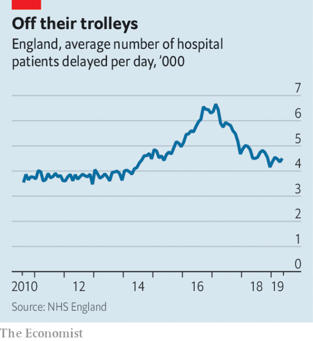

###### Beds unblocked

# How the NHS got better at freeing up beds 

 

> print-edition iconPrint edition | Britain | Aug 3rd 2019 

A HOSPITAL WARD is a great place to pick up an infection, become depressed or get out of shape. Unless you need urgent care, it is not a great place to spend time. Officials in charge of the National Health Service therefore keep a close eye on delayed transfers of care, or DTOCS, people sometimes known as bed-blockers, and officially counted as those who remain in hospital having been given the all clear to leave. To much concern, numbers took off in 2014, before peaking in 2017, when nearly 6,700 people a day remained in hospital against medical advice (see chart). 

 

The measure represents a crucial fault-line in the welfare state, where the competing incentives of the health and social care systems rub against one another, says Jon Glasby, a social-care expert at the University of Birmingham. Hospital managers need to get patients out of their institutions, but social workers are unwilling to take people without the right care in place. Leaving these people in hospital is not just a great waste of money but also a failure of welfare: nobody wants to be stuck in hospital unnecessarily. 

Helen Buckingham of the Nuffield Trust, a think-tank, says the turnaround is the result of “a burning platform and burning ambition”. With hospitals falling far behind accident-and-emergency targets, managers want to improve things at the other end of the pipeline—those leaving hospital—so doctors’ time is not wasted on people who should be in social care. A recent NHS mandate, by which the health secretary sets priorities for NHS England, instructed the health service to get on top of the issue. More attention is now being paid to the “super stranded”, who have been in hospital for longer than three weeks. 

The health service has been helped by a dose of extra funding for adult social care, which was hit hard by austerity. At the spring budget in 2017, Phillip Hammond, the then chancellor, announced £2bn ($2.6bn) more for such care, with strings attached over how it was spent, forcing collaboration between local authorities and health-care providers. Insiders admit results have been mixed, with some councils using the money to boost their bottom line, but say that it has supported innovation. 

These days, people are more likely to be discharged before their care needs are assessed, rather than assessed before they are sent home. That sounds like a ruthless way of clearing wards, but once somebody is home it is easier to work out whether they need help with, say, making breakfast. In Dorset patients are monitored at home through “virtual wards”, in which a team of social workers, doctors and nurses keep tabs on patients, with visits when necessary. In Somerset rehabilitative physiotherapy is sometimes done in a care home jointly run by a hospital and the council. Blame for delays used to be contested, but “we no longer wanted to distinguish between social care and health-care delays,” says Tim Baverstock, who works for the local council. 

The Care Quality Commission, a regulator, worries that the focus on DTOCS has moved attention from stopping people reaching crisis point in the first place. Because thresholds have been frozen, ever fewer people qualify for state help for their social care, leaving more struggling to sort things out for themselves. And despite the improvement, things are worse than they were five years ago. Yet the decline is still rare good news for a health service that, though loved, looks a little frayed. ■ 

