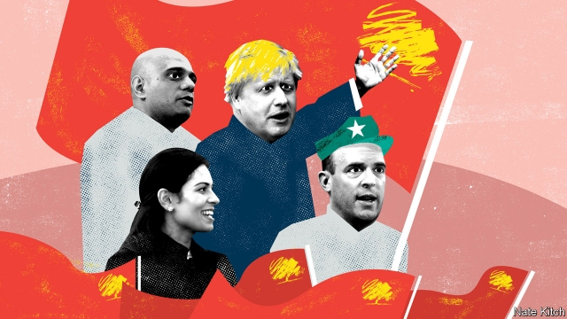

###### Bagehot

# Long live the Tory revolution! 

 

> print-edition iconPrint edition | Britain | Aug 3rd 2019 

THE CLOSEST thing the Tory party has had to an in-house philosopher is Edmund Burke, and the closest thing it has to an intellectual bête noire is Burke’s French contemporary, Jean-Jacques Rousseau. Burke, a liberal conservative, believed fervently that changing societies needed to be anchored by tradition and custom. Rousseau, the patron saint of revolutionaries from Robespierre to Pol Pot and prime enabler of “democratic dictatorship”, was the sworn enemy of the established order. 

Yet over the past few years the party of Burke has become the party of Rousseau. Boris Johnson’s bloody cabinet reshuffle completed the purge. Burkeans such as Philip Hammond and Rory Stewart were out; revolutionaries such as Dominic Raab and Priti Patel now hold all the great offices of state. Dominic Cummings, appointed as Mr Johnson’s senior adviser, told staff that the government was committed to delivering Brexit “by any means necessary”—a reference to a speech by Malcolm X on violence in the pursuit of justice. This is the British equivalent of the Chinese Communist Party embracing capitalism. 

Rousseau developed the idea of the “general will”: the opinion of the majority, which should prevail, irrespective of the interests of minorities. Burke believed that Parliament should interpret, modify and sometimes ignore the people’s views. The job of an MP was not to channel popular opinion, but to use his judgment. 

The Conservative Party is now the party of the general will. It not only made the fatal decision to call for a simple 50-50 referendum on Britain’s membership of the European Union, but has repeatedly used the result to silence MPs who have called for a soft interpretation that would take into account the opinions of the 48% who voted to remain. Now that the general will has been revealed, goes the line which Rousseauan Tories have successfully peddled, those who question it must be crushed like so many French aristocrats. 

Attitudes towards institutions are particularly telling. Burke saw them as the embodiment of collective wisdom and the bulwarks of civilisation, standing between decency and anarchy. Rousseau regarded them as fetters on the people’s freedoms. Today’s Tories are with Rousseau. Jacob Rees-Mogg has called the governor of the Bank of England, Mark Carney, “an enemy of Brexit”. James Slack, author of a notorious Daily Mail cover story describing the judges who had ruled that Parliament would need to consent to Brexit as “Enemies of the People”, is now in Downing Street. And the government has made it clear that it will “prorogue”—ie, suspend—Parliament rather than allow it to prevent Britain from leaving the EU without a deal. 

Rousseau, an early Eurosceptic who railed against the rise of a pan-European ruling class, denounced intellectuals who claimed to know better than ordinary people as having “reason without wisdom”. His ideal society was Sparta, with its austere military ethos and do-or-die defence of national sovereignty. Burke’s views were far more nuanced. While supporting the established order, he believed that it needed to be able to adapt: “A state without the means of some change is without the means of conservation.” Though he emphasised the importance of social roots, he recognised that urbanisation was progress. His guiding principle was “equipoise”—the need to balance reform with stability. 

The modern Tory party’s cultural attitudes have more in common with Rousseau’s anti-metropolitan rage than with Burke’s appeal to balance. Mr Johnson has attacked “the thousands of Davos men and women who have their jaws firmly clamped around the euro-teat”. Michael Gove has pooh-poohed experts. The most hard-core Brexiteers call themselves the Spartans. 

How to explain this extraordinary volte face? The obvious answer is the referendum of 2016: once you promise the people that their voice will be final it’s impossible to go back, even if it means self-destruction—a possibility to which Mr Johnson gestured in his “do or die” commitment to leave the EU by October 31st. But why did the Conservatives choose to hold a referendum in the first place? And why did they choose to ignore the opinions of the 48% in crafting Brexit? The referendum was a symptom as much as a cause of the internal revolution: the Rousseauan palsy had already entered the party’s central nervous system. 

Social change may have played a role. In 1950 the Conservative Party had almost 3m members and a demanding social round of dinner dances, fetes and charity functions: not so much a Burkean “little platoon” as a “big platoon”. With the decline of political parties as social institutions it has become a much more ideological outfit. Its 160,000 members are believers—above all, in Brexit. 

Thatcherism is partly to blame. Margaret Thatcher, who committed the ultimate sin in the Burkean canon of pronouncing that there is “no such thing as society”, injected a revolutionary strain of anti-establishment libertarianism into her party. Euroscepticism bears more responsibility: Tory defenders of British sovereignty are willing to burn down the village in order to save it. 

The Tory revolution, like all Rousseau-inspired movements, is beginning to consume its own children: Steve Baker, one of the leading Spartans, rejected Mr Johnson’s offer of a job in the Brexit department on the ground that it would leave him “powerless”. But resistance from outside the party of the revolution is also needed. 

Burke once wrote that “when bad men combine, the good must associate”, and there are some signs of that. Soft Brexiters are plotting to block a hard Brexit in Parliament. Mr Stewart has drawn up long-term plans for reviving the party in the country. But Mr Johnson has put together one of the most extreme cabinets in modern history, and time is short. The good men and women need to get together not only with fellow Tories but also with people of goodwill from all parties, if the ship of state is not to hit the rocks.■ 

