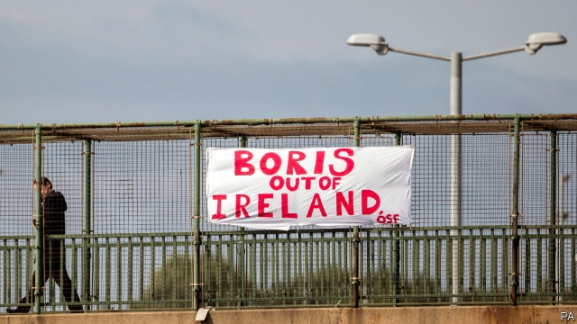

###### Brexit negotiations

# No-deal could lead to the resumption of direct rule in Northern Ireland 

 

> print-edition iconPrint edition | Britain | Aug 3rd 2019 

ONLY A FEW years ago London and Dublin were congratulating each other on forging a new golden age in Anglo-Irish relations. Brexit has put paid to that, as a phone call between Boris Johnson and Leo Varadkar, the Irish prime minister, on July 30th demonstrated. 

That there was no communication between Mr Johnson and Mr Varadkar for a week after the former assumed power was itself a symptom of the deterioration in relations. When they did talk, neither budged. Mr Varadkar insisted that the Irish backstop—the default provision which would allow goods to move freely over Britain’s only land border with the European Union after Brexit—must stay. The EU, he said, was united on the issue. Mr Johnson, in line with the views of the hard-Brexiters, insisted that it must go. 

Very likely Mr Johnson, captured as he has been by hard-Brexiters, would have taken that line anyway. But his position is complicated by his government’s reliance in Westminster on the votes of the Democratic Unionist Party, the hardline Northern Irish unionists who are allergic to anything that suggests the weakening of the United Kingdom and the strengthening of links between Northern Ireland and the Irish government. The DUP also insists that the backstop must go. 

As though the Brexit impasse were not bad enough in itself, it is undermining the historic 1998 Good Friday Agreement. The deal is already fragile. The Belfast Assembly, which is at its heart, has been closed for more than two years because of arguments over a botched green-energy scheme, with the result that Northern Ireland does not have a government. Mr Johnson visited Belfast on July 30th for talks aimed at getting things back on track, without success. 

But a British departure from the EU without a deal, which seems increasingly likely, will endanger the peace agreement further. In the absence of a Northern Irish government, the British government will probably reimpose direct rule on the province to avert or address any disruption that a no-deal Brexit may cause. “Without it”, said a report from the Institute for Government published this week, “Northern Ireland will be left even more exposed to the economic shocks of a no-deal Brexit than it is currently.” 

Direct rule would take Northern Ireland right back to where it was two decades ago, before the Good Friday Agreement. That would further exacerbate relations between the British and Irish governments, and would infuriate nationalists in Northern Ireland, where anti-London sentiment is running high. This is partly because nationalists tend to be pro-EU, and partly because they regard the Johnson government, like that of his predecessor Theresa May, not as an impartial arbiter but as an ally of the DUP. There are fears that violence could resume. 

Mr Johnson’s priorities seem clear enough. While his first contact with the Irish prime minister was confined to that 15-minute phone call, he spent much of an evening in Belfast dining with leaders of the DUP.■ 

Correction: In “Pastures old” in our issue of July 27th, we accidentally merged two regiments, referring to the “regimental goat of the Royal Welsh Guards”. It belongs to the Royal Welsh, not to the Welsh Guards. Our apologies to both regiments, and the goat. 

