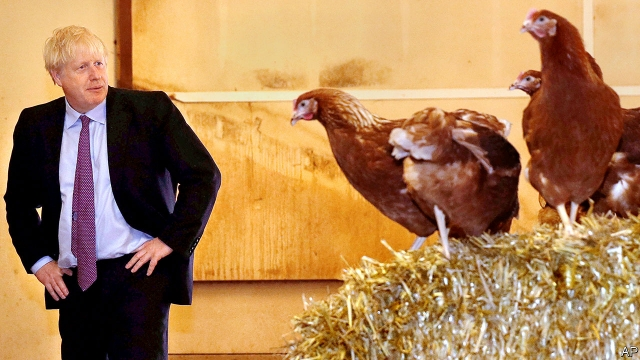
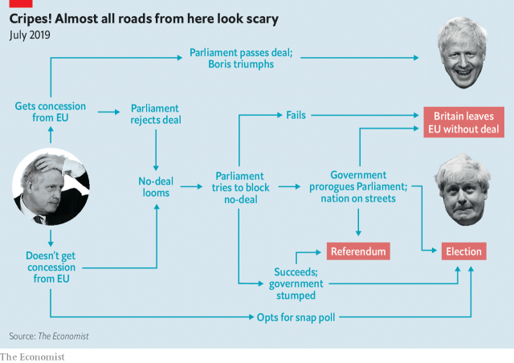

###### Fowl behaviour

# Preparing for no deal is a paradoxical process 

 

> print-edition iconPrint edition | Britain | Aug 1st 2019 

THE RULES of chicken are simple: two parties hurtle towards each other at speed and the first to move out of the way—the chicken—loses. After posing with feathered friends at a poultry farm in Wales, Boris Johnson, the new prime minister, made it clear that he would not be the first to swerve. 

Mr Johnson demands that the EU bin the Irish backstop (see article) agreed on as part of the deal reached with Theresa May, his predecessor. The EU has repeatedly ruled this out. If they can’t compromise, he squawked, “if they really can’t do it, then clearly we have to get ready for a no-deal exit.” The game may play itself out in many different ways (see chart) before October 31st, the date on which Mr Johnson is committed to leaving the EU. 

 

Crucial to winning the game is to appear determined not to chicken out. Brexiteers say that the EU never really believed Mrs May’s “no deal is better than a bad deal” line, which weakened Britain’s negotiating hand. Mr Johnson has gone all-out to show that he means it. 

Sajid Javid, the new chancellor, has pledged an extra £2bn ($2.5bn) for no-deal preparations, on top of the £4bn-odd that Philip Hammond, his predecessor, set aside. Some £100m will be spent on adverts warning the public and businesses to prepare for the worst. Michael Gove, who led the Vote Leave campaign with Mr Johnson in 2016, meets top officials daily to orchestrate “no-deal” preparations. Add the magic words “no deal” to any spending request and it will find its way to the chancellor’s desk almost immediately, says an aide. 

Yet when it comes to no-deal preparations, separating theatre from reality is tricky. Beneath the fresh bluster, in most departments preparations involve blowing the dust off old plans. Britain has been here before. In March and April, the last time a no-deal exit loomed, departments were running 24-hour response units. According to the Institute for Government (IFG), 16,000 civil servants were beavering away on Brexit plans. 

Some progress has been made since. Earlier this month the Bank of England noted that “UK-based firms have made further preparations to be able to serve EU clients” in the event that Britain leaves without a deal. It does not expect lending to firms and households to seize up. An upgraded customs system, needed to handle the large number of customs declarations that will have to be made once tariffs are in place, was not ready for March or April, but will now be partly in place by October. 

A lot more still needs to be done. By dint of its EU membership Britain has around 40 free-trade deals with non-EU countries. The government has said that it wants to reach bilateral agreements with these countries, so that the agreements roll over even if Britain leaves the EU without a deal. So far it has managed to roll over less than half. Britain has made even less progress on other international agreements to which it is party through its EU membership, including on nuclear research and competition. 

Yet there is only so much the government can do. Most of the issues thrown up by a no-deal Brexit are inherently bilateral, requiring the EU to play nice, points out Anand Menon of UK in a Changing Europe, a think-tank. Britain may throw open the port at Dover, for instance, but it would be for naught if officials in Calais enforce checks. The Confederation of British Industry says that the EU’s preparations lag behind Britain’s. And while the government will determine the route Britain takes out of the EU, it is businesses that will feel the effects, and that must take action to mitigate them. But “businesses do not want to,” says Sam Lowe, a researcher at the Centre for European Reform, another think-tank. “They want government to bear this cost.” 

Kicking business into action is harder than it looks. The first problem is Duke of York syndrome. Some firms put in place contingency measures the last time a no-deal exit loomed. Many felt that their money was wasted. “Marching them back up the hill again will be a challenge,” said Martin McTague, from the Federation of Small Businesses, a lobby group, especially when Mr Johnson himself said during his campaign to become prime minister that no-deal has a “million to one” chance of happening. “The million-to-one line will resonate more than a technical notice or a billboard from government saying ‘get ready’,” says Joe Owen of the IFG. 

Second, scaring business into action sits uneasily with Mr Johnson’s pathological optimism. A description of the threat of no-deal alarming enough to get business to prepare energetically would frighten the horses; too rosy an account of the future and people will not prepare. 

The markets, at least, are taking seriously the government’s apparent determination to leave with or without a deal. In Mr Johnson’s first week as prime minister the pound fell by 3% on a trade-weighted basis. It is nearing $1.20 against the dollar, its lowest level since the referendum. 

The government hopes that talk of a big fiscal boost will counterbalance the gloom. It is said to be planning an autumn budget that would get the economy “going gangbusters” by exit day. Mr Johnson has floated various giveaways, including raising the thresholds at which people start to pay the higher rate of income tax and more money for the NHS and police. At the poultry farm he promised to compensate farmers who lose out from any no-deal disruption. 

Yet Britain will not be able to spend its away out of no-deal chaos. In such an event, annual borrowing would anyway rise by some £30bn (1.4% of GDP) as the economy slowed, official estimates suggest. A government which promised lots of extra spending and tax cuts on top of that would test the confidence of investors. And a no-deal Brexit is likely to be primarily a shock to the supply side of the economy. Fiscal stimulus aimed at supporting demand would do nothing to help bottlenecks at Dover or firms that were no longer legally allowed to sell into the EU market. Not all types of chicken come cheap.■ 

