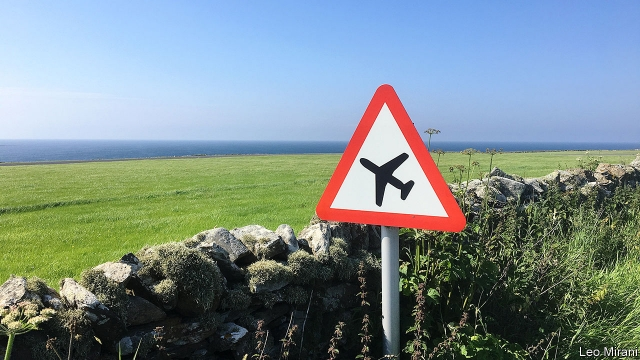
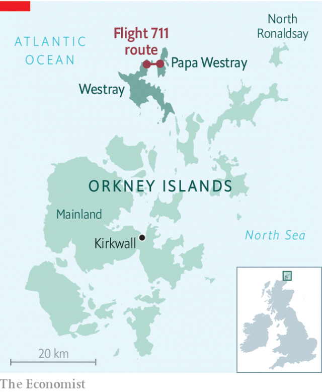

###### Orcadian rhythm

# The world’s shortest flight may soon be its greenest, too 

 

> print-edition iconPrint edition | Britain | Aug 3rd 2019 

IF YOU STARTED reading this article as Loganair Flight 711 lifted off from the compacted-gravel runway at Papa Westray (airport code PPW), a tiny island at the northern end of Orkney, it would have landed by the time you finished. Its first destination, the neighbouring island of Westray (WRY), is all of 2.7km away—a distance shorter than Heathrow airport’s runways. Lasting less than two minutes, the route holds the record for the shortest scheduled flight in the world. 

Some 75-odd weekly inter-island services connect Kirkwall, the main settlement and primary airport in Orkney, with six islands on the archipelago. Last year, around 21,000 passengers flew between the islands on Loganair’s three Britten-Norman Islander aircraft, which can carry up to eight passengers in a minivan-style arrangement. North Ronaldsay (population 72) and Papa Westray (population 90) received the most traffic. Neither island has a pier, and ferry crossings are infrequent or, depending on weather, non-existent. “So we try to compensate” with the air service, says James Stockan, the council leader. 

The Papa Westray-Westray trip is cheap for passengers—£17 one way, and £1 more to fly all the way back to Kirkwall—but costlier for taxpayers. The Orkney Islands Council throws in another £46 (€50), adding up to an annual subsidy bill of just under £1m. The subsidy—paid for largely by the Scottish government—is exempt from strict European Union rules on state aid because it is a “lifeline” route. This is no exaggeration: between October and April, all North Ronaldsay’s supplies, including food, come by air every Tuesday. 

 

The route is in contention for another record: the first commercial electric flight. In the world of commercial aviation, electric aircraft are likely to be taking off shortly. An Israeli model, expected to be operating by 2022, was unveiled at the Paris Air Show this year. Cranfield University, which specialises in aeronautics, is working on something simpler for the Islander—retrofitting it with electric power. 

Jonathan Hinkles, Loganair’s boss, says he is sceptical of attempts to put electric engines on big planes, but “with the Islander we are confident and comfortable that it does work, that this is a technically feasible solution.” Moreover, Orkney’s inter-island flights are short enough for range anxiety to not be a big concern. The longest trip, from Kirkwall to North Ronaldsay, is no more than 20 minutes. Indeed, electric planes could make small, short routes such as these more economically viable, and therefore more common. 

Orkney is already a leader in green energy. It generates more wind power than it consumes—it sells electricity to the national grid—has the highest rate of electric-vehicle ownership in Scotland and is experimenting with batteries to store excess energy. The council is working on a scheme to introduce hydrogen-powered ferries in 2021. If all goes according to plan, Loganair’s e-planes should take off the following year. ■ 

