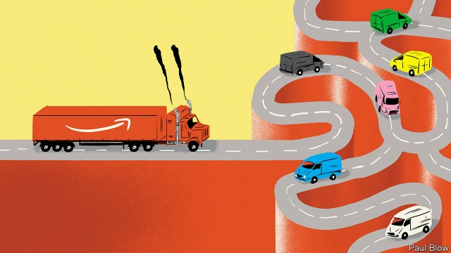
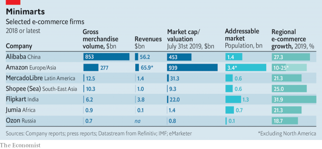

###### How to beat Bezos

# Baby Amazons take on their American role model 

 

> print-edition iconPrint edition | Business | Aug 3rd 2019 

DELIGHT OGUALU’S hair is straight, black and gloriously glossy. She made it herself. Mrs Ogualu and her husband run a business selling wigs, which are fashionable in Nigeria. At first buyers came to their small Lagos shop in person. Then they started selling their goods on Jumia, an e-commerce site, to customers across the country. Today about 60% of the Ogualus’ sales are made online. 

Around the emerging world, businesses like the Ogualus’ are finding a route to market through the internet. Global e-commerce has been growing for more than a decade. But companies like Jumia are having a moment. Investors are piling in again, spying opportunities to lock in newly connected consumers. 

Jumia floated on the New York Stock Exchange in April. MercadoLibre, Latin America’s dominant marketplace from Argentina, which listed in New York 12 years ago, has seen its share price more than double since the start of 2019; PayPal has just invested $750m in the company. Shares in Sea, an online conglomerate which listed in New York in 2017, have tripled in value this year. In March it raised $1.5bn to fund the growth of its e-commerce arm, Shopee. Last year Walmart paid $16bn for control of Flipkart, an Indian firm. Money is pouring into Russian e-commerce, where a “sprint” is on for control of the $18bn market, says Fedor Virin of Data Insight, a research firm. Last year Alibaba, China’s online titan, teamed up with Mail.ru, a Russian internet firm. Sberbank, a big Russian state-controlled lender, launched an e-commerce joint-venture with Yandex, another local company. Both are chasing Ozon, Russia’s biggest generalist online retailer. 

Such companies—call them baby Amazons—are following the path charted by America’s e-commerce colossus. They have a way to go. After stripping out Amazon’s mature north American business, some $277bn of goods changed hands on its platform last year, compared with perhaps $30bn for the biggest emerging-world firms (see table). At around $65bn, their combined value is dwarfed by Amazon’s $949bn (though its cloud-computing arm, AWS, may account for half of that). And their revenues, some $6bn all told, are a tenth of the American firm’s. 

 

But whereas Amazon’s international e-commerce sales grew by a comparatively measly 12% year on year in the second quarter, the upstarts’ sales are rising by high double digits or more, as the emerging world embraces the virtual one. MercadoLibre’s swelled by 94% in its most recent quarter. Shopee’s ballooned by 342%. Small wonder investors are giddy. 

Although all these firms no doubt want to be like the American paragon when they grow up, they are going about it differently than it did. Where Amazon’s growth piggybacked on the US Postal Service and credit-card networks, they had to build their own, or do without. This limited their early growth. With better infrastructure now in place, and potential customers flocking online, they eye a new era. “The opportunity in the next 20 years is much bigger than the last 20 years,” enthuses Sean Summers, MercadoLibre’s chief marketing officer. 

The companies share four characteristics. First, they were born adapted to tricky local markets. Walmart pulled out of Brazil in 2018, when it became clear that, partly as a function of Brazil’s long-standing protectionism, the giant American retailer could not easily access global supply chains it relies on to offer low prices in other places. Red tape related to tax, shipping and payments proved too much hassle for foreign behemoths to bother with, says Mr Summers. In their absence, the local companies can thrive. 

Before that could happen, though, they often had to build their own infrastructure in places where payment and delivery systems are rudimentary or non-existent. This is the second shared feature. Many of Jumia’s customers do not have an address, so delivery men phone ahead for directions. The company works with over 100 logistics providers and, in cities like Lagos, runs its own last-mile fleet of motorbikes and lorries. In Indonesia, a booming market of 265m people dispersed across 15,000 islands with few decent roads or, as in Nigeria, precise addresses, Shopee and its regional rivals, Tokopedia and Lazeda, enlist local shopkeepers who know the area to direct deliveries to the right recipients. 

Jumia, Souq (an Emirati firm bought by Amazon in 2017) and MercadoLibre have all built their own sophisticated payment networks. MercadoLibre’s has turned into a fully fledged money-management system, complete with payments to friends, investment options and small loans. 

The third similarity is that the emerging e-merchants tend not to hold and sell merchandise themselves. Some 40% of Amazon’s sales come from products it stocks rather than from third parties. In the case of MercadoLibre and Shopee that number is close to zero. The need to build and maintain payment and delivery systems leaves little energy—or resources—to run a shop. Regulators in developing countries have also been tougher on anticompetitive behaviour than their counterparts in America and Europe. India’s competition authority recently ordered Flipkart to stop selling wares in its marketplace, where it could undercut third-party sellers. 

The mini e-marts are different from Amazon in one last crucial way—they do not make much money at the moment. Many are burning through cash. Jumia lost €170m ($188m) last year and has lost a cumulative €862m since being founded in 2012. Shopee does not yet make a profit, though analysts expect that it will do so before 2023. Last year MercadoLibre made no money for the first time since it broke even in 2006. Mr Summers says the firm is now investing everything it can in growth. 

Investors will need patience—and deep pockets. Eghosa Omoigui of EchoVC Partners, a venture-capital fund in Lagos, is convinced that e-commerce will one day succeed in Africa. In the meantime, “you have to keep shoving coal into the engine.” In Russia, Mr Virin predicts, the race will also come down to fuel. “The winner will be the one who doesn’t run out of money.” 

For the time being, there appears to be no risk of that. Shopee’s parent raised $884m when it listed in New York two years ago. Besides reinvesting profits, MercadoLibre raised $2bn in March, partly by offering shares on the secondary market, and in part by selling a stake to Paypal. Tokopedia picked up $1.1bn from SoftBank, a Japanese tech holding company, in December. Jumia has about €380m in cash, enough for about two years at the rate the firm is currently burning through it. 

The companies are hoping that their markets will expand fast enough to generate profits before the capital taps run dry. There is room to grow. Fewer than 1% of retail sales in Jumia’s markets currently take place online. By 2025 that figure may reach 10% in Africa’s biggest economies, consultants at McKinsey reckon. The consumer class is growing fast, says Jeremy Hodara, one of Jumia’s co-founders. “They come to us and say, ‘Look, it’s the Africa Cup of Nations [football tournament] and my country’s qualified. I need my first TV.’” 

Shopee’s revenues are rising even as it spends less on marketing and promotions. Last year it had 50m active buyers, up from 21.7m the year before. In 2017 Google and Temasek, a Singaporean sovereign-wealth fund, predicted that the south-east Asian internet economy will be worth $200bn by 2025. Last year they revised their forecast up by a fifth, to $240bn. Marcel Motta of Euromonitor International expects e-commerce’s share of total retail in Brazil to double to 10% by 2023. In Russia annual online sales of physical goods could reach €50bn by then, from €22bn in 2019. 

The e-commerce hopefuls see a route to riches by closing the gap between online retail’s penetration in their markets and that enjoyed by Amazon in America, which remains three times larger. The sale of goods is not their only path to profits. Some will sell themselves to the giants, as Souq and Flipkart have done. Others will continue on their own. MercadoLibre wants to be something close to a fully fledged digital bank. All show that, having built their own infrastructure, they can sell access to it. In this respect, at least, they may give their American role model a run for its money. ■ 
<<<<<<< HEAD

-- 

 单词注释:

1.bezos[]:贝索斯（人名） 

2.amazon['æmәzɒn]:n. 亚马孙河 [医] 无乳腺者 

3.Aug[]:abbr. 八月（August） 

4.gloriously[]:adv. 辉煌地；光荣地；壮观地, 壮丽地 

5.glossy['glɒ:si]:a. 平滑的, 有光泽的 

6.Mr['mistә(r)]:先生 [计] 存储器回收程序, 多重请求 

7.wig[wig]:n. 假发, 斥责 vt. 给...戴假发, 激怒, 使发狂 vi. 激动, 发狂 

8.Nigeria[nai'dʒiriә]:n. 尼日利亚 

9.buyer['baiә]:n. 买主, 买方 [经] 买主, 买方, 买手 

10.Lagos['lɑ:gәs]:n. 拉各斯(尼日利亚的首都) 

11.Jumia[]:[网络] 杨君雅 

12.online[]:[计] 联机 

13.investor[in'vestә]:n. 投资者 [经] 投资者 

14.york[jɔ:k]:n. 约克郡；约克王朝 

15.MercadoLibre[]:[网络] 自由市场 

16.dominant['dɒminәnt]:a. 占优势的, 支配的 [医] 优性的, 显性的 

17.marketplace['mɑ:kit'pleis]:n. 市场 

18.Argentina[.ɑ:dʒәn'ti:nә]:n. 阿根廷 

19.paypal[]:n. 贝宝（全球最大的在线支付平台） 

20.conglomerate[kәn'glɒmәrit]:a. 聚成球形的, 砾岩性的 n. 集成物, 混合体, 砾岩 v. (使)凝聚成团 

21.triple['tripl]:n. 三倍数, 三个一组 a. 三倍的 vt. 使增至三倍 vi. 增至三倍 

22.walmart['wɔlma:t]: 沃尔玛（世界连锁零售企业） 

23.Flipkart[]:[网络] 印度 

24.sprint[sprint]:n. 短距离赛跑 vi. 全速跑, 冲刺 vt. 全速跑过 

25.fedor[]:n. (Fedor)人名；(俄)费奥多尔；(德、法、匈、捷、塞)费多尔 

26.datum['deitәm]:n. 论据, 材料, 资料, 已知数 [医] 材料, 资料, 论据 

27.alibaba[]:n. 阿里巴巴（公司名） 

28.Titan['taitn]:n. 提坦, 太阳神, 巨人 

29.sberbank[]:[网络] 俄罗斯联邦储蓄银行；俄罗斯储蓄银行；西伯利亚银行 

30.lender['lendә]:n. 出借人, 贷方 [经] 出借者, 贷方, 贷款人 

31.Yandex[]:[网络] 俄罗斯综合搜索；搜索引擎；搜索引擎公司 

32.ozon['əʊzəʊn]: [医]抽样 

33.generalist['dʒenәrәlist]:n. 多面手, 通才 

34.retailer['ri:teilә]:n. 零售商人, 传播的人 [经] 零售商 

35.colossus[kә'lɒsәs]:n. 巨像, 巨人 

36.dwarf[dwɒ:f]:n. 矮子, 侏儒 v. (使)变矮小 

37.aw[ɔ:]:int. 哦！噢！（表示抗议, 厌恶, 讨厌等） 

38.measly['mi:zli]:a. 患麻疹的 [医] 米珠的, 含囊尾蚴的 

39.digit['didʒit]:n. 数字, 位数, 指头 [计] 数位; 位 

40.giddy['gidi]:a. 眼花的, 头晕的 v. (使)眼花, (使)眩晕 

41.paragon['pærәgәn]:n. 杰出典范, 完人, 完美之物 

42.differently['difrentli]:adv. 差异, 不同, 各别, 各种 

43.piggyback['pi^ibæk]:a. 背着的, 在背肩上的 adv. 背着, 在背肩上 

44.postal['pәustl]:a. 邮政的, 邮局的 [经] 邮政的 

45.infrastructure['infrәstrʌktʃә]:n. 基础结构, 基础设施 [经] 基础设施 

46.enthuse[in'θju:z]:vt. 使充满热情, 使感兴趣, 使热心 vi. 热心 

47.sean[ʃɔ:n]:n. 肖恩（男子名） 

48.marketing['mɑ:kitiŋ]:n. 行销, 买卖 [经] 推销, 在市场买卖, 销售 

49.tricky['triki]:a. 狡猾的, 机敏的 

50.Brazil[brә'zil]:n. 巴西 

51.protectionism[prә'tekʃәnizm]:n. 贸易保护主义, 贸易保护制 [经] 保护(贸易)主义, 保护(贸易)制 

52.hassle['hæsl]:n. 激烈而持久的争论 vi. 争论 vt. 与...争辩, 使烦恼 

53.behemoth[bi'hi:mɔθ]:n. 庞然大物 

54.bother['bɒðә]:vt. 烦扰, 迷惑 vi. 烦恼, 操心 n. 麻烦, 纠纷, 讨厌的人 

55.rudimentary[ru:di'mentәri]:a. 基本的, 起码的, 初步的, 发展不完全的, 残留的, 退化的 [医] 原基的, 未成熟的; 残遗的, 已退化的 

56.logistic[lәu'dʒistik]:a. 逻辑的, 后勤学的 

57.provider[prә'vaidә]:n. 供应者, 供养人, 伙食承办人 [计] 提供器 

58.Indonesia[.indәu'ni:ʒә]:n. 印尼 

59.disperse[dis'pә:s]:vt. 分散, 传播, 散开 vi. 分散 a. 分散的 [计] 分散 

60.regional['ri:dʒәnәl]:a. 地方的, 地域性的 [医] 区的, 部位的 

61.enlist[in'list]:vt. 征募, 参与, 谋取 vi. 从军, 应募, 赞助 

62.recipient[ri'sipiәnt]:a. 领受的, 容易接受的, 感受性强的 n. 领受者, 容纳者, 容器 

63.souq[]:[网络] 集市；市集；苏克 

64.Emirati[]:n. (Emirati)人名；(意)埃米拉蒂 

65.amazon['æmәzɒn]:n. 亚马孙河 [医] 无乳腺者 

66.sophisticate[sә'fistikeit]:n. 久经世故的人, 精于...之道的人 vt. 篡改, 曲解, 使变得世故, 掺合, 弄复杂 vi. 诡辩 

67.fully['fuli]:adv. 十分地, 完全地, 充分地 

68.fledge[fledʒ]:vt. 喂养, 用羽毛盖上, 装上羽毛 vi. 长羽毛 

69.similarity[.simi'læriti]:n. 类似, 类似处 [法] 类似, 相似, 类似事例 

70.merchandise['mә:tʃәndaiz]:n. 商品, 货物 v. 交易, 买卖 

71.regulator['regjuleitә]:n. 调整者, 校准者, 校准器, 调整器, 标准钟 [化] 调节剂; 调节器 

72.anticompetitive[,æntikəm'petətiv]:a. 反竞争的 

73.counterpart['kauntәpɑ:t]:n. 副本, 复本, 配对物, 相应物 [经] 副本, 正副二份中之一 

74.ware[wєә]:n. 物品, 器具, 货物, 商品, 陶器 vt. 留心, 小心 a. 知道的, 意识到的, 留神的 

75.undercut['ʌndәkʌt]:n. 底切, 牛腰部下侧嫩肉, 下口, 下旋削球 vt. 廉价出售, 底切, 雕出, 下旋削球 vi. 切除底部 

76.mini['mini]:n. 同类中的极小者, 微型汽车, 超短裙 a. 微型的 

77.cumulative['kju:mjulәtiv]:a. 累积的 [医] 蓄积的, 累积的 

78.analyst['ænәlist]:n. 分析者, 精神分析学家 [化] 分析员; 化验员 

79.shove[ʃʌv]:n. 推, 挤 vt. 推挤, 猛推, 强使 vi. 推 

80.reinvest[.ri:in'vest]:vt. 再投资于, 再授给 [经] 再投资 

81.paypal[]:n. 贝宝（全球最大的在线支付平台） 

82.softbank['sɒftbæŋk]: 日本最大的软件销售商 

83.tech[tek]:n. 技术学院或学校 

84.currently['kʌrәntli]:adv. 现在, 当前, 一般, 普通 [计] 当前 

85.McKinsey[]:n. 麦肯锡（公司） 

86.reckon['rekәn]:vt. 计算, 总计, 估计, 认为, 猜想 vi. 数, 计算, 估计, 依赖, 料想 

87.jeremy['dʒerimi]:n. 杰里米（男子名） 

88.Hodara[]:奥达拉 

89.les[lei]:abbr. 发射脱离系统（Launch Escape System） 

90.promotion[prәu'mәuʃәn]:n. 晋级, 创建, 增进 [经] 推广, 推销, 促进 

91.google[]:谷歌；搜索引擎技术；谷歌公司 

92.temasek[]:n. 淡马锡控股 (Temasek Holdings)，新加坡投资机构 

93.singaporean[,siŋ^ә'pɔ:riәn]:n. 新加坡人 

94.marcel[mɑ:'sel]:n. 波浪形鬈发 vt. 把...烫成波浪形 vi. 烫发 

95.motta[]:n. (Motta)人名；(法、意、西、葡、英)莫塔 

96.Euromonitor['juərəu'mɔnitə]:n. (英国)欧洲商情市场调研公司 

97.riche[]:n. 暴发户 

98.penetration[.peni'treiʃәn]:n. 穿透, 渗透, 侵入, 识穿, 洞察(力) [化] 渗入 
=======
>>>>>>> 50f1fbac684ef65c788c2c3b1cb359dd2a904378

