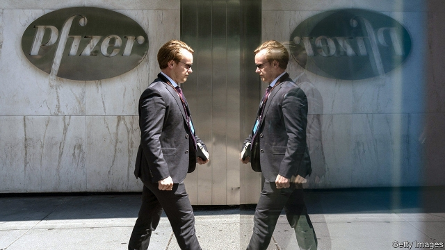

###### Generic script

# Pfizer and Mylan want to create a generic-drug giant 

 

> print-edition iconPrint edition | Business | Aug 3rd 2019 

GREATER THAN the sum of its parts. That, in a nutshell, is how Albert Bourla, the newish chief executive of Pfizer, described the merger of the giant drugmaker’s stodgy but profitable off-patent division, Upjohn, and Mylan, a big but struggling generic-drug firm. The all-stock transaction, announced on July 29th, would create the world’s largest generics firm by revenue, with an enterprise value of $50bn. 

All bosses promise that spin-offs they mastermind create value for shareholders. And there are reasons to take Mr Bourla seriously, says David Risinger of Morgan Stanley, an investment bank. If the management is to be believed, the as-yet-unnamed company will have revenues of $19bn-20bn and gross operating margins of 40%. It has pledged to pay a dividend equal to roughly a quarter of free cashflow. The incoming boss, Michael Goettler, who runs Upjohn, plans to chip away at the combined company’s $25bn in debt, by cutting $1bn in annual costs by 2023. 

It should be able to expand quickly outside America’s fiercely competitive generics market, where consolidation among wholesalers has allowed buyers to demand lower prices and faster regulatory approval of generic drugs has flooded the market with low-cost medicines. The shares of big generics firms exposed to America have performed miserably in recent years. The market share of the ten biggest declined from 53% to 44% between 2014 and 2018. 

On the surface, the transaction also makes sense for Pfizer. The drugmaker has been shedding assets to refocus on high-growth areas. In December it spun off its consumer-health division, which was combined with that of GSK, a British rival. It previously got rid of its animal-health business. By sticking to lucrative areas like cancer treatments, Mr Bourla hopes to persuade investors that Pfizer shares deserve a higher price. 

So far Wall Street seems unconvinced. Tim van Biesen of Bain, a consultancy, points out that it is unclear if Pfizer can come up with enough blockbusters to sustainably offset earnings from the divestment of peripheral but profitable businesses like Upjohn. Standard & Poor’s, a credit-rating agency, downgraded Pfizer’s debt on the news. Pfizer’s share price fell by 6.4% on June 30th, the biggest one-day slide in a decade. Mylan’s long-suffering stock edged up only slightly. 

The merged company, for its part, inherits lawsuits about Mylan’s alleged price fixing and its role in America’s opioid crisis. Mylan denies all wrongdoing. Mylan’s shareholders are still fuming over the firm’s move in 2015 to the Netherlands, where it adopted an opaque corporate structure, and practices like offering to pay Robert Coury, its chairman, about $1m a year for not using a company plane. 

Observers worry that Mr Goettler may be in over his head. They fear the firm will in fact be controlled by the controversial Mr Coury, who is to be its executive chairman, and Rajiv Malik, his long-serving lieutenant, who is embroiled in the price-fixing complaints. Pressed by analysts this week on corporate governance, Mr Coury was evasive. He vowed to return capital to shareholders “from day one”. “I don’t make shit up. You know that,” he promised. Investors may need more reassurance.■ 
<<<<<<< HEAD

-- 

 单词注释:

1.generic[dʒi'nerik]:a. 属类的, 一般的 [计] 一般的 

2.script[skript]:n. 手迹, 手稿, 正本, 手写体 vt. 改编为演出本 [计] 手写体, 小型程序 

3.pfizer[]:n. 辉瑞（美国制药公司） 

4.mylan[]:[网络] 迈兰；迈兰制药公司；麦兰 

5.Aug[]:abbr. 八月（August） 

6.nutshell['nʌtʃel]:n. 坚果壳, 极小的东西 

7.albert['ælbәt]:n. 艾伯特（男子名） 

8.bourla[]:布拉 

9.newish['nju:iʃ]:a. 尚新的 

10.merger['mә:dʒә]:n. 合并, 归并 [经] 购并 

11.stodgy['stɒdʒi]:a. 易吃饱的, 塞满的, 平凡的, 庸俗的, 步履艰难的 

12.Upjohn[]:厄普约翰 

13.transaction[træn'sækʃәn]:n. 交易, 办理, 学报, 和解协议 [计] 事务处理 

14.generic[dʒi'nerik]:a. 属类的, 一般的 [计] 一般的 

15.mastermind['mɑ:stәmaind]:n. 优秀策划者, 才子 vt. 指导, 主持, 策划 

16.shareholder['ʃєә.hәuldә]:n. 股东 [法] 股东, 股票持有人 

17.david['deivid]:n. 大卫；戴维（男子名） 

18.risinger[]: [人名] 赖辛格 

19.Morgan['mɒ:gәn]:n. 摩根马 

20.stanley['stænli]:n. 斯坦利（男子名） 

21.pledge[pledʒ]:n. 诺言, 保证, 誓言, 抵押, 信物, 保人, 祝愿 vt. 许诺, 保证, 使发誓, 抵押, 典当, 举杯祝...健康 

22.dividend['dividend]:n. 被除数, 股利 [计] 被除数 

23.cashflow['kæʃfləʊ]:vi. 现金流转 

24.incoming['inkʌmiŋ]:a. 进来的, 刚开始的, 新来的 n. 进来 

25.michael['maikl]:n. 迈克尔（男子名） 

26.chip[tʃip]:n. 屑片, 薄片, 碎片 vt. 削, 切, 削成碎片, 使摔倒, 凿 vi. 削下屑片 [计] 孔屑; 组件; 晶片; 芯片 

27.quickly['kwikli]:adv. 很快地 

28.fiercely['fiәsli]:adv. 猛烈地, 厉害地 

29.consolidation[kәn.sɒli'deiʃәn]:n. 巩固, 团结, 合并, 加强 [医] 实变 

30.wholesaler['hәulseilә]:n. 批发商 [经] 批发商 

31.buyer['baiә]:n. 买主, 买方 [经] 买主, 买方, 买手 

32.regulatory['regjulәtәri]:a. 受控制的, 统制的, 调整的 [经] 规则的 

33.miserably['mizәrәbli]:adv. 非常不幸地, 可悲地, 贫困地 

34.drugmaker['drʌ^,meikә(r)]:制药者 

35.asset['æset]:n. 资产, 有益的东西 

36.refocus[ri:'fәukәs]:vt. 重调…的焦距 

37.GSK[]:abbr. 葛兰素史克（Glaxosmithkline 英国制药公司） 

38.lucrative['lu:krәtiv]:a. 有利益的, 获利的, 合算的 

39.investor[in'vestә]:n. 投资者 [经] 投资者 

40.unconvinced[]:[法] 不相信, 怀疑的 

41.tim[tim]:n. 蒂姆（男子名） 

42.bain[]:n. 贝恩（公司名称） 

43.consultancy[]:n. 商量, 协商, 磋商, 会诊, 与...商量, 咨询, 请教, 找(医生)看病, 查阅, 考虑 [经] 咨询业务, 咨询服务 

44.unclear[.ʌn'kliә]:a. 不易了解的, 不清楚的, 含混的 

45.blockbuster['blɒkbʌstә]:n. 巨型炸弹 

46.sustainably[]:adv. 支撑得住；能保持住地 

47.offset['ɒ:fset]:n. 抵消, 把...并列, 旁系, 支管, 用胶印法印 vt. 弥补, 抵消, 胶印 vi. 装支管 n. 偏移量 [计] 偏移量 

48.earning['ә:niŋ]:n. 收入（earn的现在分词） 

49.divestment[dai'vestmәnt,di-]:n. (=divesfiture) 剥夺, 夺取 

50.peripheral[pә'rifәrәl]:a. 周边的, 周围的, 圆周的, 无关紧要的, 肤浅的 [医] 外周的, 周围的, 末梢的 

51.downgrade['dajn^reid]:vt. 降低, 贬低 n. 下坡 a. 下坡 adv. 下坡 

52.merge[mә:dʒ]:vt. 使合并, 使消失, 吞没 vi. 合并, 渐渐消失 [计] 合并 

53.lawsuit['lɒ:sju:t]:n. 诉讼 [法] 诉讼, 诉讼案件 

54.allege[ә'ledʒ]:vt. 宣称, 主张, 提出, 断言 [法] 断言, 指称, 指证 

55.opioid[əʊ'pi:əʊɪd]:a. 类鸦片（引起）的 n. 类鸦片活性肽 

56.wrongdoing['rɒŋ'du:iŋ]:n. 干坏事, 坏事 

57.fume[fju:m]:n. 臭气, 烟, 激怒 vt. 熏 vi. 冒烟 

58.Netherlands['neðәlәndz]:n. 荷兰 

59.opaque[әu'peik]:n. 不透明物 a. 不透明的, 不传热的, 不传导的, 阴暗的 [计] 白底 

60.corporate['kɒ:pәrit]:a. 社团的, 合伙的, 公司的 [经] 团体的, 法人的, 社团的 

61.Robert['rɔbәt]:[法] 警察 

62.coury[]: [人名] 考里 

63.Rajiv[]:n. (Rajiv)人名；(印)拉吉夫 

64.Malik['mɑ:lik]:n. (巴基斯坦的)酋长 

65.embroil[im'brɒil]:vt. 使卷入, 牵连 

66.analyst['ænәlist]:n. 分析者, 精神分析学家 [化] 分析员; 化验员 

67.governance['gʌvәnәns]:n. 统治, 统辖, 管理 [法] 统治, 管理, 支配 

68.evasive[i'veisiv]:a. 逃避的, 回避的, 托辞的 [法] 逃避的, 规避的, 推托的 

69.vow[vau]:n. 誓约, 誓言, 许愿 vi. 起誓, 发誓, 郑重宣言 vt. 立誓, 起誓要, 郑重地宣布 

70.shit[ʃit]:vi. 拉屎 vt. 欺骗, 在...拉屎 n. 粪, 屎 interj. 狗屁 
=======
>>>>>>> 50f1fbac684ef65c788c2c3b1cb359dd2a904378

