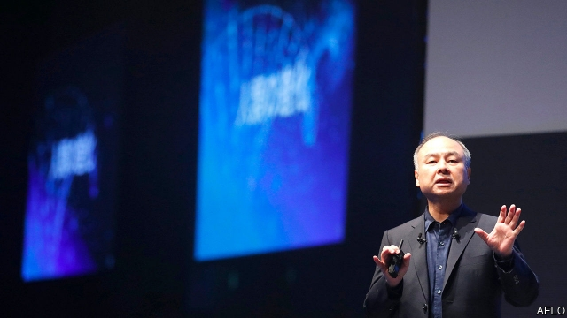

###### Double vision

# SoftBank’s transformation into an investment powerhouse continues 

 

> print-edition iconPrint edition | Business | Aug 1st 2019 

MASAYOSHI SON, the founder of SoftBank, a Japanese telecoms firm turned tech investor, will not have had many more momentous days than July 26th. First came the announcement of plans for a second Vision Fund, whose expected capital contributions of $108bn will make it the largest private technology fund ever, surpassing even the almost $100bn ploughed into its predecessor. Later came news that America’s Department of Justice will not block the merger of T-Mobile and Sprint, the country’s third- and fourth-largest mobile operators. SoftBank owns 84% of Sprint; it would still own 27% of the combined entity, but the deal nonetheless promises to spruce up its balance-sheet. 

Start with news of the second fund. The first one has already upended the assumptions of early-stage investing. Its scale is unprecedented: the next-largest venture-capital vehicles marshal pots in the mere single-digit billions. Its speed has been striking; the Vision Fund has splurged $70bn in under three years on stakes in Uber, WeWork, Arm and others. Investors have done well enough thus far: Mr Son claimed returns of 29% as of March 2019. 

That record now seems set to unlock another gargantuan pile of capital. Giants of the technology industry such as Microsoft, Apple and Foxconn will chip in, joining a string of Japanese financial institutions and Kazakhstan’s sovereign-wealth fund. One notable absentee is the sovereign-wealth fund of Saudi Arabia, whose $45bn stake made it the largest investor in the first fund but became a huge source of controversy following the murder of Jamal Khashoggi, a dissident Saudi journalist. 

SoftBank itself will be the biggest contributor: it promises to put in $38bn. That is where the Sprint deal comes in. The merger is unwelcome news for American consumers, notwithstanding requirements for the two firms to divest assets and share spectrum with Dish, a satellite-TV provider. It still faces antitrust challenges from state attorneys-general. But if the deal goes through, it would reduce the amount of debt on SoftBank’s consolidated balance-sheet by around $40bn, potentially lower the discount that the stockmarket currently applies to the firm and sharpen its focus on tech investment. 

Sceptics of the megafund model still have plenty of arguments. It is too early to judge the success of the first fund, which runs until 2029. Those who think that SoftBank has been inflating tech valuations will be closely watching WeWork, which many see as a property company masquerading as a tech firm. Its initial public offering is expected in September. The governance worries that surround the first fund are unlikely to be quelled by SoftBank’s still-larger stake in the second. Even if one $100bn fund can be put to work, how many other tech startups are there able to absorb such huge investments? But simply by raising a second gargantuan pot of money, Mr Son has given the doubters a big black eye and himself a day to remember.■ 

-- 

 单词注释:

1.powerhouse['pauәhaus]:n. 发电所, 动力室, 精力旺盛的人, 办事效率高的机构 

2.Aug[]:abbr. 八月（August） 

3.masayoshi[]:[网络] 正义；正义大师；正义作 

4.founder['faundә]:n. 创立者, 建立者 vt. 使沉没, 使摔倒, 弄跛, 浸水, 破坏 vi. 沉没, 摔到, 变跛, 倒塌, 失败 

5.softbank['sɒftbæŋk]: 日本最大的软件销售商 

6.telecom['telәkɔm]:telecommunication 电信 

7.tech[tek]:n. 技术学院或学校 

8.investor[in'vestә]:n. 投资者 [经] 投资者 

9.momentous[mәu'mentәs]:a. 重大的, 重要的 

10.surpass[sә'pɑ:s]:vt. 超越, 凌驾, 胜过 

11.predecessor[.predi'sesә]:n. 前任, 先辈, 前身 [医] 初牙, 前辈, 祖先 

12.merger['mә:dʒә]:n. 合并, 归并 [经] 购并 

13.sprint[sprint]:n. 短距离赛跑 vi. 全速跑, 冲刺 vt. 全速跑过 

14.entity['entiti]:n. 实体, 实存物, 存在 [计] 实体 

15.nonetheless[,nʌnðә'les]:conj. 然而, 尽管, 不过 adv. 不过, 仍然, 尽管如此, 然而 

16.spruce[spru:s]:n. 云杉 a. 颇为干净的, 俏的, 整洁的 v. (使)显干净, 打扮整齐 

17.upend[ʌp'end]:v. 颠倒, 倒放 

18.marshal['mɑ:ʃәl]:n. 元帅, 陆空军高级将官, 典礼官, 执法官 vt. 整理, 引领, 统率 vi. 排列, 各就各位 

19.splurge[splә:dʒ]:n. 炫耀, 夸示 vi. 炫耀, 卖弄, 挥霍 vt. 挥霍 

20.uber['ju:bә]:[医] 乳房 

21.unlock[.ʌn'lɒk]:vt. 开...的锁, 开启, 表露, 放出 vi. 被开启, 揭开, 解放 [计] 解出锁定 

22.gargantuan[gɑ:'gæntʃuәn]:a. 巨大的, 庞大的 

23.Microsoft[]:n. (美国)微软公司 [电] 微软公司 

24.foxconn[]:n. 富士康（公司名） 

25.chip[tʃip]:n. 屑片, 薄片, 碎片 vt. 削, 切, 削成碎片, 使摔倒, 凿 vi. 削下屑片 [计] 孔屑; 组件; 晶片; 芯片 

26.notable['nәutәbl]:n. 著名人士, 值得注意之事物 a. 值得注意的, 显著的 

27.absentee[.æbsәn'ti:]:n. 缺席者, 不在者 [经] 缺勤者, 缺席者, 未到工者 

28.saudi['sajdi]:a. 沙乌地阿拉伯（人或语）的 

29.Arabia[ә'reibiә]:n. 阿拉伯半岛 

30.controversy['kɒntrәvә:si]:n. 论争, 辩论, 论战, 争论 [法] 论战, 争论, 争吵 

31.Jamal[]:n. 贾马尔（男子名） 

32.khashoggi[]:卡舒吉 

33.dissident['disidәnt]:a. 意见不同的, 持不同政见的 n. 意见不同的人, 持不同政见者 

34.unwelcome[ʌn'welkәm]:a. 不受欢迎的, 讨厌的 n. 冷淡 vt. 冷淡地对待, 冷淡地接受 

35.notwithstanding[.nɒtwiθ'stændiŋ]:adv. 虽然, 尽管 prep. 尽管 conj. 虽然 

36.divest[dai'vest]:vt. 使摆脱, 使脱去, 夺去 [经] 取消权力 

37.asset['æset]:n. 资产, 有益的东西 

38.spectrum['spektrәm]:n. 光谱, 范围, 系列 [化] 光谱 

39.provider[prә'vaidә]:n. 供应者, 供养人, 伙食承办人 [计] 提供器 

40.antitrust[.ænti'trʌst]:a. 反托拉斯的 [法] 反托拉斯的 

41.consolidate[kәn'sɒlideit]:vt. 巩固, 使联合, 统一 vi. 巩固 [计] 合并计算 

42.potentially[pә'tenʃәli]:adv. 可能地, 潜在地 

43.stockmarket[s'tɒkmɑ:kɪt]: 证券市场; 证券交易所; 证券行情 

44.currently['kʌrәntli]:adv. 现在, 当前, 一般, 普通 [计] 当前 

45.sceptic['skeptik]:n. 怀疑论者 

46.megafund[]:[网络] 基金；资金；巨型基金 

47.inflate[in'fleit]:vt. 使膨胀, 使得意, 使通货膨胀, 使充气 vi. 充气, 膨胀 

48.valuation[.vælju'eiʃәn]:n. 评价, 估价, 价值判断 [经] 估价, 计价, 评价 

49.masquerade[.mɑ:skә'reid]:n. 化装舞会, 伪装 vi. 参加化装舞会, 伪装, 假装 

50.governance['gʌvәnәns]:n. 统治, 统辖, 管理 [法] 统治, 管理, 支配 

51.quell[kwel]:vt. 压制, 平息, 减轻 

52.startup[]:[计] 启动 

53.doubter['dautә]:n. 抱怀疑态度的人；不信宗教的人；怀疑论者 

