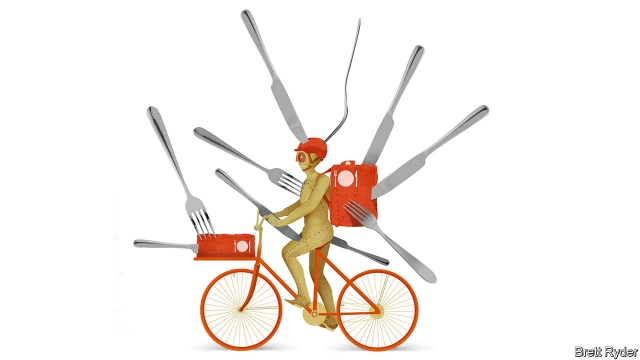

###### Schumpeter

# The foodoo economics of meal delivery 

 

> print-edition iconPrint edition | Business | Aug 3rd 2019 

EVEN THOSE who recoil at eating supper out of a soggy box, fear being mowed down by curry-bearing cyclists or think the death of home cooking is a cultural abomination should admire Jitse Groen. The 41-year-old Dutchman, who cooked up the online food-delivery business by founding Takeaway.com in his university bedroom in 2000, is not your usual tech billionaire. He keeps a low profile, views venture capital with distaste, earns a relatively unflashy six-figure salary and sometimes hops on the firm’s delivery bikes to help out. His main extravagance is a sharp Italian suit. So why did he, on July 29th, propose shelling out £8.2bn ($10.1bn) on shares for Just Eat, a large but struggling meals-on-wheels firm based in Britain? 

The answer says a lot about the voodoo economics of the food-delivery industry. It is a hotly competitive business, attracting the world’s biggest moneybags such as Amazon, Alibaba and SoftBank. Balancing the needs of diners, cooks and couriers is fiendishly complicated. Most startups lose platefuls of money. Yet they have received more than $30bn from spellbound venture capitalists in the past five years. And they are likely to get more. 

Mr Groen is a reluctant apostle of black magic. He once said of his efforts to expand beyond the Netherlands, “It’s horrible. We’ve spent 100 times more money in Germany than I thought I’d ever be able to spend.” Takeaway’s deal with Just Eat highlights the conviction that consolidation is the only way to make the sums add up. 

The food-delivery business can be split into two camps: mostly profitable veterans and loss-making newcomers. The veterans, founded at the start of the century, are led by publicly traded Grubhub in America, and Just Eat and Takeaway in Europe. The trio are collectively worth $18bn or so. They account for the largest share of the market, offering customers online access to restaurants that already have their own delivery services, such as pizza joints, sushi bars and Chinese restaurants. Their relatively simple business model, in which they take a cut of the bill from the restaurants, has enabled Grubhub and Just Eat to turn a profit for years. Takeaway makes money in its home market of the Netherlands. 

The newbies, born more recently, have turned a once-tidy business into a food fight. They include listed firms such as Meituan of China and Delivery Hero of Germany, Uber Eats (part of Uber), Ele.me (owned by China’s Alibaba), and privately held DoorDash, based in San Francisco, and Deliveroo, from London. For most of them, delivery is their core business, so they share their cut of the bill with riders as well as restaurants. This substantially broadens the market to restaurants offering everything from steak to Hawaiian poké bowls. But margins suffer. Funded largely by venture capital, they have thrown subsidies at customers, forcing their veteran rivals onto the defensive. To catch up, the veterans are investing in advertising and delivery networks—at a big cost. This week Grubhub and Just Eat reported slumping earnings, and Takeaway mounting losses, as they spent heavily to fend off the upstarts. 

The only mouthwatering aspect of the delivery business is its potential size. According to Bernstein, a brokerage, almost a third of the global restaurant industry is made up of home delivery, takeaway and drive-throughs, which could be worth $1trn by 2023. In 2018 delivery amounted to $161bn, leaving plenty of room for online firms to expand; the seven largest increased revenues by an average of 58%. Their businesses support the trend of 20- and 30-somethings to live alone or in shared accommodation, with less time and inclination to cook. In China, by far the biggest market for food delivery, one-third of people told a survey that they would be prepared to rent a flat without a kitchen because of the convenience of delivery. Delivery also fits neatly with the gig-economy zeitgeist, alongside ride-hailing firms such as Uber, Lyft and China’s Didi. 

Yet as with ride-hailing, it is by no means clear if anyone can make money by delivering meals. In fact, the economics may be even worse. Co-ordination is more complicated. Meal-delivery firms must handle dishes that take different amounts of time to cook, while restaurants cope with orders from in-house customers. Most important, bookings must be split three ways: between delivery firms, restaurants and riders, rather than just between the ride-hailing firms and their drivers. The restaurants in particular are restive, not least because food is already a low-margin business. The most popular brands like McDonald’s and Starbucks wield the power to squeeze the delivery startups in exchange for access to millions of customers. Uber admits that Uber Eats may be forced to lower service fees for big restaurant chains. 

Moreover, potential growth may be overstated. Subsidies make true demand hard to gauge. When delivery charges and service fees eventually rise, which they will have to if profits are to materialise, some customers may flee. In the meantime, cheap money lets firms undercut rivals but distorts incentives. The war of attrition could get even worse if giants like Amazon muscle in, as it has tried to do by buying a stake in Deliveroo (the deal is stalled at present because of antitrust concerns). Alibaba, Amazon’s Chinese counterpart, uses Ele.me as a loss leader helping drive traffic to its profitable e-commerce sites. 

Delivery businesses have ways to cut their losses. One is to diversify further, by delivering groceries, flowers, booze, and even people (as Uber does), as well as meals. Another is to provide cheaper meals by centrally supplying ingredients to restaurants, or building “ghost kitchens” that prepare food only for delivery. In “winner takes most” markets, the best way to drive up volumes and share of the proceeds is through consolidation across countries and cities. Mr Groen’s attempt to gobble up Just Eat marks the biggest foray so far. In the unappetising dog-eat-dog world of food delivery, it will still be a hard deal to digest. ■ 

