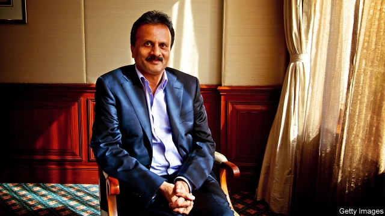

###### Death of an entrepreneur

# V.G. Siddhartha, boss of Coffee Day, is found dead 

 

> print-edition iconPrint edition | Business | Aug 3rd 2019 

“I HAVE FAILED” and “I gave up” were the six most wrenching words in a letter believed to be written by V.G. Siddhartha, an Indian entrepreneur whose body was fished out of the Netravati River on July 31st. The signed suicide note was released by his company, Coffee Day Enterprises. It described unrelenting pressure from investors and creditors, as well as harassment from tax authorities. 

Café Coffee Day, the chain Mr Siddhartha founded in 1996, has 1,700 outlets in India—ten times the number of Starbucks shops in the country. They serve as a second home to many thanks to reasonable prices and comfortable, if worn, seats. Their ubiquity made Mr Siddhartha one of India’s most recognisable bosses. He was liked and respected in business circles, having amassed a fortune of hundreds of millions of dollars. 

Earlier this year he scored a coup by offloading a long-term holding in Mindtree, a technology company, to Larsen & Toubro, a conglomerate. Mindtree’s founders felt betrayed by his willingness to sell out to an unwanted buyer. In hindsight, it appears he had little choice. 

Coffee Day sat atop a pile of debt, much of which Mr Siddhartha personally guaranteed. Six months ago he took out a loan from a friend, to help repay lenders. “I could not take any more pressure from one of the private-equity partners forcing me to buy back shares,” he wrote, without naming the partner. As pressure to return money to investors and creditors mounted, actions by tax authorities, which the letter describes as “unfair”, barred him from selling shares in Mindtree and Coffee Day. 

In a carefully worded statement responding to Mr Siddhartha’s note, KKR, an American private-equity firm, said it had sold a 4.25% stake in the company (out of a holding of 10.3%) on the stock exchange last year and was “deeply saddened by the developments”, adding that “We have not sold any shares before or after February 2018.” Three other foreign vehicles held stakes in the firm. 

Tax authorities for the state of Karnataka acknowledged they had blocked Mr Siddhartha’s shares. They said this was in order to cover potential tax liabilities stemming from a concealed transaction which Mr Siddhartha was involved in and which was unearthed during an investigation into a prominent Karnataka political leader. This has led to speculation about whether ties of Mr Siddhartha’s family to politicians may have played a role in his death. Coffee Day announced that it would launch its own investigation. 

The impact of the tycoon’s death will linger—and not only because of its mysterious circumstances and his high profile. The factors that apparently pushed him over the edge—dodgy political ties, tax investigations, high debts—are all too common in Indian business. What happened was tragic. Perhaps it should not have been a surprise.■ 
<<<<<<< HEAD

-- 

 单词注释:

1.entrepreneur[.ɒntrәprә'nә:]:n. 企业家, 主办人 [经] 承包商, 企业家 

2.vg[]:abbr. 音频段（Voice Grade）；电压增益（Voltage Gain）；很好（Very Good）；代理监督（Vicar General） 

3.siddhartha[sid'dɑ:tə]:n. 悉达多（教创始人释迦牟尼的本名）；流浪者之歌（书名） 

4.Aug[]:abbr. 八月（August） 

5.wrench['rentʃ]:n. 扳钳, 扳手, 扭伤, 歪曲, 痛苦 vt. 猛扭, 扭伤, 曲解, 折磨 vi. 猛扭, 猛绞 

6.suicide['sjuisaid]:n. 自杀, 自杀者 v. 自杀 a. 自杀的 

7.unrelenting[.ʌnri'lentiŋ]:a. 不怜悯的, 无情的, 冷酷的 

8.investor[in'vestә]:n. 投资者 [经] 投资者 

9.creditor['kreditә]:n. 债权人 [法] 债权人, 债主, 贷方 

10.harassment['hærәsmәnt]:n. 困扰, 烦扰, 烦恼 [法] 折磨, 骚扰, 侵扰 

11.starbuck['sta:bʌk]:n. 星巴克（咖啡公司） 

12.ubiquity[ju:'bikwәti]:n. 到处存在, 普遍存在 

13.recognisable[]:a. 可辨认的；可认识的；可承认的（=recognizable） 

14.amass[ә'mæs]:vt. 积聚, 堆积 

15.coup['ku:]:n. 砰然的一击, 妙计, 出乎意料的行动, 政变 [医] 发作, 中, 击 

16.offload['ɔflәjd, ɔf'lәjd; (?@) 'ɔ:flәjd]:v. 卸下, 卸货 

17.Larsen[]:n. (Larsen)人名；(英、法、丹、挪、芬、德、意、葡、捷、瑞典)拉森 拉森 

18.conglomerate[kәn'glɒmәrit]:a. 聚成球形的, 砾岩性的 n. 集成物, 混合体, 砾岩 v. (使)凝聚成团 

19.founder['faundә]:n. 创立者, 建立者 vt. 使沉没, 使摔倒, 弄跛, 浸水, 破坏 vi. 沉没, 摔到, 变跛, 倒塌, 失败 

20.unwanted[.ʌn'wɒntid]:a. 没人要的, 不需要的, 多余的 

21.buyer['baiә]:n. 买主, 买方 [经] 买主, 买方, 买手 

22.hindsight['haindsait]:n. 枪的表尺, 事后聪明 

23.atop[ә'tɒp]:adv. 在顶上 prep. 在...的顶上 

24.repay[ri'pei]:v. 偿还, 报答, 报复 

25.lender['lendә]:n. 出借人, 贷方 [经] 出借者, 贷方, 贷款人 

26.carefully['kєәfuli]:adv. 小心地, 谨慎地 

27.kkr[]:abbr. Korringa-Kohn-Rostoker method 科林加-科恩-罗斯托克法 

28.sadden[sædn]:vt. 使忧愁, 使悲哀 vi. 忧愁, 悲哀 

29.Karnataka[kɑ:'nɑ:tәkә]:卡纳塔克邦[印度邦名](旧称迈索尔邦) 

30.liability[laiә'biliti]:n. 责任, 债务, 倾向 [经] 责任, 义务, 负债 

31.transaction[træn'sækʃәn]:n. 交易, 办理, 学报, 和解协议 [计] 事务处理 

32.unearth[.ʌn'ә:θ]:vt. 发掘, 掘出, 从洞中赶出, 揭露, 发现 

33.speculation[.spekju'leiʃәn]:n. 沉思, 推测, 投机 [经] 投机交易, 买空卖空 

34.profile['prәufail]:n. 侧面, 轮廓, 传略 vt. 描绘...轮廓, 写...的传略 [计] 提问档; 剖面图法; 剖面法 

35.apparently[ә'pærәntli]:adv. 表面上, 清楚地, 显然地 

36.tragic['trædʒik]:a. 悲惨的, 悲剧的 
=======
>>>>>>> 50f1fbac684ef65c788c2c3b1cb359dd2a904378

