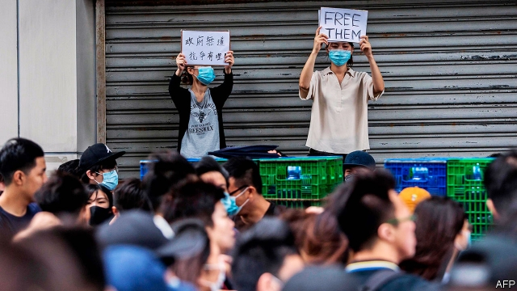

###### If at first

# Beijing urges a stronger response to the protests in Hong Kong 

 

> print-edition iconPrint edition | China | Aug 3rd 2019 

FOLLOWING EIGHT weeks of protests and mounting violence, the news that the authorities in Beijing planned to hold a rare press conference had many in Hong Kong holding their breath. The result was a (welcome) anti-climax. There were no threats to send in the army, as some had feared. A speech by the spokesperson from the Hong Kong and Macau Affairs Office made no mention of that until, when asked by a journalist whether troops could be deployed on the streets he simply pointed to the relevant sections of Hong Kong-related laws. While condemning the violence of recent protests he took care not to criticise the local government and heaped praise on the work of the Hong Kong police. 

Communist Party newspapers are a better place to look for evidence of the party’s growing frustration. The People’s Daily ordered the police to have no “psychological worries” about being much tougher. Activists are already being punished. After a weekend of violent confrontations between young pro-democracy protesters and police using tear-gas and rubber bullets, 44 people arrested during the clashes were told they would be charged with rioting. They face up to ten years in prison. 

The forceful stance of the police has not quelled the demonstrations. Indeed, many gathered outside police stations to protest against the severity of the charges. The administration of Carrie Lam, Hong Kong’s chief executive, is paralysed, those at the very top of it privately admit. Extraordinarily, Mrs Lam herself has not made any public statements for over a week. Although the Communist Party has reiterated its support, her days are surely numbered, even if it cannot accept her immediate resignation without a huge loss of face. 

As for the police, some complain privately about poor leadership. Many officers are livid at being put on the front line to sort out what they say is a political crisis. But as the provocations of black-shirted protesters mounted, it was clear that by the weekend plenty of officers were itching for revenge. After applications to march over the weekend in the central business district and Yuen Long—a suburb where pro-China thugs had beaten up innocent travellers a week earlier—were rejected, activists went ahead anyway. The police showed little restraint. Amnesty International, a human-rights watchdog, says it has seen “repeated instances where police officers were the aggressors”. 

After a wave of arrests, protesters may be more cautious—although at least seven marches are planned for August 5th alone. Meanwhile, there is not much the police can do should tactics switch to a campaign of low-level civil disobedience—strikes, sit-ins and so on. Civil servants, firemen, bus drivers and many more have backed one of the protesters’ chief demands: an independent inquiry into the crisis. 

The obvious and perhaps only way to resolve the crisis would be for China to keep its promise to let the people of Hong Kong choose their own leaders. Dream on. The radicalisation of the protests is, in part, a consequence of China’s strategy of persecuting more moderate opposition leaders trying to work within the system. 

For now, China is out to define its enemies in Hong Kong and delegitimise them. In the propaganda, Hong Kong’s quest for genuine self-rule is being portrayed as on a par with “splittists” elsewhere on China’s fringes, in Tibet or Xinjiang. It is in this nationalist context that students from the mainland have recently clashed with ones from Hong Kong on campuses in America, Australia, Canada and New Zealand. 

Back in Hong Kong, China can always resort to the ultimate sanction: deploying the local garrison of the People’s Liberation Army (PLA). That prospect was highlighted by Mrs Lam’s predecessor as chief executive, Leung Chun-ying, long close to the Communist Party. In a letter to the Financial Times last month he insisted that the PLA’s presence in Hong Kong is “not meant to be token, ceremonial or symbolic” but rather to help maintain public order. Yet deploying the PLA to crush largely peaceful protests would only deepen the government’s illegitimacy in locals’ eyes, while attracting enormous international opprobrium. That it is even being discussed is a sign of how bad things have become. ■ 
<<<<<<< HEAD

-- 

 单词注释:

1.hong[hɔŋ]:n. （中国、日本的）行, 商行 

2.kong[kɔŋ]:n. 含锡砾石下的无矿基岩；钢 

3.Aug[]:abbr. 八月（August） 

4.spokesperson['spәukspә:sn]:n. 发言人, 代言人 

5.macau[]:n. 澳门（中国地名） 

6.deploy[di'plɒi]:v. 展开, 配置 

7.criticise['kritisaiz]:v. 批评, 吹毛求疵, 非难 

8.frustration[frʌs'treiʃәn]:n. 挫折, 顿挫 [医] 挫折 

9.activist['æktivist]:n. 激进主义分子 

10.confrontation[.kɔnfrʌn'teiʃәn]:n. 对抗；对质；面对 

11.protester[]:n. 抗议者, 持异议者, 拒付者 [经] 反对者 

12.clash[klæʃ]:n. 冲突, 撞击声, 抵触 vi. 冲突, 抵触 vt. 使发出撞击声 [计] 对撞 

13.riot['raiәt]:n. 暴动, 喧闹, 放纵 vi. 发动, 暴动, 纵情, 放荡 vt. 浪费, 挥霍 

14.forceful['fɒ:sful]:a. 有力的, 强烈的, 有说服力的 

15.stance[stæns]:n. 准备击球姿势, 站立的姿势, 位置, 姿态 [经] 地位, 形势 

16.quell[kwel]:vt. 压制, 平息, 减轻 

17.demonstration[.demәn'streiʃәn]:n. 示范, 实证 [医] 示教, 实物教授 

18.severity[si'veriti]:n. 严格, 朴素, 激烈 

19.carrie['kæri]:n. 卡丽（女名, Caroline的昵称） 

20.lam[læm]:v. 打, 鞭笞, 逃脱 n. 逃亡 

21.paralyse['pærәlais]:vt. 使麻痹, 使瘫痪, 使无力, 使气馁, 终止 [医] 使麻痹, 使瘫痪 

22.privately[]:adv. 秘密地；私下地 

23.extraordinarily[ik'strɔ:dθnәrili]:adv. 非凡, 破例, 特别, 非常, 离奇, 使人惊奇, 惊人, 特命, 特派 

24.Mr['mistә(r)]:先生 [计] 存储器回收程序, 多重请求 

25.reiterate[ri:'itәreit]:vt. 反复地说, 重申, 反复地做 [法] 重述, 重申, 反覆地做 

26.cannot['kænɒt]:aux. 无法, 不能 

27.livid['livid]:a. 铁青的 [医] 青紫的 

28.provocation[.prɒvә'keiʃәn]:n. 激怒, 刺激, 挑拨 [医] 激发[作用] 

29.itch[itʃ]:n. 痒, 渴望, 疥疮 vi. 发痒, 渴望 

30.yuen[]:n. 袁（姓氏）；元；阮 

31.thug[θʌg]:n. 恶棍, 刺客, 凶手 [法] 凶手, 刺客, 暴徒 

32.traveller['trævlә]:n. 旅行者 [经] 旅行商 

33.amnesty['æmnisti]:n. 大赦, 赦免 

34.watchdog['wɒtʃdɒg]:n. 看门狗, 监察人 [化] 监控设备; 监视器 

35.aggressor[ә'gresә]:n. 侵略者, 挑畔者 [法] 侵略者, 攻击者 

36.tactic['tæktik]:n. 一项战术, 一条策略 a. 战术的, 顺序的, 排列的 

37.radicalisation[]:[网络] 激进化 

38.persecute['pә:sikju:t]:vt. 迫害, 虐待, 困扰, 同...捣乱 [法] 迫害, 虐待, 烦扰 

39.opposition[.ɒpә'ziʃәn]:n. 反对, 敌对, 相反, 在野党 [医] 对生, 对向, 反抗, 反对症 

40.delegitimise[]:[网络] 去合法性；非法化 

41.propaganda[.prɒpә'gændә]:n. 宣传, 宣传活动 [医] 宣传 

42.quest[kwest]:n. 探索, 寻求, 调查 v. 寻找, 找, 追寻猎物 

43.portray[pɒ:'trei]:vt. 描绘, 描写, 描绘...的肖像 

44.par[pɑ:]:n. 标准, 票面价值, 平均数量, 同等水平 a. 票面的, 平常的, 标准的, 平价的 [计] 重新传输的肯定回答 

45.splittist[sp'lɪtɪst]: 分裂主义分子 

46.fringe[frindʒ]:n. 边缘, 端, 流苏, 穗, 初步 vt. 加穗于, 加饰边于 a. 边缘的, 附加的 

47.nationalist['næʃәnәlist]:n. 国家主义者, 民族主义者 

48.context['kɒntekst]:n. 上下文, 背景, 来龙去脉 n. 上下文 [计] 上下文 

49.zealand['zi:lәnd]:n. 西兰岛（丹麦最大的岛） 

50.alway['ɔ:lwei]:adv. 永远；总是（等于always） 

51.garrison['gærisn]:n. 守备队, 驻军, 要塞 vt. 守备, 派兵驻守 

52.PLA[]:中国人民解放军 [计] 可编程序逻辑阵列 

53.predecessor[.predi'sesә]:n. 前任, 先辈, 前身 [医] 初牙, 前辈, 祖先 

54.leung[]:梁/亮；莱翁 

55.token['tәukәn]:n. 表征, 记号, 代币 a. 象征的, 表意的 [计] 记号 

56.ceremonial[.seri'mәunjәl]:n. 仪式 a. 正式的 

57.symbolic[sim'bɒlik]:a. 象征的, 符号的 [电] 符号化 

58.illegitimacy[.ili'dʒitimәsi]:n. 不法, 私生, 不规则性, 不合逻辑 [医] 私生, 违法 

59.opprobrium[ә'prәubriәm]:n. 污名, 耻辱, 咒骂 [法] 轻蔑, 责骂, 不名誉 
=======
>>>>>>> 50f1fbac684ef65c788c2c3b1cb359dd2a904378

