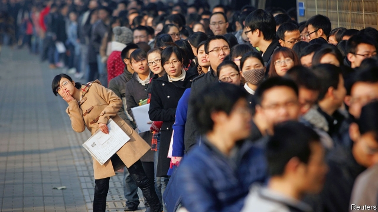

###### Idle hands

# The growing ranks of unemployed graduates worry China’s government 

 

> print-edition iconPrint edition | China | Aug 3rd 2019 

THRONGS OF YOUNG people roam around the makeshift booths in an exhibition hall in northern Beijing. They are at a job fair organised by the municipal government, aimed at unemployed college graduates. Like most jobseekers in attendance, Su Jian has brought along a stack of CVs to hand out to prospective employers. But Mr Su (not his real name), who graduated in June from a second-tier university in the capital, is unimpressed by what he sees.  

The most popular booth at the fair belongs to China Railway, a state-owned behemoth. The firm’s recruiter says it pays new graduates around 4,000 yuan ($580) a month. That is less than half the average salary in Beijing and not even double the city’s minimum wage. Mr Su nonetheless submits his CV. “What can you do? There are too many of us,” he laments.  

Chinese universities produced a record 8.3m graduates this summer. That is more than the entire population of Hong Kong, and up from 5.7m a decade ago. Tougher visa policies in much of the West mean that China will also receive nearly half a million returning graduates from foreign institutions this year. It is not a propitious time to enter the job market. China’s economy, buffeted by the trade war with America, is growing at its slowest pace in nearly 30 years. This year fully two-thirds of all workers joining the labour force will be university graduates, up from around half just three years ago. Mr Su wonders whether the number of graduates has outstripped the labour market’s ability to absorb them.  

As recently as the early 1990s the government simply assigned graduates to jobs. It no longer dictates people’s lives so crudely, but it is clearly worried about what will happen if they do not find work. On July 12th five state agencies warned local governments that boosting employment “has become more onerous”. They linked the “employment of graduates” with “overall social stability”. Such warnings have been made annually since 2011, but this year, unusually, the public-security ministry attached its name to the notice. 

Last month the government announced measures aimed at getting more graduates into work. Small firms that hire unemployed graduates can apply for a tax rebate. The national system of household registration, hukou, which restricts where people can receive subsidised public services, will be kinder to new graduates. The new rules instruct all provincial capitals (but not megacities such as Beijing and Shanghai) to make it easier for graduates to apply for local hukou, boosting labour mobility. 

 Graduates who want to start their own businesses may be eligible for a state loan with little or no collateral, the ministry of human resources says. Those who cannot get hired and lack entrepreneurial drive are invited to visit one of its many local branches for “one-on-one assistance”. Local governments are also trying to help. One city in Guangxi province announced on July 26th that helping graduates find jobs had become “the utmost priority”. 

There are no official statistics on the employment status of fresh graduates, but MyCos, a consultancy on education in Beijing, found that the proportion of them who had found full-time jobs within six months of graduation had fallen from 77.6% in 2014 to 73.6% in 2018. The average monthly salary for new graduates fell from a peak of 4,800 yuan in 2015 to 4,000 yuan in 2017, according to Zhaopin, China’s biggest job-recruitment platform.  

The trade war with America seems to have tempered hiring, especially in export industries. A crackdown on shadow banks (lenders that do not take state-guaranteed deposits), which have been enthusiastic recruiters of new graduates, has forced mass layoffs. Growing international suspicion of Chinese tech firms may slow their expansion plans, too. Civil-service recruitment, meanwhile, was cut to 14,500 this year, the lowest intake in a decade. 

A recent graduate from Peking University recounts how she was laid off by a financial-services firm earlier this year. She is looking for a job at an internet firm. Prospective employers, she says, have extended the probation period from two or three months to six. “During the probation period employers are legally entitled to pay only 80% of the normal salary,” she explains. “More and more companies are exploiting this power.”  

With a degree from China’s most prestigious university, she is at least confident she will soon secure a good job. Graduates from lesser-known institutions face a much harder time. Several recruiters at the job fair in northern Beijing admit to chucking CVs from “no-name schools” straight into the bin. Part of the problem, says Joshua Mok, a professor at Lingnan University in Hong Kong, is that the “average quality” of graduates may have deteriorated in recent years. The number of universities has increased from just over 1,000 in 2000 to around 2,700 today. Employers, unfamiliar with so many new names, often dismiss the obscure ones as degree mills. They are not always wrong. 

In 2009 a sociologist coined the term yizu, or “ant tribe” to refer to struggling graduates from the provinces who swarm to megacities. An estimated 100,000 so-called “ants” lived in Beijing in 2010. But the term is no longer widely used, says a graduate from the southern province of Yunnan who lives in Beijing. Rising rents, combined with a crackdown on the illegal subdivision of flats, have driven most provincial graduates away. She, too, may move home soon: salaries may be lower in Yunnan, but so is the cost of living. 

 Many graduates have unrealistic expectations, says Yao Yuqun of Renmin University: “Everybody wants to be a manager right away.” There are plenty of jobs to go around, he says. A report in May by the China Institute for Employment Research, a think-tank, found that there were 1.4 entry-level vacancies (excluding unskilled work) for each graduating student. Many jobs are in second- and third-tier cities. Graduates, it seems, are too snooty to take them. One calls this the “BAT or bust” mentality, referring to Baidu, Alibaba and Tencent, three sought-after online giants. The government counsels humility. Anyone blessed with a job offer, it said recently, should “promptly sign the contract”. ■ 

