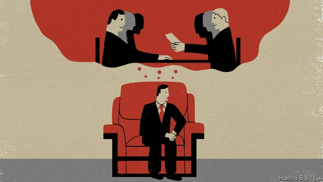

###### Chaguan

# Why Chinese officials like useless meetings in over-stuffed chairs 

 

> print-edition iconPrint edition | China | Aug 3rd 2019 

REVEALINGLY OFTEN, when foreigners meet Chinese leaders the encounter is a pain in the neck. The cause is not mysterious. For reasons that may involve both high culture and low political calculation, important visitors to China are typically invited to sink into one of a pair of side-by-side armchairs, at one end of a formal reception room. There the guest must sit, head twisted through 90 degrees, to see and hear a host whose opening remarks may stretch to an hour. 

Foreign bigwigs planning to consult aides in such a meeting room are further out of luck. Their entourage will be trapped in their own armchairs, placed in a horseshoe pattern or marching down one long wall of the room, opposite a matching row of Chinese officials. In a recent episode of the US-China Dialogue Podcast, an oral history project at Georgetown University, Wendy Cutler, who as an American official played a leading role in negotiating China’s entry to the World Trade Organisation, recalls how her Chinese counterparts used exhaustion and embarrassment to manipulate visitors. For one thing, they have a habit of beginning meetings with envoys at 10pm. Then there is the hazard of reception rooms that make it daunting to stand up from an armchair, cross yards of empty carpet and hand a boss a note about a detail of policy or tactics. Visitors have to be very sure that their message for the boss is worth the interruption, because the room makes it “very awkward”, Ms Cutler recalls. 

Such recollections lead Chaguan to what may seem an odd hunch. This is a moment of low trust in China’s relations with the world, when many Western governments and businesses are losing hope that China’s leaders will open their markets to foreigners on equal terms. This is also a moment of impatience, when Chinese practices that have long frustrated outsiders, such as state subsidies for national champions, or the use of security laws and politicised regulations to bully trade secrets out of foreign firms, feel insupportable now that China is so large. To emerge safely from these perilous times China and America, in particular, will have to learn to co-exist as competitors, trade partners and ideological rivals, at one and the same time. One way to guess whether such a rebalancing is possible is to watch the chairs. 

Whenever Chinese, American or other foreign delegations meet, if the two sides are sitting at a long table that allows for substantive, clause-by-clause negotiations, flickers of optimism may be justified. If, instead, meeting rooms feature antimacassars on overstuffed armchairs, little tables bearing teacups and large paintings of mist-shrouded mountains, gloom may be in order. 

It says something sobering about present-day China that sales of the armchairs used in horseshoe-shaped meeting rooms have risen steadily over the past 20 years. Surprisingly often, the armchairs used for such meetings are made by a single company, Tiantan (or Temple of Heaven) Furniture, founded in 1956 and owned by Beijing’s city government. Business is good, says the firm. 

The company traces the chairs’ history back to imperial audiences granted during the Song Dynasty, almost a thousand years ago, when floor-mats and stools gave way to chairs. Running at up to $800 each, Tiantan’s bestseller is known within the company as the “Jiang-style Armchair”, because it was commissioned in the early 2000s by aides to the party leader and president of the day, Jiang Zemin. Patriotism has helped expand the market for all sorts of traditional Chinese furniture, says Wang Shengli, a manager at Tiantan. In contrast: “In the 1980s, Western styles were more popular.” Beyond that, there is the specific appeal of owning chairs fit for a vice-minister or provincial party secretary. Tiantan sells a lot to the government, but also to private businesses, hotels and wealthy individuals moved to imitate the look of Communist officials, in what Mr Wang calls a “follow-the-leaders” effect. 

It takes 20 days to assemble a Jiang-style armchair from Chinese walnut, fine cloth or leather (red is the most popular colour) and lots of foam padding, especially in the small of the back, so that occupants can sit up straight for hours. “The chair is quite firm, as is fitting for a leader,” explains Mr Wang on a factory tour, over the noise of whirring tools. Tiantan armchairs are found in the Great Hall of the People and the central leadership compound of Zhongnanhai in Beijing, and even aboard leaders’ aeroplanes. 

Naturally, if China does agree to businesslike meetings, America has homework to do, too. From 2004 to 2013 David Dollar represented first the World Bank and then the United States Treasury in Beijing. At too many meetings he watched American political appointees, flanked by young aides straight out of graduate school, as they tried to negotiate with the help of written records of talks involving previous administrations. Meanwhile, in the chair of honour on the Chinese side, Mr Dollar says, the chief negotiator quite possibly “used to be at the bottom of the table 20 years ago, and then they sent him off to be vice-mayor of Guiyang or whatever, and he works his way up.” As a result, Chinese officials could and did cite oral agreements that they believed they had heard American officials make years earlier. In contrast, laments Mr Dollar, “The US has no institutional memory.” 

Just now America presents China with a particular puzzle. President Donald Trump revels in pomp, protocol and monarchical chats with fellow leaders, which should play into China’s hands. At his first meeting with President Xi Jinping he happily shared a brocade sofa at Mar-a-Lago, his Florida estate, and declared his Chinese guest a great friend. But Mr Trump also feels unbound by agreements, oral or otherwise, made by previous governments, a blow to China and its elephantine capacity for remembering ancient half-promises. With globalisation in the balance, it is time China stopped using the dismal horseshoe to stall reforms. But America, too, must make better use of its seat at trade’s top table. ■ 

-- 

 单词注释:

1.Aug[]:abbr. 八月（August） 

2.revealingly[ri'vi:liŋli]:adv. 启发人地；袒胸露肩地 

3.typically['tipikәli]:adv. 代表性地；作为特色地 

4.bigwig['bigwig]:n. 要人, 大亨 

5.aide[eid]:n. 助手, 副官 [计] 数据输入的可说明性 

6.entourage[,ɔntu'rɑ:ʒ]:n. 全体随行人员, 陪同人员 

7.horseshoe['hɒ:sʃu:]:n. 马蹄铁 vt. 装蹄铁于 

8.podcast[]:n. 播客 

9.georgetown['dʒɔ:dʒtaun]:n. 乔治城（圭亚那首都） 

10.wendy['wendi]:n. 温迪（女子名） 

11.cutler['kʌtlә]:n. 刀匠, 刀剪商 

12.organisation[,ɔ: ^әnaizeiʃən; - ni'z-]:n. 组织, 团体, 体制, 编制 

13.counterpart['kauntәpɑ:t]:n. 副本, 复本, 配对物, 相应物 [经] 副本, 正副二份中之一 

14.embarrassment[im'bærәsmәnt]:n. 困难, 阻碍, 困窘 [医] 窘迫 

15.manipulate[mә'nipjuleit]:vt. 操纵, 利用, 操作, 巧妙地处理, 假造 

16.envoy['envɒi]:n. 外交使节, 特使 [法] 使者, 代表, 使节 

17.daunt[dɒ:nt]:vt. 威吓, 难倒, 使气馁 

18.tactic['tæktik]:n. 一项战术, 一条策略 a. 战术的, 顺序的, 排列的 

19.recollection[.rekә'lekʃәn]:n. 记忆, 回想, 回忆 

20.hunch[hʌntʃ]:n. 肉峰, 预感, 大块 vt. 弯腰驼背, 预感到, 耸肩 vi. 向前移动, 隆起 

21.impatience[im'peiʃәns]:n. 性急, 难耐, 焦急, 急躁 

22.outsider[' aut'saidә]:n. 外人, 局外人, 非会员, 外行, 门外汉, 比赛中获胜可能性不大的选手 [经] 外船公司 

23.politicise[pɒ'lɪtɪsaɪs]:vt. 使政治化, 使具有政治性; 使对政治有兴趣 

24.bully['buli]:n. 欺凌弱小者, 土霸 vt. 威胁, 恐吓, 欺负 vi. 欺负 a. 特好的, 第一流的 adv. 十分 

25.insupportable[.insә'pɒ:tәbl]:a. 忍耐不住的, 不合理的 

26.perilous['perilәs]:a. 危险的, 濒临毁灭的 

27.ideological[.aidiә'lɒdʒikәl]:a. 意识形态的, 空想的 [法] 思想的, 思想上的, 意识形态的 

28.rebalance[re'bæləns]: 再平衡 

29.substantive['sʌbstәntiv]:a. 表示实在的, 有实质的, 独立存在的, 大量的, 重大的, 坚实的, 名词的 n. 名词性实词, 名词 

30.negotiation[ni.gәuʃi'eiʃәn]:n. 谈判, 磋商, 交涉 [经] 谈判, 协商 

31.flicker['flikә]:n. 闪烁, 闪光, 颤动 vi. 闪动, 闪烁, 摇动, 扑动翅膀 vt. 使摇曳, 使闪烁 

32.optimism['ɒptimizm]:n. 乐观主义, 乐观, 乐天 [医] 乐观主义, 乐观 

33.antimacassar[.æntimә'kæsә]:n. 椅背套 

34.overstuff['әuvә'stʌf]:vt. 装填...过度, 给...装以厚厚的填料 

35.teacup['ti:kʌp]:n. 茶杯, 满茶杯 

36.gloom[glu:m]:n. 忧郁, 暗处, 幽暗 vi. 变忧沉, 变黑暗 vt. 使忧郁, 使黑暗 

37.tiantan[]:[网络] 天坛牌；天公埕；天宁寺租房 

38.imperial[im'piәriәl]:a. 帝王的, 宗主国的, 至尊的, 壮丽的 n. 特等品 

39.bestseller[]:n. 畅销书 

40.Jiang[]:江 蒋 姜（中国姓氏） 

41.zemin[]:[网络] 江 

42.patriotism['peitriәtizm]:n. 爱国心, 爱国精神, 爱国主义 

43.wang[]:n. 王（姓氏）；王安电脑公司 

44.provincial[prә'vinʃәl]:n. 外地人, 粗野的人 a. 省的, 外地的, 偏狭的 

45.foam[fәum]:n. 泡沫, 水沫, 泡沫材料 vi. 起泡沫, 吐白沫 vt. 使起泡沫 

46.occupant['ɒkjupәnt]:n. 占有者, 居住者, 占用者 

47.whir[hwә:]:n. 呼呼声, 飕飕声 vi. 作呼呼声, 发飕飕声 vt. 使呼呼响 

48.zhongnanhai[]:[网络] 中南海烟液；中国政府；帝国之脑 

49.businesslike['biznislaik]:a. 有条理的, 有效率的 

50.david['deivid]:n. 大卫；戴维（男子名） 

51.treasury['treʒәri]:n. 国库, 宝库, 财政部, 国库券 [经] 库存, 国库, 金库 

52.appointee[ә.pɒin'ti:]:n. 被任命者 [法] 被指定的人, 被任命者 

53.flank[flæŋk]:n. 侧面, 侧腹, 胁, 腰窝肉 vt. 攻击侧面, 守侧面 vi. 侧面与...相接 

54.negotiator[ni'gәuʃieitә]:n. 磋商者, 交涉者, 议定者 [经] 谈判者, 交易者, 协商者 

55.Guiyang['^wei'jɑ:ŋ]:贵阳[贵州省](旧译Kweiyang) 

56.cite[sait]:vt. 引用, 引证, 表彰 [建] 引证, 指引 

57.lament[lә'ment]:n. 悲叹, 悔恨, 恸哭, 挽歌, 悼词 vt. 哀悼 vi. 悔恨, 悲叹 

58.institutional[.insti'tju:ʃәnәl]:a. 制度的, 公共机构的, 学会的 [法] 组织机构的, 制度的, 公共机构的 

59.revel['revl]:n. 作乐, 狂欢 vi. 狂欢作乐, 陶醉, 着迷 vt. 耗费 

60.pomp[pɒmp]:n. 壮丽, 盛观, 夸耀 

61.protocol['prәutәkɒl]:n. 草案, 礼仪, 协议 v. 拟定 [计] 协议, 协议列表实用程序 

62.monarchical[mɔ'nɑ:kikәl]:a. 君主的, 君主政体的, 君主政治的 

63.brocade[brәu'keid]:n. 织锦 

64.Florida['flɒridә]:n. 佛罗里达州 

65.unbind[.ʌn'baind]:vt. 解, 解开, 解放 [计] 协议撤消程序 

66.elephantine[.eli'fæntain]:a. 象的, 巨大的, 粗笨的 

67.globalisation[,gləubəlai'zeiʃən]:n. 全球化, =globalization 

68.dismal['dizmәl]:a. 阴沉的, 凄凉的, 令人忧郁的 n. 低落的情绪, 沼泽 

69.stall[stɒ:l]:n. 厩, 停车处, 牧师职位, 货摊, 托辞, 拖延 vt. 关入厩, 停顿, 推托, 支吾, 使陷于泥中 vi. 被关在厩内, 陷于泥中, 停止, 支吾 

