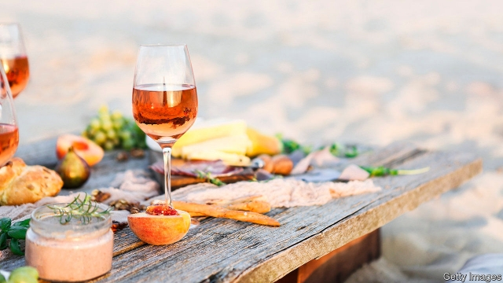

###### The rise of rosé

# Even the French are learning to drink pink 

 

> print-edition iconPrint edition | Europe | Aug 3rd 2019 

“THERE IS MORE philosophy in a bottle of wine than in all the books in the world,” said Louis Pasteur, a 19th-century French chemist. For the French, wine is not just a drink or source of alcohol: it is a mark of civilisation, a subject of scholarship, a way of life. So why in the land of fine wines is rosé, the industry’s poor cousin, enjoying such a boom? 

On the slopes of a forested hillside close to Mont Ventoux, the Domaine de la Verrière is one of the highest vineyards in Provence. Among the Chêne Bleu wines it produces, predominantly from hand-picked grenache and syrah, is a premium organic rosé. By July this year, for the first time, the estate had sold out of last year’s vintage. “Our rosé sales are now constrained by supply,” says Danielle Rolet, whose family owns the vineyard. 

France is both the world’s biggest producer and consumer of rosé wine, a pale pink blend that snobs have traditionally scorned. In the second half of 2018 supermarket sales of red in France fell by 5% on the same period the previous year, and white was flat. Yet rosé sales were up by 6%. 

Why the French craze for rosé? One answer is the change in diets. In recent years even the French have begun to eat less steak and other red meat, which they traditionally accompany with red. As a simpler—and, the purists would say, blander—wine, rosé is seen as a lighter drink, particularly when chilled in summer. It is especially popular among the under-25s, the age group most likely to be vegetarian, according to the Organisation Internationale de la Vigne et du Vin. 

A second, and perhaps more surprising, reason is the emergence of winemakers seeking to take rosé upmarket. A bottle of top-end Garrus rosé from the Château d’Esclans, a Provençal wine estate, for instance, sells at an improbable €100 ($110). Such wines, or so their producers hope, are helping to lend rosé the cachet it has lacked until now. “From the start, we wanted to make a more complex, structured, serious rosé,” says Ms Rolet; “Now, almost unexpectedly, we find that it’s through our rosé that people find us.” 

And then there is the celebrity image. Almost all the Côtes de Provence wines, made along France’s Mediterranean fringe, are rosés. For millennials, the pale pink hue, backlit by sun, is considered highly “Instagrammable”. “It’s a fashion that has come up from Saint-Tropez,” says a winemaker farther inland, dismissively. Brad Pitt and Angelina Jolie own the Château de Miraval in Provence, which produces a premium rosé. Other aspirational brands, such as Minuty, are popular—often by the magnum—on the yachts and in the beach clubs of the Riviera. Such bottles sell not so much a pale pink liquor as a glamorous lifestyle fantasy. The promise, as it were, of la vie en rosé—to which even the French, it seems, are not immune. ■ 
<<<<<<< HEAD

-- 

 单词注释:

1.Aug[]:abbr. 八月（August） 

2.louis['lu(:)i, 'lu(:)is]:n. 路易斯（男子名） 

3.pasteur[pæs'tә:]:n. 巴斯德（法国化学家、细菌学家） 

4.civilisation[,sivilai'zeiʃən;-li'z-]:n. 文明, 文明世界, 文化, 开化, 教化 

5.mont[]:n. 蒙特, 蒙脱石 

6.ventoux[]:[网络] 旺图山；旺度；冯杜山 

7.domaine[dәu'mein]:n. 葡萄园 

8.de[di:]:[化] 非对映体过量 [医] 铥(69号元素铥的别名,1916年Eder离得的假想元素) 

9.La[lɔ:, lɑ:]:[医] 镧(57号元素) 

10.vineyard['vinjәd]:n. 葡萄园 

11.Provence['prɒvens]:n. 普罗旺斯(在法国东南部) 

12.bleu[blә:]:a. 有蓝色霉菌花纹的 

13.predominantly[]:adv. 主要地, 显著地, 大多数地, 突出地 

14.grenache[]:n. 【食】歌海娜 [网络] 格那希；歌海娜葡萄；格纳西 

15.syrah[]:n. 席拉（一种葡萄） 

16.premium['pri:miәm]:n. 额外补贴, 奖金, 奖赏, 保险费 [医] 保险费 

17.vintage['vintidʒ]:n. 酒, 葡萄收获(期、量), 酿酒 v. 采葡萄 a. 佳酿的, 古典的, 老式的 

18.constrain[kәn'strein]:vt. 强迫, 限制, 关押 

19.DANIELLE[dæn'jel]:n. 丹妮尔(f.) 

20.producer[prә'dju:sә]:n. 生产者, 制作者, 制作人 [化] 发生器; (炉煤气)发生炉; 制气炉; 生产者 

21.snob[snɒb]:n. 势利的人, 假内行 

22.traditionally[]:adv. 传统上；传说上；习惯上 

23.craze[kreiz]:n. 狂热, 大流行 v. (使)发狂, (使)开裂 

24.les[lei]:abbr. 发射脱离系统（Launch Escape System） 

25.purist['pjuәrist]:n. 纯粹主义者 

26.vegetarian[.vedʒi'tєәriәn]:n. 素食者, 食草动物 a. 素食的 

27.organisation[,ɔ: ^әnaizeiʃən; - ni'z-]:n. 组织, 团体, 体制, 编制 

28.Internationale[,intәnæʃә'nɑ:l, -'næʃәnәl]:[法]《国际歌》 

29.vigne[]: [人名] 瓦因 

30.Et['i:ti:]:[化] 乙基 

31.vin[væŋ]:n. （法）酒；葡萄酒 

32.emergence[i'mә:dʒәns]:n. 出现, 浮现, 发生 

33.winemaker[]: 葡萄酒酿造者；葡萄酒生产者 

34.upmarket[ˌʌpˈmɑ:kɪt]:a. 高级的, 高档的, 高端的 

35.Château[]:[地名] 沙托 ( 法 ) 

36.improbable[im'prɒbәbl]:a. 不大可能的, 不象发生的, 荒谬可笑的 [法] 未必会的, 不大可能发生的, 未必确实的 

37.cachet[kæ'ʃei]:n. 公章, 私人印戳, 标记, 威望, 纪念邮戳 [医] 扁囊剂 

38.unexpectedly[]:adv. 想不到的, 突然的, 意外的, 出乎意料的 

39.celebrity[si'lebrti]:n. 名声, 名人 

40.fringe[frindʒ]:n. 边缘, 端, 流苏, 穗, 初步 vt. 加穗于, 加饰边于 a. 边缘的, 附加的 

41.millennials[mɪ'leniəl]:adj. 一千年的；一千年至福的 [网络] 千禧世代；千禧之子；千禧一代 

42.hue[hju:]:n. 样子, 色度, 色彩, 叫声, 色调 [计] 色调 

43.backlit['bæklit]:n. 后面打光；背光式 

44.dismissively[]:adv. 轻蔑地；不屑一顾地 

45.brad[bræd]:n. 角钉, 曲头钉 

46.pitt[pit]:n. 皮特钻石（品牌名）；皮特（姓氏, 特指英国政治家父子威廉姆斯皮特） 

47.angelina[,ændʒi'li:nә]:n. 安吉莉娜（女子名） 

48.jolie[]:n. 朱莉（女子名） 

49.miraval[]:[网络] 米拉法尔；米拉沃 

50.aspirational[ˌæspəˈreɪʃənl]: 志同的, 有抱负的 

51.yacht[jɒt]:n. 快艇, 游艇 vi. 驾游艇, 乘游艇 

52.riviera[,rivi'eәrә]:n. 海滨游憩胜地 

53.glamorous['glæmәrәs]:a. 富有魅力的, 迷人的 

54.lifestyle['laifstail]:n. 生活方式 

55.vie[vai]:vi. 争, 竞争, 争胜 vt. 提出...来竞争, 以...作较量 

56.en[en]:n. 字母N, (铅字)半方 prep. 在...中, 作为 

57.immune[i'mju:n]:a. 免疫的, 免除的, 不受影响的 n. 免疫者 
=======
>>>>>>> 50f1fbac684ef65c788c2c3b1cb359dd2a904378

