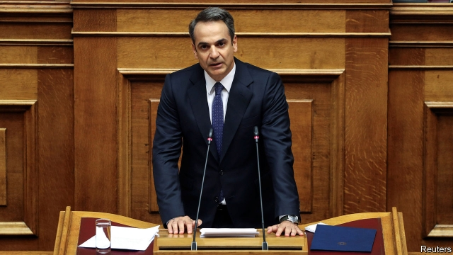
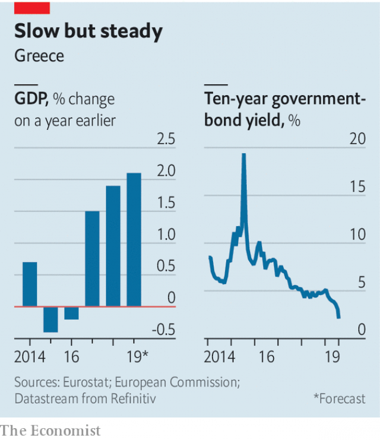

###### Let the good times roll

# Greece’s new government promises tax cuts and spending increases 

 

> print-edition iconPrint edition | Europe | Aug 1st 2019 

OVER THE past decade Greece has been a tough place for politicians who like to be liked. The newly elected centre-right government is trying its best. In his first few weeks in office Kyriakos Mitsotakis, the prime minister, has announced tax breaks for ordinary Greeks and corporations. He has promised not to cut social benefits or fire any public-sector workers. Jobs are being created in areas that suffered deep cuts during the country’s eight-year malaise. The health ministry is preparing to hire 2,400 hospital staff; another 1,500 police officers are being recruited. 

Sadly, the good times are not guaranteed. The prime minister’s policy choices could derail Greece’s chances of hitting tough budget-surplus targets set by its creditors, the EU and the IMF. Economists fear that the relatively inexperienced Mr Mitsotakis—he held a fairly junior ministerial post from 2013 to 2015—may be overestimating his government’s capacity to shake up the country’s sleepy bureaucracy and push through reforms. 

So far the markets have smiled on Mr Mitsotakis and his New Democracy. On July 16th Greece issued its first seven-year bond since 2010. A modest target of €2.5bn ($2.8bn) issued was hugely oversubscribed: offers exceeded €13bn, pushing down the yield on the new bond to 1.9%. 

Winning over the EU and the IMF will be harder. Asked about the new Greek government at her annual summer press conference, Angela Merkel, the German chancellor, called the bond issue “very positive” but sounded a note of caution: “We will have to see how things evolve.” 

 

Mr Mitsotakis’s eagerness to accelerate growth by cutting taxes as fast as possible is risky. In his first policy statement in parliament on July 21st, Mr Mitsotakis announced an immediate 22% cut in “enfia”, an unpopular annual property tax, and a cut of four percentage points in corporate tax to 24%. Both measures will take effect in September, four months earlier than originally expected. The income-tax rate for the lowest bracket will fall from 22% to 9%; value-added tax will drop by two percentage points. Further cuts will follow in 2020, Mr Mitsotakis says. 

He has also made it clear that he will not broaden the tax base, a long-awaited reform that Syriza reneged on last year. Miranda Xafa, a former IMF economist, points out that seven out of ten Greeks pay less than €100 a year in income tax. Getting more people to pay tax “would help pay for the tax-rate cuts and make burden-sharing fairer”, she says. 

The prime minister nonetheless promises that Greece will stick to a harsh budget target this year and next. This target has already been agreed with its creditors: a primary surplus (before debt-servicing costs) of 3.5% of GDP. The Syriza government of Alexis Tsipras, Mr Mitsotakis’s predecessor, exceeded this target last year by raising taxes and cutting the public-investment budget. Creditors were impressed by Syriza’s rigour, but growth was subdued. This year’s forecast is around 2%, well below the 3.5-4% needed to make up for the recession quickly. Greek GDP is still about 25% below its pre-crisis peak. 

The new government hopes that political stability (thanks to its majority in parliament) and business-friendly reforms (cutting red tape as well as taxes) will attract foreign investment. “Greece will be a totally new country for business,” promises Adonis Georgiadis, the minister for development and investment. As a sign of seriousness, he is leading a push to make sure the long-stalled privatisation of Hellinikon, a prime site that used to be Athens’s airport, gets under way this year. 

The government will present a draft budget in September. Although Greece is no longer in an official rescue programme, the budget must be approved by the creditors under the terms of a post-bail-out “surveillance” agreement. He is betting on drastic cost-cutting at government ministries to offset immediate revenue reductions from tax cuts. Good luck with that. ■ 

-- 

 单词注释:

1.Aug[]:abbr. 八月（August） 

2.kyriakos[]:[网络] 希腊；基里亚科斯 

3.mitsotakis[]:米佐塔基斯 

4.malaise[mæ'leiz]:n. 不舒服 [医] 不适, 欠爽 

5.derail[di'reil]:vt. 使出轨 n. 脱轨器 [计] 转移指令 

6.creditor['kreditә]:n. 债权人 [法] 债权人, 债主, 贷方 

7.EU[]:[化] 富集铀; 浓缩铀 [医] 铕(63号元素) 

8.IMF[]:国际货币基金组织 [经] 国际货币基金 

9.economist[i:'kɒnәmist]:n. 经济学者, 经济家 [经] 经济学家 

10.inexperience[.inik'spiәriәns]:n. 无经验, 不熟练 

11.ministerial[.mini'stiәriәl]:a. 部长的, 内阁的, 执政的 [法] 部长的, 部的, 公使的 

12.overestimate[.әuvәr'estimeit]:vt. 评价过高, 过高估价 n. 估计过高, 评价过高 

13.bureaucracy[bjuә'rɒkrәsi]:n. 官僚, 官吏 [法] 官僚主义, 官僚政治, 官僚机构 

14.hugely['hju:dʒli]:adv. 巨大地, 非常地 

15.angela['ændʒilә]:n. 安吉拉（女子名） 

16.merkel[]: [人名] 默克尔; [地名] [美国] 默克尔 

17.chancellor['tʃɑ:nsәlә]:n. 大臣, 总理, 首相, 大使馆/领事馆的一等秘书, 司法官, 大学校长 

18.eagerness['i:gәnis]:n. 热心 

19.risky['riski]:a. 危险的 

20.enfia[]:abbr. exchange network facilities for interstate access 州际接入交换网络设施 

21.unpopular['ʌn'pɔpjulә]:a. 不得人心的, 不受欢迎的, 不流行的 

22.corporate['kɒ:pәrit]:a. 社团的, 合伙的, 公司的 [经] 团体的, 法人的, 社团的 

23.originally[ә'ridʒәnli]:adv. 本来, 原来, 最初, 就起源而论, 独创地 

24.bracket['brækit]:n. 支架, 括弧, 托架 vt. 装托架, 括入括弧 [计] 方括号; 括号 

25.broaden['brɒ:dn]:vi. 变宽, 扩大 vt. 放宽, 使扩大 

26.Syriza[]:[网络] 激进左翼联盟；激进左派联盟；左翼激进联盟 

27.renege[ri'ni:g]:vi. 违例出牌, 食言, 毁约 vt. 否认, 放弃, 拒绝 n. 出牌违例 

28.miranda[mi'rændә]:n. 米兰达（女子名） 

29.les[lei]:abbr. 发射脱离系统（Launch Escape System） 

30.nonetheless[,nʌnðә'les]:conj. 然而, 尽管, 不过 adv. 不过, 仍然, 尽管如此, 然而 

31.alexi[]:亚历克西（男子名） 

32.Tsipras[]:[网络] 领袖齐普拉斯；领导齐普拉斯 

33.predecessor[.predi'sesә]:n. 前任, 先辈, 前身 [医] 初牙, 前辈, 祖先 

34.rigour['rigә]:n. 严格, 严厉, 苛刻, 严酷, 严密, 精确 

35.subdue[sәb'dju:]:vt. 使服从, 压制, 减弱, 抑制, 克制 

36.recession[ri'seʃәn]:n. 后退, 凹处, 衰退, 归还 [医] 退缩 

37.quickly['kwikli]:adv. 很快地 

38.Adonis[ә'dәunis]:n. 阿多尼斯(希腊神话人物), 美少年, 花花公子 [医] 福寿草, 侧金盏花 

39.georgiadis[]: [人名] 乔治亚迪斯 

40.seriousness['siәriәsnis]:n. 严肃, 认真, 严重性 

41.privatisation[ˌpraɪvətaɪ'zeɪʃən]:n. 私有化, 非国营化（将国营企业转为民营） 

42.surveillance[sә:'veilәns]:n. 监视, 监督 [电] 侦测 

43.drastic['dræstik]:a. 激烈的 [医] 峻泻药, 剧烈的 

44.offset['ɒ:fset]:n. 抵消, 把...并列, 旁系, 支管, 用胶印法印 vt. 弥补, 抵消, 胶印 vi. 装支管 n. 偏移量 [计] 偏移量 

