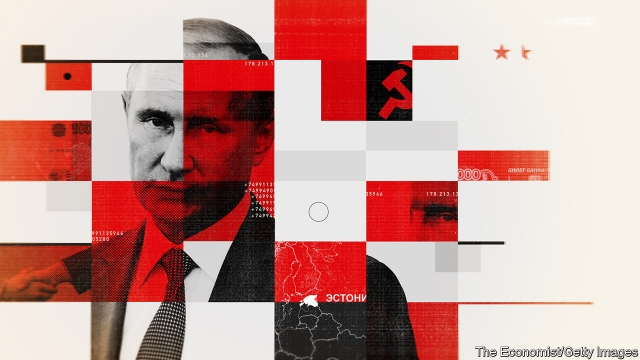

###### The enemy within

# How the Baltic states spot the Kremlin’s agents 

 

> print-edition iconPrint edition | Europe | Aug 3rd 2019 

THE TIP was sent by a city tech worker: a single person could, in one fell swoop, disable almost every traffic light in Vilnius, Lithuania’s capital. It proved true, says Aurimas Navys, a former officer at Lithuania’s State Security Department. Mr Navys, who had received the tip despite his recent retirement, made sure the vulnerability was fixed. Lithuania and the other Baltic states, Estonia and Latvia, all NATO members, are scrambling, he says, to identify such weaknesses and the individuals who might exploit them on behalf of Russia. Mr Navys reckons that the defensive efforts of the Baltic states have multiplied tenfold since 2014. That was when Russia seized Crimea and, in Ukraine’s east, set off separatist fighting that continues today. 

Russia pulled that off with help from supporters in Ukraine, many of whom had been discreetly cultivated by Russia’s intelligence agencies and Spetsnaz special forces. Kremlin supporters in Ukraine’s military bureaucracy in Kiev proved especially damaging, Mr Navys says. They deliberately stalled Ukraine’s response to the seizure of its territory. (Among the Ukrainians arrested for aiding Russia in 2014 was Ukraine’s army chief at the time, Volodymyr Zamana, though he was later freed.) Ukraine had failed to search hard enough for Russian assets in its midst, says Raimundas Karoblis, Lithuania’s defence minister. “We now, after Ukraine, have learned the lessons,” he says. 

The Baltics are keen to avoid Ukraine’s mistakes. Recent remarks by Russian officials and Kremlin mouthpieces have highlighted the danger. As their propaganda has it, parts of Lithuania were gifts from Moscow in Soviet times and therefore rightfully belong to Russia. Troublingly, that was Russia’s rationale for annexing Crimea. The Baltic states reckon that to thwart a destabilisation campaign that Russia could launch, perhaps to support an armed attack, they should determine who might be susceptible to the Kremlin’s bidding. So the search is on for people involved in what officials call “Russian influence activities” as well as, more darkly, “sleeper cells” that could be activated from Moscow. 

Consider the following hypothetical example, says Stephen Flanagan, a specialist on eastern Europe at America’s National Security Council during Russia’s offensive in Ukraine. A rumour spreads that an ethnic Russian girl in Estonia has been raped. A local pro-Kremlin motorcycle gang is told to wreak havoc. The Kremlin, which has asserted a right to protect ethnic Russians abroad, might then send in troops. At least two Russian security agencies operate in the Baltic states, says Mr Flanagan, who, before leaving government, studied the region’s defences against Russia. 

Most of the suspects identified by Lithuania’s security agencies as part of this effort are classified as Kremlin “supporters”. People in this category might do things like pass along the fabrications against Baltic democracies that crop up relentlessly online. In April, for example, a bogus report asserted that Mr Karoblis had been arrested for accepting a bribe to promote American interests at Lithuania’s defence ministry. In one iteration, he was shown behind bars in a faked photograph. Lithuania has placed a smaller number of suspects in a different category: “potential doers”. Officials fear these people might take stronger action, perhaps rioting to discredit a democratic government. 

Officials say they begin with tips, as well as hints of Kremlin sympathies. They might spot these in displays of military symbols or Vladimir Putin’s image, as well as in tweets, tattoos and even hairstyles. Such things often mean little in and of themselves, but officials say tracking them is useful. For starters, tallying even the seemingly trivial—reports of pro-Kremlin rants by drunkards, say—can reveal an important emerging pattern, says Tomas Ceponis, an analyst at Lithuania’s defence ministry. He is part of a team that records locations and other characteristics of pro-Kremlin or anti-NATO displays, graffiti and vandalism included. 

Polls suggest that few Balts believe life would be better under Russian rule. As a Vilnius Uber driver describing past Russian domination puts it: “For us, Russia is an animal.” The average wage in Russia is lower than “a pension for a babushka in Estonia”, says Toomas Hendrik Ilves, Estonia’s president from 2006 to 2016. 

Russia, however, has ways to recruit foreign helpers who are not necessarily devoted believers. In eastern Ukraine, for example, the GRU (Russia’s military intelligence agency) has offered heads of criminal gangs positions in a future Russian administration in exchange for help bringing it about. In Baltic countries the risk of arrest for Russia’s operatives is greater. Russia, then, tends to recruit indirectly in the Baltic states, offering inducements via local NGOs and the Socialist People’s Front, a Lithuanian leftist political party whose former leader was arrested last year on charges of spying for Russia. 

A larger number of Balts, officials say, are recruited when they travel to Russia or its ally Belarus. Cigarettes and petrol are mostly cheaper there, so many people hop across the border, stock up, and sell the stuff once back home. Russian agents commonly approach Balts making these runs and offer money in exchange for help. Edvinas Kerza, Lithuania’s vice-minister of defence, says his country therefore works hard to identify Lithuanians engaged in this hustle. Most troubling, he says, are those who have access to sensitive information thanks to a job in government. 

Russia also recruits by blackmailing visitors who accept the advances of beautiful women, Mr Kerza says. Another approach involves creating a legal problem for a relative living in Russia or Belarus. The Balt is then told that the charges will be dropped in exchange for spying services. Mr Kerza says Lithuania checks to see if applicants for a government job have relatives in Russia. Arrests of suspected spies are common in the Baltic countries. 

Some fret that the search for fifth columnists can be taken too far. Eitvydas Bajarunas, the Lithuanian foreign ministry’s top official for hybrid threats, tells the story of men spotted in a wooded area near Vilnius. They were quickly rounded up by special forces but released soon after. They had been playing paintball. To process leads more effectively, a new intelligence centre is quietly being readied in Vilnius for operations to begin later this year. The Baltic Special Operations Forces Intelligence Fusion Cell, as it is called, is an initiative of Estonia, Latvia, Lithuania and Poland, with American help. They are being designed so that the analysts can be rapidly dispersed to work from vehicles, lest the headquarters be targeted in a conflict. 

Were Russia to invade the Baltic states, local Kremlin supporters could no doubt hamper resistance. But Anders Fogh Rasmussen, a former boss of NATO, says Russia is more likely to step up efforts to stoke divisions and undermine trust in Baltic democracies with the help of its “useful idiots” there. On that, many Baltic officials are cautiously optimistic. Resistance to the Kremlin narrative of a decadent, fascist West is stronger in the Baltic region than in poorer eastern Ukraine. And even there, Russia is so unpopular that it has so far failed to secure control of a land corridor to Crimea. The Kremlin’s propagandists do not always win. ■ 

-- 

 单词注释:

1.Baltic['bɒ:ltik]:a. 波罗的海的 

2.Aug[]:abbr. 八月（August） 

3.tech[tek]:n. 技术学院或学校 

4.swoop[swu:p]:n. 俯冲, 攫取 vt. 抓取 vi. 猛扑, 突然袭击 

5.Vilnius['vilnijs, -әs]:维尔纽斯[立陶宛共和国首都] 

6.navys[]:[网络] 深蓝色 

7.retirement[ri'taiәmәnt]:n. 退休, 隐居, 撤退 [经] 退休, 退股, (固定资产)报废 

8.vulnerability[.vʌlnәrә'biliti]:n. 易受伤, 易受责难, 易受伤部位 [医] 易损性 

9.lithuania[,liθju(:)'einjә, -niә]:n. 立陶宛 

10.Estonia[es'tәuniә]:n. 爱沙尼亚 

11.Latvia['lætviә]:n. 拉脱维亚 

12.NATO['neitәj]:北大西洋公约组织, 北约组织 [经] 北大西洋公约组织 

13.scramble['skræmbl]:n. 攀缘, 爬行, 抢夺, 混乱, 紧急起飞 vi. 攀缘, 杂乱蔓延, 争夺, 拼凑, 匆忙 vt. 攀登, 扰乱, 使混杂 

14.reckon['rekәn]:vt. 计算, 总计, 估计, 认为, 猜想 vi. 数, 计算, 估计, 依赖, 料想 

15.defensive[di'fensiv]:a. 防卫的, 防备用的, 自卫的 n. 守势, 防卫姿势, 防卫物 

16.tenfold['tenfәuld]:a. 十倍的, 十重的 adv. 十倍地, 十重地 

17.Crimea[krai'miә]:n. 克里米亚, 克里米亚半岛 

18.separatist['sepәreitist]:n. 分离主义者, 独立派 

19.supporter[sә'pɒ:tә]:n. 支持者, 后盾, 迫随者, 护身织物 [法] 支持者, 赡养者, 抚养者 

20.ukraine[ju(:)'krein]:n. 乌克兰（原苏联一加盟共和国, 现已独立） 

21.discreetly[dɪ'skri:tlɪ]:adv. 谨慎地, 小心地 

22.spetsnaz[]:n. 特种部队; （俄罗斯）雪域特战队 

23.Kremlin['kremlin]:n. 克里姆林宫 [经] 克里姆林宫 

24.bureaucracy[bjuә'rɒkrәsi]:n. 官僚, 官吏 [法] 官僚主义, 官僚政治, 官僚机构 

25.kiev['ki:ev]:n. 基辅（乌克兰共和国首都） 

26.stall[stɒ:l]:n. 厩, 停车处, 牧师职位, 货摊, 托辞, 拖延 vt. 关入厩, 停顿, 推托, 支吾, 使陷于泥中 vi. 被关在厩内, 陷于泥中, 停止, 支吾 

27.seizure['si:ʒә]:n. 捕获, 夺取, 占领, 捕获物, 没收, 充公 [医] 发作; 癫痫发作 

28.ukrainian[ju(:)'kreinjәn]:a. 乌克兰的；乌克兰人的 

29.volodymyr[]:[网络] 昊宇 

30.asset['æset]:n. 资产, 有益的东西 

31.Baltic['bɒ:ltik]:a. 波罗的海的 

32.mouthpiece['mauθpi:s]:n. 发话筒, 代言人, (电话)送话口 [机] 钳口垫片 

33.propaganda[.prɒpә'gændә]:n. 宣传, 宣传活动 [医] 宣传 

34.rightfully[]:adv. 正当地；正直地 

35.troublingly[]:adv. trouble的变形 

36.rationale[.ræʃә'nɑ:li]:n. 基本原理 [医] 原理, 理论 

37.annex[ә'neks]:n. 附加物, 附属建筑物 vt. 附加, 盖(印), 并吞 

38.thwart[θwɒ:t]:a. 横放的 vt. 反对, 阻挠, 横过 prep. 横过 adv. 横过 

39.destabilisation[di:,steibilai'zeiʃən; -li'z-]:n. destabilise的变形 

40.susceptible[sә'septәbl]:a. 易受影响的, 易感动的, 容许...的 [法] 易感的, 易受影响的, 容许 

41.darkly['dɑ:kli]:adv. 暗, 黑, 呈黑 

42.sleeper['sli:pә]:n. 睡眠者, 枕木, 卧铺 [法] 睡眠者, 懒人, 死人 

43.activate['æktiveit]:vt. 使活动, 使激活, 正式建成 vi. 有活力 

44.hypothetical[,haipәu'θetikәl]:a. 假设的, 有待证实的, 假定的, 有前提的 [计] 理想的 

45.stephen['sti:vn]:n. 斯蒂芬（男子名） 

46.Flanagan['flænә^әn]:弗拉纳根(姓氏) 

47.offensive[ә'fensiv]:a. 令人不快的, 侮辱的, 攻击性的 [法] 攻击的, 进攻的, 冒犯的 

48.ethnic['eθnik]:a. 人种的, 种族的 [医] 人种的 

49.rape[reip]:n. 抢夺, 掠夺, 强奸, 葡萄渣, 芸苔 vt. 掠夺, 抢夺, 强奸 

50.wreak[ri:k]:vt. 发泄(怒火), 报仇 [法] 报仇, 报复, 施 

51.havoc['hævәk]:n. 大破坏, 蹂躏 vt. 严重破坏 

52.assert[ә'sә:t]:vt. 主张, 坚称, 断言 [法] 宣称, 断言, 维护 

53.fabrication[.fæbri'keiʃәn]:n. 制造, 建造, 虚构的谎言 [医] 虚谈症 

54.relentlessly[]:adv. 不仁慈, 严酷, 无情, 坚韧, 不懈, 不屈不挠 

55.online[]:[计] 联机 

56.bogus['bәugәs]:a. 假的, 伪造的 [经] 伪的, 伪造的 

57.bribe[braib]:n. 贿赂 vt. 贿赂, 收买 vi. 行贿 

58.iteration[.itә'reiʃәn]:n. 重复, 反复说的话 [计] 迭代 

59.fake[feik]:n. 假货, 欺骗, 诡计 a. 假的 vt. 假造, 仿造 vi. 伪装 

60.doer['du:ә]:n. 行为者, 实干家 [法] 行为人, 实行家 

61.riot['raiәt]:n. 暴动, 喧闹, 放纵 vi. 发动, 暴动, 纵情, 放荡 vt. 浪费, 挥霍 

62.discredit[dis'kredit]:n. 无信用, 丢脸, 不名誉 vt. 不信, 怀疑, 使丢脸 

63.Vladimir[vlɑ'dimɪr]:n. 弗拉基米尔（古罗斯弗拉基米尔-苏兹达里公国的古都） 

64.tweet[twi:t]:vi. 啁啾 n. 小鸟叫声 

65.tattoo[tә'tu:]:n. 归营号, 连续有节奏的敲击, 文身, 矮种马 vt. 连续有节奏地敲, 刺花纹于 vi. 作连续有节奏的敲击 

66.hairstyle['hєәstail]:n. 发型 

67.starter['stɑ:tә]:n. 开端者, 在起跑线上的人, 参加赛跑的人, 调度员, 起动机, 酵母 [计] 启动程序, 启动器 

68.tally['tæli]:n. 符木, 记账, 得分, 比分, 计数器, 标签, 符合, 对应物 vt. 记录, 点数, 计算, 加标签于, 使符合 vi. 记帐, 符合, 吻合, 记分 [计] 计数 

69.seemingly['si:miŋli]:adv. 看来似乎, 表面上看来 

70.rant[rænt]:v. 咆哮, 痛骂 n. 咆哮, 大话 

71.drunkard['drʌŋkәd]:n. 酒鬼 [医] 嗜酒者 

72.toma[]:n. 生田斗真（日本艺人） 

73.analyst['ænәlist]:n. 分析者, 精神分析学家 [化] 分析员; 化验员 

74.graffiti[]:n. 墙上乱写乱画的东西 

75.vandalism['vændәlizm]:n. 故意毁坏文物的行为, 破坏他人财产的行为 

76.balt[bɔ:lt]:n. 波罗的海地区居民 

77.uber['ju:bә]:[医] 乳房 

78.domination[.dɒmi'neiʃәn]:n. 支配, 控制, 管辖 

79.babushka[bә'bu:ʃkә]:n. 头巾 

80.Toomas[]:托马斯 

81.Hendrik[]:n. (Hendrik)人名；(法)昂德里克 

82.ilves[]:abbr. infralow frequency【电信学】亚低频 

83.helper['helpә]:n. 帮忙者, 有益的东西 [机] 助手 

84.believer[bi'li:vә]:n. 信徒 

85.gru[]:n. (Gru)人名；(法)格吕 abbr. 格勒乌, 苏军总参谋部情报总局（Glavnoe Razvedivatelnoe Upravlenie） 

86.operative['ɒpәrәtiv]:a. 动作的, 运转的, 有效的, 关键的, 手术的 n. 技工, 侦探 

87.indirectly[]:adv. 间接, 曲折, 迂回, 不直截了当, 不诚实, 不坦率 [计] 间接地 

88.inducement[in'dju:smәnt]:n. 诱因, 动机, 吸引力, 刺激物 [法] 诱惑, 引诱, 诱因 

89.ngos[]:abbr. non-government organization 非政府组织，非政府机构 

90.Lithuanian[.liθju:'einiәn]:n. 立陶宛人 a. 立陶宛的, 立陶宛人的, 立陶宛语的 

91.leftist['leftist]:n. 左翼的人, 左派 a. 左派的 

92.ally['ælai. ә'lai]:n. 同盟者, 同盟国, 助手 vt. 使联盟, 使联合, 使有关系 vi. 结盟 

93.Belarus['belərəs]:n. 白俄罗斯, 白俄罗斯共和国 

94.hop[hɒp]:n. 单脚跳, 跳跃, 舞会, 飞行 vi. 单脚跳, 跳跃 vt. 跃过, 跳上, 加蛇麻子于, 服麻醉药 [计] 跳跃式传输 

95.Lithuanian[.liθju:'einiәn]:n. 立陶宛人 a. 立陶宛的, 立陶宛人的, 立陶宛语的 

96.hustle['hʌsl]:n. 心碌, 挤, 推, 拥挤喧嚷 vt. 催促, 乱挤活动, 硬逼, 强夺 vi. 赶紧, 硬挤过去 

97.blackmail['blækmeil]:n. 勒索 vt. 勒索 

98.balt[bɔ:lt]:n. 波罗的海地区居民 

99.fret[fret]:n. 烦躁, 磨损, 焦急, 网状饰物 vi. 烦恼, 不满, 磨损 vt. 使烦恼, 腐蚀, 使磨损, 使起波纹 

100.columnist['kɒlәmist]:n. 专栏作家 

101.hybrid['haibrid]:n. 混血儿, 杂种, 混合物 a. 混合的, 杂种的, 混合语的 [计] NetWare的主机实用程序, 双重用户建立程序 

102.wooded['wudid]:a. 树木繁茂的 

103.quickly['kwikli]:adv. 很快地 

104.paintball['peintbɔ:l]:n. 彩弹球；漆弹游戏 

105.effectively[i'fektivli]:adv. 有效地, 有力地, 实际上 

106.quietly['kwaiәtli]:adv. 安静地, 沉着地, 秘密地 

107.fusion['fju:ʒәn]:n. 熔合物, 结合, 熔合 [化] 熔融; 熔化; 聚变 

108.Poland['pәulәnd]:n. 波兰 

109.disperse[dis'pә:s]:vt. 分散, 传播, 散开 vi. 分散 a. 分散的 [计] 分散 

110.headquarter[,hed'kwɔ:tә]:vt. 将...的总部设在 

111.hamper['hæpә]:n. 食篮, 阻碍物, 食盒 vt. 阻碍, 使困累, 妨碍, 牵制 

112.ander[]:n. (Ander)人名；(匈)翁代尔；(瑞典、英)安德 

113.fogh[]:[网络] 佛冈 

114.Rasmussen[]:拉斯马森（人名） 

115.stoke[stәuk]:v. 司炉, (使)大吃 

116.undermine[.ʌndә'main]:vt. 在...下面挖, 渐渐破坏, 暗地里破坏 [法] 暗中破坏, 以阴谋中伤伤害 

117.idiot['idiәt]:n. 白痴, 极蠢之人 [医] 白痴者, 痴子 

118.cautiously['kɒ:ʃәsli]:adv. 慎重地 

119.narrative['nærәtiv]:n. 叙述, 故事 a. 叙述的, 叙事的, 故事体的 

120.decadent['dekәdәnt]:a. 衰微的, 颓废的 n. 颓废派 

121.fascist['fæʃist]:n. 法西斯主义者, 法西斯党员 

122.unpopular['ʌn'pɔpjulә]:a. 不得人心的, 不受欢迎的, 不流行的 

123.propagandist[.prɒpә'gændist]:n. 宣传者 a. 宣传的, 宣传者的 

124.alway['ɔ:lwei]:adv. 永远；总是（等于always） 

