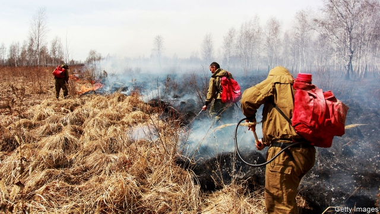
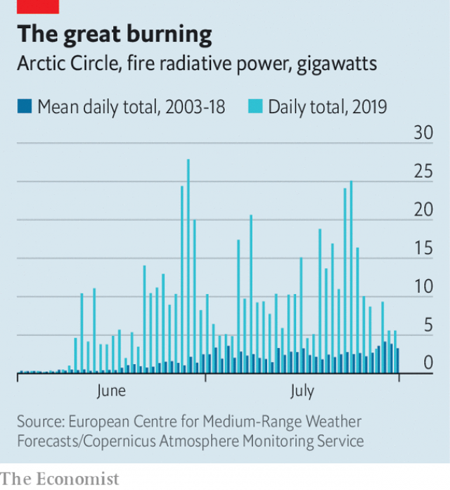

###### Ice and fire

# The Arctic is ablaze 

 

> print-edition iconPrint edition | Europe | Aug 1st 2019 

THE EASTERN SIBERIAN landscape does not normally resemble hell. In winter it is blanketed in snow; in summer, its forests are lush and its wetlands soggy. This year, however, the region is on fire, as are large parts of the Arctic Circle. 

Nothing on this scale has been observed since high-resolution satellite records of fires in the globe’s far north began in 2003 (see chart). A study in 2013 suggests that even the amount of burning seen in boreal regions in recent decades was outside the norm for the past 10,000 years. Researchers call this year’s events “unprecedented”. The data this summer are “insane”, says Guillermo Rein, an expert in peat fires at Imperial College in London. 

 

The fires began in June, spurred by an extremely hot and dry early summer. It was the hottest June on record, globally, according to America’s National Oceanographic and Atmospheric Administration. Temperature increases owing to global warming are not evenly distributed, and the Arctic is warming twice as fast as the rest of the planet. In the regions that are burning, temperatures peaked at 8-10°C warmer than the average from 1981 to 2010. This has dried out the landscape, producing tinder for natural forest fires that were probably ignited by lightning. 

So far, hundreds of above-ground fires have been recorded by satellites, covering hundreds of thousands of hectares in the Arctic and sub-Arctic, from Eastern Siberia to Alaska and Greenland. The European Copernicus Atmosphere Monitoring Service estimates that fires within the Arctic Circle have produced more than 100m tonnes of carbon dioxide, or roughly what Belgium emits in a year. That is a lot. But burnt vegetation can regrow within a decade, and in doing so reabsorbs much of the released carbon dioxide. 

It is what is happening below ground that most worries ecologists and climate scientists. Many of the Siberian and Alaskan fires are burning carbon-dense peat soils, which would normally be waterlogged. Peat fires produce much more carbon dioxide and methane from the combustion of carbon that has been locked in the ground for hundreds or thousands of years. Burning soil therefore eliminates important carbon sinks that cannot be replaced on any useful timescale. 

This in turn sets in motion positive feedback loops which are not accounted for in the climate projections of the Intergovernmental Panel on Climate Change. Climate researchers do cite the possibility that global warming will thaw Arctic permafrost, releasing large amounts of stored greenhouse gases. But if fires in the region become more common, that could have even bigger consequences. The emissions from this year’s fires make it more likely that the conditions will be met for peat to ignite again in coming summers, producing ever more emissions, and so on. Under these conditions, “I am convinced that it will actually be wildfires that will release much faster and bigger amounts of carbon,” rather than melting permafrost, says Mr Rein. The fires also produce a fine black soot known as black carbon which, if dropped on the Arctic sea ice by favourable winds, will darken its surface, making it more likely to absorb sunlight and melt. This decreases the reflectivity of the region as a whole (blue water absorbs more solar energy than white ice) and further increases Arctic warming. 

The full scale of the Arctic fires’ impact will not be known for months. The satellite data being used to estimate emissions from the wildfires cannot capture fires that are smouldering below the ground, which could double or triple the impact, according to Mr Rein. 

Smog from the fires is blanketing much of Siberia, from Kazakhstan to the Bering Sea, with carbon monoxide and other nasties. On July 31st, after a petition to declare a state of emergency garnered more than 800,000 signatures, President Vladimir Putin ordered the army to help fight the fires. It is likely to be too little too late. Fighting fires that have grown to such colossal sizes in remote regions with few roads is difficult or impossible. 

The task is even harder for large peat fires. In South-East Asia, peat fires are caused by local environmental change, including drainage and deforestation to make way for crops. “What is scary about the Arctic fires is that they are driven by climate change, and as such there’s very little you can do,” says Thomas Smith, who studies wildfires at the London School of Economics. “You can’t raise the water table for an area the scale of northern Alaska or Siberia.” Few natural peat fires this big have ever been successfully managed, and then only by pumping billions of gallons of water over land. The only way to deal with the spread of these fires is to slow the rate of global warming, by stepping up work on cutting greenhouse-gas emissions. Don’t hold your breath. ■ 

