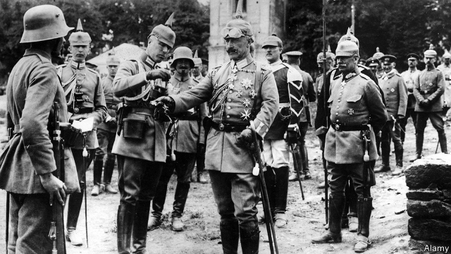

###### Hohenzollerns in hot water

# The Kaiser’s family’s claims for restitution provoke a backlash 

 

> print-edition iconPrint edition | Europe | Aug 3rd 2019 

PRINCE GEORG FRIEDRICH of Prussia is getting a lesson on how not to get the public on his side. The great-great-grandson of the last Kaiser has been in talks for years with the federal government, as well as the state governments of Berlin and Brandenburg, about the return of possessions expropriated by the Russians at the end of the second world war. A letter from his lawyer to the authorities has now been leaked to the press, provoking a vehement backlash against Wilhelm II’s Hohenzollern dynasty and its alleged support for the Nazis. 

The document reveals that the prince wants compensation of at least €1.2m ($1.3m), the right to live rent-free at Cecilienhof (the palace where American, British and Russian leaders held the 1945 Potsdam conference that settled the post-war order), as well as paintings, sculptures, books, letters, photographs and medals from various Hohenzollern houses. The requested inventory includes Cranach paintings and the armchair in which Frederick the Great died. 

The prince was perhaps naive in thinking the letter would remain confidential in Brandenburg, a state ruled by a coalition of Social Democrats and Die Linke, an ex-communist party, which is preparing for hotly contested state elections. The public reacted with Jacobin fury. “The aristocracy is not noble, but evil,” fumed Tomas Fitzel of Rundfunk Berlin-Brandenburg, a local radio station. The aristocracy robbed and extorted for centuries, tweeted Kathrin Vogler, an MP for Die Linke, adding that aristocrats are lucky Germany is not France. 

Like all families whose property was confiscated by the Russians and eastern Germany’s communist regime, the Hohenzollerns cannot claim their houses back. Yet according to legislation passed in 1994, they are entitled to restitution of mobile property, as well as the payment of compensation. The only exceptions are families that actively supported the Nazi regime. This is the sticking-point. 

If the case goes to the courts it will not be pretty. Prince Wilhelm, the son of the last Kaiser, has been called a mouthpiece for Nazi propaganda. His brother August Wilhelm was a fervent Nazi. All parties are still hoping for a settlement out of court. It is very much in the prince’s interest to make it happen.■ 

