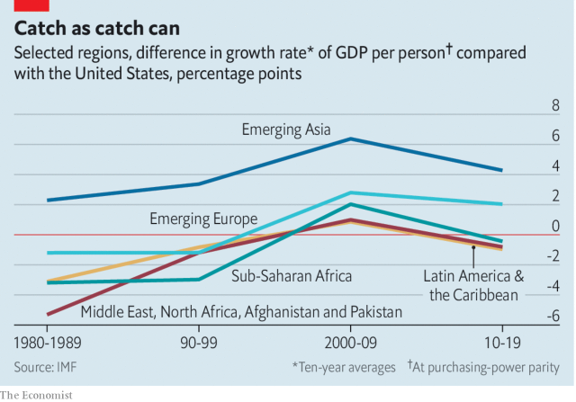

###### Free exchange

# Emerging-market dreams of rich-world incomes meet reality 

 

> print-edition iconPrint edition | Finance and economics | Aug 3rd 2019 

FOR A RICH economy, a growth rate beginning with a five would be cause for ecstasy. For India, it is a huge disappointment. Its most recent quarterly growth figure translates into an annualised rate of only 5.8%, the fourth consecutive quarterly slowdown. That is slower than China (a 6.2% annualised rate in the second quarter of 2019, down from 6.4% in the first) and substantially slower than India believes itself capable of. Recent data suggest the swoon has since deepened (and an analysis published in June by a former adviser to the Indian government also suggests that the China-like growth rates posted in the recent past may reflect dodgy statistics). India is hardly doomed; if it might reasonably have expected to do better, experience elsewhere shows it could very easily have done worse. But the slowdown is yet another sign that the emerging-market narratives to which the world has grown accustomed are in need of serious revision. 

During most of the 20th century advanced economies outgrew poorer ones. But around the turn of the millennium a dramatic shift occurred. In terms of real GDP per person, adjusted for purchasing-power parity, just 24% of the countries now classified as emerging markets by the IMF grew faster than America did across the 1980s as a whole. In the decade starting in 2000, by contrast, 76% did so. Then the BRICs—Brazil, Russia, India and China—were in their pomp. Poverty rates tumbled across developing countries and the world economic order was rewritten. 

 

Convergence continues: over the past ten years about 60% of emerging economies have grown faster than America. But the geographic scope of catch-up growth is narrowing. Real output per person as a share of that in America has fallen since 2011 in the Middle East and north Africa, since 2013 in Latin America, and since 2014 in sub-Saharan Africa. Estimates suggest decline this year in the emerging economies of Europe, leaving Asia as a last outpost of convergence—admittedly a big and important one. A wobble in India thus represents more than a blow to Indian pride. 

There are two competing explanations for the slowing of convergence. One is that the good times were never going to last. Development is hard, which is why so few poor countries became rich during the 20th century. But around 2000 an unlikely combination of tailwinds temporarily suspended this age-old truism. The emerging world found itself swept along by the most astonishing experience of economic development in history: four decades of near-double-digit annual growth in the world’s most populous country. Simultaneously, the world enjoyed an unprecedented expansion in global trade, boosted by technological changes that enabled firms to forge supply chains across dozens of national borders. And governments in the emerging world learned from past crises how best to manage foreign capital. That meant they were well placed when investors sought out better returns than the paltry ones on offer across the rich world. 

But China could perform its miraculous rise only once. Supply chains are as disaggregated as they are likely to get. And it was only a matter of time before rich economies perked up and the post-crisis period of extraordinarily easy monetary conditions came to an end. Convergence is ending, yes, but in this story there is little for countries like India to do as growth rates fall, other than wish they had made more of the moment while it lasted. 

The second theory offers the possibility that emerging markets still have room to grow. Poor countries catch up with rich ones when productivity rates and the amount of capital per worker rise towards levels in the rich world. Increasing productivity is partly about moving workers from sectors where it is low to those where it is high (from subsistence farming to textile manufacturing, say), and partly about achieving steady growth in productivity within sectors. The second of these—sustained productivity growth—is the difference between a short-lived bout of catch-up that peters out and sustained progress towards high incomes. 

During the growth spurt of the past two decades, many countries saw their stock of capital increase. Quite a few experienced periods of urbanisation and economic reform that helped pull workers into factory and office employment, at higher productivity levels. And in some economies the groundwork for sustained growth was also laid during the boom. The dense supply chains that grew up around China served as conduits for technological know-how, transmitting the elements of sustained innovation to underdeveloped economies. For India, exports of commercial services played something of the same role. India is the world’s biggest exporter of information-technology services bar Ireland, where the figures are skewed by the tax-avoiding accounting antics of American tech firms. 

If convergence is not dead, slowing rates of growth are nonetheless cause for concern. Governments may have become complacent, abandoning needed reforms and skimping on investments in productivity-enhancing things like education. India would like to overtake China, but its literacy rate, at about 70%, is lower than China managed 30 years ago. Worse, the decades-long march towards greater global openness may be ending. Amid rising economic belligerence, in particular from America, rich-world companies will naturally think twice before investing abroad. A serious breakdown in global trade, were it to occur, could harm emerging markets’ prospects for a decade or more. Such delay would be made even more devastatingly costly by climate change, which poorer countries will find harder to manage than rich ones. 

Still, there is hope. The obstacles that have sprung up in the way of development might yet be cleared. President Donald Trump could be gone in 18 months. Governments unsettled by visions of economic mortality could discover a renewed zeal for reform, investment and liberalisation. But whichever theory is right, emerging-market dominance has been exposed as anything but inevitable. To put the developing world’s billions back on the path to rich-world incomes will take heroic efforts by governments, firms and workers around the world—and a hefty dose of luck. ■ 

