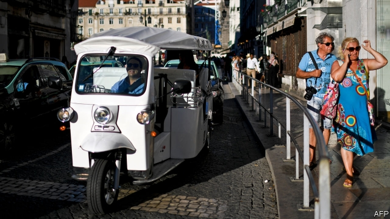

###### Golden handshake

# Portugal tries to lure emigrants back 

 

> print-edition iconPrint edition | Finance and economics | Aug 3rd 2019 

FED UP WITH politics in America, Madonna left in 2017 and set up home in Lisbon. As Portugal’s population shrinks its government might hope that others will follow the pop star. It already has a “golden visa” scheme—which gives investors the right of residence—and offers highly skilled migrants tax breaks. A new scheme, launched on July 22nd, tries to lure back emigrants, even if they are neither highly paid nor highly skilled. 

The Regressar (Return) programme is aimed at former residents who have lived outside Portugal for at least three years and are considering moving back. Returners are promised 50% off their income tax bills for five years. Those who take up jobs in Portugal receive help with the costs of relocation, such as travel, moving possessions and re-registering professional qualifications, up to a maximum of around €6,500 ($7,200). Those searching for jobs while still abroad can sign on with the Portuguese employment office. 

As the economy was struck first by the global financial crisis and then by a sovereign-debt crisis, unemployment soared, to 17% in 2013. But since then the rate has dropped below 7%, and companies now complain that both skilled and unskilled workers are in short supply. A shrinking population makes matters worse. Since 2010 it has fallen by 300,000, or 3%. More than half of the decline is caused by the number of deaths exceeding that of births. The rest is because more people left, discouraged by crisis, than arrived. Although this balance reversed in 2017, the inflow of migrants has not been big enough to offset the overall declining trend. 

Most Portuguese leavers went to other parts of Europe, though Lusophone Angola and Mozambique were also in the top ten destinations. They are younger and more skilled than those who left in previous waves, says Miguel Cabrita, the secretary of state for employment. That double loss prompted the scheme to tempt them back. 

Though many countries welcome new migrants with fiscal incentives, attempts to lure back leavers tend to be limited to those with large diasporas. China, Malaysia and Israel offer tax incentives for returners; Spain and Ireland offer help navigating bureaucracy and modest funding for those wanting to set up a business. 

Portugal’s scheme has already piqued some interest. Miguel Nuno Cardiga of BDO, a tax-advisory firm, says he has received a few inquiries from clients (including from a football player who is not eligible for the existing tax breaks). Mr Cabrita says 1,800 people from 72 countries have signed up to the job-search portal. 

But the decision to move country depends on more than tax breaks. Average yearly earnings in Portugal were a paltry €12,000 in 2018, less than half the euro-area average. White-collar workers at multinationals might hesitate to move back to Portugal if there are no comparable jobs, says Mr Nuno Cardiga. That may be changing. Google and BMW have opened tech-support centres, in Lisbon and Porto. The more good jobs, the better: most migrants know that it’s a material world.■ 

