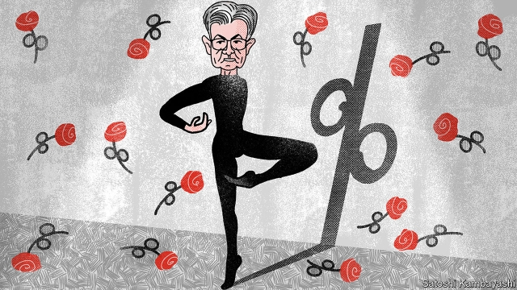
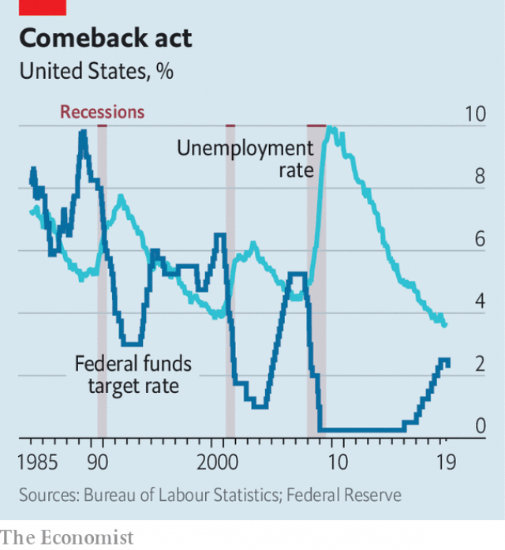

###### Turning point

# The Fed cuts rates for the first time in over a decade 

 

> print-edition iconPrint edition | Finance and economics | Aug 1st 2019 

INTEREST RATES set by the Federal Reserve have been rising since 2015. The gradual approach, explained the Fed’s chairman, Jerome Powell, last September, was intended to leave time to see how well the economy could absorb each raise. “So far the economy has performed very well, and very much in keeping with our expectations,” he said back then. 

Now America is being treated to what some are calling “Powell’s pirouette”. On July 31st Mr Powell announced America’s first interest-rate cut in over a decade, of 0.25 percentage points (see chart). At the press conference after the announcement he blamed weak global growth, trade policy uncertainty and muted inflation. “We’re trying to sustain the expansion,” he said. 

 

The move was widely expected, though not universally understood. By many measures America’s economy still seems buoyant. After dipping a little, earlier in the year, consumer confidence is almost back to its post-recovery peak. Figures published on July 26th revealed that Americans are still spending enthusiastically. Some recent risks have subsided, notably those to do with the public finances. On July 22nd politicians agreed on a deal to raise America’s debt limit, and to avoid steep spending cuts. According to Oxford Economics, a consultancy, had they failed, the squeeze could have knocked 0.4 percentage points off real GDP growth. 

But businesses do not appear to share consumers’ confidence. Non-residential investment shrank in the second quarter of the year. Residential investment has fallen for six consecutive quarters. According to the Federal Reserve Bank of New York, investors are pricing government debt at a level that has historically been associated with a one-in-three chance of a recession within 12 months. 

President Donald Trump’s trade war shows no signs of abating. The effects of the latest increase in tariffs, in mid-June, will take a few more months to become fully apparent in the data. On July 18th the IMF updated its World Economic Outlook, citing “subdued” global growth and a “precarious” projected pickup in 2020. Moreover, some of the economy’s recent resilience may have been in the expectation of the cut to come. Financial conditions have become looser since January, when Fed officials first signalled that they would be pausing interest-rate increases. Mortgage rates have also fallen since then. 

Finally, as Mr Powell emphasised on July 31st, inflation is uncomfortably weak. On a measure that excludes volatile food and energy prices, it sagged to 1.6% in June, well below the Fed’s 2% target. That has paved the way for members of the Fed’s rate-setting committee to adjust the path of interest rates downwards and to implement an “insurance cut”—a tactical reduction intended to keep the expansion alive. With interest rates so low, there is little room for an aggressive move. Rate-setters hope that a small and speedy cut will mean one will not be needed. 

As Mr Powell finished speaking on July 31st, market prices reflected a 73% chance of a further cut of 0.25 percentage points this year. But he studiously avoided committing to anything more, saying that any further cuts would depend on both incoming data and “evolving risks to the outlook”. 

A further cut would not be universally welcome. Catherine Mann of Citigroup, a bank, is sceptical that the latest round of monetary easing will boost business confidence enough to rekindle investment. The Trump administration’s trade policy, not the cost of capital, is holding businesses back, she thinks. She fears that the Fed may be causing asset prices and the broader economy to move apart, generating risks to financial stability. 

Nonetheless investors could react badly if Mr Powell fails to meet their expectations, warns Neil Shearing of Capital Economics, a consultancy. A strengthening dollar, wobbling equity markets or tightening credit conditions could then bounce the Fed into a further burst of loosening. 

America’s monetary-policymakers also need to consider the actions of other countries’ central banks, which have already started to ease. Julia Coronado of MacroPolicy Perspectives, a consultancy, points out that there are limits to how much the Fed can depart from the global trend before it starts causing problems in capital markets. Too much divergence and the dollar will strengthen, tightening supplies of dollar credit and further crimping global trade. Mr Powell has executed a fine pirouette. But he is going to need even more fancy footwork in the coming year. ■ 

-- 

 单词注释:

1.Aug[]:abbr. 八月（August） 

2.jerome[dʒә'rәum]:n. 杰罗姆（男子名） 

3.powell['pәuәl, 'pauәl]:n. 鲍威尔（英国物理学家） 

4.pirouette[.piru'et]:n. 脚尖旋转, 快速旋转 vi. 以脚尖旋转, 作快速旋转 

5.uncertainty[.ʌn'sә:tnti]:n. 不确定, 不可靠, 不确定的事物 [化] 不确定度 

6.inflation[in'fleiʃәn]:n. 胀大, 夸张, 通货膨胀 [化] 充气吹胀; 膨胀 

7.universally[ju:ni'v\\:sәli]:adv. 宇宙, 全世界, 普遍, 一般, 普通, 全体, 一致, 通用, 万能, 广用, 广泛 

8.buoyant['bɒiәnt]:a. 有浮力的, 心情愉快的 [经] 降而复升的, 保持高价的, 遂之而升的 

9.enthusiastically[in.θju:zi'æstikli]:adv. 热心地, 狂热地 

10.subside[sәb'said]:vi. 沉淀, 沉降, 平息 

11.notably['nәjtbәli]:adv. 显著地, 著名地, 尤其, 特别 

12.Oxford['ɒksfәd]:n. 牛津, 牛津大学 

13.consultancy[]:n. 商量, 协商, 磋商, 会诊, 与...商量, 咨询, 请教, 找(医生)看病, 查阅, 考虑 [经] 咨询业务, 咨询服务 

14.residential[.rezi'denʃәl]:a. 住宅的, 与居住有关的 [法] 有关居住的, 房产的:居所的, 适于居住的 

15.consecutive[kәn'sekjutiv]:a. 连续的, 联贯的 [计] 连续的; 连接的 

16.york[jɔ:k]:n. 约克郡；约克王朝 

17.investor[in'vestә]:n. 投资者 [经] 投资者 

18.historically[his'tɔrikәli]:adv. 历史上地；从历史观点上说 

19.recession[ri'seʃәn]:n. 后退, 凹处, 衰退, 归还 [医] 退缩 

20.abate[ә'beit]:vt. 减少, 减轻, 减弱, 废除, 打折扣 vi. 减轻, 减弱, 减少, 失效, 被废除 

21.tariff['tærif]:n. 关税, 关税表, 价格表, 收费表 vt. 课以关税 [计] 价目表 

22.fully['fuli]:adv. 十分地, 完全地, 充分地 

23.datum['deitәm]:n. 论据, 材料, 资料, 已知数 [医] 材料, 资料, 论据 

24.IMF[]:国际货币基金组织 [经] 国际货币基金 

25.update[ʌp'deit]:vt. 更新, 使现代化 n. 更新 [计] 更新 

26.cite[sait]:vt. 引用, 引证, 表彰 [建] 引证, 指引 

27.subdue[sәb'dju:]:vt. 使服从, 压制, 减弱, 抑制, 克制 

28.precarious[pri'kєәriәs]:a. 不稳定的, 不安的, 危险的 

29.pickup['pikʌp]:n. 拾起, 加速, 刺激, 猎物的收集, 好转, 恢复健康, 搭车者, 兴奋剂, 电视摄像 [电] 拾音器 

30.resilience[ri'ziliәns]:n. 弹回, 有弹力, 恢复力 [化] 回弹; 弹性; 弹回性; 回能; 弹能 

31.loos[]:n. 损耗, 洗手间（loo复数形式） 

32.mortgage['mɒ:gidʒ]:n. 抵押, 约束性义务, 抵押借款 vt. 抵押, 以...作担保, 把...许给 

33.emphasise[]:vt. 强调, 重读, 加强...的语气, 着重 

34.uncomfortably[ʌnˈkʌmftəbli]:adv. 不舒适地, 不自在地, 令人不快地 

35.volatile['vɒlәtail]:a. 挥发性的, 可变的, 不稳定的, 飞行的, 轻快的, 爆炸性的 n. 有翅动物, 挥发物 [计] 易失的 

36.sag[sæg]:vi. 下垂, 倾斜, 萎靡, 萧条, 变得乏味 vt. 使下垂 n. 下垂, 倾斜, 萧条 [计] 系统分析组, 语法分析生成程序, 电压下降 

37.downwards['daunwәdz]:adv. 向下 

38.tactical['tæktikl]:a. 战术的, 用兵上的, 策略的 

39.speedy['spi:di]:a. 快的, 迅速的 [经] 快的, 迅速的 

40.studiously[]:adv. 故意地；好学地；注意地 

41.incoming['inkʌmiŋ]:a. 进来的, 刚开始的, 新来的 n. 进来 

42.catherine['kæθәrin]:n. 轮圈外缘装有倒钩的车轮, 侧翻筋斗, 轮转烟火, 车轮窗 

43.mann[mæn]:n. 曼（姓氏）；曼恩法案（美国国会1910年6月通过的一项法案, 禁止州与州之间贩运妇女） 

44.citigroup[]:n. 花旗集团1998年4月6日; 花旗公司与旅行者集团宣布合并; 合并组成的新公司称为“花旗集团”; 其商标为旅行者集团的红雨伞和花旗银行的兰色字标。 

45.monetary['mʌnitәri]:a. 货币的, 金钱的 [经] 货币的, 金融的 

46.rekindle[.ri:'kindl]:vt. 再点火, 重新激起 vi. 重新燃烧 

47.asset['æset]:n. 资产, 有益的东西 

48.nonetheless[,nʌnðә'les]:conj. 然而, 尽管, 不过 adv. 不过, 仍然, 尽管如此, 然而 

49.neil[]:n. 尼尔（男子名） 

50.wobble['wɒbl]:n. 摆动, 摇晃, 不稳定, 抖动 vi. 摇晃, 摇摆, 游移不定 vt. 使摇摆, 使颤动 

51.equity['ekwiti]:n. 公平, 公正 [经] 权益, 产权 

52.tighten['taitn]:vt. 勒紧, 使变紧 vi. 变紧, 绷紧 

53.julia['dʒu:ljә]:n. 朱莉娅（女子名） 

54.coronado[]:n. (Coronado)人名；(英、西)科罗纳多 科罗纳多 

55.macropolicy[]:宏观政策 

56.divergence[dai'vә:dʒәns]:n. 分歧 [计] 分散度 

57.crimp[krimp]:n. 诱人当兵的人, 拳曲, 鬈发 vt. 诱...去当兵, 使拳曲, 使有褶 

58.footwork['futwә:k]:n. 脚的动作, 脚力, 现场采访活动 

