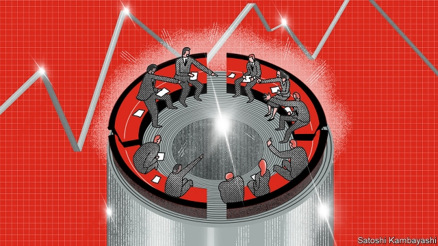

###### Buttonwood

# The LME is Europe’s only surviving “open outcry” venue 

 

> print-edition iconPrint edition | Finance and economics | Aug 3rd 2019 

HER CLIENT’S huge order would cause prices to surge if the market got wind of it. She knew she needed to be crafty. “So I shouted as loud as I could, ‘I’ll sell at £795’.” The price sank. “By now I was pointing at everyone who had bid, but because they thought I was a heavy seller they backed off, only taking 25 tonnes at a time.” At the bell, the price fell to £780. That triggered automatic sell orders. At the next session she was able to buy back her stock—plus a few thousand tonnes for her client—on the cheap. 

Every trader on the London Metal Exchange probably has a tale to tell of wrong-footed rivals. This story, told in “Ring of Truth”, a memoir by Geraldine Bridgewater, the LME’s first female trader, is from four decades ago. Little has changed. Traders still sit in a circle (the Ring) and yell orders for copper at each other, just as they have for more than a century. The LME is the only “open outcry” trading venue left in Europe. Its rituals seem as quaint as Morris dancing or the Trooping of the Colour. 

Yet somehow the LME retains its relevance. It is now owned by Hong Kong Exchanges and Clearing (HKEX). Ms Bridgewater’s big trade was for the People’s Republic of China, a client she had shrewdly cultivated. China has since become the LME’s biggest source of custom. There is a rival exchange in Shanghai; China dislikes being a taker of prices set beyond its borders. Still, the LME is where the liquidity flows to. Its staying power owes a lot to incumbency—but also to transparency. 

Metals-trading in London can be traced back as far as 1571. Back then, it happened alongside other kinds of merchant-trading on the Royal Exchange. A metals-only exchange that traded mostly copper and tin was formalised in 1877, at the peak of British industry’s global clout. In those days copper from Chile took three months to reach London. Merchants wanted to lock in the price of a shipment as it left port. That is how three-month futures became a standard. They are still the most traded LME contract today. 

Other traditions are observed. Even on a brutally hot day in July everybody is dressed smartly, the men in jackets and ties. The noise rises a little as the bell signals the start of a new session. Metals are traded in short, timed bursts to enhance liquidity. Traders sit on the red quarter-circle banquettes of the Ring. Account executives (in Ms Bridgewater’s day they were simply “clerks”) stand behind them straining to hear. They relay each quote, assisted by hand signals, to colleagues standing, with telephones cradled to each ear, in the brokers’ booths that make up an outer ring. 

It looks chaotic. It certainly sounds it. But it is striking, given the noise, how calm the traders seem. It is essential for them to remain poker-faced. When they need to be heard, they lean forward. In between yells a trader might glance up at the main board, down at his dealing card or at his watch to see exactly how much time is left (the clock on the dealer board does not count seconds). Unlike in the trading pits of Chicago, most sessions are limited to one sort of commodity. And traders sit in the same spot every day. 

Is all this fuss and noise strictly necessary? Only perhaps a tenth of trades that are cleared through the LME are agreed on in the Ring. Most are done over the phone or on the LME’s electronic trading platform. When HKEX acquired the LME in 2012, it must surely have thought it would soon be rid of the Ring. It is a costly pageant. Screen-based trading has lower overheads and is more profitable for the exchange. A lot of Ring trades are lending or borrowing between odd dates—from next Tuesday to Monday a fortnight hence, say. Only specialists want to make those kinds of bets. 

Yet they are needed to underpin a system of daily contracts that extend out to the three-month contract. They are too complex to be carried out on-screen. Daily pricing matters to the miners, smelters and manufacturers who produce or consume the metals being traded. Long-term supply arrangements are based on LME prices. So the Ring survives. It is like a poker room—a loss-leader in a casino full of more profitable slot machines. 

Some things have changed: daytime drinking is now banned. But the LME is still the place to find liquidity of the right sort. Trading could scarcely be more transparent (once you can speak the argot). Prices are trusted worldwide. Traders can feint, but must play fair. Tomorrow they will be face-to-face with the same people. You can’t help wishing that all financial markets were like this. 

