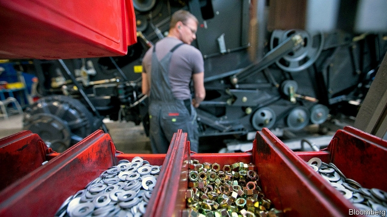
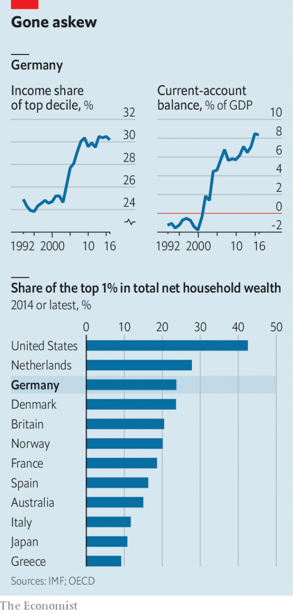

###### Getting uneven

# The Mittelstand’s corporate success comes at a cost 

 

> print-edition iconPrint edition | Finance and economics | Aug 1st 2019 

THE MITTELSTAND, exports and thrift—all are matters of German national pride. Thanks to them Germany has run the world’s biggest current-account surplus since 2016, last year just shy of $300bn (7.3% of GDP). This sign that it saves more than it invests at home, and sells abroad more than it imports, has earned the ire of President Donald Trump, who would like thrifty Teutons to buy American. 

The IMF has long wrung its hands at the savings glut. Last month, in its annual report on global imbalances, it repeated a warning that Germany’s current-account surplus was “substantially” stronger than warranted by economic fundamentals. In a separate paper it presented evidence that the growing current-account surplus was accompanied by increasing inequality (see chart). The link, it says, is high corporate profitability. 

 

Around the turn of the millennium Germany’s exports took off, as rapidly growing emerging economies started to buy its high-value-added manufacturing goods in bulk. That, together with stingier welfare benefits and government policies encouraging wage restraint, helped push up profits. But corporate success did nothing for poorer households because of a highly unequal distribution of wealth. 

Germany is one of the most unequal of the 35 countries in the OECD. The top tenth of households own 60% of net wealth. The median household has net wealth of €61,000 ($68,000), slightly more than the median for Poland, but less than the median for Greece and more than a third below the median for the euro area. The comparison may be unduly harsh, since it excludes pension wealth, which is likely to be large in Germany. But it reflects the fact that poorer Germans are less likely to own houses or shares. 

Germany’s corporate wealth tends to be kept in the family. The country has relatively few listed firms: 60% of corporate assets belong to privately owned firms. Many are family-run. Even among the publicly listed ones two-thirds are family-controlled, and controlling shareholders hold larger stakes than those in, say, Britain or Sweden. This leaves less equity for outsiders. 

Higher profits, therefore, mean higher capital incomes for the already rich. The IMF reckons that the rise in profits, together with high wealth inequality, explains about half the rise in income inequality in Germany between 2000 and 2015. One sign that the less well-off claim a smaller slice of the economic pie is that household spending fell over that period as a share of GDP. The rich tend to spend a smaller share of their incomes than the poor. German tycoons are also thriftier than their peers elsewhere. Though Germany’s authorities tend to blame an ageing society for its high savings rate, the true culprits appear to be the moguls of the Mittelstand. 

Germany’s tax system does little to counter these trends. Revenues from property taxes are relatively low and falling. Reforms in 2009 excluded business wealth from inheritance tax. As wealth accumulates, the share of income flowing to the rich rises, further widening inequality. 

Government officials say that some of these trends are reversing. The labour market has tightened, allowing wages to rise and profits to fall. But the IMF reckons that in order for disposable household incomes to regain their 2005 share of GDP, wage growth would have to outstrip nominal GDP growth by 1.5 percentage points for the next decade—a tall order. 

Policy could speed things along: tax relief for low-income households to reduce the concentration of income, and property and inheritance-tax reform to reduce the concentration of wealth. But that would mean recognising that a much-vaunted economic model is in need of repair. ■ 

-- 

 单词注释:

1.uneven[.ʌn'i:vәn]:a. 不平坦的, 不均等的, 奇数的 

2.corporate['kɒ:pәrit]:a. 社团的, 合伙的, 公司的 [经] 团体的, 法人的, 社团的 

3.Aug[]:abbr. 八月（August） 

4.Mittelstand[ˈmɪtlˌstænd]:[网络] 中小型企业；中小企业；德国中小型企业 

5.ire[aiә]:n. 忿怒 [电] 美国无线电工程师学会 

6.thrifty['θrifti]:a. 节俭的, 兴旺的, 繁茂的 

7.Teuton['tju:tn]:n. 条顿人, 日耳曼人 

8.IMF[]:国际货币基金组织 [经] 国际货币基金 

9.wring[riŋ]:n. 扭绞, 拧, 挤 vt. 拧, 绞, 扭, 勒索, 折磨, 使痛苦 vi. 蠕动, 扭动, 绞, 扭, 感到痛苦 

10.glut[glʌt]:n. 大量, 供过于求 vt. 使充满, 使吃饱, 过多供应 vi. 吃得过多, 狼吞虎咽 

11.imbalance[im'bælәns]:n. 不平衡, 不均衡 [医] 不平衡, 失调 

12.substantially[sәb'stænʃәli]:adv. 实质上, 本质上, 大体上 

13.warrant['wɒ:rәnt]:n. 授权, 正当理由, 根据, 证明, 批准, 凭证, 令状, 委任状 vt. 授权给, 保证, 担保, 批准, 使有正当理由 

14.inequality[.ini'kwɒliti]:n. 不平等, 不同, 不平坦, 不平均 n. 不平等, 不等式 [计] 不等式 

15.profitability[.prɒfitә'biliti]:n. 收益性, 利益率 [经] 可获利润率 

16.millennium[mi'leniәm]:n. 千禧年, 一千年 

17.manufacturing[.mænju'fæktʃәriŋ]:n. 制造业 a. 制造业的 

18.stingier[ˈstɪndʒi:ə]:a. 小气的, 吝啬的( stingy的比较级 ) 

19.unequal[.ʌn'i:kwәl]:a. 不相等的, 不规则的, 不能胜任的 [经] 不平均的, 不等的 

20.Oecd[]:[经] 已开发国家组织 

21.median['mi:diәn]:a. 中央的, 中间的, 正中的 n. 正中动脉, 中位数, 中线 

22.Poland['pәulәnd]:n. 波兰 

23.les[lei]:abbr. 发射脱离系统（Launch Escape System） 

24.euro['juәrәu]:n. 欧元（欧盟的统一货币单位） 

25.unduly[.ʌn'dju:li]:adv. 不适当地, 过度地 [法] 过分的, 过度的, 不正当的 

26.asset['æset]:n. 资产, 有益的东西 

27.privately[]:adv. 秘密地；私下地 

28.shareholder['ʃєә.hәuldә]:n. 股东 [法] 股东, 股票持有人 

29.Sweden['swi:dn]:n. 瑞典 

30.equity['ekwiti]:n. 公平, 公正 [经] 权益, 产权 

31.outsider[' aut'saidә]:n. 外人, 局外人, 非会员, 外行, 门外汉, 比赛中获胜可能性不大的选手 [经] 外船公司 

32.reckon['rekәn]:vt. 计算, 总计, 估计, 认为, 猜想 vi. 数, 计算, 估计, 依赖, 料想 

33.tycoon[tai'ku:n]:n. 企业界大亨, 将军 [经] 企业界巨头, 企业家 

34.thriftier[ˈθrɪfti:ə]:a. 节俭的( thrifty的比较级 ); 节约的; 茁壮的; 茂盛的 

35.peer[piә]:n. 同等的人, 匹敌, 贵族 vi. 凝视, 窥视, 费力地看, 隐现 vt. 与...同等, 封为贵族 

36.culprit['kʌlprit]:n. 犯人, 罪犯, 刑事被告 [法] 犯罪者, 犯人, 罪犯 

37.mogul[mәu'^ʌl, 'mәu^ʌl]:n. 大人物, 有权势的人 

38.Mittelstand[ˈmɪtlˌstænd]:[网络] 中小型企业；中小企业；德国中小型企业 

39.inheritance[in'heritәns]:n. 遗传, 遗产 [医] 遗传 

40.tighten['taitn]:vt. 勒紧, 使变紧 vi. 变紧, 绷紧 

41.disposable[dis'pәuzәbl]:a. 可任意处理的 [法] 可任意处理或处置的, 可自由使用的 

42.regain[ri'gein]:vt. 取回, 恢复, 重回, 复得 [化] 回潮 

43.outstrip[.aut'strip]:vt. 追过, 胜过, 凌驾 

44.nominal['nɒminl]:a. 名义上的, 名字的, 有名无实的, 稍许的 n. 名词性词 

