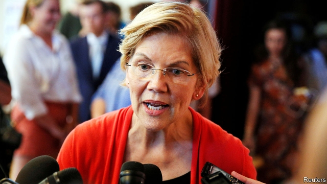

###### Pick your poison

# What Wall Street thinks of Elizabeth Warren 

 

> print-edition iconPrint edition | Finance and economics | Aug 1st 2019 

CONVERSATIONS WITH bankers about the Democratic primaries invariably turn to Elizabeth Warren, a senator for Massachusetts. That is not because they like her. Most would prefer to see the Democratic ticket headed by Joe Biden, who leads the polls, or Pete Buttigieg, a business-friendly mayor from Indiana. They know Ms Warren as the candidate who wants to break up big banks, bring in a wealth tax and make private-equity firms liable for the debt of companies they buy. After the crisis of 2008-09 she was instrumental in creating the Consumer Finance Protection Bureau, an agency to police shady practices at banks. “I took on Wall Street, and CEOs, and their lobbyists, and their lawyers,” she boasted during the second Democratic debate on July 30th—“and I beat them.” 

But mutual contempt has bred familiarity. Perhaps surprisingly, bankers are fretting just as much about a candidate who is a racing certainty to make it onto the ballot: President Donald Trump. 

Wall Street’s finest think they have already got all they are ever going to get from Mr Trump. They hoped for two things from his election in 2016: a big corporate-tax cut and sweeping revisions to Dodd-Frank, the post-crisis regulatory bill. They got their tax cut. And though Dodd-Frank was tweaked only modestly, they think there may not be much more to be gained in a second term. 

Those gains came with unexpected costs. “[Mr Trump] has been terrible for our business,” says the boss of one of Wall Street’s famous names. Investment-banking revenues were hit by a government shutdown in January, usually a busy time. The Securities and Exchange Commission, to which firms must submit documents for capital-raising, was barely functioning. Equity-underwriting revenues fell by 25% year-on-year on average in the first quarter of 2019 at the five largest investment banks. 

Banks generally do well when the economy is growing, as it is now. But revenues are harmed by economic uncertainty, when companies fret about making the sorts of strategic decisions for which a banker’s advice may be sought. Many of Mr Trump’s policies hurt them in this respect, says another investment-bank boss, for example his interference with antitrust policy and trade antagonism with China. 

With Ms Warren in the White House banks might face tougher regulation. That would be bad for business, but in ways that are easy to understand—and which would harm smaller banks more than the giants. And bankers reckon that Ms Warren’s more radical instincts could well be stymied by political gridlock. “If Elizabeth Warren is president,” says an executive at one private-equity firm, “my first question is: Did the Republicans keep the Senate?” 

A second Trump term is harder to plan for. The trade war could have knock-on effects. And Mr Trump might replace Jerome Powell, the chairman of the Federal Reserve, a frequent target of his ire. Mr Trump’s picks for the Fed’s board have been unorthodox; a new chairman fitting that pattern could have a huge effect on bank regulation and the wider economy. 

Faced with the prospect of either four more years of Mr Trump, or Ms Warren in the Oval Office constrained by a partly Republican Congress, a surprising number of bankers would opt for the latter. Still, many financiers are busy hosting fundraising dinners for Mr Buttigieg and Mr Biden, in the hope of putting a more palatable choice on the menu. ■ 

