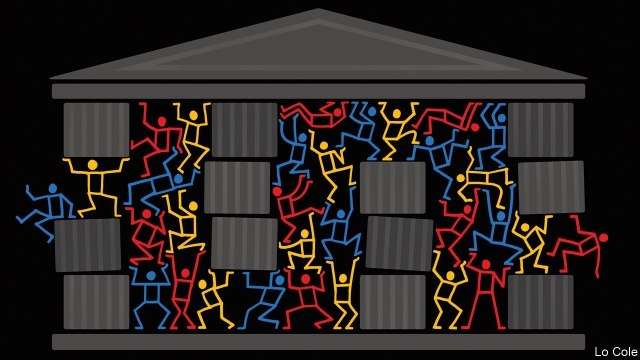
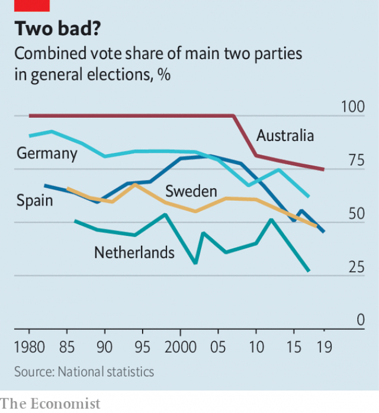

###### In office but not in power

# Are Western democracies becoming ungovernable? 

 

> print-edition iconPrint edition | International | Aug 1st 2019 

A SPECTRE IS haunting the rich world. It is the spectre of ungovernability. “Ungovernability in Italy is a great risk,” averred its former prime minister, Matteo Renzi, in 2017. “It will be impossible to govern Spain until they face the political problem in Catalonia,” predicted the spokeswoman of the Catalan regional government in February (just before that government was closed down). Emmanuel Macron, for whom to govern is to reform, warned that “France is not a reformable country”, evoking the spirit of General de Gaulle who once asked how anyone could govern a nation with 246 kinds of cheese. 

When you survey the political landscape of rich countries, you see an unusual amount of chaos and upheaval. Prague has seen the largest demonstrations since the overthrow of communism. More than a quarter of the current parliaments in Europe were elected in polls that were called early. In Britain the mother of parliaments has been at the gin bottle and opinion polls everywhere show increasing numbers of people losing patience with democratic niceties and hankering after a strongman. 

But experiencing protests or having weak governments does not make a country ungovernable. Moreover, as Tolstoy might have written, each ungovernable country is ungovernable in its own way. The problems of Italy, Spain and Britain are all different. So what, if anything, does ungovernability mean when applied to democracies? And if it is a problem, is it worse now than in the recent past? 

Ungovernability can be thought of in four ways. No Western country is ungovernable in every one. But there are a few features that exist in more than one country and a few countries that look ungovernable in more than one sense. 

First, some countries cannot form a stable government either because (in first-past-the-post systems) the largest party does not command a majority in parliament, or because (in countries with coalitions) parties cannot organise a stable alliance on the basis of election results. Spain has had three elections since the end of 2015 and may have to call a fourth following its failure to negotiate a new coalition. In Britain an election in 2017 stripped the ruling Conservatives of their majority and their subsequent period in office has been tumultuous. In both countries, stable two-party systems have given way to wobbly four- or five-party ones. (And both, incidentally, have seen the collapse of large regional governments, in Catalonia and Northern Ireland.) 

In the 28 European Union countries, eight of the most recent legislative elections were snap polls, called before the end of the normal parliamentary term. This is not a trivial share, though it does not suggest widespread chaos, either. 

More common, countries with coalition governments have suffered unusually protracted negotiations. Sweden’s lasted four months ending in January 2019; the country now has an ineffective minority government. Finland held an election in April and it took until the end of May to create a left-right coalition. These cases pale in comparison with the eight months that it took to produce a Czech government in 2018, to say nothing of the record 535 days that Belgium endured without a government in 2010-11. After its vote in 2018, Italy did manage to cobble together a coalition between populist right and populist left, though they cannot stand one another. These countries should probably be called precarious, rather than ungovernable. 

Next, ungovernability can mean that governments fail to pass basic laws on which the operations of the state depend. Spain’s could not pass a budget this year, triggering the election in April. Italy did pass its budget for 2019, but by busting the financial limits imposed by the EU, though confrontation has so far been avoided. 

Britain has seen an unprecedented failure: a thrice-repeated defeat by huge margins in the House of Commons on the most important issue of the day, Brexit. Had this happened at any other time, the government would have resigned, precipitating an election. As it was, the defeats triggered a contest for leadership of the Conservative Party, resulting in a government which expects to crash out of the EU without an agreement, pitted against a parliament determined to prevent such a thing happening (see Britain section). This is an extraordinary turn of events in a system which is not supposed to permit divided government. If Britain is sliding towards ungovernability will depend on whether it does crash out and what happens at the expected early election. At the moment, with a one- or two-seat majority, the government is running on fumes. 

But the home of failure to pass meaningful laws is the United States, where both Republicans and Democrats have given up on passing legislation until after the presidential election of 2020. This continues a long-standing failure. Appropriation (budget) bills routinely fail to be approved on time. Between 2016 and 2018, Republicans controlled both branches of government but failed in their main legislative goal, to repeal the Affordable Care Act (“Obamacare”), and did not try to win approval for a promised deal to improve America’s crumbling infrastructure. America is not ungovernable in most senses of the term but its legislature and executive are locked into paralysis. 

A third aspect of ungovernability is the systematic corruption of constitutional norms, making political processes haphazard or arbitrary. This does not always make countries ungovernable. Sometimes, as recently in Hungary, for example, it does the opposite, increasing state power at the expense of democratic checks and balances. But the undermining of norms can also hamper decision-making, as in Britain. There, cabinet responsibility and party discipline have broken down, ministers break the ministerial code of conduct and traditions of parliamentary procedure, such as holding a Queen’s Speech to outline legislative proposals, are ignored. 

America is not quite as bad. But President Donald Trump shut down the federal government twice in a year—compared with once in Barack Obama’s eight years. The second Trump shutdown, in 2018-19, was the longest in history. Mr Trump has flouted Congress over a tax law and urged his administration to resist Congressional requests for information. The former British ambassador to Washington called his administration dysfunctional, unpredictable, faction-riven, diplomatically clumsy and inept. And that is the view of America’s friends. America’s political system is not designed to operate smoothly. But it is becoming dysfunctional in ways the framers never envisaged. 

Western countries are not ungovernable in the sense of paralysed by riots or crises. They have not lost control of the streets. Nor are they Congo. But their governments are riven by disputes and are too weak to implement big reforms—to pensions, say, or social care. They are not impossible to govern in the sense of chaotic or anarchic but more than a few are ungovernable in the sense that their governments cannot do anything of importance. 

Lastly, the past year has seen a return to the streets of mass demonstrations. In France, the gilets jaunes (yellow jackets), a populist grassroots movement, have blocked roads and staged some of the most violent demonstrations the country has seen since 1968. In Britain campaigners against Brexit claimed 1m people joined a demonstration in London in March 2019, which would make it one of Britain’s largest-ever rallies. Prague has seen the largest demonstrations since the Velvet revolution of 1989. And there have been smaller anti-government rallies in Spain, Serbia, Hungary and Slovakia in 2018-19. 

The nature of these demonstrations, however, is a reminder of what today’s ungovernability is not. It is not mob rule. No one is burning down the presidential palace or executing the king. Protests in Western capitals have mostly been placid compared with the 1960s and 1970s. During riots after the assassination of Martin Luther King in 1968, machineguns were posted on the steps of the Capitol. 

That point of comparison suggests an odd feature of contemporary politics: it turns the experience of the 1970s upside down. Then, inflation was rampant, unemployment high and strikes common. There were riots and assassinations and, in America, conscription into an unpopular war. Yet, with exceptions such as the Watergate scandal, the business of government continued to rumble along. Within a couple of years of the riots in 1968, Richard Nixon had set up the Environmental Protection Agency; de Gaulle won a legislative election just after the Paris événements. Paul Keating, later Australia’s prime minister, said of his country’s government in the 1980s that “the dogs may bark but the caravan moves on” (ie, the government kept going, critics notwithstanding). Now, matters seem to be reversed. Inflation is tamed, unemployment is low and wages are inching up. But governments are stalemated. Compared with the 1970s, societies are less disorderly but politics is more so. 

Perhaps this will prove short-lived. Maybe politicians are just facing a temporary double-whammy of unpopularity. Voters are not giving them credit for economic recovery and are angry about the costs of austerity. If so, governments might one day reap electoral rewards and normal governance will resume. 

But longer-term trends seem against that, notably the secular decline of large political parties which has gone furthest in Europe (see chart). At their height, the two largest parties in Britain, Spain and Germany were winning 80-90% of the vote. Now, they are down to two-thirds or less. 

 

In 1960, 15% of electorates in western Europe were affiliated with a party. Now the share is below 5%. Britain’s two big parties were once the largest civic organisations in the country. Now their combined membership is less than that of the Royal Society for the Protection of Birds. 

Membership of unions and churches has fallen, marginalising the institutions that buttressed the centre-left and centre-right, respectively. And, except in America, voters are more fickle. Alessandro Chiaramonte of the University of Florence and Vincenzo Emanuele of Luiss University in Rome found that 8% of European voters changed their votes between national elections in 1946-68; in 1969-91, 9% did so; in 1992-2015, 13% changed their minds. 

Everywhere, parties are finding it harder to recruit and retain members and to mobilise voters. Parties are the organising forces of parliamentary democracy. They pick candidates, approve manifestos and get out the vote. Coalitions usually revolve around one large party. If parties continue to decline, political systems are likely to become at least more fluid, and at worst harder to govern. ■ 

-- 

 单词注释:

1.Aug[]:abbr. 八月（August） 

2.spectre['spektә]:n. 幽灵, 妖怪, 凶兆 

3.haunt[hɒ:nt]:n. 常到的地方, 生息地 vt. 常到, 出没于, 萦绕于 vi. 出没, 作祟 

4.spectre['spektә]:n. 幽灵, 妖怪, 凶兆 

5.ungovernability[]:[网络] 不可治理性；无法治理；不可管治 

6.ungovernability[]:[网络] 不可治理性；无法治理；不可管治 

7.aver[ә'vә:]:vt. 断言, 坚称 [法] 立证, 证明, 确证 

8.matteo[]:马泰奥（人名） 

9.renzi[]:[网络] 黎恩济 

10.Spain[spein]:n. 西班牙 

11.catalonia[,kætә'lәjniә]:n. 加泰罗尼亚（西班牙东北地方） 

12.spokeswoman['spәuks,wumәn]:n. 女发言人, 女代言人 

13.Catalan['kætәlәn]:n. 加泰隆人, 加泰隆语 

14.regional['ri:dʒәnәl]:a. 地方的, 地域性的 [医] 区的, 部位的 

15.emmanuel[i'mænjuәl]:n. 以马内利（耶稣基督的别称）；伊曼纽尔（男子名, 等于Immanuel） 

16.macron['mækrәn]:n. 长音符号 

17.reformable[ri'fɒ:mәbl]:a. 可改正的, 可改革的, 可感化的 [法] 可改造的, 能改过自新的, 可革除的 

18.evoke[i'vәuk]:vt. 唤起, 引起, 召(魂) [法] 提审, 移送 

19.de[di:]:[化] 非对映体过量 [医] 铥(69号元素铥的别名,1916年Eder离得的假想元素) 

20.Gaulle[]:高尔（人名） 

21.landscape['lændskeip]:n. 风景, 山水, 风景画 vi. 从事景观美化 vt. 美化...景观 [计] 横向 

22.chao[]:n. 钞（货币） 

23.upheaval[ʌp'hi:vl]:n. 举起, 隆起, 大变动, 剧变 

24.Prague[prɑ:g]:n. 布拉格 

25.demonstration[.demәn'streiʃәn]:n. 示范, 实证 [医] 示教, 实物教授 

26.overthrow[.әuvә'θrәu]:n. 推翻, 瓦解, 倾覆 vt. 打倒, 推翻, 倾覆 

27.gin[dʒin]:n. 杜松子酒, 轧棉机, 陷阱 vt. 轧棉, 用陷阱捕 

28.nicety['naisәti]:n. 美好, 准确, 精密, 拘泥细节, 纤细 

29.hanker['hæŋkә]:vi. 渴望, 热切希望 

30.strongman[ˈstrɒŋmæn]:n. 大力士 

31.ungovernable[.ʌn'gʌvәnәbl]:a. 难管制的, 难压制的, 放肆的 [法] 难控制的, 难驾驭的, 难统治的 

32.Tolstoy['tɔlstɔi]:n. 托尔斯泰（俄国小说家） 

33.cannot['kænɒt]:aux. 无法, 不能 

34.coalition[.kәuә'liʃәn]:n. 结合体, 结合, 联合 [经] 联合, 联盟 

35.alliance[ә'laiәns]:n. 联盟, 联合 [法] 同盟, 联盟, 联姻 

36.tumultuous[tju:'mʌltʃuәs]:a. 吵闹的, 纷乱的, 骚乱的 [法] 喧嚣的, 骚乱的, 凶猛的 

37.wobbly['wɒbli]:a. 摆动的, 不稳定的 

38.incidentally[.insi'dentәli]:adv. 伴随地, 偶然, 顺便 

39.legislative['ledʒislәtiv]:n. 立法机构 a. 立法的, 有立法权的 

40.parliamentary[.pɑ:lә'mentәri]:a. 国会的, 议会的, 议会制度的 

41.trivial['tiviәl]:a. 琐碎的, 不重要的, 轻微的, 平常的 

42.protract[prәu'trækt]:vt. 延长, 拖延, 伸出, 绘制 [法] 延迟, 拖延, 延长 

43.negotiation[ni.gәuʃi'eiʃәn]:n. 谈判, 磋商, 交涉 [经] 谈判, 协商 

44.ineffective[.ini'fektiv]:a. 无效的 [法] 失效的, 无效的, 效率低的 

45.Finland['finlәnd]:n. 芬兰 

46.Czech[tʃek]:n. 捷克人, 捷克语 a. 捷克的, 捷克语的, 捷克人的 

47.cobble['kɒbl]:n. 圆石, 鹅卵石 vt. 铺鹅卵石, 修, 粗粗地修补 

48.Populist['pɔpjulist]:n. 民粹派的成员 

49.precarious[pri'kєәriәs]:a. 不稳定的, 不安的, 危险的 

50.trigger['trigә]:n. 触发器, 扳机 vt. 触发, 发射, 引起 vi. 松开扳柄 [计] 切换开关 

51.bust[bʌst]:n. 半身像, 胸部, 失败, 殴打 vt. 使爆裂, 使破产 vi. 爆裂, 破产 [计] 操作错 

52.EU[]:[化] 富集铀; 浓缩铀 [医] 铕(63号元素) 

53.confrontation[.kɔnfrʌn'teiʃәn]:n. 对抗；对质；面对 

54.unprecedented[.ʌn'presidentid]:a. 空前的 [经] 空前的, 无前例的 

55.Brexit[]:[网络] 英国退出欧盟 

56.precipitate[pri'sipiteit]:n. 沉淀物, 凝结物, 结果 vt. 猛抛, 使陷入, 促成, 使沉淀 vi. 猛地落下 a. 突然的, 猛地落下的, 轻率的 

57.fume[fju:m]:n. 臭气, 烟, 激怒 vt. 熏 vi. 冒烟 

58.meaningful['mi:niŋful]:a. 意味深长的 

59.democrat['demәkræt]:n. 民主人士, 民主主义者, 民主党党员 [经] 民主党 

60.presidential[.prezi'denʃәl]:a. 总统制的, 总统的, 首长的, 统辖的 [法] 总统的, 议长的, 总经理的 

61.appropriation[әprәupri'eiʃәn]:n. 拨用, 挪用, 拨款 [经] 拨款, 挪用 

62.routinely[]:adv. 日常, 乏味, 常规, 例行 

63.repeal[ri'pi:l]:n. 废止, 撤消 vt. 废止, 撤消, 放弃 

64.affordable[]:[计] 普及型 

65.obamacare[]: 奥巴马医改计划 

66.crumble['krʌmbl]:v. (使)粉碎, (使)成为碎屑, 瓦解, 崩溃, 败落 

67.infrastructure['infrәstrʌktʃә]:n. 基础结构, 基础设施 [经] 基础设施 

68.legislature['ledʒisleitʃә]:n. 立法机关, 议会, 立法院 [法] 立法机构, 立法机关 

69.paralysis[pә'rælisis]:n. 麻痹, 停顿, 瘫痪 [医] 麻痹, 瘫痪 

70.corruption[kә'rʌpʃәn]:n. 腐败, 堕落, 贪污 [计] 论误 

71.constitutional[.kɒnsti'tju:ʃәnl]:a. 宪法的, 立宪的, 体质的 [医] 全身的; 体质的 

72.norm[nɒ:m]:n. 基准, 模范, 标准, 准则, 平均数 [化] 定额 

73.haphazard[hæp'hæzәd]:n. 偶然性, 偶然事件 a. 无计划的, 偶然的, 随便的 adv. 偶然地 

74.alway['ɔ:lwei]:adv. 永远；总是（等于always） 

75.Hungary['hʌŋgәri]:n. 匈牙利 

76.undermine[.ʌndә'main]:vt. 在...下面挖, 渐渐破坏, 暗地里破坏 [法] 暗中破坏, 以阴谋中伤伤害 

77.hamper['hæpә]:n. 食篮, 阻碍物, 食盒 vt. 阻碍, 使困累, 妨碍, 牵制 

78.ministerial[.mini'stiәriәl]:a. 部长的, 内阁的, 执政的 [法] 部长的, 部的, 公使的 

79.barack[bɑ:'ræk]:n. 巴拉克（男子名） 

80.shutdown['ʃʌtdaun]:n. 关门, 停工, 停机 [经] 停工 

81.flout[flaut]:vt. 嘲笑, 愚弄 vi. 表示轻蔑 n. 嘲笑, 愚弄, 轻视 

82.congressional[kәn'greʃәnl]:a. 会议的, 议会的, 国会的 [法] 代表大会的, 大会的, 议会的 

83.Washington['wɒʃiŋtn]:n. 华盛顿 

84.dysfunctional[dɪsˈfʌŋkʃənl]:a. 功能失调的 

85.unpredictable[.ʌnpri'diktәbl]:a. 不可预知的 

86.diplomatically[,diplә'mætikәli]:adv. 在外交上, 靠外交途径, 凭外交手腕 

87.inept[in'ept]:a. 不适当的, 不理智的, 笨拙的 [法] 不称职者, 无能的, 不符要求的 

88.framer['freimә]:n. 组成者, 构成者, 筹划者 [电] 调帧器 

89.envisage[in'vizidʒ]:vt. 面对, 正视, 想象 

90.paralyse['pærәlais]:vt. 使麻痹, 使瘫痪, 使无力, 使气馁, 终止 [医] 使麻痹, 使瘫痪 

91.riot['raiәt]:n. 暴动, 喧闹, 放纵 vi. 发动, 暴动, 纵情, 放荡 vt. 浪费, 挥霍 

92.Congo['kɔŋ^әu]:n. 刚果, 刚果河, 工夫茶 [建] 刚果, 直接刚果红 

93.rive[raiv]:vt. 撕开, 使破碎 vi. 裂开, 破裂 

94.chaotic[kei'ɒtik]:a. 混乱的, 无秩序的 [法] 混乱的, 混沌的 

95.anarchic[æ'nɑ:kik]:a. 无政府的, 无政府主义的, 无规律的 [医] 反常的 

96.lastly['lɑ:stli]:adv. 最后, 终于 

97.gilet[dʒi'lei]:n. 背心, 马甲 

98.jaune[]:[网络] 汝拉 

99.grassroot[]:n. 草根 

100.campaigner[kæm'peinә]:n. 从军者, 老兵, 竞选者 

101.rally['ræli]:n. 重振旗鼓, 集合, 群众集会, 跌停回升 v. 重整旗鼓, 集合, 恢复精神, 团结, 挖苦, 嘲笑 

102.serbia['sә:bjә]:n. 塞尔维亚（南斯拉夫成员共和国名） 

103.Slovakia[slәu'vækiә]:n. 斯洛伐克 

104.reminder[ri'maindә]:n. 提醒的人, 暗示 [经] 催单 

105.mob[mɒb]:n. 暴民, 民众, 暴徒 vt. 大举包围, 蜂拥进入, 围攻 vi. 聚众生事 

106.placid['plæsid]:a. 平静的, 温和的, 沉着的, 平稳的 

107.assassination[ә.sæsi'neiʃәn]:n. 暗杀 [法] 暗杀, 行刺 

108.Martin['mɑ:tin]:n. 马丁, 圣马丁鸟 

109.luther['lu:θә]:n. 卢瑟（男子名） 

110.machinegun[]:n. 机枪 vt. 用机枪射击, 用机枪击中 

111.Capitol['kæpitl]:n. 国会大厦, 州议会大厦, 朱比特神庙 

112.upside['ʌpsaid]:n. 上侧, 上段, 上部 [机] 上侧, 上部 

113.inflation[in'fleiʃәn]:n. 胀大, 夸张, 通货膨胀 [化] 充气吹胀; 膨胀 

114.rampant['ræmpәnt]:a. 猖獗的, 蔓生的, 猛烈的, 跃立作扑击状的 

115.conscription[kәn'skripʃәn]:n. 征兵, 募兵, 征用(制度) [法] 征兵, 征用 

116.unpopular['ʌn'pɔpjulә]:a. 不得人心的, 不受欢迎的, 不流行的 

117.watergate['wɔ:tәɡeit. 'wɔ-]:n. 水门, 水闸；水门事件 

118.rumble['rʌmbl]:n. 隆隆声, 辘辘声 vi. 发隆隆声, 辘辘响 vt. 使隆隆响, 低沉地说 

119.richard['ritʃәd]:n. 理查德（男子名） 

120.nixon['niksn]:n. 尼克松（美国第37任总统） 

121.environmental[in.vaiәrәn'mentәl]:a. 周围的, 环境的 [经] 环境的, 环保的 

122.paul[pɔ:l]:n. 保罗（男子名） 

123.Keating[]:n. 基廷（姓氏, 男子名） 

124.caravan['kærәvæn]:n. 旅行队, 有篷顶的大车 [经] 商队, 结队商贩 

125.notwithstanding[.nɒtwiθ'stændiŋ]:adv. 虽然, 尽管 prep. 尽管 conj. 虽然 

126.inflation[in'fleiʃәn]:n. 胀大, 夸张, 通货膨胀 [化] 充气吹胀; 膨胀 

127.stalemate['steilmeit]:n. 僵持状态, 僵局, 陷于困境, 胶着状况 vt. 将...逼和, 使僵持, 使陷入困境 

128.les[lei]:abbr. 发射脱离系统（Launch Escape System） 

129.disorderly[dis'ɒ:dәli]:a. 无秩序的, 乱的, 骚乱的 [法] 妨害治安的, 骚乱的, 无法无天的 

130.politic['pɒlitik]:a. 精明的, 明智的, 策略的 

131.unpopularity['ʌn.pɒpju'læriti]:n. 不受欢迎, 失人心 

132.voter['vәutә]:n. 选民, 投票人 [法] 选民, 选举人, 投票人 

133.austerity[ɒ'sterәti]:n. 朴素, 苦行, 严格, 严峻 

134.electoral[i'lektәrәl]:a. 选举人的, 选举的, (有关)选举的 [法] 选举的, 选举人的, 由选举人组成的 

135.governance['gʌvәnәns]:n. 统治, 统辖, 管理 [法] 统治, 管理, 支配 

136.notably['nәjtbәli]:adv. 显著地, 著名地, 尤其, 特别 

137.secular['sekjulә]:n. 修道院外的教士 a. 世俗的, 现世的, 长期的 

138.electorate[i'lektәrit]:n. 选民, 有选举权者, 选区 [法] 选民, 选举团, 选区 

139.affiliate[ә'filieit]:vt. 使紧密联系, 使附属, 接纳, 收养 vi. 发生联系, 参加 

140.civic['sivik]:a. 市的, 市民的, 公民的 [法] 公民的, 市民的, 公民资格的 

141.organisation[,ɔ: ^әnaizeiʃən; - ni'z-]:n. 组织, 团体, 体制, 编制 

142.membership['membәʃip]:n. 会员的资格, 全体会员, 会员数目 [法] 会员资格, 成员资格, 会籍 

143.membership['membәʃip]:n. 会员的资格, 全体会员, 会员数目 [法] 会员资格, 成员资格, 会籍 

144.marginalise['mɑ:dʒɪnəlaɪz]:v. 使显得微不足道；使处于边缘；使无实权 

145.buttress['bʌtris]:n. 拱壁, 扶壁, 支持物 vt. 支持, 以扶壁支撑 

146.fickle['fikl]:a. 变幻无常的, 浮燥的, 薄情的 

147.Alessandro[]:n. 亚历山大（男子名, 公司名）；爱丽斯（公司名, 产耳机）；阿里桑德罗（男子名） 

148.chiaramonte[]:n. (Chiaramonte)人名；(法、意)基亚拉蒙特 

149.Florence['flɒ:rәns]:n. 佛罗伦萨(意大利城市) 

150.Vincenzo[]:n. (Vincenzo)人名；(西)文森索；(意)温琴佐 

151.emanuele[]:n. (Emanuele)人名；(法、意)埃马努埃莱 

152.LUISS[]:[网络] 国际社会科学自由大学；罗马国际社会科学自由大学；罗马路易斯 

153.Rome[rәum]:n. 罗马 

154.mobilise['mәjbilɑiz]:vi.vt. 动员, 松动, 使活动, 调动, 发动 

155.manifesto[.mæni'festәu]:n. 宣言, 声明 

156.revolve[ri'vɒlv]:v. (使)旋转, 反复考虑, 循环出现 

