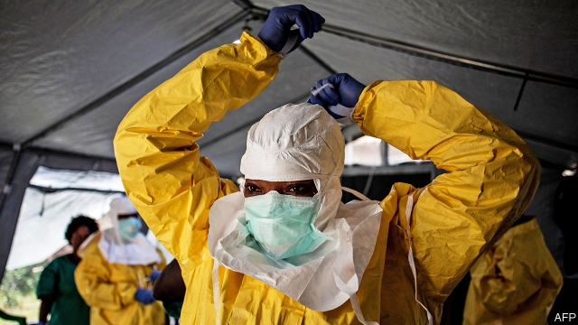

###### If it bleeds, pay heed

# Ebola is a reminder of why the world should pay attention to Congo 

 

> print-edition iconPrint edition | Leaders | Aug 3rd 2019 

WHEN CONGOLESE blood is spilled by machete-wielding militiamen, outsiders barely notice. Was the death toll from the Democratic Republic of Congo’s civil war 800,000 or 5m? No one kept an accurate tally. By contrast, when blood spills out of Congolese Ebola victims, the world pays attention. The World Health Organisation says that 1,707 people have so far died in Congo’s current Ebola outbreak. On July 17th it declared it a global health emergency. 

It is obvious why an infectious and often fatal virus concerns everyone. Unchecked, it might spread into neighbouring Uganda, Rwanda, South Sudan and beyond. More cases have been reported in the bustling border city of Goma. The world is right to take this epidemic seriously, and to pour resources into fighting it. However, it should also spare a thought for the other kind of bloodshed in Congo—not least because it makes tackling Ebola much harder. Men with guns have taken to burning down Ebola clinics and killing health workers (see article). Local bigwigs are thought to be behind some of the attacks, perhaps to drive away the NGOs that made it too hard to embezzle aid dollars. In the two Congolese provinces worst-hit by Ebola, dozens of armed groups, some with foreign backing, are fighting the state, looting minerals and preying on civilians. 

This is not just a local problem, so it matters how outsiders deal with Congo’s new government. The good news is that, after 18 years of larcenous tyranny under Joseph Kabila, Congo has a different president. The bad news is that Félix Tshisekedi did not really win the election that was held in December. Rather, he won the vote count, after a rumoured backroom deal with Mr Kabila. It is now unclear who is in charge. Mr Kabila controls the national assembly and the army. Mr Tshisekedi has executive powers that may grow with time. So far, he seems considerably less awful than his predecessor. He has released political prisoners, allowed free speech and is eager to win budget support from the IMF. Several outside powers, such as America and the World Bank, think he represents a chance of change for the better. Others are working with him because they have no choice: Ebola will not wait until Congo is a democracy. 

The most urgent task is to identify those who have been infected, treat them and vaccinate the people with whom they have come in contact. A big push now will cost less, and save more lives, than a weaker effort that lets the epidemic grow. Neighbouring countries should resist the temptation to ban travellers from Congo—many would simply sneak across borders, making it harder to monitor infections. Fighting Ebola will require some actual fighting, too. The UN peacekeeping force in Congo, which normally sticks to defending civilians, is helping the Congolese army push rebel groups that threaten aid workers out of the Ebola zone. It is right to do so. And the $1bn a year that donors spend on blue helmets in Congo is a bargain compared with other conflicts. It should not be reduced. 

In the long run, Congo needs better, cleaner government. If Mr Tshisekedi is sincere about reform, there are several things he could start doing now. His predecessor hardly built anything—Congo has whole cities without grid power. Mr Tshisekedi should work with private investors to build roads and generate electricity, without which Congo cannot properly exploit its mineral wealth, let alone move beyond it. More important, he should end the impunity that has let warlords kill and politicians steal. Some of the fatter fish should be put behind bars. To curb the smaller fry, the government should simplify the impossible tangle of rules and inspections that lets corrupt officials bully businesses into paying bribes to be left alone. Until it is easier to do business in Congo, the country will stay poor and unstable. 

Most donors do not want to reward a stolen election. But no one wants to see the collapse of a state seven times the size of Germany at the heart of Africa, either. It is too early to say whether Mr Tshisekedi’s regime will be as corrupt as its predecessors, but it might not be. Mr Kabila’s baleful influence may wane. Despots who seek to remain in charge by bequeathing their office to a puppet sometimes succeed (think of Vladimir Putin). But sometimes they fail, as in Angola, where the appalling dos Santos clan has been swept aside. Donors should offer Congo lots of technical help. And if the new regime proves serious about cleaning up its act—a big if—they should back it with cash, too.■ 
<<<<<<< HEAD

-- 

 单词注释:

1.heed[hi:d]:n. 注意, 留心 v. 注意, 留心 

2.ebola[i'bəulə]:n. 埃博拉病毒 

3.reminder[ri'maindә]:n. 提醒的人, 暗示 [经] 催单 

4.Congo['kɔŋ^әu]:n. 刚果, 刚果河, 工夫茶 [建] 刚果, 直接刚果红 

5.Aug[]:abbr. 八月（August） 

6.Congolese[,kɔŋ^ә'li:z]:n. 刚果人, 刚果语 a. 刚果的, 刚果语的, 刚果人的 

7.militiaman[mi'liʃәmәn]:n. 国民兵, 民兵 

8.outsider[' aut'saidә]:n. 外人, 局外人, 非会员, 外行, 门外汉, 比赛中获胜可能性不大的选手 [经] 外船公司 

9.toll[tәul]:n. 通行费, 代价, 钟声 vt. 征收, 敲钟, 鸣钟, 勾引, 引诱 vi. 征税, 鸣钟 

10.tally['tæli]:n. 符木, 记账, 得分, 比分, 计数器, 标签, 符合, 对应物 vt. 记录, 点数, 计算, 加标签于, 使符合 vi. 记帐, 符合, 吻合, 记分 [计] 计数 

11.Congolese[,kɔŋ^ә'li:z]:n. 刚果人, 刚果语 a. 刚果的, 刚果语的, 刚果人的 

12.organisation[,ɔ: ^әnaizeiʃən; - ni'z-]:n. 组织, 团体, 体制, 编制 

13.outbreak['autbreik]:n. 爆发, 暴动 [医] 暴发 

14.infectious[in'fekʃәs]:a. 有传染性的, 易传染的 [医] 传染性的 

15.unchecked[.ʌn'tʃekt]:a. 未加抑制的, 未经检查的 [计] 未选中的 

16.Uganda[ju(:)'^ændә, u:'^ændә]:n. 乌干达 

17.rwanda[rj'ændә]:n. 卢旺达（东非国家）；卢旺达语 

18.Sudan[su:'dæn]:n. 苏丹 [化] 苯偶氮间苯二酚; 苏丹 

19.bustle['bʌsl]:n. 喧闹, 裙撑 vi. 奔忙, 喧闹 vt. 使忙碌, 催促 

20.goma[]:abbr. general officer money allowance 将级军官货币津贴 

21.epidemic[.epi'demik]:n. 传染病, 流行病 a. 流行的, 传染性的 

22.bloodshed['blʌdʃed]:n. 流血 

23.tackle['tækl]:n. 工具, 复滑车, 滑车, 装备, 扭倒 vt. 固定, 处理, 抓住 vi. 扭倒 

24.bigwig['bigwig]:n. 要人, 大亨 

25.ngos[]:abbr. non-government organization 非政府组织，非政府机构 

26.embezzle[im'bezl]:vt. 盗用, 挪用 [经] 贪污(公款), 盗用 

27.loot[lu:t]:n. 赃物, 洗劫, 抢夺 v. 洗劫, 抢夺 

28.prey[prei]:n. 被掠食者, 牺牲者 vi. 捕食 

29.larcenous['lɑ:sәnәs]:a. 盗窃的 [法] 构成盗窃罪的, 犯盗窃罪的, 偷窃的 

30.tyranny['tirәni]:n. 专制, 暴政 [法] 苛政, 暴政, 专横 

31.Joseph['dʒәuzif]:n. 约瑟夫（男子名）；约瑟（圣经中雅各的第十一子） 

32.kabila[]:[网络] 卡比拉 

33.Félix[]:[地名] 费利克斯 ( 法、西 ) 

34.tshisekedi[]:齐塞克迪 

35.backroom['bækrum]:n. 后房, 密室 a. 在密室中的 

36.unclear[.ʌn'kliә]:a. 不易了解的, 不清楚的, 含混的 

37.considerably[kәn'sidәrәbli]:adv. 非常地, 很, 颇 

38.les[lei]:abbr. 发射脱离系统（Launch Escape System） 

39.predecessor[.predi'sesә]:n. 前任, 先辈, 前身 [医] 初牙, 前辈, 祖先 

40.IMF[]:国际货币基金组织 [经] 国际货币基金 

41.vaccinate['væksineit]:v. 预防接种 

42.traveller['trævlә]:n. 旅行者 [经] 旅行商 

43.sneak[sni:k]:vi. 鬼鬼祟祟做事 vt. 偷偷地做 n. 鬼鬼祟祟的人, 偷偷摸摸的行为, 帆布胶底运动鞋 a. 暗中进行的 

44.infection[in'fekʃәn]:n. 传染, 影响, 传染病 [医] 传染, 感染 

45.UN[ʌn]:pron. 家伙, 东西 [经] 联合国 

46.donor['dәunә]:n. 捐赠人 [化] 给体; 供体 

47.grid[grid]:n. 格子, 栅格 [计] 网格 

48.investor[in'vestә]:n. 投资者 [经] 投资者 

49.cannot['kænɒt]:aux. 无法, 不能 

50.impunity[im'pju:niti]:n. 不受惩罚, 无事, 无患 [法] 不受刑罚, 免罚, 免罪 

51.warlord['wɒ:lɒ:d]:n. 军阀, 军阀式领袖 

52.curb[kә:b]:n. 抑制, 勒马绳, 边石 vt. 抑制, 束缚, 勒住 

53.tangle['tæŋgl]:n. 缠结, 纠结的一团, 困惑, 纠纷, 混乱 vt. 使缠结, 缠住 vi. 缠结, 乱作一团 

54.bully['buli]:n. 欺凌弱小者, 土霸 vt. 威胁, 恐吓, 欺负 vi. 欺负 a. 特好的, 第一流的 adv. 十分 

55.bribe[braib]:n. 贿赂 vt. 贿赂, 收买 vi. 行贿 

56.regime[rei'ʒi:m]:n. 政权, 当权期间, 政体, 社会制度, 体制, 情态 [医] 制度, 生活制度 

57.baleful['beilful]:a. 有害的, 恶意的 

58.wane[wein]:n. 减少, 衰微, 败落, 亏缺, 月亏 vi. 变小, 亏缺, 衰落, 消逝, 退潮 

59.despot['despɒt]:n. 专制君主, 暴君 [法] 暴君, 专制君主 

60.Vladimir[vlɑ'dimɪr]:n. 弗拉基米尔（古罗斯弗拉基米尔-苏兹达里公国的古都） 

61.putin['putin]:n. 普京（人名） 

62.Angola[æŋ'^әulә]:[经] 安哥拉 

63.appalling[ә'pɒ:liŋ]:a. 骇人的, 令人震惊的 

64.dos[du:z]:磁盘操作系统 [计] 磁盘操作系统; DOS内部命令:该命令用于将DOS核心部分装入高内存区 且允许其设备驱动程序或常驻程序装入上层内存块 

65.Santos['sæntәs]:桑托斯(巴西港市) 

66.clan[klæn]:n. 氏族, 宗族, 集团 [医] 支 
=======
>>>>>>> 50f1fbac684ef65c788c2c3b1cb359dd2a904378

