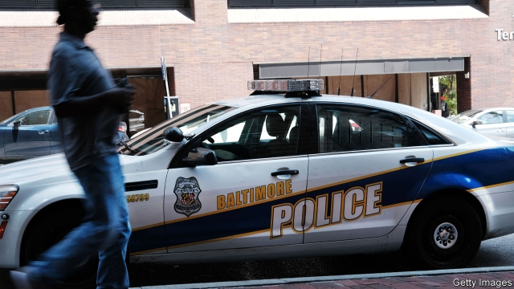

###### Saving Charm City

# How to fix Baltimore 

 

> print-edition iconPrint edition | Leaders | Aug 3rd 2019 

DONALD TRUMP likes to grab the news with a barrage of tweets. Just weeks after insulting four Democratic congresswomen, all from minority backgrounds, the president has found another target. On July 27th it was Elijah Cummings, a black Democratic congressman from Maryland’s seventh district, home to much of the city of Baltimore, who attracted the president’s wrath. Mr Cummings, who as chairman of the House Oversight Committee has been investigating Mr Trump, comes from “the worst run and most dangerous” district in America, the president jeered. Much of the city, he said, is a “disgusting, rat and rodent infested mess”, in which “no human being would want to live”. 

Mr Trump’s invective smacks of bigotry: congressmen from poor white districts do not receive insults in the same vein. And Baltimoreans are naturally seething at the contempt that their president seems to have for them. 

Yet while the president is hitting out at his foes and cranking up the politics of outrage, Baltimore’s problems are all too real. It is one of America’s great cities: Johns Hopkins University, the Victorian splendour of Fell’s Point, and an important port are assets most American mayors would dream of. But it is also deeply troubled. Since the spring of 2015, when Freddie Gray, a 25-year-old black man, died in police custody, sparking rioting that set parts of the city alight, Baltimore has struggled to hold itself together (see article). 

In 2019 the number of murders is likely to surpass 300 for the fifth year in a row, in a city of 602,000 people. Baltimore has more homicides than New York, which has 14 times more people. Last year heroin and fentanyl killed nearly three times as many people as murderers did; the overdose rate is the worst of any big American city. No wonder the population fell last year, by 1.2%. 

The causes of these problems are long-term and structural. Deindustrialisation, baleful planning and white flight all hit hard from the 1960s onwards. But the recent deterioration was not inevitable, even after the riot. And though Mr Cummings does not deserve Mr Trump’s barbs, the Democratic Party to which he belongs, and which has controlled the city of Baltimore since 1967, must take its share of responsibility. It has long struggled to get a grip on the city’s problems. In May the city’s mayor, Catherine Pugh, resigned after being investigated over a corruption scandal involving the purchase of thousands of copies of a children’s book she had written. She is the second mayor to have resigned over graft allegations in a decade. Baltimore has had five police commissioners in as many years. 

The city has many problems, from its dilapidated schools to urban deprivation and decrepit infrastructure. The most urgent, though, is the violence: people will not stay where they do not feel safe. And that is the result of appalling policing. 

Some on the left talk about cops as though they were an occupying force who need to be defeated. In fact Baltimore is far from overpoliced. Since 2002 the number of police officers has been cut by a quarter. Just over 2,500 cops cannot hope to solve over 300 murders a year. More money is needed. It should probably come from the state of Maryland, which is run by Larry Hogan, a Republican, and a Democratic legislature. Suburban voters may bristle at giving money to their poorly run neighbour, but they cannot pretend that they owe nothing to the city. 

The quid pro quo for this funding must be reform. On the right, people such as Mr Trump act as though police can stop crime only if they are allowed to rough up suspects. That is why his government has stopped issuing consent decrees (an Obama-era policy where the federal government monitors police departments accused of brutality; Baltimore has had one since 2017). But thuggery makes police departments less effective. When people do not trust cops, they will not volunteer information about crimes. And until victims are confident of justice, they will resort instead to revenge. 

Baltimore has repeatedly failed to clean up its police. It has had cops clearing street corners rather than investigating murders. Corruption and brutality have gone unpunished. Projects such as Operation Ceasefire, which stopped tit-for-tat killings in other cities, have been tried only half-heartedly. 

Unless Baltimore can get crime under control, it will continue to lose businesses and better-heeled residents and the taxes they pay. The risk is that one of America’s great metropolises enters a death spiral, as Detroit had by the 1990s. If that happens, Mr Trump’s tweets will be the least of its problems. ■ 

-- 

 单词注释:

1.charm[tʃɑ:m]:n. 吸引力, 魔力, 符咒 vt. 迷住, 使陶醉, 行魔法 vi. 用符咒, 有魅力 

2.Baltimore['bɒ:ltimɒ:]:n. 巴尔的摩 

3.Aug[]:abbr. 八月（August） 

4.grab[græb]:n. 抓握, 掠夺, 强占, 东方沿岸帆船 vi. 抓取, 抢去 vt. 攫取, 捕获, 霸占 

5.barrage['bærɑ:dʒ]:n. 弹幕, 掩护炮火 vt. 以密集炮火进攻 

6.tweet[twi:t]:vi. 啁啾 n. 小鸟叫声 

7.congresswoman['kɒŋgreswumәn]:n. 国会女议员, 众议院女议员 

8.elijah[i'laidʒә]:n. 以利亚（希伯来先知） 

9.Cumming[]:n. (Cumming)人名；(英)卡明 卡明 

10.congressman['kɒŋgresmәn]:n. 国会议员, 众议院议员 [法] 国会议会 

11.wrath[rɒ:θ]:n. 愤怒, 激怒, 愤怒的举动, (自然现象等)严酷 

12.oversight['әuvәsait]:n. 勘漏, 失察, 失败, 照料 [经] 监督权 

13.jeer[dʒiә]:n. 嘲笑, 讥讽, 戏弄 v. 嘲弄, 揶揄, 戏弄 

14.rodent['rәudәnt]:a. 咬的, 啮齿类的 n. 啮齿动物 

15.infest[in'fest]:vt. 骚扰, 寄生于, 大批出没 [医] 传染, 感染 

16.invective[in'vektiv]:n. 恶言漫骂, 臭骂 a. 漫骂的, 非难的, 恶言的 

17.smack[smæk]:n. 风味, 滋味, 少量, 拍击声, 咂嘴声, 小渔船, 海洛因 vi. 有味道, 咂嘴, 发出拍击声 vt. 拍, 打, 掴, 咂, 出声地吻 adv. 啪地一声, 猛然 

18.vein[vein]:n. 血管, 静脉, 纹理, 气质, 情绪 vt. 使有脉络, 像脉络般分布于 

19.baltimoreans['bɔ:lti'mɔ:riən]:n. 巴尔的摩人 adj. 巴尔的摩的；巴尔的摩人的 

20.sethe[]:n. (Sethe)人名；(德)泽特 

21.foe[fou]:n. 仇敌, 反对者, 敌人, 对手 

22.crank[kræŋk]:a. 不稳的, 脾气暴燥的, 易怒的 n. 曲柄, 奇想 vt. 装曲柄 vi. 转动曲柄 

23.politic['pɒlitik]:a. 精明的, 明智的, 策略的 

24.outrage['autreidʒ]:n. 暴行, 侮辱, 愤怒 vt. 凌辱, 虐待, 触犯 

25.john[dʒɔn]:n. 盥洗室, 厕所, 嫖客 

26.hopkins['hɔpkinz]:n. 霍普金（姓氏） 

27.Victorian[vik'tɔ:riәn]:a. 英国维多利亚女王时代的, 笃信宗教的, 讲究体面的 n. 维多利亚女王时代的英国人 

28.splendour['splendә]:n. 光辉, 壮丽, 显赫 

29.asset['æset]:n. 资产, 有益的东西 

30.freddie['fredi]:n. 弗雷迪（男子名, 等于Freddy） 

31.custody['kʌstәdi]:n. 监护, 拘留, 监禁 [经] 保管, 照顾, 保护 

32.riot['raiәt]:n. 暴动, 喧闹, 放纵 vi. 发动, 暴动, 纵情, 放荡 vt. 浪费, 挥霍 

33.alight[ә'lait]:vi. 落下, 偶然发现 a. 点着的 

34.surpass[sә'pɑ:s]:vt. 超越, 凌驾, 胜过 

35.homicide['hɒmisaid]:n. 杀人, 杀人者 [医] 杀人, 杀人者 

36.york[jɔ:k]:n. 约克郡；约克王朝 

37.heroin['herәuin]:n. 海洛因, 吗啡 [化] 海洛因; 二醋吗啡; 二乙酰吗啡 

38.fentanyl[fen'tænil,'fentәnil]:[化] 芬太尼 

39.overdose['әuvәdәus]:n. 配药量过多 vt. 配药过量, 使过分沉溺 

40.deindustrialisation[]:[网络] 去工业化；后工业化 

41.baleful['beilful]:a. 有害的, 恶意的 

42.onward['ɒnwәd]:a. 向前的, 前进的 adv. 向前, 前进, 在先 

43.deterioration[di.tiәriә'reiʃәn]:n. 恶化, 衰退, 退化 [医] 变坏, 变质, 颓废, 衰退 

44.barb[bɑ:d]:n. 倒钩 vt. 装倒钩于 

45.catherine['kæθәrin]:n. 轮圈外缘装有倒钩的车轮, 侧翻筋斗, 轮转烟火, 车轮窗 

46.pugh[pju:]:interj. 呸(表示轻蔑、嫌恶) 

47.corruption[kә'rʌpʃәn]:n. 腐败, 堕落, 贪污 [计] 论误 

48.graft[grɑ:ft]:n. 嫁接, 贪污 v. 嫁接, 移植, 贪污 

49.allegation[.æli'geiʃәn]:n. 断言, 主张, 申辩 [法] 声明, 事实陈述, 断言 

50.commissioner[kә'miʃәnә]:n. 委员, 理事, 行政长官 [法] 委员, 政府的特派员, 地方地官 

51.dilapidate[di'læpideit]:v. (使)荒废, (使)毁坏 

52.deprivation[.depri'veiʃәn]:n. 剥夺, 剥夺官职, 免职 [医] 丧失, 剥夺, 缺乏 

53.decrepit[di'krepit]:a. 衰老的 

54.infrastructure['infrәstrʌktʃә]:n. 基础结构, 基础设施 [经] 基础设施 

55.appalling[ә'pɒ:liŋ]:a. 骇人的, 令人震惊的 

56.cop[kɒp]:n. 警官 vt. 抓住 

57.overpoliced[]:[网络] 过度投票 

58.cannot['kænɒt]:aux. 无法, 不能 

59.Maryland['merilәnd]:n. 马里兰州 

60.Larry['læri]:n. 拉里（男子名） 

61.hogan['hәuɡәn]:n. 泥盖木屋 

62.legislature['ledʒisleitʃә]:n. 立法机关, 议会, 立法院 [法] 立法机构, 立法机关 

63.suburban[sә'bә:bәn]:a. 郊外的, 郊区的, (贬)偏狭的, 土气的, 见识不广的 n. 郊区居民 

64.voter['vәutә]:n. 选民, 投票人 [法] 选民, 选举人, 投票人 

65.poorly['puәli]:adv. 贫穷地, 不充分地, 贫乏地 a. 身体不舒服的 

66.quid[kwid]:n. 一镑金币, 一镑, 咀嚼物 

67.pro[prәu]:adv. 正面地 [计] 可编程远程操作 

68.quo[]:vt. [古]说 

69.decree[di'kri:]:n. 法令, 判决, 天意 vt. 颁布, 判决 vi. 发布命令 

70.brutality[bru:'tæliti]:n. 残忍, 无慈悲, 野蛮的行为 

71.thuggery['θʌ^әri]:n. 谋财害命 

72.les[lei]:abbr. 发射脱离系统（Launch Escape System） 

73.corruption[kә'rʌpʃәn]:n. 腐败, 堕落, 贪污 [计] 论误 

74.unpunished[.ʌn'pʌniʃt]:a. 不受处罚的, 免去刑法的 [法] 未受处罚的 

75.ceasefire[ˈsi:sfaɪə(r)]:n. （通常指永久性的）停火, 停战; 停火命令 

76.killing['kiliŋ]:n. 谋杀, 杀戮 a. 杀害的, 疲惫的, 迷人的 

77.metropolis[mi'trɒpәlis]:n. 大都市, 重要中心, 首府 [医] 产地, 生地 

78.spiral['spairәl]:n. 螺旋形之物, 螺线 a. 螺旋形的, 盘旋的 vi. 螺旋形下降, 螺旋形上升, 螺旋形行进 vt. 使螺旋形行进 

79.Detroit[di'trɒit]:n. 底特律(美国城市) 

