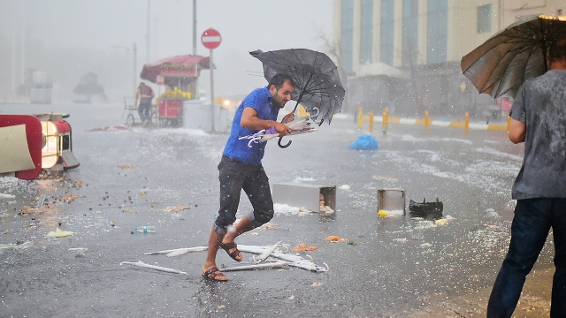
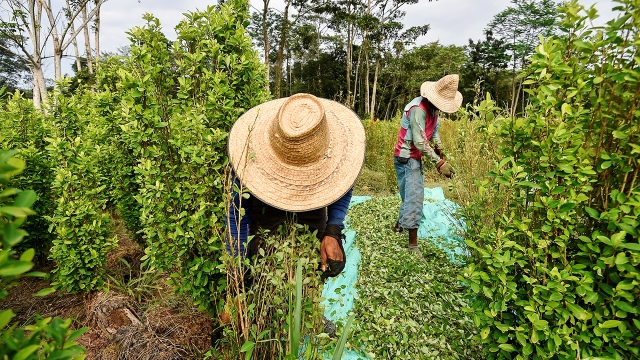
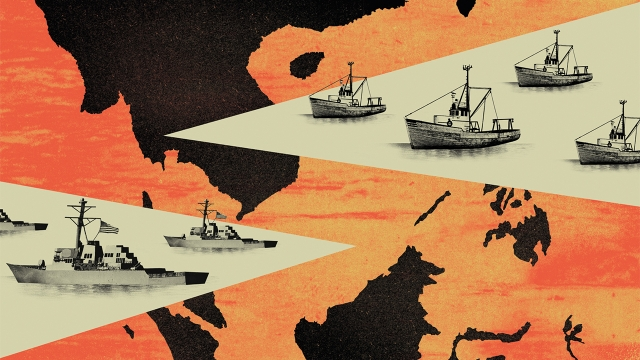

###### Letters to the editor

# On insurance, Tommy Flowers, Colombia, the future, flatmates 

> Aug 3rd 2019 

 

Your article on innovation in insurance (“Run for cover”, July 20th) did not touch on a fundamental transformation that is taking place across the life-, health- and motor-insurance markets, namely incentivising customers to be healthier and to make better choices. This acknowledges that the nature and treatment of risk has shifted, from pre-existing risk to risk driven by behavioural factors. Some 60% of mortality and 80% of the global disease burden are a function of just four lifestyle choices—lack of exercise, poor nutrition, smoking and alcohol abuse—which lead to major non-communicable diseases. 

This new approach to risk allows companies to share the gains resulting from healthier choices with their customers, by funding valuable incentives and lowering premiums, creating a shared-value loop. It has also created a more profound role for insurers: not only providing protection against adverse events, but helping make society healthier. 

ADRIAN GOREGroup chief executiveDiscovery VitalityJohannesburg 

Insurance companies are indeed clueless about the most recent advances in climate and weather modelling, even though the risks they cover are “becoming more severe and unpredictable.” But because insurers usually offer short-term contracts this problem is of only minor importance to their business at this point. It does pose more complex challenges for governments, property owners and lenders, who are in it for the long-term. 

You also lauded the innovation of “parametric insurance”, where polices pay out when clearly defined parameters, such as rainfall threshold, are reached. But the evidence suggests that when insurers tried to sell these parametric products (initially for crops in low-income countries), the take-up was very low, even when premiums were subsidised. Still too often, parametric insurance is akin to a lottery ticket, as basis risk—the lack of correspondence between the parametric trigger and experienced damage—is high. Risk modelling needs to improve before many of these products should be sold. 

ILAN NOYChair in the economics of disastersVictoria University of WellingtonWellington, New Zealand 

 

Alan Turing did not build Colossus, an electronic digital computer that made a big contribution to breaking the German Lorenz cipher in the second world war (“Due credit”, July 20th). That acclaim should go to Tommy Flowers. He got no public recognition at the time and has had precious little since. Flowers was born to a working-class family in Poplar, a poor part of east London. He was educated through an apprenticeship and by taking night classes at the University of London. He deserves to be remembered for his achievement. 

DONALD NEALHamilton, New Zealand 

 

“Blow up” (July 6th) reported on Colombia’s expanded coca cultivation and the government’s poor options for dealing with it. This illustrates only too clearly the curse that the UN drug conventions and their enforcement by America in its war on drugs have cast upon the country. There is a case that Colombia’s guerrilla movements would have made peace in the early 1990s had it not been for the cocaine revenues that gave the FARC ample means to carry on. Now, ironically, a surge in coca cultivation, that is in part a perverse result of that peace process, is fuelling a recrudescence of violence in the coca-growing areas that the FARC abandoned. 

Other countries should give Colombia time to reduce production and support its efforts in tracing assets and disrupting flows of cash, cocaine and precursor chemicals, which can be just as effective as crop eradication. In Bogotá there are concerns that American impatience might lead the administration to decertify Colombia for its slow progress. This was tried in the mid-1990s. It succeeded in getting Colombia to reintroduce extradition but also contributed to a dramatic increase in coca cultivation and paramilitary violence. There could not be a worse time for a repetition of that, with the peace process at such a delicate stage. And Colombia is America’s key ally in dealing with the Venezuelan crisis. 

SIR KEITH MORRISBritish Ambassador to Colombia, 1990-94London 

 

Scenarios should radically challenge conventional thinking, rather than just sound crazy, as the leader accompanying The World If suggests (“Navigating the rapids”, July 6th). At the Oxford Scenarios Programme, we argue that the value of scenarios lies in the actions taken as a consequence of thinking through a small set of alternative possible futures, which cannot be dismissed as crazy, and instead have sufficient connection with reality to pose credible challenges to current thinking. What may appear crazy to one member of a team is reasonable to another. What matters is making sense of the apparent strangeness or incompatibility of contrasting and different perspectives to help leaders navigate turbulence. 

Good scenarios are thus honed for a specific user, use, and purpose. Rigorous theory and method guide the use of these scenarios and help executives go beyond responding to things haphazardly. 

RAFAEL RAMIREZCHO KHONGTRUDI LANGCYNTHIA SELINFacultyOxford Scenarios Programme 

Thanks for the annual summer brain exercises in The World If. Reading about future forecasting reminds me of Isaac Asimov’s early novel, “Foundation”, in which a mathematician discovers the future. A lesson can be derived from this book: the mathematician refuses to share his findings because by doing so it would modify, and potentially annihilate, his predictions. 

In other words, by sharing a handful of speculative scenarios, you may have changed the course of history. 

CHRISTOPHE CAUVYOxford 

The future is not always conveniently packaged. Around 1990 Bell Laboratories conducted a survey among its most insightful prognosticators regarding the most significant communications technologies that would lead us into the millennium. ISDN made the list; the internet did not. As Yogi Berra (may have) said, it’s tough to make predictions, especially about the future. 

HANS MATTESPetaluma, California 

The parents of the students who refused to take Trump supporters as roommates should be asking for their tuition back (“Strange bedfellows”, July 20th). The core skill of an educated person is to be able to listen to an opposing view, engage with it, find common ground if possible, learn from it and respect it. By rejecting Trump supporters, these students mimic his behaviour by gleefully rejecting anyone who disagrees with them. 

My second thought after reading the article, is where can I find an apartment for $625 a month? 

PEGGY TROUPINNew York 
<<<<<<< HEAD

-- 

 单词注释:

1.tommy['tɒmi]:n. 配给面包, 实物工资制 [经] 实物工资制 

2.Colombia[kә'læmbiә]:n. 哥伦比亚 

3.flatmate[ˈflætmeɪt]:n. 合住一套公寓的人 

4.Aug[]:abbr. 八月（August） 

5.innovation[.inәu'veiʃәn]:n. 改革, 创新 [法] 创新, 改革, 刷新 

6.incentivising[]:[网络] 激励 

7.behavioural[bi'heivjәrәl]:a. 行为的 

8.mortality[mɒ:'tælәti]:n. 必死的命运, 死亡数目, 死亡率 [医] 必死性, 死亡率 

9.lifestyle['laifstail]:n. 生活方式 

10.incentive[in'sentiv]:n. 动机 a. 激励的 

11.premium['pri:miәm]:n. 额外补贴, 奖金, 奖赏, 保险费 [医] 保险费 

12.profound[prә'faund]:a. 极深的, 深厚的, 深刻的, 渊博的 

13.adverse['ædvә:s]:a. 不利的, 敌对的, 相反的, 逆的 [法] 相反的, 敌对的, 逆的 

14.adrian['eidriәn]:n. 艾德里安（男子名）；艾德里安市（美国密歇根州东南部城市） 

15.clueless[ˈklu:ləs]:a. 无能的, 笨的 

16.unpredictable[.ʌnpri'diktәbl]:a. 不可预知的 

17.insurer[in'ʃuәrә]:n. 保险公司 [法] 保险人, 承保人, 保险公司 

18.lender['lendә]:n. 出借人, 贷方 [经] 出借者, 贷方, 贷款人 

19.laud[lɒ:d]:n. 赞美, 称赞 vt. 赞美, 称赞 

20.parametric[,pærә'metrik]:a. 参数的, 参量的 [医] 子宫旁的 

21.parameter[pә'ræmitә]:n. 参变数, 参变量, 参数, 参量 [计] 参量; 参数 

22.threshold['θreʃәuld]:n. 门槛, 入口, 开端, 阈 [计] 阈; 阈值 

23.initially[i'niʃәli]:adv. 最初, 开头 

24.subsidise[]:vt. 给...补助金, 津贴, 资助 

25.akin[ә'kin]:a. 同类的, 同族的, 同源的 

26.lottery['lɒtәri]:n. 奖券, 彩票, 运气 [经] 抽彩给奖法 

27.correspondence[.kɒri'spɒndәns]:n. 相符, 通信, 信件 [医] 对应, 相对 

28.trigger['trigә]:n. 触发器, 扳机 vt. 触发, 发射, 引起 vi. 松开扳柄 [计] 切换开关 

29.ilan[]:abbr. integrated local area network 综合局域网 

30.zealand['zi:lәnd]:n. 西兰岛（丹麦最大的岛） 

31.alan['ælәn]:n. 艾伦（男子名） 

32.ture[]: 油温测量装置；介观结构 

33.colossus[kә'lɒsәs]:n. 巨像, 巨人 

34.Lorenz[]:n. 洛伦兹（姓氏, 奥地利动物学家） 

35.cipher['saifә]:n. 零, 暗号, 密码, 无用的东西, 阿拉伯数字 v. 计算, 做算术 

36.acclaim[ә'kleim]:n. 喝彩, 欢呼, 赞同 v. 欢呼, 喝彩, 称赞 

37.poplar['pɒplә]:n. 杨树, 杨木 [医] 杨属植物(通常指白杨) 

38.apprenticeship[ә'prentisʃip]:n. 学徒身分, 见习(期) [经] 学徒制, 学徒期 

39.coca['kәukә]:n. 古柯, 古柯叶 [医] 古柯 

40.cultivation[.kʌlti'veiʃәn]:n. 教化, 培养, 耕作 [医] 培养[法] 

41.UN[ʌn]:pron. 家伙, 东西 [经] 联合国 

42.enforcement[in'fɒ:smәnt]:n. 执行, 强制 [法] 实施, 加强, 厉行 

43.guerrilla[gә'rilә]:n. 游击队 

44.cocaine[kә'kein]:n. 可卡因, 古柯碱 [化] 可卡因; 古柯碱 

45.farc[]:abbr. Federal Addiction Research Center 联邦上瘾研究中心; Fuerzas Armadas Revolucionarias de Colombia (Spanish=Armed Revolutionary Forces of Colombia) （西班牙语）哥伦比亚武装革命力量; Federal Archives and Records Center 联邦档案履历中心; Field Artillery Replacement Center 野战炮兵补充训练中心（美军） 

46.ironically[]:adv. 冷嘲地, 挖苦地, 讽刺地, 令人啼笑皆非地 

47.surge[sә:dʒ]:n. 巨涌, 汹涌, 澎湃 vi. 汹涌, 澎湃, 颠簸, 猛冲, 突然放松 vt. 使汹涌奔腾, 急放 [计] 电压尖峰 

48.perverse[pә'vә:s]:a. 乖张的, 故意作对的, 有悖常情的, 执迷不悟的, 歪曲的, 错误的, 不正当的 [法] 邪恶的, 罪恶的:堕落的, 不合法的 

49.recrudescence[.ri:kru:'desns]:n. 复发, 再发作, 再爆发 [医] [短期后]复发(几日或几星期后) 

50.asset['æset]:n. 资产, 有益的东西 

51.disrupt[dis'rʌpt]:a. 分裂的, 中断的 vt. 使分裂, 使瓦解 

52.precursor[.pri:'kә:sә]:n. 先驱者, 前导, 前兆 [化] 前体; 前身; 产物母体 

53.eradication[i,rædi'keiʃәn]:n. 连根拔除, 歼灭, 消灭, 根除, 使断根 [医] 根除, 扑灭, 消灭 

54.impatience[im'peiʃәns]:n. 性急, 难耐, 焦急, 急躁 

55.decertify[di:'sә:tifai]:vt. 收回...的证件 

56.reintroduce[ri:intrә'dju:s]:vt. 再引进, 再介绍 

57.extradition[.ekstrә'diʃәn]:n. 引渡逃犯, 亡命者送还本国 [法] 引渡 

58.paramilitary[.pærә'militәri]:a. 辅助军事的 

59.ally['ælai. ә'lai]:n. 同盟者, 同盟国, 助手 vt. 使联盟, 使联合, 使有关系 vi. 结盟 

60.venezuelan[,venә'zweilәŋ]:a. 委内瑞拉的；委内瑞拉人的 

61.keith[ki:θ]:n. 基思（男子名） 

62.scenario[si'nɑ:riәu]:n. 剧本提纲, 情节, 剧本, 方案, 事态 [计] 方案 

63.radically['rædikәli]:adv. 根本地, 完全地 

64.navigate['nævigeit]:vi. 航行 vt. 航行于, 驾驶, 操纵, 使通过 

65.Oxford['ɒksfәd]:n. 牛津, 牛津大学 

66.cannot['kænɒt]:aux. 无法, 不能 

67.credible['kredәbl]:a. 可信的, 可靠的 [法] 可信的, 可靠的 

68.strangeness['streindʒnis]:n. 奇妙, 不可思议, 陌生 [化] 奇异性 

69.incompatibility['inkәm,pætә'biliti]:n. 互不相容的东西, 不相容 [计] 不兼容性 

70.turbulence['tә:bjulәns]:n. 混乱, 动荡, 骚乱, 紊流 [化] 湍流; 紊流 

71.hone[hәun]:n. 磨刀石, 抱怨, 想念 vt. 用磨刀石磨, 磨练 

72.rigorous['rigәrәs]:a. 严厉的, 严酷的, 严格的, 苛刻的, 严密的, 精确的 

73.haphazardly[.hæp'hæzәdli]:adv. 偶然地, 随意地；杂乱地 

74.rafael[]:n. 拉斐尔（男子名, 来源于圣经故事） 

75.isaac['aizәk]:n. 艾萨克（男人名）；以撒（希伯来族长, 犹太人的始祖亚伯拉罕和萨拉的儿子） 

76.mathematician[.mæθәmә'tiʃәn]:n. 数学家 

77.potentially[pә'tenʃәli]:adv. 可能地, 潜在地 

78.annihilate[ә'naiәleit]:vt. 消灭, 废止 

79.prediction[pri'dikʃәn]:n. 预言, 预报 [化] 预测 

80.speculative['spekjuleitiv]:a. 思索性的, 投机的, 推测的 [经] 投机的, 冒险的 

81.Christophe[]:n. 克里斯多夫（男子名） 

82.alway['ɔ:lwei]:adv. 永远；总是（等于always） 

83.conveniently[]:a. 方便, 合宜 

84.insightful['in.saitful]:a. 有深刻见解的, 富有洞察力的 

85.prognosticator[prɒg'nɒstikeitә]:n. 预言者, 占卜者 

86.millennium[mi'leniәm]:n. 千禧年, 一千年 

87.ISDN[]:综合业务数字网络 [计] 综合业务数字网 

88.yogi['jәu^i]:n. 瑜伽派教师, 教瑜伽功者 

89.berra[]:贝拉（意大利地名） 

90.han[hæn]:n. 汉朝；汉民族 

91.California[.kæli'fɒ:njә]:n. 加利福尼亚 

92.supporter[sә'pɒ:tә]:n. 支持者, 后盾, 迫随者, 护身织物 [法] 支持者, 赡养者, 抚养者 

93.roommate[]:n. 住在同室的人 

94.bedfellow['bed.felәu]:n. 同床者, 伙伴 

95.mimic['mimik]:a. 模仿的, 摹拟的 n. 效颦者, 模仿者, 小丑, 仿制品 vt. 模仿, 摹拟 

96.gleefully['ɡli:fəlɪ]:adv. 高兴地 

97.peggy['pe^i]:n. 佩吉（女子名） 

98.york[jɔ:k]:n. 约克郡；约克王朝 
=======
>>>>>>> 50f1fbac684ef65c788c2c3b1cb359dd2a904378

