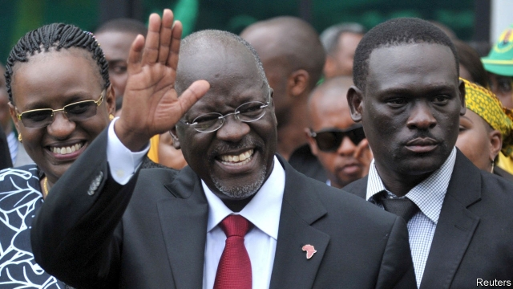

###### Tyranny in Tanzania

# Another critic of President John Magufuli is silenced 

 

> print-edition iconPrint edition | Middle East and Africa | Aug 1st 2019 

JOHN MAGUFULI, Tanzania’s president, is known as “the Bulldozer”. When he took office in 2015 the nickname was seen as a compliment: at last the East African country of 57m people had a leader who would take on graft and get things done. In his first months in charge Mr Magufuli wasted no time in cracking down on corruption (at least among his enemies). But since then the only things being squashed in Tanzania are civil liberties. 

One observer who knows this well is Erick Kabendera. A journalist, Mr Kabendera has written for the Economist Intelligence Unit, our sister company, and many other international outlets. He has documented Mr Magufuli’s abuses of power, including a proposal last year that would make it illegal to contradict official statistics. 

On July 29th Mr Kabendera was forcibly removed from his home on the outskirts of Dar es Salaam, the commercial capital, by plain-clothes policemen. His phone, and those of his wife and neighbours, were taken. The premise for the abduction is unclear and his whereabouts are unknown. 

Mr Kabendera’s arrest is not the first attack on journalists in Tanzania under Mr Magufuli. Azory Gwanda, a freelance, was abducted in 2017 and has not been seen since. At least four newspapers and two radio stations have been closed. Legislation enacted in 2016 made it harder to criticise those in power. (The East African Court of Justice says it violates press freedom.) 

Other critics of the regime, including opposition MPs, are frequently arrested. One MP, Tundu Lussu, was shot in 2017 in an assassination attempt. Companies such as Acacia Mining have been shaken down for huge tax bills. 

The repression is hurting Tanzania. Earlier this year the IMF warned that authoritarianism and arbitrary policies were crimping growth in what was once one of the continent’s fastest-growing economies. Mr Magufuli, naturally, blocked the report’s release. 

But it is the human cost that is most apparent. Tanzania was until recently a relatively liberal country in a region dotted with tyrannies. Under Mr Magufuli that reputation is in tatters. It is a story that Mr Kabendera has told. He seems to be paying the price for that.■ 
<<<<<<< HEAD

-- 

 单词注释:

1.tyranny['tirәni]:n. 专制, 暴政 [法] 苛政, 暴政, 专横 

2.Tanzania[.tænzә'ni:ә]:n. 坦桑尼亚 

3.john[dʒɔn]:n. 盥洗室, 厕所, 嫖客 

4.Aug[]:abbr. 八月（August） 

5.john[dʒɔn]:n. 盥洗室, 厕所, 嫖客 

6.bulldozer['buldәuzә]:n. 推土机 [化] 推土机 

7.nickname['nikneim]:n. 绰号, 昵称 vt. 给...取绰号, 叫错名字 [计] 绰号 

8.graft[grɑ:ft]:n. 嫁接, 贪污 v. 嫁接, 移植, 贪污 

9.corruption[kә'rʌpʃәn]:n. 腐败, 堕落, 贪污 [计] 论误 

10.squash[skwɒʃ]:n. 挤压, 压碎的东西, 南瓜属植物, 拥挤的人群 vt. 压扁, 镇压, 压制 vi. 被压扁, 发溅泼声, 挤入 

11.erick[]:n. 埃里克（人名, 等于eric） 

12.economist[i:'kɒnәmist]:n. 经济学者, 经济家 [经] 经济学家 

13.statistic[stә'tistik]:n. 统计量 a. 统计的, 统计学的 

14.forcibly['fɒ:sәbli]:adv. 强制地, 用力地 

15.dar[]:abbr. 美国革命女儿会（Daughters of the American Revolution） 

16.E[i:]:[计] 元件, 部件, 元素, 误差, 执行, 表达式, 指数 

17.salaam[sә'lɑ:m]:n. 额手礼, 问安 v. 行额手礼 

18.premise['premis]:n. 前提, 房屋连地基, 上述各项 vt. 预先提出, 引出, 作为...的前提 vi. 作出前提 

19.abduction[æb'dʌkʃәn]:n. 诱拐, 绑架, 外展 [医] 外展, 展 

20.unclear[.ʌn'kliә]:a. 不易了解的, 不清楚的, 含混的 

21.whereabout['hwεәrә.baut]:n. 行踪；下落 

22.Gwanda[]:[地名] 关达 ( 津 ) 

23.freelance[]:n. 自由作家, 自由投稿, 自由职业者 a. 自由投稿的 

24.abduct[æb'dʌkt]:vt. 诱拐, 绑架, 使外展 [医] 外展, 展 

25.enact[i'nækt]:vt. 制定法律, 扮演, 颁布 [法] 法令, 法规, 条例 

26.criticise['kritisaiz]:v. 批评, 吹毛求疵, 非难 

27.regime[rei'ʒi:m]:n. 政权, 当权期间, 政体, 社会制度, 体制, 情态 [医] 制度, 生活制度 

28.opposition[.ɒpә'ziʃәn]:n. 反对, 敌对, 相反, 在野党 [医] 对生, 对向, 反抗, 反对症 

29.MP[]:国会议员, 下院议员 [计] 宏处理程序, 维护程序, 线性规划, 微程序, 多处理器 

30.MP[]:国会议员, 下院议员 [计] 宏处理程序, 维护程序, 线性规划, 微程序, 多处理器 

31.assassination[ә.sæsi'neiʃәn]:n. 暗杀 [法] 暗杀, 行刺 

32.acacia[ә'keiʃә]:n. 洋槐, 刺槐, 阿拉伯树胶 [化] 阿拉伯胶; 金合欢胶 

33.repression[ri'preʃәn]:n. 抑制, 压抑, 制止 [医] 压抑, 抑制 

34.IMF[]:国际货币基金组织 [经] 国际货币基金 

35.authoritarianism[ə,θɔrə'tɛrɪənɪzəm]:n. 独裁主义；权力主义 

36.crimp[krimp]:n. 诱人当兵的人, 拳曲, 鬈发 vt. 诱...去当兵, 使拳曲, 使有褶 

37.tyranny['tirәni]:n. 专制, 暴政 [法] 苛政, 暴政, 专横 

38.tatter['tætә]:n. 破布条, 破衣服, 梭编工人 vt. 把...扯碎 vi. 变破烂 
=======
>>>>>>> 50f1fbac684ef65c788c2c3b1cb359dd2a904378

