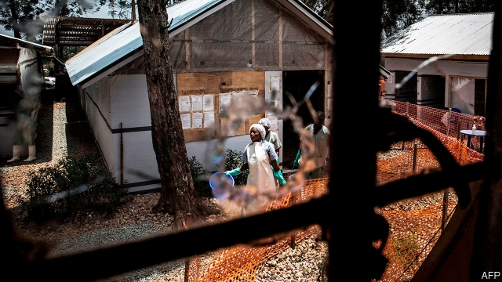
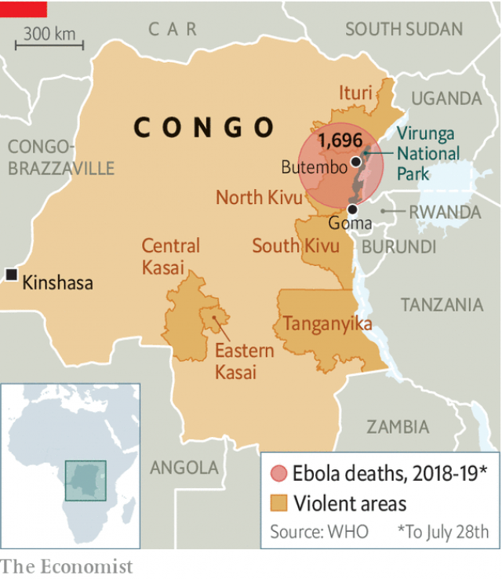
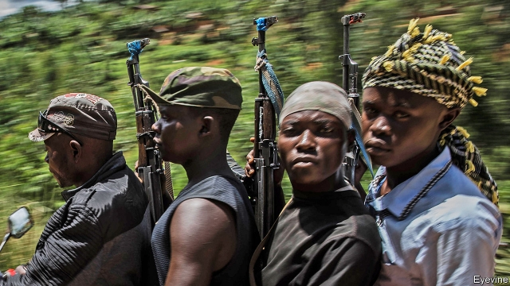

###### Congo’s challenge

# How do you reform a country where gunmen torch Ebola clinics? 

 

> print-edition iconPrint edition | Middle East and Africa | Aug 3rd 2019 

WHAT DR GRACE HANGI overheard, as she hid from the gunmen burning down the Ebola clinic where she worked, was revealing. The assailants accused the staff of “enriching” themselves. Dr Hangi escaped. But when she returned to what was left of the clinic, many patients had fled, taking the virus back to their villages. 

What happened that day in February in Butembo, a city in the north-eastern part of the Democratic Republic of Congo, is horribly common. Clinics and health workers fighting Ebola in Congo have been attacked roughly 200 times this year. To outsiders, such violence makes no sense. The clinics not only treat the sick, they also curb the spread of a virus that causes fever, bleeding and death. The current outbreak in Congo is the second-worst ever, anywhere. Some 2,700 cases have been recorded, and 1,700 people have died of it. On July 17th the World Health Organisation declared it a global emergency, citing fears that it might surge into neighbouring Uganda, Rwanda and lawless South Sudan. Donor-funded clinics and vaccines are the world’s best defence against Ebola. Alas, many Congolese do not see it that way. 

After years of kleptocracy and civil war, they expect only abuse from their government. Having been pillaged by nine foreign armies, they distrust outsiders. So when aid workers arrived in Butembo, many locals did not see them as saviours. Rather, they saw strangers in fancy four-wheel-drive cars. They assumed that these people were getting rich dishonestly, because that is what the powerful do. 

The UN peacekeepers guarding the health workers rolled around town in intimidating armoured cars. Congolese security forces sometimes rounded up the sick at gunpoint and forced them into health centres, from which some never emerged alive. The official (and true) explanation of those deaths—that they had succumbed to Ebola—was widely doubted. About 40% of locals do not believe Ebola exists, says Justus Nseo, the co-ordinator of the Ebola response in Butembo. Some local politicians help spread this dangerous myth. 

Health workers often do not even know who is attMracking them. Dozens of militia groups operate in North Kivu, the province that includes Butembo. Some attacks may be spontaneous. Others may be orchestrated by local politicians, to drive out NGOs that strive too diligently to prevent the embezzlement of donor funds. Violence often stymies the relief effort. “Not a day passes without trouble,” says Dr Nseo. 

Yet there is hope. The clinics in Butembo have been rebuilt. Suspected Ebola victims are isolated in cubes, surrounded by clear plastic sheets so that relatives can see and talk to them without risk of infection. Hand-and-foot-washing stations have sprung up all around eastern Congo to stop the spread of the virus. 

Kavo Donse, a nurse who caught Ebola from a patient, was treated in one of the newly rebuilt clinics. Her excruciating fever, headaches and bloody diarrhoea have gone. She is back at work, saving lives. She smiles ruefully at the fact that so many of her neighbours still think the virus mythical. As for the thugs who burned down the clinic? “May God forgive them,” she says. 

Reforming Congo is like fighting a deadly virus in a chaotic war zone—only trickier. The new president, Félix Tshisekedi, has vowed to make the country less poor, corrupt, violent, ill-educated, roadless and dimly lit. To do so, he must grapple with grasping warlords, crooked civil servants, an unprincipled political class and a restive population. 

That would be hard enough for a president with a popular mandate. Mr Tshisekedi has none. His predecessor, Joseph Kabila, had to bow out because he was two years beyond his term limit. Martin Fayulu, a businessman, won an election in December with 60% of the vote, according to independent estimates. Mr Kabila’s chosen successor, Emmanuel Shadary, did so badly that officials could not pretend he had won. Instead, Mr Kabila struck a deal with his least threatening opponent, Mr Tshisekedi, who was then declared the winner. 

No one believes the result, but most Congolese appear to have sighed and accepted it. Many were pleasantly surprised that Mr Kabila, a despot who had ruled for 18 years, was no longer president. No Congolese ruler had ever been peacefully replaced at the ballot box. Also, people are weary of instability. Estimates of the death toll from the last full-blown civil war, between 1998 and 2003, range from 800,000 to 5m, mostly from war-induced disease and hunger. Such uncertainty about numbers is common in Congo. No one systematically counts the living or the dead. 

The terms of Mr Tshisekedi’s alleged deal with Mr Kabila are unknown. What is clear is that the two men are tussling for power. Mr Kabila’s coalition controls two-thirds of the seats in the national assembly, and could impeach Mr Tshisekedi. Mr Tshisekedi could dissolve the assembly and demand another election. For six months, no government was formed, as the two camps squabbled over who would get which ministries. A compromise was reportedly struck on July 26th. The division of the spoils is not yet public. One analyst says that Mr Kabila has 70% of the power to Mr Tshisekedi’s 30%. But that could change. 

Mr Tshisekedi is less tyrannical than Mr Kabila. He has released 700 political prisoners and unmuzzled the media. “I no longer fear being arrested,” says Georges Kapiamba, a human-rights campaigner. Mr Tshisekedi says he wants to “dismantle the dictatorial system that was in place”. Yet he has banned several public protests. 

He travels furiously, seeking to mend Congo’s dire relations with donors and neighbours. The IMF is considering whether to offer loans. The World Bank is eager to give the new regime a chance. America supports Mr Tshisekedi, guessing that he cannot be worse than Mr Kabila. Mr Fayulu says this “is a big mistake”. 

 

Mr Tshisekedi has suspended some officials for financial mismanagement. But Mr Kabila and his cronies appear untouchable, for now. Mr Tshisekedi named a new management team for Gécamines, the atrociously run state mining giant. The minister of industry, loyal to Mr Kabila, refused to approve the appointment. In effect, the ex-president overruled the new one. Observers are unimpressed. “He needs to crush corruption. Right now. Put people in prison,” says a businessman. “I think when he says [he will fight corruption], he means it. But he doesn’t have the tools,” says a human-rights agitator. 

Mr Tshisekedi has vowed to spend money on roads, schools, health care, electricity, ports and infrastructure. A project to build flyovers in Kinshasa, the capital, has already begun (and is temporarily making congestion much worse). This is not much, but it compares favourably with Mr Kabila’s record. Unusually for a dictator, he built very little—not even to put his name on it. 

For Congo to revive, it needs a measure of peace and a government that tangibly improves people’s lives. Better roads would help, in a country four times the size of France with few good ones. So would electricity—some cities of 1m people, such as Butembo, have no grid. All these things would be easier if Mr Tshisekedi could curb corruption: the ingrained habit whereby anyone with access to public money steals it, and anyone with even a little power makes life miserable for ordinary folk in the hope of being bribed to back off. 

Security is improving, says Leila Zerrougui, the head of MONUSCO, the 16,000-strong UN peacekeeping mission in Congo. Rebel forces no longer control big towns. “The rebel groups still exist. But they are in hiding,” says an observer. 

Still, things are bad. Some 3m Congolese have been driven from their homes. Six out of 26 provinces are smouldering. The conflagrations in North Kivu, South Kivu and Ituri all involve foreign powers. Militias backed by Rwanda and Uganda energetically loot Congo’s minerals. Fighting in Eastern and Central Kasai has eased since 2017, but Tanganyika is still hot. Dozens of armed groups hide in the bush, preying on civilians. 

Thanks to Ebola, outsiders are anxious to see Congo pacified. The UN has gone beyond its usual role of protecting civilians, and is using its air power to help the Congolese army drive the ADF, a rebel group with jihadist links, out of Ebola zones. Mr Tshisekedi has suggested inviting the Ugandan army into Congo to fight the ADF, which also threatens Uganda. This would not be popular, warns Ms Zerrougui. 

The Congolese army would be more effective if its soldiers were paid properly, on time and after they retire. “You can’t expect people to die for the nation when they know that their body won’t be collected and their family will starve in the streets,” says a foreign bigwig. The army is far too big, not least because it keeps absorbing ex-rebels. Thousands have “surrendered”, joined up and carried on pillaging in a government uniform. 

It would be better, many observers reckon, if rebels who lay down their arms could be nudged into civilian jobs, or helped to become farmers. Given how little most “earn” by looting, this is possible. But government schemes to retrain ex-combatants have not always been well run. Some have been given kit to become electricians and sent to villages with no electricity. 

Lasting peace is unlikely so long as killers face no punishment. The UN has sponsored attempts to prosecute war criminals, but the process is uncertain. Justice exists “to re-establish order” and “to end impunity”, says Colonel Hippolyte Ndaka, a prosecutor in Goma. His target, Ntabo Ntaberi Cheka, a former warlord, sits in a cell nearby. Guarding him are Congolese soldiers, some of them visibly drunk or reeking of marijuana. Mr Cheka is accused of recruiting child soldiers and letting his men carry out mass rapes. Some accused women of hiding smuggled gold in their vaginas, as a pretext to strip and violate them. 

Surly and defiant in a tracksuit and flip-flops, Mr Cheka denies it all. He led a militia to defend the local population against foreign invaders, and not, as some allege, to seize local gold and tin mines. Where, he asks, are the witnesses to prove his guilt? Where, indeed? A handful of brave souls have offered to testify; faces covered, voices scrambled. Most of his alleged victims, however, are too scared. The man in the cell next to Mr Cheka’s openly toys with a mobile phone. It would be easy for the caged warlord to talk to his troops, hundreds of whom still lurk in the bush. 

For all the gloom and mayhem, most of Congo is not at war. A businessman in Kinshasa says that the fighting 2,000km away does not affect him at all. “You have plenty of rebels in Ituri and the Kivus,” he says. “It sucks. I hate it. But for them to reach my company headquarters would take years.” 

The budget is balanced. (Who will lend money to Congo?) Inflation is a modest 11%—far below its peak of 24,000% in 1994. But growth is feeble. GDP expanded by 5.8% in 2018, of which 4.4 percentage points came from mining. With population growth around 3% “most people got poorer,” says Philippe Egoumé of the IMF. 

Over dinner in a posh restaurant, four businessmen swap tales of woe. Every one of them has been arrested or assaulted. One was held in the back of a car and thumped until his two meaty assailants were tired of thumping. All complain of high taxes and constant “inspections”. One says that officials try to extort money from his firm “about once a day”. “There are 300 different taxes and they can choose which one to audit. A tax inspector who uncovers tax fraud gets to keep 25% of the fine, so they bribe your staff to do bad things.” 

Micro-entrepreneurs have it even tougher. At the “petite barrière” in Goma, a border crossing with Rwanda used by small traders, the road on the Rwandan side is well-paved and smooth. As soon as it enters Congo, it is a cratered moonscape. Push-carts loaded with sacks of grain bump and jostle through the hubbub. Police grab a trader by the neck, force him to open his backpack and accuse him of smuggling matches. Another trader reminds an official of a previous arrangement to dodge import taxes and is told to shut up because a journalist is present. 

Diodata Ruyumba, a trader, is walking into Congo with a bowl of salt fish, peanuts and onions on her head. Business is bad, she says. The Congolese franc doesn’t buy as much as it used to in Rwanda. “If we had peace we could grow enough in Congo,” she says; “The soil is richer. We have lots of land. But it’s too unsafe to farm it.” She fled her village after her grandfather was murdered and her brother shot and hospitalised. She has no idea who the killers were. 

When the state is absent or useless, others step in. Often they are malign: for example, the militias who charge locals “taxes” for “protection”. Sometimes they are benign: several big private firms in Congo build their own roads, which others can also use. An intriguing example of the interplay between such good and bad actors can be seen in the Virunga National Park, 8,000 square kilometres of forest, lake and savannah sandwiched between three live volcanoes and the Mountains of the Moon. 

Legally, the park is reserved for wildlife, including endangered mountain gorillas. No one is allowed to farm its rich volcanic soil, chop down trees or hunt game. But this is Congo. The 4m people who live within a day’s walk of Virunga often plant crops, burn wood for charcoal and poach hippos for their meat. And the many militia groups who hide in the park offer them “protection”: ie, they take a cut of everything produced illegally in the park. They also scare off tourists. 

The risk to tourists is modest—well-armed rangers, perhaps the best-trained forces in Congo, accompany them everywhere. A complex surveillance system ensures that visitors are not sent into areas where bullets are flying. But more than 170 park staff have been killed since 1996. And two British trekkers were kidnapped last year (they were released unharmed). Emmanuel de Merode, the Belgian aristocrat who runs the park, closed it to tourists for eight months while he beefed up security. The park is now open again, but the number of visitors is a paltry fraction of what it could attract. Congo is far bigger and arguably more beautiful than Kenya, yet Kenya earns 250 times as many tourist dollars. 

To keep functioning, Virunga must generate more cash and local support. That means taking on tasks normally reserved for a state. Since no one can rely on the police, the rangers protect locals from the militias, escorting convoys of vehicles through the park. The number of reported attacks on civilians there has fallen from 144 in 2015 to eight last year. The park also has checkpoints where travellers wash their hands and are tested for the high temperature that may mean they have Ebola. 

Technically, the park is an arm of the state and Mr de Merode is a government employee. But it is partly funded by a UK-based charity, and Mr de Merode has forged public-private partnerships to foster industry. The Virunga Alliance, a partnership with local people and businesses, is building roads and hydroelectric plants. It powers thousands of homes, and allows a local factory to turn vegetable oil into soap. A field has been cleared to build a chocolate factory. Mr de Merode says that every new megawatt (13 megawatts are generated jointly by the two plants already installed) creates between 800 and 1,000 jobs. Some of these go to ex-militiamen, but no more than about 10%—the park does not want young men to see taking up arms as a shortcut to a salary. The Virunga Alliance even offers legal and financial advice to small businesses. “It’s much cheaper since we got electricity from Virunga,” says Bonny Katembo, a barber who previously used a generator. “We can keep the lights on longer, charge the styling tools and have more customers each day.” It also lets him power a very loud radio. 

 

There are snags, of course. Rival power producers are often hostile. Ephrem Balole, the CEO of Virunga Energies, was jailed for three days this year for no good reason. Mr de Merode says the park could be financially self-sustaining by the end of 2022. Until then it needs donor funds, which could be a problem. As a British charity, the Virunga Foundation receives EU funds, but after Brexit it may not be eligible for them. 

Congo’s mineral wealth is often exaggerated. Annual mineral exports are barely a quarter of a dollar per head, so even if they double, which is possible, Congo will still be poor. For the country’s 85m-100m people to prosper, they will need to produce other things. Industrialisation would require an adult literacy rate of 70-80% and an electricity supply of 300 kilowatts per person, argues Charles Robertson of Renaissance Capital. Congo’s literacy rate is already high enough, but its power supply is only a third of the necessary level. It could reach it by 2030 if big proposed dam projects are completed. Industrialisation could push the economic growth rate to 7-10% a year, Mr Robertson predicts. Yves Kabongo, an investor in Kinshasa, is more cautious. Industrialisation will take “a generation, to be optimistic”, he says. ■ 

