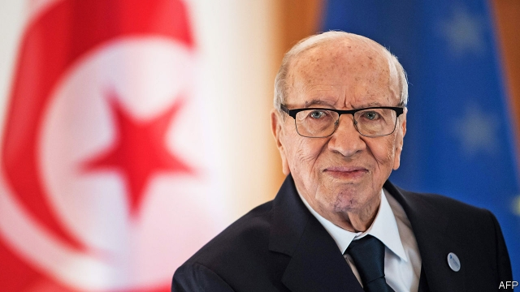

###### A fond farewell

# Tunisians say goodbye to President Beji Caid Essebsi 

 

> print-edition iconPrint edition | Middle East and Africa | Aug 3rd 2019 

THERE ARE rarely heartfelt funerals for Arab presidents. Those who pass away while in office are laid to rest in stage-managed events, more spectacle than remembrance. Others live long enough to fall out of power, and out of favour with their successors. Muhammad Morsi, Egypt’s sole democratic leader, ousted by the current president, was unceremoniously dumped into a grave in the early morning after his sudden death in June. 

The greatest tribute to Beji Caid Essebsi is that he was an exception. The president of Tunisia, the only country to emerge from the Arab spring as a democracy, died on July 25th. Mr Essebsi, who was 92, steered Tunisia’s nascent democracy through a rough patch. He also failed to fix many of its problems. But he left behind a country that held an orderly transfer of power and will elect a new democratic leader in September. For that, even his detractors were grateful. The expressions of sorrow after his death were genuine. 

An old man, a mandarin of the ancien régime, Mr Essebsi was an odd fit for the presidency of a young and newly free country. After studying law in Paris he returned home to a long string of official posts under the dictators who ruled Tunisia for half a century: ambassador to France and Germany, foreign minister, speaker of parliament. The revolution of 2011 brought a brief stint as interim prime minister. That might have been the end of his career. 

History went a different way. The first elected government after the revolt was led by Ennahda, a moderate Islamist party. In 2013, after two political assassinations sparked mass protests, it agreed to step down. Mr Essebsi returned to the scene as the head of Nidaa Tounes, a coalition of secular forces determined to unseat Ennahda. He won a presidential election in 2014 with 56% of the vote and his party gained a plurality in parliament. 

Some Tunisians compared Mr Essebsi to Abdel-Fattah al-Sisi, the general who led the coup against Mr Morsi and his Muslim Brotherhood. Before the election they joked that the only difference between the men was “a dot”, a reference to the similarity of their names in Arabic. The comparison was unfair. Though Mr Essebsi wanted a stronger presidency, he did not try to dismantle Tunisia’s democracy. Unlike Mr Sisi, who crushed the Brotherhood, Mr Essebsi struck up a friendship with Ennahda’s leader, Rachid Ghannouchi. Until last year Nidaa Tounes governed in concert with Ennahda. A few of Mr Essebsi’s pet projects were laudable, notably an effort to grant women equal rights under inheritance laws, which was approved last year. 

The economy was a constant struggle, though. An IMF-backed austerity programme outraged the public. As Mr Essebsi’s support waned, his party splintered: about half of his MPs are now aligned with other groups. Over the past year he fell out with the prime minister, Youssef Chahed, who will lead his own secular faction in parliamentary elections in October. 

The speaker of parliament, Muhammad Ennaceur, has taken over as interim president. A transition had been imminent anyway: Mr Essebsi did not plan to seek a second term, saying a younger person should hold the job. His death simply speeds up what looks to be an uncertain vote. Polls show established parties doing poorly. In June lawmakers approved amendments to the electoral law that block several popular would-be candidates, such as Nabil Karoui, a media magnate whose television channel is often critical of the government. Mr Karoui was subsequently charged with money-laundering, which would seem to scupper his chances. 

Since the uprising, Tunisia’s politics have often been reduced to a struggle between Islamists and secularists, or between entrenched labour unions and powerful businessmen linked to the old regime. The public is growing tired of these factions. Established parties are in chaos and voters are hungry for political outsiders. The next president, whoever it is, will be judged above all on his or her handling of a sluggish economy. Mr Essebsi was right: Tunisia needs a younger leader—one not caught up in the battles of the past. ■ 

-- 

 单词注释:

1.Tunisian[tju:'niziәn]:a. 突尼斯的, 突尼斯人的 n. 突尼斯人 

2.Beji[]:[网络] 贝吉 

3.caid[kɑ:'eð]:n. 酋长, 伊斯兰教法官或市政官员 

4.Essebsi[]:埃塞卜西 

5.Aug[]:abbr. 八月（August） 

6.heartfelt['hɑ:tfelt]:a. 衷心的, 真心真意的 

7.remembrance[ri'membrәns]:n. 回想, 记忆, 纪念品, 记忆力, 问候, 致意 

8.successor[sәk'sesә]:n. 继承者, 接任者 [计] 后继 

9.muhammad[]:n. 穆罕默德 

10.morsi[]: [地名] [印度] 莫尔西 

11.oust[aust]:vt. 逐出, 罢黜, 剥夺, 驱逐 [法] 驱逐, 剥夺, 免职 

12.unceremoniously[ˌʌnˌserəˈməʊniəsli]:adv. 无礼地, 粗鲁地, 唐突地 

13.tribute['tribju:t]:n. 贡物, 礼物, 颂辞 

14.Tunisia[tju:'nisiә]:n. 突尼斯 

15.nascent['næsnt]:a. 发生中的, 开始存在的, 初期的 [医] 初发的, 初生的 

16.detractor[di'træktә(r)]:n. 毁损者, 贬低者 

17.mandarin['mændәrin]:n. 中国官话, 国语, 满清官吏, 柑橘 a. (中国式)紧身马褂的 

18.ancien[]:[网络] 过去的；古战场；古希 

19.presidency['prezidәnsi]:n. 总统职权, 总裁职位 

20.dictator['dikteitә]:n. 命令者, 独裁者 

21.stint[stint]:vt. 节省, 限制, 停止 vi. 节约 n. 吝惜, 节约, 限额 

22.interim['intәrim]:a. 暂时的, 临时的, 间歇的 n. 过渡时期 

23.Islamist[iz'lɑ:mist]:n. 伊斯兰教主义者；回教教徒 

24.assassination[ә.sæsi'neiʃәn]:n. 暗杀 [法] 暗杀, 行刺 

25.coalition[.kәuә'liʃәn]:n. 结合体, 结合, 联合 [经] 联合, 联盟 

26.secular['sekjulә]:n. 修道院外的教士 a. 世俗的, 现世的, 长期的 

27.unseat['ʌn'si:t]:vt. 剥夺...的席位, 使失去资格, 使退位, 罢免, 使去职, 使退职 

28.presidential[.prezi'denʃәl]:a. 总统制的, 总统的, 首长的, 统辖的 [法] 总统的, 议长的, 总经理的 

29.plurality[.pluә'rælәti]:n. 复数, 较大的数, 多数状态, 兼职 [法] 大多数, 较多数, 复数 

30.coup['ku:]:n. 砰然的一击, 妙计, 出乎意料的行动, 政变 [医] 发作, 中, 击 

31.Muslim['mjzlim; (?@) 'mʌzlem]:n. 伊斯兰教, 伊斯兰教教徒 

32.similarity[.simi'læriti]:n. 类似, 类似处 [法] 类似, 相似, 类似事例 

33.dismantle[dis'mæntl]:vt. 拆除...的设备, 分解, 去除覆盖物 

34.sisi[]:n. (Sisi)人名；(意)西西 abbr. 短增量敏感指数（short increment sensitivity index） 

35.rachid[]:n. (Rachid)人名；(葡、阿拉伯)拉希德；(英)拉奇德 

36.laudable['lɒ:dәbl]:a. 值得赞赏的, 值得佩服的 [医] 健康的 

37.notably['nәjtbәli]:adv. 显著地, 著名地, 尤其, 特别 

38.inheritance[in'heritәns]:n. 遗传, 遗产 [医] 遗传 

39.austerity[ɒ'sterәti]:n. 朴素, 苦行, 严格, 严峻 

40.outrage['autreidʒ]:n. 暴行, 侮辱, 愤怒 vt. 凌辱, 虐待, 触犯 

41.wane[wein]:n. 减少, 衰微, 败落, 亏缺, 月亏 vi. 变小, 亏缺, 衰落, 消逝, 退潮 

42.MP[]:国会议员, 下院议员 [计] 宏处理程序, 维护程序, 线性规划, 微程序, 多处理器 

43.align[ә'lain]:vi. 排列, 排成一行, 结盟 vt. 使结盟, 使成一行, 校正 

44.youssef[]:n. (Youssef)人名；(阿拉伯)优素福 

45.faction['fækʃәn]:n. 小派系, 内讧 [法] 宗派, 派别, 小集团 

46.parliamentary[.pɑ:lә'mentәri]:a. 国会的, 议会的, 议会制度的 

47.transition[træn'ziʃәn]:n. 转变, 转换, 变迁, 过渡时期, 临时转调 [化] 跃迁 

48.imminent['iminәnt]:a. 即将来临的, 逼近的 

49.poorly['puәli]:adv. 贫穷地, 不充分地, 贫乏地 a. 身体不舒服的 

50.lawmaker[lɒ:'meikә]:n. 立法者 

51.amendment[ә'mendmәnt]:n. 修订, 改善, 改良, 改正 [化] 调理剂; 修正 

52.electoral[i'lektәrәl]:a. 选举人的, 选举的, (有关)选举的 [法] 选举的, 选举人的, 由选举人组成的 

53.nabil[]: [地名] [俄罗斯] 纳比利河 

54.karoui[]:卡鲁伊 

55.magnate['mægneit]:n. 大官, 巨头 [法] 大官, 权贵, 大资本家 

56.subsequently['sʌbsikwәntli]:adv. 后来, 随后 

57.scupper['skʌpә]:n. 甲板排水孔, 泄水口 

58.uprise[ʌp'raiz]:n. 升起, 起立, 上山坡, 出现 vi. 上升, 起义, 出现 

59.politic['pɒlitik]:a. 精明的, 明智的, 策略的 

60.Islamist[iz'lɑ:mist]:n. 伊斯兰教主义者；回教教徒 

61.secularist['sekjulәrist]:n. 现世主义者, 宗教与教育分离论者 

62.entrench[in'trentʃ]:vt. 围以壕沟, 防护, 保卫, 使处于牢固地位 vi. 掘壕, 侵犯 

63.regime[rei'ʒi:m]:n. 政权, 当权期间, 政体, 社会制度, 体制, 情态 [医] 制度, 生活制度 

64.chao[]:n. 钞（货币） 

65.voter['vәutә]:n. 选民, 投票人 [法] 选民, 选举人, 投票人 

66.outsider[' aut'saidә]:n. 外人, 局外人, 非会员, 外行, 门外汉, 比赛中获胜可能性不大的选手 [经] 外船公司 

67.sluggish['slʌgiʃ]:a. 偷懒的, 懒惰的, 迟钝的 [经] 萧条的, 呆滞的 

