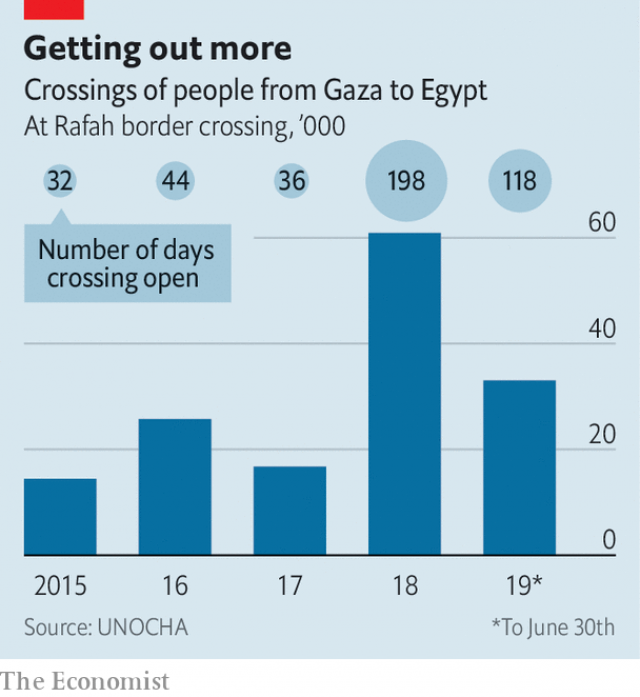

###### An exodus in reverse

# Young Palestinians are leaving Gaza in droves 

 

> print-edition iconPrint edition | Middle East and Africa | Aug 3rd 2019 

YARUB IKHDEH and his friends had been waiting half their lives to get on a bus. The six young men had never left Gaza, which has been blockaded by Israel and Egypt since 2007. They grew up in a territory where half the population is jobless and at least 70% rely on aid to survive. “We’re all recent graduates in business and IT,” says Mr Ikhdeh. “And we’re all unemployed.” 

Early on a recent morning the friends sat in a sun-baked car park in Rafah, on the border with Egypt. Each had crammed his life into a single suitcase. They would soon board a bus for Cairo, then a flight to Dubai in the United Arab Emirates (UAE). None had a job waiting in the UAE. Their tourist visas would be valid for only a month. But the mere prospect of work was enough to make them leave home. 

Gazans wanting to leave the territory have two main exits. Only a few may use the crossing at Erez, on the border with Israel. The rest are limited to Rafah. Poor relations between Egypt and Hamas, the militant Islamist group that controls Gaza, meant that it was largely sealed for years. Egypt opened the crossing for just 36 days in 2017. But since last spring, when thousands of Gazans started to protest at the border with Israel to demand the removal of the blockade, Egypt has loosened its restrictions. Last year the Rafah crossing was open for 198 days. 

 

The change set off an exodus from Gaza, which has a population of 2m. Last year there were 60,900 crossings into Egypt, three-and-a-half times more than in 2017 (see chart). About 24,000 people seem not to have returned. There were another 33,000 crossings in the first half of this year. Some of those leaving, like Mr Ikhdeh, hope to find work in the Gulf. Others fly to Turkey and attempt the perilous journey across the Mediterranean to Europe. 

Emigration has long carried a stigma among some Palestinians, a people who have fought for generations to stay on their land. Hamas does not release statistics on emigration, lest they highlight how bad life in Gaza has become during its rule. But those leaving seem to be mostly recent university graduates. Youth unemployment is thought to be about 70%. Earlier this year the education ministry advertised 300 new teaching positions. It received 43,000 applications. Those who do find work are often stuck in dead-end jobs. “I’ve been at the same company for eight years and I only earn $250 a month,” says Alaa Abu Aqleh, a business graduate also waiting to board a bus. That is half of what a low-wage job in Ramallah would pay, to say nothing of work in the Gulf. 

Not surprisingly, doctors in Gaza say dozens of their colleagues have left in recent months. Apart from low pay, medical staff must cope with daily blackouts and routine shortages of everything from baby formula to cancer drugs. Worried about a shortage of doctors, Hamas has stopped issuing them with travel permits. A poll in December found that 48% of Gaza residents want to emigrate, compared with 22% in the West Bank. “Pessimism is spreading over every corner of this place,” says Sameer Abu Mudallala, an economics professor at Al-Azhar University in Gaza. 

Egypt still caps the number of daily travellers at around 300. A waiting list runs to more than 10,000 people. Young men in particular struggle to obtain permits because of security concerns on the Egyptian side. To jump the queue Gazans pay the tanseeq, or “co-ordination”, a polite euphemism for a bribe. Brokers in Gaza collect it and distribute the money to officers in Egypt. (Hamas is also thought to take a cut, though it denies this.) Prices start at $1,000, almost triple the average monthly wage. Families sell land or gold to get their sons across. “It’s ironic. The main issue, for a long time, was for Palestinians to return home. It was a dream,” says Mr Abu Mudallala. “Now we’re paying money to leave.” ■ 
<<<<<<< HEAD

-- 

 单词注释:

1.exodus['eksәdәs]:n. 大批的离去 [法] 退出, 大批离去, 成一外出 

2.Palestinian[,pælis'tiniәn]:[经] 巴勒斯坦的 

3.gaza['^ɑ:zә]:n. 加沙（地中海岸港市） 

4.drove[drәuv]:n. 畜群 drive的过去式 

5.Aug[]:abbr. 八月（August） 

6.blockade[blɒ'keid]:n. 阻塞 vt. 封锁 

7.Israel['izreil]:n. 以色列, 以色列后裔, 犹太人 

8.Egypt['i:dʒipt]:n. 埃及 

9.jobless['dʒɔblis]:a. 失职的, 无职业的 [经] 失业的 

10.unemployed[.ʌnim'plɒid]:a. 失业的, 未被利用的 [经] 没有被雇用的, 失业的, 没有被利用的 

11.rafah[]:[网络] 拉法；拉法赫；拉法市 

12.cram[kræm]:vt. 塞满, 填满, 猛吃 vi. 贪吃 n. 极度拥挤, 死记硬背 

13.Cairo['kaiәrәu]:n. 开罗 

14.dubai['dju:bai]:n. 迪拜（阿拉伯联合酋长国的酋长国之一）；迪拜港（阿拉伯联合酋长国港市） 

15.emirate[e'miәrit]:n. 埃米尔的地位, 酋长国 

16.UAE[]:阿拉伯联合酋长国 

17.Gazan['ɡɑ:zən]:n. 加沙地带居民；加沙(城)居民 a. 加沙地带的；加沙(城)的 

18.erez[]:n. (Erez)人名；(以、土)埃雷兹 

19.Hama['hæmә]:哈马[叙利亚西部城市] 

20.militant['militәnt]:a. 好战的 

21.Islamist[iz'lɑ:mist]:n. 伊斯兰教主义者；回教教徒 

22.perilous['perilәs]:a. 危险的, 濒临毁灭的 

23.emigration[.emi'greiʃәn]:n. 移民, 移居外国(或外地) [医] 血细胞渗出 

24.stigma['stigmә]:n. 耻辱, 污名, 烙印 [医] 柱头; 小孔, 眼点; 气孔; 小斑; 特征 

25.statistic[stә'tistik]:n. 统计量 a. 统计的, 统计学的 

26.emigration[.emi'greiʃәn]:n. 移民, 移居外国(或外地) [医] 血细胞渗出 

27.alaa[]:n. (Alaa)人名；(阿拉伯)阿拉 abbr. 抗淋巴细胞自身抗体（antilymphocyte autoantibody） 

28.abu[]:abbr. 亚洲广播联盟（Asian Broadcast Union） 

29.ramallah['rɑ:mællə]:n. 拉马拉；拉姆安拉（巴勒斯坦地区城市） 

30.blackout['blækaut]:n. 灯火管制, 暂时的意识丧失, 灯火熄灭, 删除 [计] 电网掉电 

31.emigrate['emigreit]:v. (使)移居, (使)移民 

32.pessimism['pesimizm]:n. 悲观, 悲观情绪, 悲观主义 [医] 悲观主义 

33.sameer[seɪm]:a. [the same]同一的；[the same]相同的,同样的 adv. [the same]同样地,一样地 pron. [the  same或指示代词]同一个人；同一个物；同样的事物 

34.traveller['trævlә]:n. 旅行者 [经] 旅行商 

35.euphemism['ju:fәmizm]:n. 委婉说法, 委婉语 

36.bribe[braib]:n. 贿赂 vt. 贿赂, 收买 vi. 行贿 

37.broker['brәukә]:n. 掮客, 经纪人 [经] 经纪人, 掮客 

38.triple['tripl]:n. 三倍数, 三个一组 a. 三倍的 vt. 使增至三倍 vi. 增至三倍 

39.ironic[aiә'rɔnik]:a. 冷嘲的, 挖苦的, 反话的, 讽刺的, 令人啼笑皆非的, 出乎意料的 
=======
>>>>>>> 50f1fbac684ef65c788c2c3b1cb359dd2a904378

