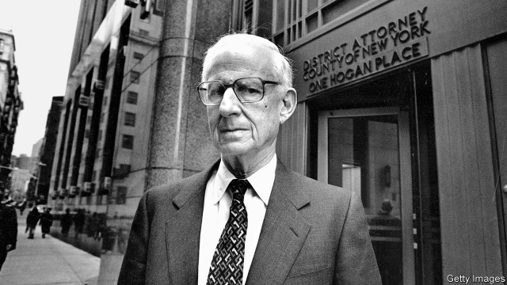

###### The long arm of the law

# Obituary: Robert Morgenthau died on July 21st 

 

> print-edition iconPrint edition | Obituary | Aug 3rd 2019 

IF YOU ASKED Robert Morgenthau which of his prosecutions he was proudest of, you might expect him to give a half-smile, pause to knock out his cigar in the brown glass ashtray, and in his usual soft growl—a strange blend of modest, clipped patrician and Noo York—reply that it was his pursuit of the Bank of Credit and Commerce International. He trailed this shady outfit, laundromat of choice for narcos, terrorists and dictators, for years, before nailing it for fraud in 1991 and forcing it to close. All its assets were forfeit, and it lost $15bn. It was the biggest bank-fraud prosecution in world financial history, spanning 76 countries, and if you wondered what a DA from Manhattan was doing in it, his answer came with more than a half-smile: “The long arm of the law.” 

However, it was not the case he took most pride in. He was shyly proud of them all—3.5m prosecutions, he reckoned, over the 35 years he had presided over the DA building at the edge of Chinatown, from his desk with the famous five Rolodexes. He had gone after rapists, extortioners, drug-dealers, “Teflon John” Gotti, John Lennon’s killer and the CEO of Tyco International, who had drained his company of $100m. These raps stood out in a docket crowded with the usual misdemeanours of a huge, close-packed city. But every crime mattered equally to him because it mattered equally to the victim, whether millionaire investor or some poor woman fretting that drugs were being sold on her street. Anyone joining his team of prosecutors knew that this was the Boss’s bottom line. 

And every malefactor needed to fear the interest of the DA’s office. No one was too rich, middle-class or well connected to escape his hawkish eye. If he thought a case could be brought, he would bring it, no matter what the public or any power group thought. If a teenager could be prosecuted for breaking into a grocery store, you also had to prosecute those comfortable people who put their money offshore and paid no taxes. 

Yet this was not the situation when he arrived in the job in 1975. The DA’s office was a mess, as the whole city was, near-bankrupt, filthy and battered by violent crime. He immediately took on more prosecutors, streamlined their jobs so that each of them handled a case from start to finish, hired minorities and women, expanded the homicide department and brought in as many new evidence-testing techniques as scientists could invent. He added 34 more units, including identity theft, consumer affairs, “cold” cases, Asian gangs and firearms trafficking. By the time he left, having seen out 16 police commissioners, his team had swelled to nearly 500 prosecutors with a budget of $75m—and murders in Manhattan had dropped from 642, when he started, to 58. Thanks to “Morgy”, as the tabloids liked to call him, the city felt safe, and New Yorkers rewarded him with landslides whenever his job came up. 

He also brought in a rackets bureau, along with a crowd of accountants to track down financial crimes. In his previous job, as federal prosecutor for the Southern District of New York (where he indicted no fewer than 150 mobsters, including Anthony (“Tony Ducks”) Corallo, whose very nickname boasted how slippery he was), he had set up a unit to investigate Wall Street. It was long overdue. As DA he spent a third of his budget in pursuit of money-launderers and stock manipulators, not forgetting those clean-looking tax lawyers and corporate accountants. His team had to act like vacuum cleaners, sucking up every least scrap of evidence, and like bully boys, threatening small fry with certain jail-time to persuade them to co-operate, which might land even bigger fish. 

Some thought he was biased politically. He was a liberal Democrat, after all, a Kennedy appointee (as well as a Kennedy friend, from the days when he and Jack, two wealthy young scions of east-coast political dynasties, had raced sailing boats off Cape Cod). As such he twice ran briefly for governor of New York, but felt too awkward to shine on the stump. He supported gun control, never sought the death penalty and spent much of his time, pro bono, helping immigrants avoid deportation: good Democratic causes. But people’s politics had no importance. Justice did. 

His success rate was impressive. Three-quarters of his cases ended in convictions. Some were controversial, such as his prosecution of a player for the Giants on a gun rap, which brought him death threats from fans; or of Bernhard Goetz, who had shot at four young blacks who threatened him in the subway, for no more than gun-possession. Some people claimed he was indifferent to blacks, but it wouldn’t fly: he not only hired plenty as prosecutors in the DA’s office but, on war service in the navy, he had brought in four blacks as gunners on one of his ships and resolutely refused his captain’s orders to demote them. Pressure always made him even more stubborn than he naturally was. 

He liked to get convictions. Any DA did. Yet he didn’t count them up like notches on a gun, because he cared about justice more. In 1990, for example, he secured the convictions of five teenagers, four black and one Latino, for the beating and rape of a young woman in Central Park. They went to prison, but 12 years later another man confessed to the crime. Immediately, as DA, he ordered a new investigation with DNA testing, which had not been available before. The testing came back 100%, so the ball game was over. His prosecution had failed, but justice had been done, and this exoneration pleased him just as much as his successes. 

It all fell under the head of doing something useful with his life, part of a plea bargain he had made with the Almighty when, in 1944, his ship USS Lansdale had been sunk under him by German torpedoes. Once spared, he became a lawyer, then such a prosecutor that he inspired the DA hero of “Law and Order”, a hit TV series. But he might have been a farmer, for his not-so-secret other life was on his grandfather’s 270 acres of orchards upstate at East Fishkill. There he spent his summers as a boy, escaping the heat of the city, and there with the same purpose he worked later, in overalls, returning to Manhattan with eggs and hard cider to sell. The long arm of the law, which criminals dreaded, also reached to prune apple trees and pick a fruit or two. McIntosh were best. ■ 
<<<<<<< HEAD

-- 

 单词注释:

1.Robert['rɔbәt]:[法] 警察 

2.Morgenthau['mɔ:^әnθɔ:]:摩根索(姓氏) 

3.obituary[ә'bitjuәri]:a. 关于死亡的, 讣告的 n. 讣告 

4.Aug[]:abbr. 八月（August） 

5.prosecution[.prɒsi'kju:ʃәn]:n. 执行, 经营, 起诉 

6.ashtray['æʃtrei]:n. 烟灰缸 

7.clip[klip]:n. 修剪, 夹子, 回形针, 剪下来的东西 vt. 修剪, 痛打, 夹牢, 剪报 vi. 剪报 

8.patrician[pә'triʃәn]:n. 贵族, 有教养的人 a. 贵族的, 显贵的 

9.noo[]:abbr. Navy Oceanographic Office <美国>海军海洋局 

10.outfit['autfit]:n. 用具, 配备, 机构 vt. 配备, 供应 vi. 得到装备 

11.laundromat['lɑ:ndrә,mæt, lɔ:n-]:n. 自助洗衣店, 自动洗衣店 

12.narcos[]: narcotics 麻醉药；致幻毒品；镇静剂；narcotics police officers 致幻毒品警察官 

13.terrorist['terәrist]:n. 恐怖分子 [法] 恐怖份子, 恐怖主义 

14.dictator['dikteitә]:n. 命令者, 独裁者 

15.fraud[frɒ:d]:n. 欺骗, 欺诈, 诡计, 骗子 [经] 欺诈, 舞弊, 骗子 

16.asset['æset]:n. 资产, 有益的东西 

17.forfeit['fɒ:fit]:n. 没收物, 罚金, 丧失 vt. 没收, 丧失 a. 丧失了的 

18.DA[,di:'ei]:美国地方检察官 [计] 数据采集, 数据管理员, 数据分析, 设计自动化 

19.Manhattan[mæn'hætәn]:n. 曼哈顿 

20.shyly[]:adv. 害羞地；羞怯地；胆怯地；小心地 

21.reckon['rekәn]:vt. 计算, 总计, 估计, 认为, 猜想 vi. 数, 计算, 估计, 依赖, 料想 

22.preside[pri'zaid]:vi. 统辖, 当主人, 主持 [法] 主持, 负责, 指挥 

23.Chinatown['tʃainәtajn]:n. 唐人街, 中国城 

24.Rolodex['rəulə,deks]:n. 名片盒 

25.rapist['reipist]:n. 强奸犯 [法] 强奸犯 

26.extortioner[ik'stɒ:ʃәnә]:n. 勒索者, 敲诈者 [法] 勒索者, 敲诈者, 强夺者 

27.teflon['teflɔn]:[化] 聚四氟乙烯 [医] 塔夫纶, 聚四氟乙烯(商品名,用于外科的塑料) 

28.john[dʒɔn]:n. 盥洗室, 厕所, 嫖客 

29.gotti[]:n. (Gotti)人名；(法、意)戈蒂 

30.killer['kilә]:n. (非正式)杀人者, 屠杀者, 猛兽, 致死(疾病), 杀手, 止痛药, 限制器, 瞄准器 [计] 删除程序; 断路器 

31.ceo[]:abbr. 首席执行官；执行总裁（chief executive officer） 

32.tyco[]:[网络] 泰科；美国泰科；泰科电子 

33.rap[ræp]:n. 轻敲, 拍击, 责骂, 无价值的东西 vt. 轻敲, 厉声说出, 叱责, 抢走, 使着迷 vi. 敲击, 发敲击声, 交谈, 同情 [计] 随机存取程序, 资源分配处理器, 常驻汇编程序 

34.docket['dɒkit]:n. 摘要, 记事表 vt. 在...上附加摘要 

35.misdemeanour[.misdi'mi:nә]:n. 行为不端 [法] 不轨行为, 轻罪, 行为失检 

36.equally['i:kwәli]:adv. 相等地, 同样地, 平等地 

37.investor[in'vestә]:n. 投资者 [经] 投资者 

38.fret[fret]:n. 烦躁, 磨损, 焦急, 网状饰物 vi. 烦恼, 不满, 磨损 vt. 使烦恼, 腐蚀, 使磨损, 使起波纹 

39.prosecutor['prɒsikju:tә]:n. 实行者, 告发者, 公诉人 [法] 原告, 起诉人, 检举人 

40.malefactor['mælifæktә]:n. 罪人, 犯人, 坏人 [法] 罪犯, 作恶者 

41.hawkish['hɒ:kiʃ]:a. 像鹰的, 鹰派的, 强硬派的 

42.prosecute['prɒsikju:t]:vt. 告发, 起诉, 彻底进行, 执行, 从事 vi. 告发, 起诉, 作检察官 

43.filthy['filθi]:a. 污秽的, 丑恶的 

44.batter['bætә]:v. 连续猛打（尤其指妇女），猛击 n. 面糊（食物），击球员，打击手 

45.streamline['stri:mlain]:n. 流线, 流线型 vt. 使成流线型, 使合理化 

46.homicide['hɒmisaid]:n. 杀人, 杀人者 [医] 杀人, 杀人者 

47.firearm['faiә'ɑ:m]:n. 火器, 枪炮 

48.trafficking[ˈtræfikɪŋ]:n. 非法交易 

49.commissioner[kә'miʃәnә]:n. 委员, 理事, 行政长官 [法] 委员, 政府的特派员, 地方地官 

50.tabloid['tæblɒid]:n. 小报, 小型画报, 药片, 文摘 a. 轰动性的, 扼要的, 缩略的, 小报式的 

51.yorker['jɒ:kә]:n. 贴板球 

52.landslide['lændslaid]:n. 山崩 [化] 滑坡 

53.york[jɔ:k]:n. 约克郡；约克王朝 

54.indict[in'dait]:vt. 起诉, 控告, 指控 [法] 控告, 揭发, 对...起诉 

55.mobster['mɒbstә]:n. 犯罪集团成员 [法] 暴徒, 盗匪 

56.anthony['æntәni]:n. 安东尼（人名） 

57.tony['tәuni]:a. 高贵的, 时髦的 

58.corallo[]:[网络] 珊瑚；克拉洛；科拉罗椅 

59.nickname['nikneim]:n. 绰号, 昵称 vt. 给...取绰号, 叫错名字 [计] 绰号 

60.manipulator[mә'nipjuleitә]:n. 操作者, 机械手 [化] 机械手 

61.corporate['kɒ:pәrit]:a. 社团的, 合伙的, 公司的 [经] 团体的, 法人的, 社团的 

62.scrap[skræp]:n. 碎片, 残余物, 些微, 片断, 铁屑, 吵架 vt. 扔弃, 敲碎, 拆毁 vi. 互相殴打 a. 零碎拼凑成的, 废弃的 

63.bully['buli]:n. 欺凌弱小者, 土霸 vt. 威胁, 恐吓, 欺负 vi. 欺负 a. 特好的, 第一流的 adv. 十分 

64.bias['baiәs]:n. 偏见, 斜纹 a. 偏斜的 adv. 偏斜 vt. 使有偏见 [计] 偏流; 偏压; 偏磁; 偏离 

65.politically[]:adv. 政治上 

66.democrat['demәkræt]:n. 民主人士, 民主主义者, 民主党党员 [经] 民主党 

67.kennedy['kenidi]:n. 肯尼迪（姓氏, 美国第35任总统） 

68.appointee[ә.pɒin'ti:]:n. 被任命者 [法] 被指定的人, 被任命者 

69.jack[dʒæk]:n. 插座, 千斤顶, 男人 vt. 抬起, 提醒, 扛举, 增加, 提高, 放弃 a. 雄的 [计] 插座 

70.scion['saiәn]:n. 接穗, 子孙 [医] 嫩枝, 接穗 

71.cape[keip]:n. 岬, 海角, 披肩, 斗蓬 

72.cod[kɒd]:n. 鳕, 欺骗, 愚弄 v. 欺骗, 愚弄 

73.briefly['brifli]:adv. 简短地, 扼要地, 简明地, 简单地 

74.stump[stʌmp]:n. 残株, 树桩, 烟蒂, 讲演台 vt. 砍断, 挑战, 难住 vi. 蹒跚而走 

75.penalty['penәlti]:n. 处罚, 刑罚, 罚款, 罚球, 报应, 不利结果, 妨碍 [经] 罚金(款), 违约金 

76.pro[prәu]:adv. 正面地 [计] 可编程远程操作 

77.bono[]:n. 宝鸟服饰；报喜鸟（品牌名） 

78.politic['pɒlitik]:a. 精明的, 明智的, 策略的 

79.conviction[kәn'vikʃәn]:n. 定罪, 信服, 坚信 [法] 定罪, 证明有罪, 判罪 

80.Bernhard[]:伯恩哈德（人名） 

81.goetz[]: [人名] 戈茨 

82.gunner['gʌnә]:n. 炮手, 炮长, 机关枪手, 带枪猎人 

83.resolutely[]:adv. 坚决地；毅然地 

84.demote[.di:'mәut]:vt. 使降级, 使降职 

85.alway['ɔ:lwei]:adv. 永远；总是（等于always） 

86.notch[nɒtʃ]:n. 刻痕, 等级, 峡谷 vt. 刻凹痕, 用刻痕计算, 赢得 

87.Latino[læ'ti:nәu, lә-]:n. 拉丁美洲人 

88.rape[reip]:n. 抢夺, 掠夺, 强奸, 葡萄渣, 芸苔 vt. 掠夺, 抢夺, 强奸 

89.DNA[]:脱氧核糖核酸 [计] 无效数据, 数字网络体系结构, 分布式网络体系结构 

90.exoneration[ig.zɒnә'reiʃәn]:n. 免罪, 免除 [经] 免除, 解除, 免于 

91.plea[pli:]:n. 恳求, 辩解, 抗辩, 诉讼, 请愿, 托词 [法] 抗辩, 申诉案件, 答辩 

92.almighty[ɒ:l'maiti]:a. 万能的, 全能的 

93.USS[]:美国(工业)规格, 美国(工业)标准, 美国参议院 

94.lansdale[]: [人名] 兰斯代尔; [地名] [美国] 兰斯代尔 

95.sery[]:n. (Sery)人名；(俄)谢雷；(科特)塞里 

96.orchard['ɒ:tʃәd]:n. 果园, 果树林 

97.upstate['ʌp'steit]:a. 偏僻的, 州的北部的 n. 州的北部 adv. 在州的北部 

98.fishkill['fiʃkil]:n. （水污染引起的）鱼殇；鱼难 

99.cider['saidә]:n. 苹果汁, 苹果酒 [建] 苹果汁 

100.prune[pru:n]:n. 洋李, 李子干, 深紫红色, 傻瓜 vt. 修剪, 砍掉, 删除 vi. 删除, 删节 

101.McIntosh['mækintɒʃ]:n. 麦金托什苹果 
=======
>>>>>>> 50f1fbac684ef65c788c2c3b1cb359dd2a904378

